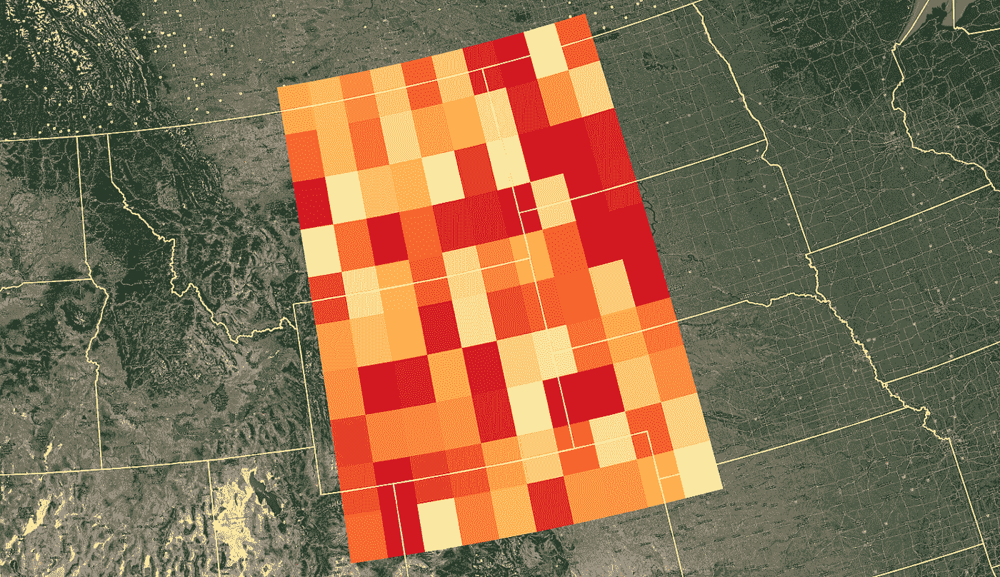
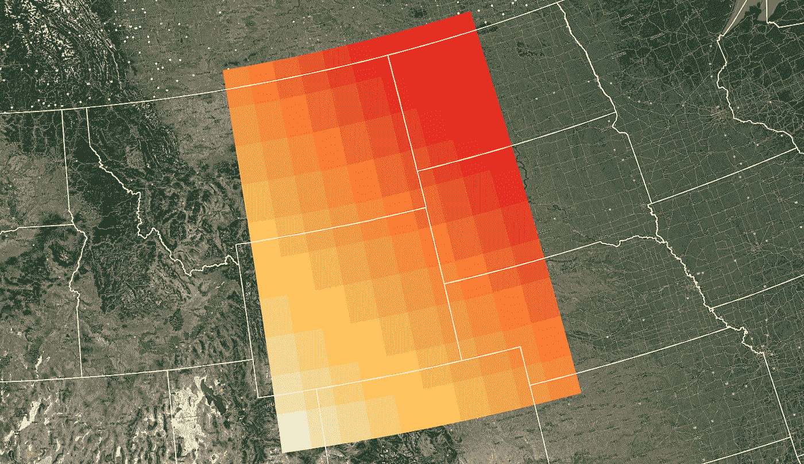

# 用 Python 创建 NetCDF 文件

> 原文：<https://towardsdatascience.com/create-netcdf-files-with-python-1d86829127dd?source=collection_archive---------14----------------------->

## 一旦你打破了学习曲线，一个强大的数据格式

网格化的空间数据通常存储在 NetCDF 文件中。对于气候数据来说尤其如此。NetCDF 文件通过支持多个变量和详细的元数据，提供了比一些传统栅格格式更大的灵活性和透明度。由于元数据和文件结构的原因，NetCDF 文件比传统的栅格格式更难访问。本文介绍了创建 NetCDF 文件和用 Python 编写数据值的基础知识。我之前写过关于用 Python 从 NetCDF 文件中访问元数据和变量的文章。

# 创建 NetCDF 数据集

导入`netCDF4`和`numpy`模块。然后定义一个扩展名为`.nc`或`.nc4`的文件名。调用`Dataset`，用`'w'`指定写模式，创建 NetCDF 文件。NetCDF 文件未建立，可以写入。完成后，一定要在数据集上调用`close()`。

# 添加维度

NetCDF 文件通常包含三个维度:时间、宽度(x 或经度)和高度(y 或纬度)。宽度和高度尺寸总是固定的。时间维度是动态的(可以增长)，允许将时间步长添加到文件中。在 NetCDF 中，动态的或不断增长的维度被称为“无限的”。

可以添加无限的尺寸，并由`None`指定。我们将对时间变量使用无限的维度，这样它就可以增长。换句话说，我们可以继续向文件添加时间步长。此外，创建纬度和经度维度。`lat`和`lon`定义了我们文件的地理范围和维度。这里我们只是创建了一个大小为 10 的维度。这意味着生成的网格只有 10 行和 10 列。`lat`和`lon`的大小或地理距离被指定为变量。其实每个维度都会有对应的变量。

# 添加 NetCDF 变量

变量包含文件的实际数据。它们还定义了数据所引用的网格。这个文件将包含四个变量。纬度和经度定义了网格值和数据位置。`times`定义数据文件中的图层。`value`包含实际数据。要创建变量，指定变量名、[数据类型](https://unidata.github.io/netcdf4-python/netCDF4/index.html)和形状。通过引用维度名称，形状被定义为元组。还指定了附加元数据。这里我们将`value`的单位定义为`Unknown`。

# 分配纬度和经度值

用网格单元创建一个简单的网格，用`numpy.arange`测量 1 度乘 1 度。将 y 值分配给`lats`，将 x 值分配给`lons`。现在我们只需要分配与我们创建的网格尺寸相匹配的数据值。

# 分配 NetCDF 数据值

将两个时间步长的数据添加到我们创建的值变量中。每个时间步长由一个 2D 数数组表示。每个数组的大小必须与`lat`和`lon`尺寸相匹配。用`numpy.random`创建一个从 0 到 100 的随机数数组。该数组包含第一个时间步长的数据。

接下来，创建一个数组，数组中的值从 0.5 线性增加到 5.0。要做到这一点，用`numpy.linspace`创建两个 1D 数组，并在相反的轴上将它们加在一起。下面的代码展示了这是如何做到的。创建数组并将其分配给`value`后，关闭`ds`。您的 NetCDF 现在已保存并准备就绪。在 QGIS 中打开文件进行可视化，或在 Python 中绘制数组。结果的图像如下所示。

带有随机值的 NetCDF(由作者创建)

带有线性插值的 NetCDF(由作者创建)

# 结论

一旦您理解了 NetCDF 文件的基本结构，它将是处理空间数据的一种非常有用的方式。在这个例子中，我们创建了一个只有一个数据变量的文件。但是可以将多个变量添加到一个文件中，这可能会减少管理数据所需的文件数量。NetCDF 文件最有用的方面之一是阐明它们包含的数据的文档和元数据。

*原载于 2020 年 7 月 13 日*[*https://opensourceoptions.com*](https://opensourceoptions.com/blog/create-netcdf-files-with-python/)*。*