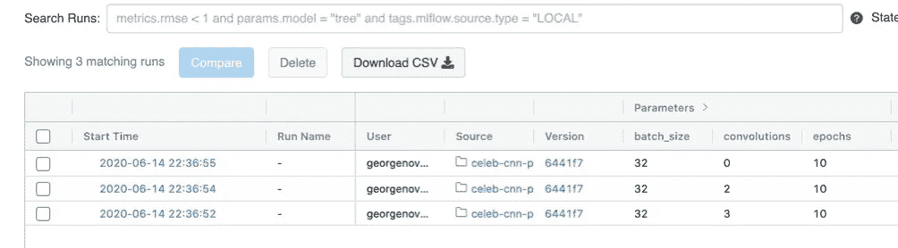
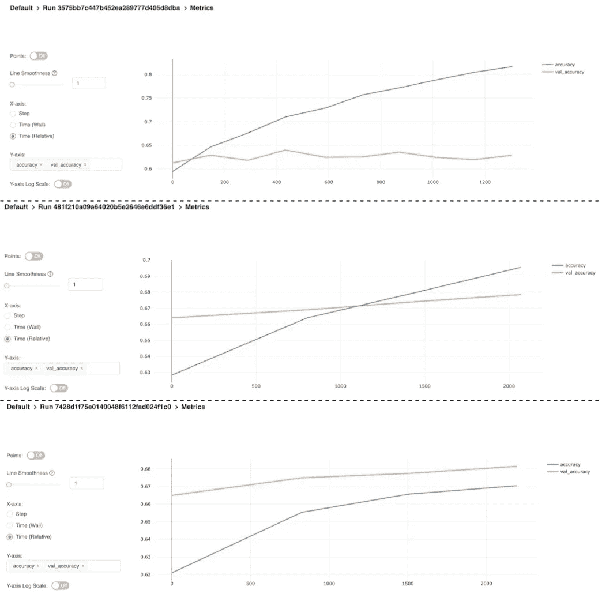

# 使用 MLflow 项目和 Docker 创建可重用的 ML 模块

> 原文：<https://towardsdatascience.com/create-reusable-ml-modules-with-mlflow-projects-docker-33cd722c93c4?source=collection_archive---------25----------------------->

## 因为你永远不会只训练你的模型一次。

让我们面对现实吧，将机器学习模型投入生产并不容易。从从不同来源收集数据到调整超参数和评估模型性能，从沙盒到生产有如此多的不同步骤，如果我们不小心，可能会分散在许多相互依赖的笔记本或脚本中，所有这些都必须以正确的顺序运行才能重新创建模型。更糟糕的是，当我们迭代和评估模型的新版本时，很容易忽略记录超参数的每个组合和每个结果度量，因此我们经常会忘记在迭代模型构建过程中吸取的教训。

还记得我们用来制作模型第一版的笔记本吗？好吧，当我们完成第二版的时候，那些笔记本已经被调整和改变了太多，如果我们需要的话，我们已经没有希望重新创建第一版了。

在本文中，我将展示如何使用 MLflow 和 Docker 来创建模块化的、可重用的 ML 项目，并允许您轻松地重新创建旧版本的模型和调整参数来构建和评估新的模型。

## 什么是 MLflow？

[MLflow](https://mlflow.org/) 是一套开源工具，帮助管理 ML 模型开发生命周期，从早期的实验和发现，一直到在中央存储库中注册模型并将其部署为 REST 端点以执行实时推理。在本文中，我们不会涉及模型注册中心或模型部署工具。我们的重点将是 MLflow 跟踪，它允许我们在快速迭代模型的不同版本时评估和记录模型结果，以及 MLflow 项目，我们将使用它将我们的模型开发工作流打包到一个可重用的参数化模块中。

# 我们将建造什么

在本文中，我们将使用 TensorFlow 和 [CelebA](http://mmlab.ie.cuhk.edu.hk/projects/CelebA.html) 数据集来构建一个基本的卷积神经网络，以预测给定图像的主体是否在微笑。我们将创建一个 Docker 映像，它将作为我们的训练环境，并将包含训练模型所需的所有依赖项。接下来，我们将模型训练代码打包为 MLflow 项目，最后，我们将创建一个简单的驱动程序，该程序将使用不同的超参数值异步启动项目的多次运行。

## 本地设置

为了跟进，您需要在本地安装 [Python 3](https://www.python.org/downloads/) 、 [Docker](https://www.docker.com/get-started) 和 MLflow。您可以使用`pip`安装 MLflow

```
pip install mlflow
```

## 构建模型

由于我们的重点是 MLflow，所以我不会详细介绍实际的模型，但是我会简要地介绍一些代码示例，并在本文的最后提供一个工作端到端项目的链接。

首先要做的是加载 CelebA 数据集。我们将使用 [TensorFlow 数据集](https://www.tensorflow.org/datasets)来完成这项工作。

从 *tfds* 加载的数据集不包含显式目标值。每个记录只是一个图像和关于该图像的一组属性(例如，图像中的人是否在微笑、是否戴着帽子、是否有胡子等等)。)，所以使用`data_generator()`函数以一种可以传递到模型中的方式格式化数据。该函数返回一个生成器，该生成器将每条记录生成为以下格式的元组:

```
(image, 1 if subject is smiling else 0) 
```

我们将通过使用`tf.data.from_generator`并传入`data_generator()`函数来为模型创建训练和验证数据集。

接下来，我们将使用训练和验证数据集来构建和训练 CNN。

## 创建项目环境

MLflow 项目允许您以三种不同的方式定义环境: [Conda、Docker 容器或本地系统](https://mlflow.org/docs/latest/projects.html#project-environments)。我们将在项目环境中使用 Docker 容器。

下面是我们简单项目环境的 docker 文件:

*requirements.txt* 文件包含运行项目所需的包: *mlflow* 、 *tensorflow* 和 *tensorflow-datasets。*和 *load_data.py* 脚本只是从 TensorFlow 加载 CelebA 数据集，并将结果存储在 */app/data* 目录中。

**注意**:在现实世界的场景中，您可能不会将培训/验证数据与项目环境一起存储。相反，您的环境将只包括访问数据所需的配置和库，无论数据存储在哪里(例如，本地数据库或云存储帐户)。我这样做只是为了避免每次项目运行时从 TensorFlow 下载数据集。

## 打包培训代码

我们现在将前面的模型训练代码打包到一个 MLflow 项目中。MLflow 项目只是一个带有 *MLproject* 文件的目录，该文件定义了项目的一些内容:

*   项目将运行的环境。对我们来说，这是我们刚刚创建的 Docker 图像。
*   项目入口点。这将是构建和训练模型的 python 脚本。
*   可以传递到项目中的参数。我们将在下面定义其中的一些。

第一步是创建一个 *MLproject* 文件。正是在这个文件中，我们引用了将被用作项目环境的 Docker 图像。我们还将定义可以传递到项目中的任何参数。

如您所见，我们的项目将使用 *gnovack/celebs-cnn* 图像作为项目环境(这是上一节中创建的 Docker 图像),并将接受许多参数:批处理大小、时期数、卷积层数、训练和验证样本数，以及一个布尔值，该值指示是否在训练期间对输入图像执行一些随机转换。

接下来，我们将修改模型训练代码，以使用传入的参数，并使用 MLflow 跟踪来记录训练进度。我们将很快讨论 MLflow 跟踪，但现在只知道它由一个跟踪服务器和一个 GUI 组成，跟踪服务器在模型训练运行(MLflow 称之为实验运行)期间跟踪参数和指标，GUI 允许我们查看所有运行并可视化每次运行的性能指标。

我们可以像使用任何命令行参数一样使用`argparse`来访问项目输入参数。

然后我们可以使用这些参数来动态构建 CNN。我们还将在 MLflow 运行中包装模型训练，使用`mlflow.start_run()`告诉 MLflow 将我们的模型训练作为 MLflow 实验运行进行跟踪。

关于上述代码的几点注意事项:

*   `mlflow.tensorflow.autolog()`支持自动记录 TensorFlow 的参数、指标和模型。MLflow 支持几种机器学习框架的自动日志记录。完整列表见此:[https://ml flow . org/docs/latest/tracking . html #自动记录](https://mlflow.org/docs/latest/tracking.html#automatic-logging)。
*   在训练期间随机旋转图像以帮助防止过度拟合的`RandomFlip`层，现在根据`randomize-images`参数的值有条件地添加到模型中。
*   模型中卷积层的数量现在取决于参数`convolutions`的值。
*   自定义回调已添加到`model.fit`调用中。`MLFlowCallback`是一个简单的 Keras 回调类，它在每个训练期之后使用`mlflow.log_metrics()`向 MLflow 跟踪服务器发送模型性能指标

## 编写驱动程序

定义了 Docker 环境并创建了 MLflow 项目后，我们现在可以编写一个驱动程序来异步执行该项目的一些运行，从而允许我们评估超参数和神经网络架构的不同组合。

在运行项目之前，我们需要启动 MLflow 跟踪服务器。对于本例，我们将只使用您的本地计算机作为跟踪服务器，但是在您与一个工程师和/或数据科学家团队合作的环境中，您可能希望建立一个共享的跟踪服务器，该服务器始终运行，供所有团队成员共享。一些云服务，如 Databricks 和 Azure 机器学习，甚至内置了 MLflow 跟踪服务器。

要运行本地跟踪服务器并打开 MLflow GUI，请运行以下命令:

```
mlflow ui
```

我们将使用链接到 Github 中 MLflow 项目的`mlflow.projects.run()`方法、[https://github.com/gnovack/celeb-cnn-project](https://github.com/gnovack/celeb-cnn-project)来运行项目(您也可以使用包含 MLflow 项目的本地目录的相对文件路径)。驱动程序脚本使用不同的参数异步运行项目三次。

我们指定`synchronous=False`，这样我们可以并行执行所有三次运行，而`backend='local'`表示项目将在您的本地机器上执行。MLflow 还支持在 Databricks 或 Kubernetes 集群上执行项目。

执行驱动程序后，进入 [http://localhost:5000/](http://localhost:5000/) 查看 MLflow 跟踪 UI 中的三个活动运行。



MLflow 运行。(图片由作者提供)

通过深入每次运行，您可以查看模型性能指标，由于我们创建了`MLFlowCallback`,这些指标会在每个训练时期后更新，使我们能够在模型仍在训练时绘制这些指标。



MLflow 跟踪指标。*(图片作者)*

正如您从准确性数字中看到的，我们的模型在使用少量数据进行几次训练后不会赢得任何奖项，但您可以开始看到不同模型的性能趋势(例如，未使用卷积层的顶级模型似乎过度拟合数据，因为训练准确性稳步上升，而验证准确性保持相当稳定)。一旦每次运行完成，它将输出已训练的模型对象作为可以从跟踪服务器下载的工件，这意味着，通过 MLflow 跟踪，我们不仅可以访问历史训练运行的参数和指标，还可以访问已训练的模型。

当处理更复杂的模型和更大的训练数据集时，训练过程很容易需要几个小时或几天才能完成，因此能够实时查看这些指标使我们能够确定哪些参数组合可能会或可能不会产生生产质量的模型，并使我们有机会在看到性能指标中的过度拟合等趋势时停止运行。

## 结论

在本文中，我们已经看到了如何使用 MLflow 项目将机器学习模型的开发和训练打包到一个封装的可重用模块中，允许我们并行训练模型的几个版本，并在训练过程中实时比较它们的性能。MLflow 还让我们能够跟踪与每个历史项目运行相关的参数、指标和模型，这意味着如果需要的话，我们可以很容易地复制任何以前版本的模型。还值得注意的是，虽然我们在本文中只使用了 TensorFlow，但是 MLflow 跟踪和 MLflow 项目可以与所有主要的 ML 框架一起工作。

感谢阅读！我将留下包含本文中描述的端到端项目的存储库的链接，以及我在从事这项工作时参考的一些有用的文档。如有任何问题或意见，请随时联系我们。

## Github 仓库

*   包含构建 Docker 环境所需代码的存储库:[https://github.com/gnovack/celeb-cnn-base-image](https://github.com/gnovack/celeb-cnn-base-image)。
*   生成的图像存储在 Docker Hub:【https://hub.docker.com/repository/docker/gnovack/celebs-cnn 
*   MLflow 项目存储库包含【https://github.com/gnovack/celeb-cnn-project】ml Project 文件和张量流模型代码[ml Project](https://github.com/gnovack/celeb-cnn-project)
*   执行 MLflow 项目并行运行的驱动程序:[https://github.com/gnovack/celeb-cnn-driver](https://github.com/gnovack/celeb-cnn-driver)

## 参考

*   https://mlflow.org/docs/latest/projects.html#
*   [https://ml flow . org/docs/latest/tracking . html # tensor flow-and-keras-experimental](https://mlflow.org/docs/latest/tracking.html#tensorflow-and-keras-experimental)
*   [https://www.tensorflow.org/datasets/catalog/celeb_a](https://www.tensorflow.org/datasets/catalog/celeb_a)
*   [https://www.tensorflow.org/api_docs/python/tf/data/Dataset?hl=en](https://www.tensorflow.org/api_docs/python/tf/data/Dataset?hl=en)