# 将 TensorFlow 2 深度学习分类器用作 REST API(有 GPU 支持)，第一部分

> 原文：<https://towardsdatascience.com/create-serve-a-tensorflow-2-2-deep-learning-classifier-as-a-rest-api-with-gpu-support-part-i-4767a8a22608?source=collection_archive---------67----------------------->

## [端到端 TensorFlow REST API](https://towardsdatascience.com/tagged/TensorFlow-REST-API)

## 在这一系列文章中，我将一步一步地解释如何使用 [Flask](https://flask.palletsprojects.com/en/1.1.x/) 创建和服务一个图像分类器作为 REST API！🚀稍后我们将[把它归档🐳！](https://www.docker.com/why-docker)


[比尔·杰伦](https://unsplash.com/@billjelen?utm_source=medium&utm_medium=referral)在 [Unsplash](https://unsplash.com?utm_source=medium&utm_medium=referral) 上的照片

## 在 [Jupyter 笔记本](https://jupyter.org/)上编写深度学习图像分类器很棒，如果你部署你的模型，让你的客户有可能使用它，那就更棒了！

这一系列文章将帮助您从笔记本转向数据科学技术的真实使用案例！我们将深度学习分类器从零到生产🚀！

*免责声明:你应该有*[*CNN-卷积神经网络*](https://cs231n.github.io/convolutional-networks/) *的先验知识和经验。*

我们将用来训练我们的卷积神经网络分类器的数据集是 [CIFAR-10](https://www.cs.toronto.edu/~kriz/cifar.html) ( **暂时不要下载**)。CIFAR-10 数据集包括 10 类 60000 幅 32×32 彩色图像，每类 6000 幅图像。有 50000 个训练图像和 10000 个测试图像。

以下是数据集中的类，以及每个类中的 10 幅随机图像:

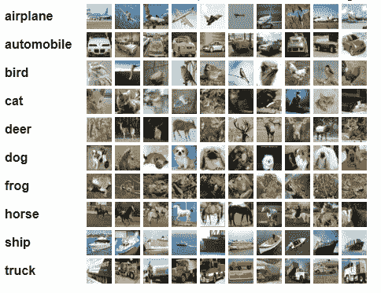

[CIFAR-10](https://www.cs.toronto.edu/~kriz/cifar.html)

准备好了吗？我们走吧！

# 1 —创建我们的项目结构

受 cookiecutter-data-science 开源模板的启发太多，下面是我最喜欢的数据科学项目结构:

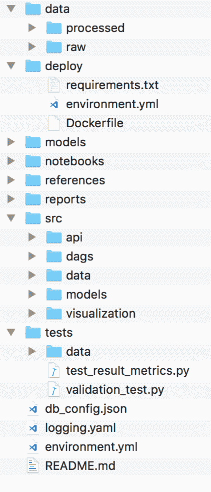

我最喜欢的数据科学项目结构

*   在*数据/raw* 中，我复制我的原始数据并在*数据/中处理；*我保留预处理过的数据。
*   在 *deploy* 文件夹中，您可以找到 Dockerfile 和 *requirements.txt* 或 *environment.yml* (仅保存生产库)
*   在 models 的文件夹中，我存储了保存的模型。
*   在*笔记本*文件夹中，我有我的笔记本(。ipynb 文件)
*   在*参考*文件夹中，我放入了元数据和我在项目中使用的资源的所有参考(pdf，笔记…等等)
*   在*报告*文件夹中，我放了所有的图表和报告(png、pdf、幻灯片),其中包含与我的团队分享的见解
*   在 *src* 文件夹中，我的 Python 脚本按以下方式分组:src/***API****文件夹用于创建 REST API 的脚本，src/ ***data*** 文件夹包含用于处理数据的脚本，src/ ***dags*** 文件夹包含我的 [Airflow DAG](https://airflow.apache.org/docs/stable/concepts.html) s，src/ **【T25***
*   **测试*文件夹包含用于测试我的应用程序的 python 脚本*
*   *我在那里配置我的 Python 日志记录器*
*   *db_config.json 只是一个 json 文件，包含一些数据库访问配置*

***为了简化起见**，让我们稍微简化一下我们的项目结构，只创建(暂时保留所有内容为空):*

*   ****数据*** 文件夹*
*   ****部署*** 文件夹*
*   ****型号*** 文件夹*
*   ****笔记本*** 文件夹*
*   ****src*** 文件夹内的 ***src/model*** 和 ***src/api*** 子文件夹*
*   ****environment . yml***文件*
*   ****logging.yml*** 文件*

*就像我一样，你最终会得到这些文件夹*

*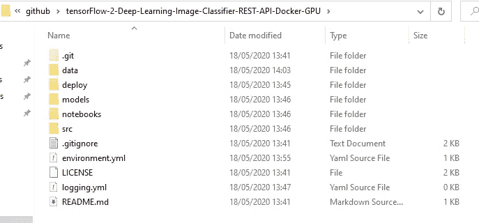*

*项目结构*

*太好了！您已经准备好了一个清晰的项目结构！让我们建立我们的工作环境！*

# *2 —开发设置*

*按照以下步骤创建一个在 *environment.yml* 文件中定义的虚拟 Python 3 工作环境，并配置您的 GPU:*

*   ***2.1 —** 安装 [Miniconda 3](http://conda.pydata.org/miniconda.html) (或 [*Anaconda 3*](https://www.anaconda.com/products/individual) )*
*   ***2.2 —** 确保 *conda* 在您的路径上(否则将 bin 文件添加到您的 **$PATH** ):*

```
*$ which conda~/anaconda3/bin/conda*
```

*   ***2.3 —** 如果你有 CUDA 计算能力 3.5 或更高的 NVIDIA GPU 卡，请按照以下步骤启用 TensorFlow GPU 支持[https://www . tensor flow . org/install/GPU # software _ requirements](https://www.tensorflow.org/install/gpu#software_requirements)(暂时不要 *pip 安装 tensorflow* ！首先配置 CUDA，我们将在下一步安装 tf2(2.4)*
*   ***2.4 —** 我们现在调用我们的虚拟环境***tf2-image-classifier-API***，然后在***environment . yml***文件中指定所需的包(复制粘贴以下代码): *tensorflow-gpu* 、 *numpy* 、 *seaborn* 、 *jupyter* 用于创建图像分类器*烧瓶*和*女侍*用于休息 API 创建。tqdm 用于获得令人愉快的进度条，最后，opencv-python 用于图像预处理！*

***environment.yml** 文件*

*   ***2.5 —** 现在转到项目根目录，创建一个虚拟环境:*

```
*$ conda env create -f environment.yml*
```

*   ***2.6 —** 激活虚拟环境*

```
*conda activate tf2-image-classifier-api*
```

*您现在应该已经激活了您的虚拟环境！*

*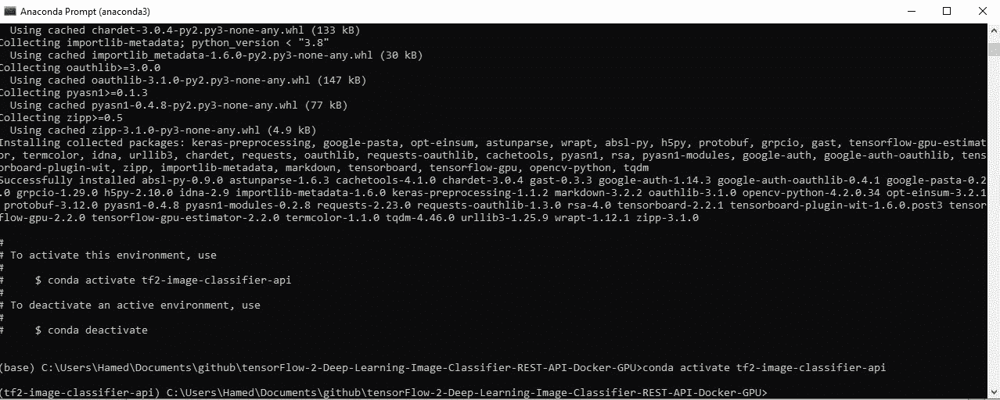*

***奖金(仅供参考，现在不需要)**:*

*彻底清除环境*

```
*conda env remove — name tf2-image-classifier-api*
```

*将环境包更新到最新的兼容版本*

```
*conda env update -f environment.yml*
```

*   ***2.7 —** 从此处 下载 CIFAR-10 数据集，但为 png 格式[](https://pjreddie.com/projects/cifar-10-dataset-mirror/)*
*   ****2.8 —** 将下载的 *cifar.tgz* 文件复制到***data/raw****文件夹中并解压到那里(你应该会得到 *train* 文件夹、 *test* 文件夹和 labels.txt 文件)***

**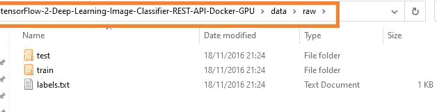**

**解压 *cifar.tgz 文件并将其移动到****data/raw***后**

**太好了！现在，您的环境和数据集已经为我们的图像分类器训练和预测做好了准备！**

# **3-加载库和数据集**

**首先在**项目的根**中运行 jupyter notebook 命令:**

```
**$ jupyter notebook**
```

**现在导航到[http://localhost:8888/tree/notebooks](http://localhost:8888/tree/notebooks)**

**创建新笔记本**

**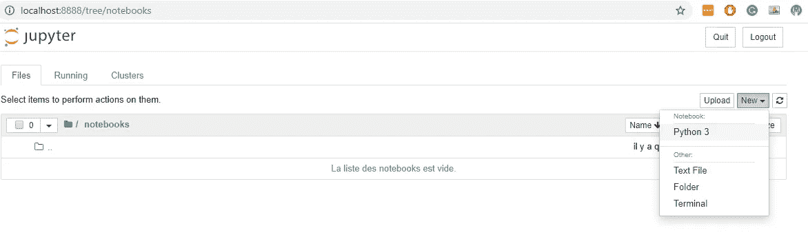**

**创建新的 Jupyter 笔记本**

**并遵循以下步骤:**

## **3.1 —导入 tensorflow 并检查 GPU 支持**

**第一次，加载所需的 [cuDNN](https://developer.nvidia.com/cudnn) libs(帮助 TensorFlow 发现您的 GPU 设备)需要几分钟时间。如果一切正常，你会得到与我相似的结果(除了我有一个 GTX 960M/CUDA v10.2)。**

**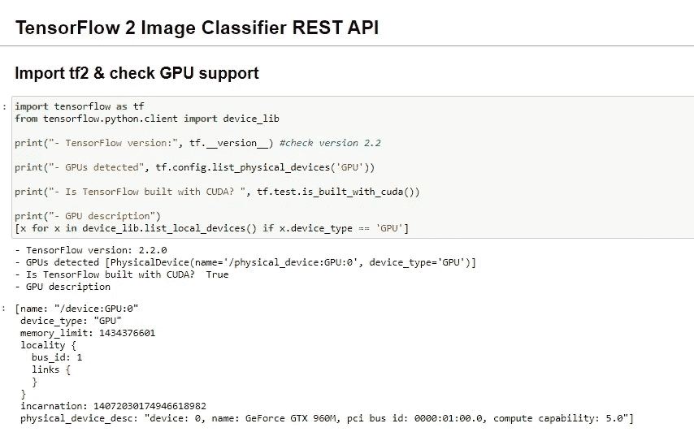**

**导入 tf2 并检查 GPU 支持**

## **3.2-导入其他必需的库**

## **3.3-加载数据集**

**但是之前我们需要定义两个方法；*read _ image*&*load _ dataset***

*   **使用 OpenCV 读取图像**

*   **通过可视化一些图像来测试该方法**

**结果**

**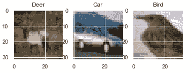**

**从训练集中可视化的随机图像**

*   **加载数据集并以 numpy 数组的形式返回*图像*和*目标***

*   **现在我们已经准备好加载我们的**训练&测试数据集**！**

*   **检查您的训练数据和测试数据形状**

**如果一切正常，你会得到和我相似的结果。**

**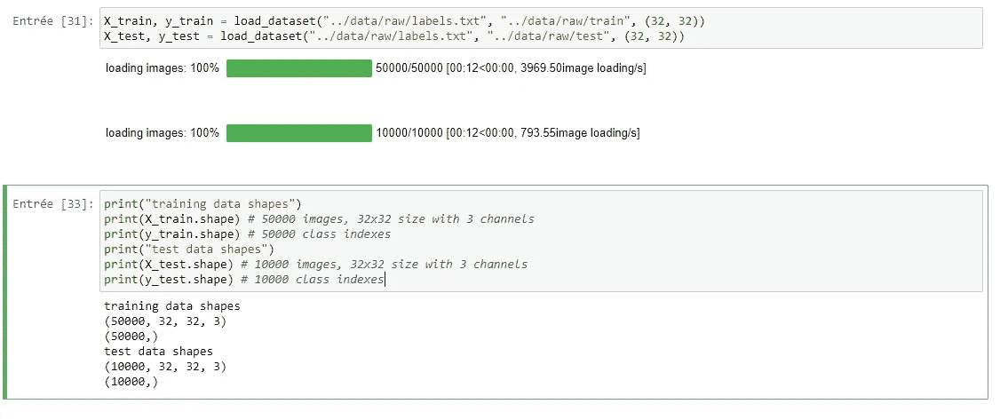**

**验证数据集形状**

**太好了！现在我们已经加载了库，数据集也准备好了！让我们创建我们的 CNN 架构！**

# **4 —创建图像分类深度学习模型**

**我们不需要重新发明轮子，我们将使用这个 [CNN 架构](https://github.com/deep-diver/CIFAR10-img-classification-tensorflow)但是在 TensorFlow 2.2 中！**

**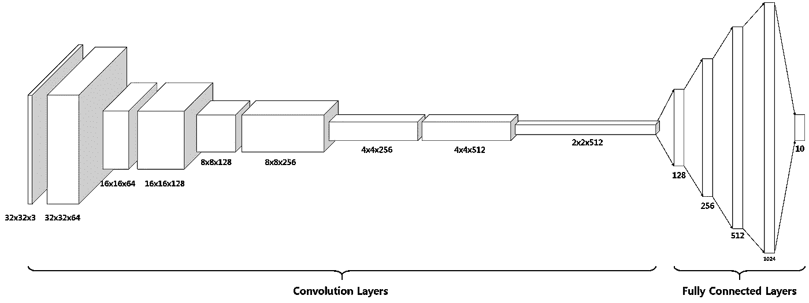**

**我们的 CNN 模型架构— [图片来源](https://github.com/deep-diver/CIFAR10-img-classification-tensorflow)**

**整个模型总共包括 16 层:**

1.  **批量标准化**
2.  **与 64 个大小为(3×3)的不同滤波器进行卷积**
3.  **最大池容量为 2**

*   **ReLU 激活功能**
*   **批量标准化**

**4.与 128 个大小为(3×3)的不同滤波器进行卷积**

**5.最大池容量为 2**

*   **ReLU 激活功能**
*   **批量标准化**

**6.与 256 个大小为(3×3)的不同滤波器进行卷积**

**7.最大池容量为 2**

*   **ReLU 激活功能**
*   **批量标准化**

**8.与 512 个大小为(3×3)的不同滤波器进行卷积**

**9.最大池容量为 2**

*   **ReLU 激活功能**
*   **批量标准化**

**10.展平最后卷积运算的三维输出。**

**11.具有 128 个单元的全连接层**

*   **拒绝传统社会的人**
*   **批量标准化**

**12.具有 256 个单元的全连接层**

*   **拒绝传统社会的人**
*   **批量标准化**

**13.具有 512 个单元的全连接层**

*   **拒绝传统社会的人**
*   **批量标准化**

**14.具有 1024 个单元的全连接层**

*   **拒绝传统社会的人**
*   **批量标准化**

**15.具有 10 个单元的全连接层(图像类的数量)**

**16.Softmax**

## **4.1 —创建卷积块**

**定义一种创建卷积块的方法(使用最大池和批量标准化)**

## **4.2 —创建密集块**

**定义一种创建密集块的方法(带丢弃和批量标准化)**

## **4.3 —使用 TF 2 Keras 创建 CNN 模型**

**酷！现在我们已经准备好创建 CNN 的助手函数了！**

**这个函数帮助我们创建一个 CNN Keras 模型准备编译！**

**现在我们可以定义我们的训练**超参数**:**

**训练超参数，你应该调整以获得更好的结果！**

**现在可以实例化我们的模型了。还有，我们来看看它的总结。**

**应该能打印出来**

```
**Model: "keras_image_classification_model"
_________________________________________________________________
Layer (type)                 Output Shape              Param #   
=================================================================
inputs (InputLayer)          [(None, 32, 32, 3)]       0         
_________________________________________________________________
batch_normalization_15 (Batc (None, 32, 32, 3)         12        
_________________________________________________________________
conv_1_features (Conv2D)     (None, 32, 32, 64)        1792      
_________________________________________________________________
max_pooling2d_8 (MaxPooling2 (None, 16, 16, 64)        0         
_________________________________________________________________
batch_normalization_16 (Batc (None, 16, 16, 64)        256       
_________________________________________________________________
conv_2_features (Conv2D)     (None, 16, 16, 128)       73856     
_________________________________________________________________
max_pooling2d_9 (MaxPooling2 (None, 8, 8, 128)         0         
_________________________________________________________________
batch_normalization_17 (Batc (None, 8, 8, 128)         512       
_________________________________________________________________
conv_3_features (Conv2D)     (None, 8, 8, 256)         819456    
_________________________________________________________________
max_pooling2d_10 (MaxPooling (None, 4, 4, 256)         0         
_________________________________________________________________
batch_normalization_18 (Batc (None, 4, 4, 256)         1024      
_________________________________________________________________
conv_4_features (Conv2D)     (None, 4, 4, 512)         3277312   
_________________________________________________________________
max_pooling2d_11 (MaxPooling (None, 2, 2, 512)         0         
_________________________________________________________________
batch_normalization_19 (Batc (None, 2, 2, 512)         2048      
_________________________________________________________________
flatten_2 (Flatten)          (None, 2048)              0         
_________________________________________________________________
dense_1_features (Dense)     (None, 128)               262272    
_________________________________________________________________
dropout_4 (Dropout)          (None, 128)               0         
_________________________________________________________________
batch_normalization_20 (Batc (None, 128)               512       
_________________________________________________________________
dense_2_features (Dense)     (None, 256)               33024     
_________________________________________________________________
dropout_5 (Dropout)          (None, 256)               0         
_________________________________________________________________
batch_normalization_21 (Batc (None, 256)               1024      
_________________________________________________________________
dense_3_features (Dense)     (None, 512)               131584    
_________________________________________________________________
dropout_6 (Dropout)          (None, 512)               0         
_________________________________________________________________
batch_normalization_22 (Batc (None, 512)               2048      
_________________________________________________________________
dense_4_features (Dense)     (None, 1024)              525312    
_________________________________________________________________
dropout_7 (Dropout)          (None, 1024)              0         
_________________________________________________________________
batch_normalization_23 (Batc (None, 1024)              4096      
_________________________________________________________________
dense_1 (Dense)              (None, 10)                10250     
_________________________________________________________________
softmax (Softmax)            (None, 10)                0         
=================================================================
Total params: 5,146,390
Trainable params: 5,140,624
Non-trainable params: 5,766**
```

**精彩！**5140624 个参数**来训练！**

## **4.4 —编译我们的 CNN Keras 模型**

**为了训练我们的模型，我们将使用 [RMSprop](https://keras.io/api/optimizers/rmsprop/) 作为优化器& [*作为损失函数。为什么*稀疏分类交叉熵*而不仅仅是*分类交叉熵？*好问题！下面是*](https://www.tensorflow.org/api_docs/python/tf/keras/losses/SparseCategoricalCrossentropy)*[为什么是](https://stackoverflow.com/questions/59787897/how-does-tensorflow-sparsecategoricalcrossentropy-work/59788222#59788222)！***

*现在我们可以编译我们的模型了！*

*使用 RMSProp 作为优化器和 CategoricalCrossentropy 作为损失函数来编译 CNN 模型*

## *4.5 —训练我们的 CNN Keras 模型*

*一切都准备好训练我们的模型了。然而，让我们定义三个回调:*

*   *[**提前停止**](https://www.tensorflow.org/api_docs/python/tf/keras/callbacks/EarlyStopping) 当我们的指标停止改善时，停止训练*
*   *[**张量板回调**](https://www.tensorflow.org/tensorboard/tensorboard_in_notebooks) 查看我们模型的训练历史*
*   *[**tqdm 回调**](https://tqdm.github.io/docs/keras/) tqdm `keras`回调为历元和批次进度*

*CNN 培训！*

*如果一切正常，你的模特应该开始训练了！你应该得到和我相似的结果。*

*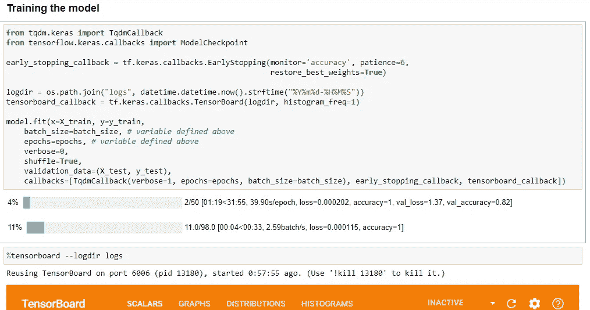*

*我的 CNN 培训！*

*太好了！你的 GPU 现在正在燃烧🔥！让它训练你的模型，我们将在训练结束后回来！(这里是我的 GPU 努力工作的截图)*

*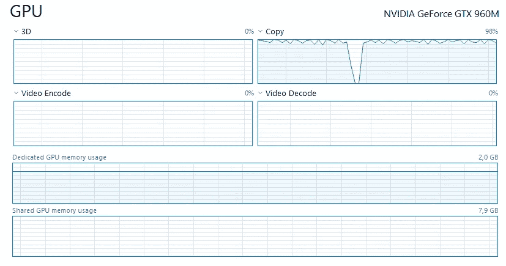*

*我训练 Keras CNN 时的 GPU*

*如果你想像汤姆那样，就拍快照吧！*

*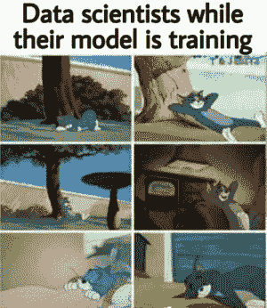*

*[图像信用](https://pics.me.me/thumb_data-scientists-while-their-model-is-training-still-waiting-60708854.png)*

## *4.5 —测试我们的模型*

*酷！我们的分类器已经完成训练！是时候评估一下了，对吧？它是如何处理测试图像的？我们可以通过使用下面的命令启动笔记本中的 **tensorboard** 界面来检查这一点。*

```
*%tensorboard --logdir logs*
```

*此命令应启动 tensorboard，并显示精度和损耗图，用于训练和验证:*

*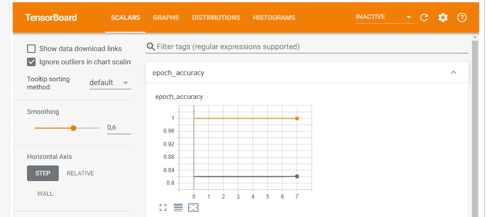*

*张量板*

*但是等等，对于一个分类器来说，准确度不是一个好的评估指标！让我们检查每一个类的精确度、召回率和 f1 分数！我们能做到这一点要感谢 scikit-learn 的 [*分类 _ 报告*](https://scikit-learn.org/stable/modules/generated/sklearn.metrics.classification_report.html) 方法:*

*分类报告*

*这些是我的结果:*

```
*precision    recall  f1-score   support airplane       0.84      0.86      0.85      1000
  automobile       0.92      0.92      0.92      1000
        bird       0.76      0.72      0.74      1000
         cat       0.63      0.67      0.65      1000
        deer       0.80      0.81      0.80      1000
         dog       0.74      0.72      0.73      1000
        frog       0.86      0.86      0.86      1000
       horse       0.87      0.86      0.86      1000
        ship       0.91      0.90      0.91      1000
       truck       0.88      0.89      0.88      1000 accuracy                           0.82     10000
   macro avg       0.82      0.82      0.82     10000
weighted avg       0.82      0.82      0.82     10000*
```

*第一次尝试不错，对吧？ **0.82 精度& 0.82 召回**！我们可以调整超参数并重新训练模型以获得更好的结果！*

*用你的结果来回应这个故事！我很乐意检查它们！😊*

*让我们做一个推理测试。给出测试集中的图像，让我们发现我们的模型看到了什么！*

*结果*

*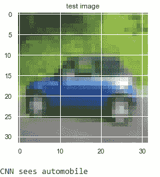*

# *5-导出模型*

*不错！我们的模型在测试数据上表现很好，现在我们可以将它导出到磁盘。我们保存的模型用于进行推理，并将作为 REST API 公开！*

*最后，让我们通过加载来检查保存的模型是否工作正常！*

*精彩！精彩！精彩！您已经成功创建、训练(在 GPU 上)、测试并保存了一个 TensorFlow 2 深度学习图像分类器！*

*现在我们准备将它公开为一个带有 Flask 和 waste 的 REST API，稍后将所有东西 Dockerize！*

*准备好了吗？走吧。*

# *6 —开发一个 REST API*

*但是等等，这对于一个中等的故事来说已经太多了😔！敬请关注第二部分！🚀*

*所有的源代码都在我的 GitHub 上👇我会继续推动一切！*

*[](https://github.com/hzitoun/tensorFlow-2-Deep-Learning-Image-Classifier-REST-API-Docker-GPU) [## Hz iton/tensor flow-2-深度学习-图像-分类器-REST-API-Docker-GPU

### 媒体故事的源代码🚀创建和服务 TensorFlow 2 深度学习图像分类器作为 REST API 和…

github.com](https://github.com/hzitoun/tensorFlow-2-Deep-Learning-Image-Classifier-REST-API-Docker-GPU)* 

*太好了！感谢您的阅读！我渴望在第二部里见到你(即将上映)！*

*我希望我已经帮助你使用 TensorFlow 2.2 创建了一个深度学习图像分类器。在第二部分中，我们将把保存的模型公开为 REST API，稍后我们将对所有内容进行 dockerize！*

*如果你喜欢这个故事，请考虑分享。那会有很大帮助。*

## *最后，我每天在 LinkedIn 上分享机器学习👉https://www.linkedin.com/in/hamed-zitoun/与我联系😊*