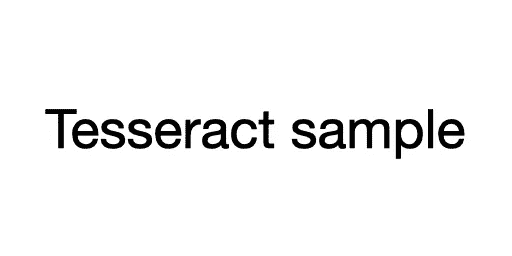
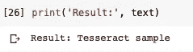
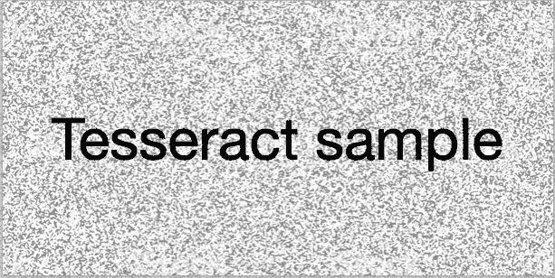
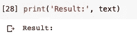
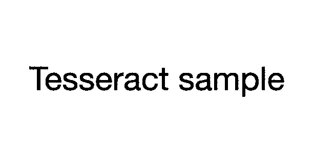

# 用 Python 创建简单的光学字符识别(OCR)

> 原文：<https://towardsdatascience.com/create-simple-optical-character-recognition-ocr-with-python-6d90adb82bb8?source=collection_archive---------12----------------------->

## 宇宙魔方光学字符识别初学者指南


[约书亚·索特诺](https://unsplash.com/@sortino?utm_source=medium&utm_medium=referral)在[号航天飞机](https://unsplash.com?utm_source=medium&utm_medium=referral)上拍摄的照片

当为文本挖掘过程收集数据或查找其他参考资料时，我们经常会找到图像形式的源。例如，如果我们要分析 pdf 格式的单词，文件会包含文本图像。这无疑使数据处理变得困难。解决这个问题的一个方法是我们可以使用光学字符识别(OCR)。

OCR 是一种识别图像中文本的技术，例如扫描文档和照片。常用的 OCR 工具之一是 [**魔方**](https://github.com/tesseract-ocr/tesseract) 。宇宙魔方是各种操作系统的光学字符识别引擎。它最初是由惠普公司作为专有软件开发的。后来谷歌接管了开发。

目前，宇宙魔方在 Windows、macOS 和 Linux 平台上运行良好。宇宙魔方支持 Unicode (UTF-8)并支持 100 多种语言。在本文中，我们将从镶嵌 OCR 安装过程开始，并测试图像中文本的提取。

第一步是安装宇宙魔方。为了使用宇宙魔方库，我们首先需要在我们的系统上安装它。如果您正在使用 Ubuntu，您可以简单地使用 apt-get 来安装宇宙魔方光学字符识别:

```
sudo apt-get install tesseract-ocr
```

对于 macOS 用户，我们将使用自制软件来安装宇宙魔方。

```
brew install tesseract
```

对于 Windows，请参见 [**魔方文档**](https://github.com/tesseract-ocr/tesseract/wiki#windows) 。让我们从安装侏儒怪开始。

```
$ pip install pytesseract
```

安装完成后，让我们继续用 python 应用宇宙魔方。首先，我们导入依赖项。

```
from PIL import Image
import pytesseract
import numpy as np
```

我将使用一个简单的图像来测试魔方的用法。我将使用下面的图像。



示例图像

让我们加载此图像并将其转换为文本。

```
filename = 'image_01.png'
img1 = np.array(Image.open(filename))
text = pytesseract.image_to_string(img1)
```

现在，让我们看看结果。

```
print(text)
```

这就是结果。



从宇宙魔方获得的结果对于简单的图像来说已经足够好了。因为在现实世界中很难找到真正简单的图像，所以我将添加噪声来观察宇宙魔方的性能。我将使用下面的图像。



有噪声的样本图像

然后，我们将执行与之前相同的过程。

```
filename = 'image_02.png'
img2 = np.array(Image.open(filename))
text = pytesseract.image_to_string(img2)
print(text)
```

这就是结果。



结果是……没什么。这意味着宇宙魔方无法读取有噪声的图像中的单词。

然后我们尝试使用一点图像处理来消除图像中的噪声。在这里，我将使用开放简历库。在这个实验中，我使用归一化，阈值和图像模糊。

```
import numpy as np
import cv2norm_img = np.zeros((img.shape[0], img.shape[1]))
img = cv2.normalize(img, norm_img, 0, 255, cv2.NORM_MINMAX)
img = cv2.threshold(img, 100, 255, cv2.THRESH_BINARY)[1]
img = cv2.GaussianBlur(img, (1, 1), 0)
```

那么结果就会是这样。



预处理图像

图像足够干净，然后我们将再次尝试与以前相同的过程。这就是结果。


从上图可以看出，结果与我们所期望的一致。

[](https://medium.com/@fahmisalman/an-easy-way-of-creating-text-localization-and-detection-in-tesseract-ocr-24cc89ed6fbc) [## 在 Tesseract OCR 中创建文本定位和检测的简单方法

### 如何利用 Tesseract 来检测、定位和 OCR 文本

medium.com](https://medium.com/@fahmisalman/an-easy-way-of-creating-text-localization-and-detection-in-tesseract-ocr-24cc89ed6fbc) 

可以得出的结论是，当构建扫描和处理图像的文档处理管道时，tesseract 是最合适的。这最适合高分辨率输入的情况，在这种情况下，前景文本从背景中整齐地分割出来。