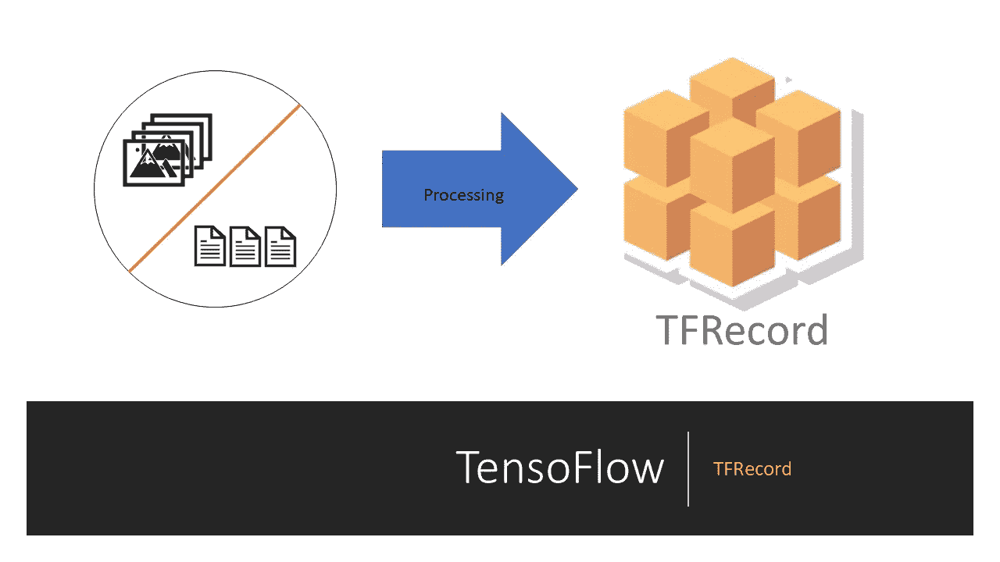

# 创建 TFRecords 数据集并使用它来训练 ML 模型

> 原文：<https://towardsdatascience.com/create-tfrecords-dataset-and-use-it-to-train-an-ml-model-da26fe9f0c2c?source=collection_archive---------14----------------------->

## 有益于处理顺序学习模型的人



嗨，极客们，

希望你一切安好。

在这个故事中，你将了解到。什么是 TFRecords？
2。如何将数据保存为 tfrecords 文件？
3。提取 TFRecord 数据。
4。如何使用 tfrecord 中的数据集来训练模型？

PS——如果你只是来拿代码的话。从[这里](https://github.com/Raghavsharma15832/Useful/blob/master/train_from_tfrecord.py)开始享用吧！

# 什么是 TFRecords？

TFRecord 是一种 Tensorflow 格式，用于存储二进制记录序列。除了顺序数据，TFrecord 还可以用于存储图像和 1D 矢量。在本文中，我们将看到如何存储和读取以下类型的数据:
(i) Integer。(int64，uint8 等。)
(二)花车。
(三)琴弦。
(四)图像。
TFRecord 只能按顺序读写。因此，它通常被用于序列模型，如 RNN，LSTM 等。但这并不意味着我们只能用它来进行连续学习。

# 如何将数据保存为 tfrecords 文件？

要将任何数据存储到 tfrecords，我们首先需要创建 TensorFlow 示例。这些张量流示例可以使用 *tf.train.examples* 函数创建。这个函数将创建一个包含一些特性的示例对象。代码如下-

```
example = tf.train.Example(features = tf.train.Features(feature = {        }))
```

**功能中应该有什么？**

这些特征包含我们的图像、数据，还包含该数据的文件名。如果有人使用监督算法，图像的相应标签也会出现在特征中。因此，创建特征的典型代码是—

**注意-** 图像和相应的标签已经以字节格式保存。

一旦我们创建了一个图像的例子，我们需要把它写入一个 trfrecord 文件。这些可以使用 tfrecord writer 来完成。下面代码中的 tfrecord_file_name 是我们要存储图像的 tfrecord 的文件名。TensorFlow 会自动创建这些文件。

```
writer = tf.python_io.TFRecordWriter(tfrecord_file_name)
writer.write(example.SerializeToString())
```

**存储图像的代码**

# 提取 TFRecord 数据

如果你知道写它们的正确方法，读 tfrecord 文件就简单多了。过程是一样的。首先，我们需要创建一个用于编写 rfrecord 文件的特性字典。然后我们将使用*TF . train . tfrecorddataset*函数创建一个 dataset 对象。

创建数据集对象后，我们将使用下面给出的代码将该数据集对象映射到我们想要的数据集。

在上面这段代码中，函数 *_extract_fn* 将数据集映射到我们想要的东西的列表中(文件名、图像、标签、图像形状)。为此，我们首先解析我们在 tfrecords 生成过程中制作的示例。解析之后，我们需要使用 *tf.io.decode_raw()* 函数将解析后的示例解码成图像。

# 如何使用 tfrecord 中的数据集来训练模型？

为了使用从 tfrecord 提取的数据来训练模型，我们将在 dataset 对象上创建一个迭代器。

```
iterator = tf.compat.v1.data.make_initializable_iterator(batch_dataset)
```

创建这个迭代器后，我们将循环进入这个迭代器，这样我们就可以在从这个迭代器中提取的每个图像上训练模型。函数 *extract_image* 通过使用 iterator.get_next()对 tfrecord 中出现的每个图像执行此操作。关于这个函数，请参考下面的代码。

希望你现在对 tfrecord 有所了解，以及我们如何利用它们来训练模型。

编码快乐！