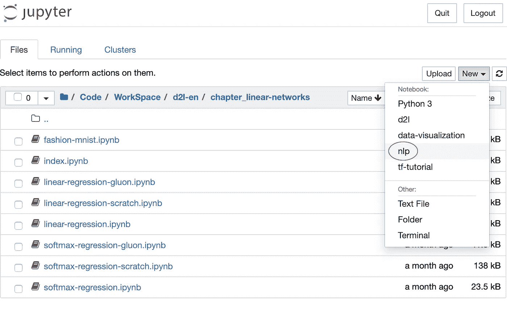
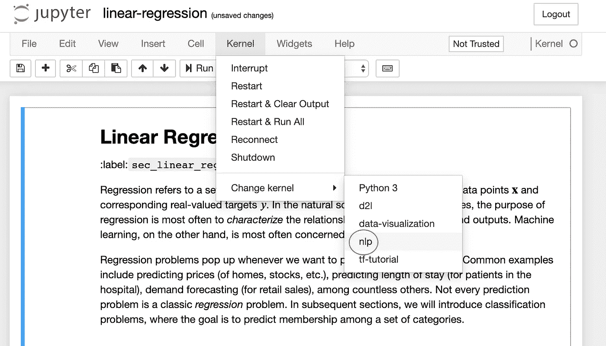

# 使用“virtualenv”创建虚拟环境，并将其添加到 Jupyter 笔记本中

> 原文：<https://towardsdatascience.com/create-virtual-environment-using-virtualenv-and-add-it-to-jupyter-notebook-6e1bf4e03415?source=collection_archive---------2----------------------->

## 你是机器学习工程师，正在使用 Python 和 Jupyter Notebook 吗？在本文中，您将看到为什么需要虚拟环境，一些现有工具的区别以及如何将虚拟环境添加到 Jupyter Notebook 中。


照片由 [Hitesh Choudhary](https://unsplash.com/@hiteshchoudhary?utm_source=unsplash&utm_medium=referral&utm_content=creditCopyText) 在 [Unsplash](https://unsplash.com/s/photos/python-code?utm_source=unsplash&utm_medium=referral&utm_content=creditCopyText) 上拍摄

下面是文章大纲:

*   为什么需要虚拟环境？
*   `virtualenv`、`virtualenvwrapper`、`penv`和`venv`有什么区别？
*   使用`virtualenv`创建一个虚拟环境
*   将虚拟环境添加到 Juypter 笔记本

# **为什么需要虚拟环境？**

像其他编程语言一样，Python 有自己下载、存储和解析包(或库)的方式。默认情况下，您机器上的每个 Python 项目都将使用默认的 Python **site-packages** 目录(该目录与主 Python 安装相关联，表示为 ***base(root)*** 环境)。您可以通过以下方式找到答案:

```
>>> import site
>>> site.getsitepackages()
['/Users/admin/anaconda3/lib/python3.7/site-packages']
```

想象一个场景，你在做两个机器学习项目，其中一个使用 TensorFlow v1.5，另一个使用 TensorFlow v2。这将是一个真正的问题，因为 Python 不能区分**站点包**目录中的版本。TensorFlow v1.5 版和 TensorFlow v2 将驻留在同名的同一目录中。由于版本之间没有区别，两个项目将被要求使用相同的版本，这在这种情况下是不可接受的。这就是虚拟环境工具发挥作用的地方。

Python 虚拟环境的主要目的是为 Python 项目创建一个隔离的环境。每个项目都可以有自己的依赖项，不管其他项目有什么依赖项。

此外，当您需要在共享系统上工作并且没有安装软件包的权限时，虚拟环境也很有用，因为您可以在虚拟环境中安装它们。

下面是一些流行的用 Python 创建虚拟环境的库/工具:`virtualenv`、`virtualenvwrapper`、`pvenv`、`venv`。

如果你对使用`conda`创建虚拟环境感兴趣，可以看看:

[](https://medium.com/analytics-vidhya/create-virtual-environment-using-conda-and-add-it-to-jupyter-notebook-d319a81dfd1) [## 使用“conda”创建虚拟环境，并将其添加到 Jupyter 笔记本中

### 你正在使用 anaconda 和使用 Jupyter Notebook 和 Python 吗？在这篇文章中，你将看到如何创建虚拟的…

medium.com](https://medium.com/analytics-vidhya/create-virtual-environment-using-conda-and-add-it-to-jupyter-notebook-d319a81dfd1) 

# 【virtualenv，virtualenvwrapper，pvenv，venv 有什么区别？

*   `[**virtualenv**](https://virtualenv.pypa.io/en/stable/#)`:是创建隔离 Python 环境最流行的库。你可以通过跑`pip install virtualenv`得到它。它的工作原理是在本地目录中制作 Python 解释器二进制文件的精确副本(`python`或`python3`)。通过修改`PATH`环境变量，在它前面加上一个自定义的 ***bin*** 目录，可以激活一个环境。
*   `[**virtualenvwrapper**](https://pypi.org/project/virtualenvwrapper/)`:是`virtualenv`的一组扩展。它给你像`mkvirtualenv`、`lssitepackages`，尤其是`workon`这样的命令，用于在不同的`virtualenv`目录之间切换。如果您想要多个`virtualenv`目录，这个工具非常有用。
*   `**pyvenv**`:是 Python 3 附带的库，但是在 Python 3.6 中贬值了，因为它有问题。
*   `[**venv**](https://docs.python.org/3.6/library/venv.html#module-venv)`:是 Python 3.3+附带的库。您可以使用`python3 -m venv <path_to_new_env>.`运行，它的作用与`virtualenv`相同，此外[还可以延长](https://docs.python.org/3.6/library/venv.html#an-example-of-extending-envbuilder)。

`virtualenv`继续比`venv`更受欢迎，尤其是因为前者同时支持 Python 2 和 3。对初学者的一般建议是，从学习同时适用于 Python 2 和 3 的`virtualenv`和`pip`开始。在各种情况下，一旦你开始需要其他工具，就拿起它们。

# 使用“virtualenv”创建虚拟环境

## 安装`virtualenv`

检查你是否有`virtualenv`

```
which virtualenv
```

如果没有，请在您的终端中输入以下内容进行安装。

```
pip install virtualenv
```

## 创建虚拟环境

要在当前目录中创建虚拟环境，请执行以下操作:

```
virtualenv <my_env_name>
```

下面是一个在当前目录“**/Users/admin/Code/WorkSpace/python-venv/**”下创建虚拟环境“ **nlp** ”的例子。

```
⇒  virtualenv **nlp**
Using base prefix '/Users/admin/anaconda3'
New python executable in /Users/admin/Code/WorkSpace/python-venv/**nlp/bin/python**
Installing setuptools, pip, wheel...done.
```

## 使用特定版本的 Python 创建一个环境

也可以使用自己选择的 Python 解释器(比如`python2.7`)。

```
virtualenv **-p /usr/bin/python2.7** <my_env_name>
```

## 从 requirements.txt 文件创建环境

通常情况下，您总是采取以下步骤:

1.  `virtualenv <my_env_name>`创造新环境
2.  `source <my_env_name>/bin/activate`激活新环境
3.  `pip install -r requirements.txt`在当前环境中安装需求

或者，你可以考虑使用 [pipenv](https://www.kennethreitz.org/essays/announcing-pipenv) ，它结合了`pip`和`virtualenv`。

## 激活虚拟环境

您可以通过运行以下命令来激活虚拟环境:

```
source <my_env_name>/bin/activate
```

下面是一个激活“ **nlp** 的例子:

```
⇒  pwd
/Users/admin/Code/WorkSpace/python-venv⇒  **source nlp/bin/activate**⇒  which python
/Users/admin/Code/WorkSpace/python-venv/nlp/bin/python
```

## 停用虚拟环境

要停用当前环境，您可以键入:

```
deactivate
```

## 检查你所处的环境

您可以通过运行`which python`或`which pip`来快速验证您是否在环境中，如果一切顺利，这将返回 python 可执行文件在环境中的路径:

```
⇒  which python
/Users/admin/Code/WorkSpace/python-venv/nlp/bin/python⇒  which pip
/Users/admin/Code/WorkSpace/python-venv/nlp/bin/pip
```

## 移除环境

要删除一个环境，请确保您已将其停用，然后`cd`进入环境目录并键入

```
sudo rm -rf <my_env_name>
```

# 向 Jupyter 笔记本电脑添加虚拟环境

确保 IPython 内核可用，但是您必须手动添加一个具有不同 Python 版本或虚拟环境的内核。

首先，你需要激活你的虚拟环境。

接下来，安装为 Jupyter 提供 IPython 内核的 [ipykernel](https://github.com/ipython/ipykernel) :

然后，您可以通过键入以下命令将您的虚拟环境添加到 Jupyter:

```
python -m ipykernel install --user --name=<my_env_name>
```

例如:将虚拟环境" **nlp** "添加到 Jupyter，它应该会打印以下内容:

```
⇒  python -m ipykernel install --user --name=**nlp**
Installed kernelspec nlp in /Users/admin/Library/Jupyter/kernels/**nlp**
```

之后，您可以`cd`进入 env 文件夹并检查配置文件`kernel.json`

现在你可以在 Jupyter 笔记本中选择环境作为内核。这看起来是这样的:



从 Jupyter 笔记本中选择一个虚拟环境



在打开的笔记本中更改虚拟环境

## 从 Jupyter 笔记本中删除虚拟环境

删除虚拟环境后，您还需要将其从 Jupyter 中删除。先来看看有哪些内核可用。您可以使用以下命令列出它们:

```
⇒  jupyter kernelspec list
Available kernels:
  d2l        /Users/admin/Library/Jupyter/kernels/d2l
  nlp        /Users/admin/Library/Jupyter/kernels/nlp
  ...
```

现在，要卸载内核，您可以键入:

```
jupyter kernelspec uninstall <my_env_name>
```

# 尽情享受吧！

仅此而已。感谢阅读。