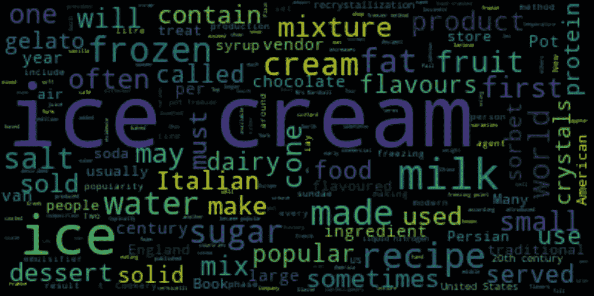
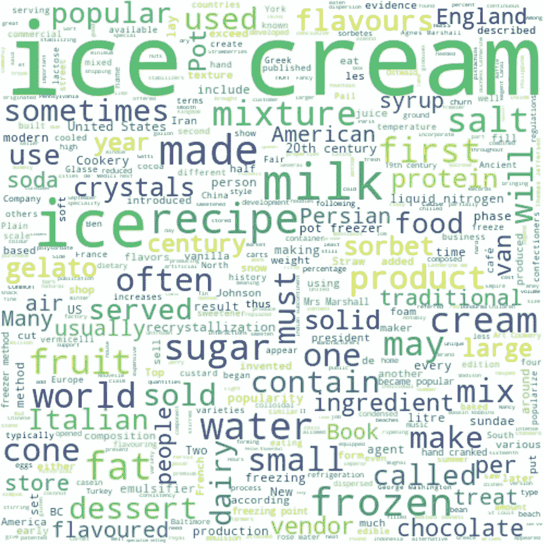
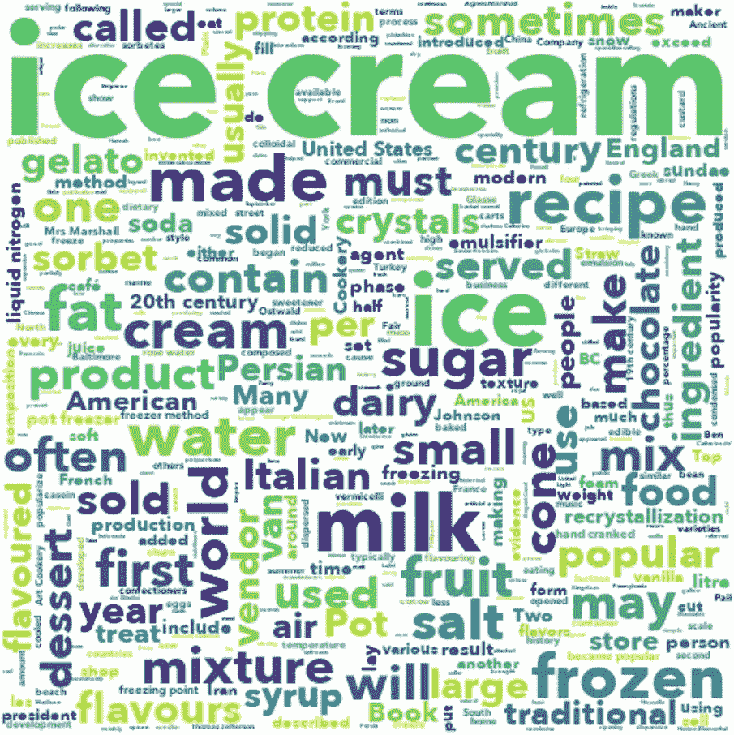
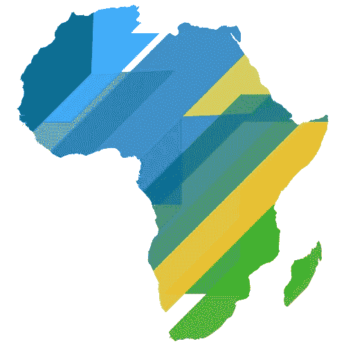
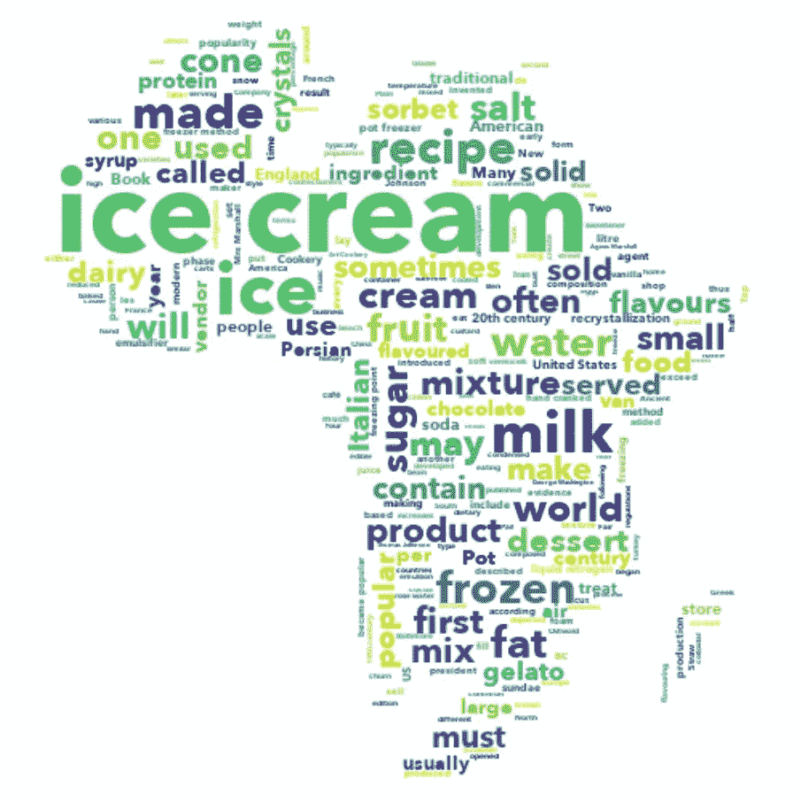
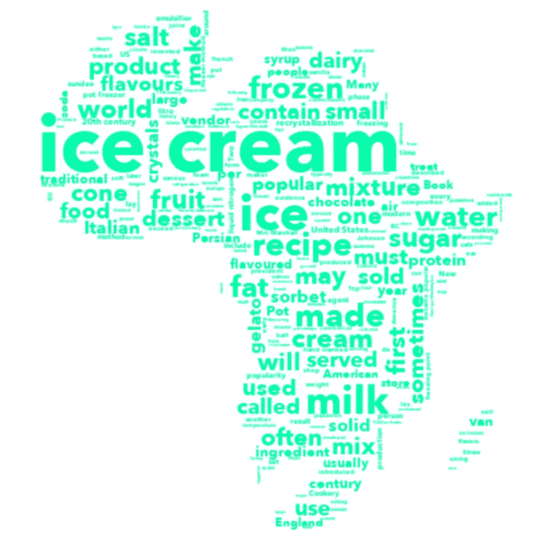
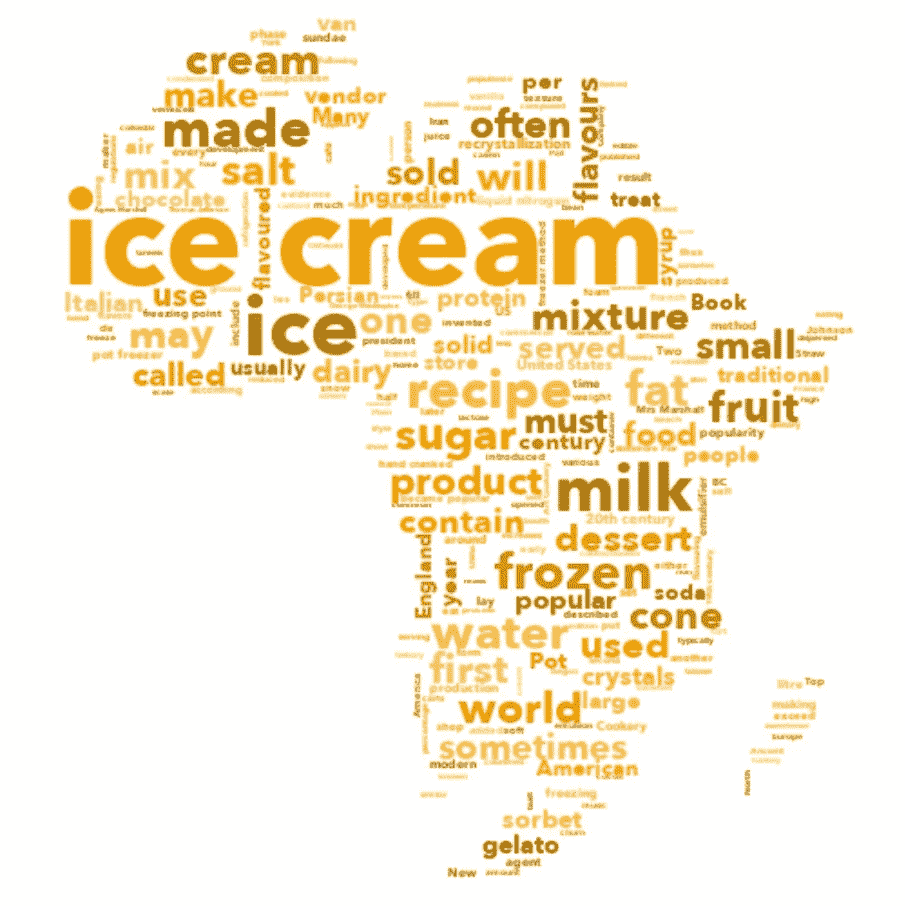
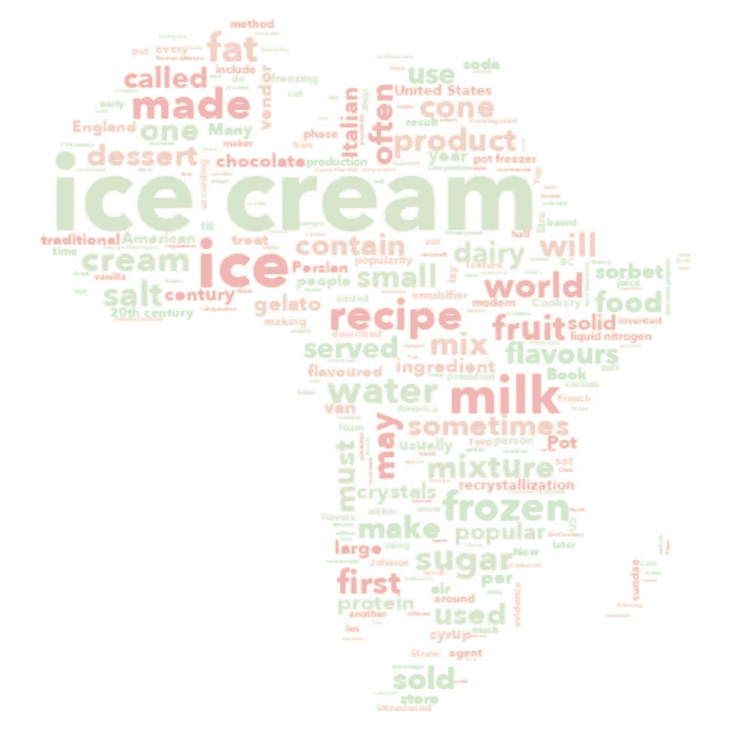
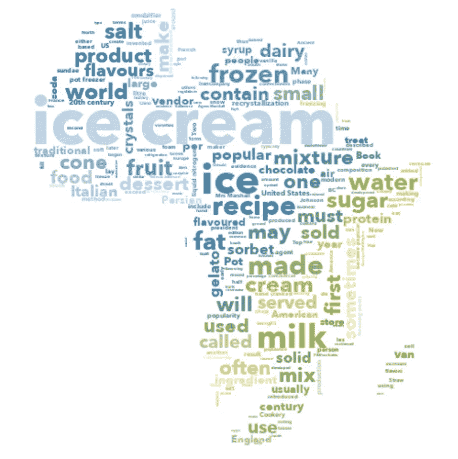

# 使用 Python 创建你想要的任何形状的单词云

> 原文：<https://towardsdatascience.com/create-word-cloud-into-any-shape-you-want-using-python-d0b88834bc32?source=collection_archive---------10----------------------->

## 创建漂亮单词云的分步指南


词云示例— Twitter 美国航空公司情绪([https://www . ka ggle . com/crowd flower/Twitter-Airline-情绪](https://www.kaggle.com/crowdflower/twitter-airline-sentiment))

数据可视化(如图表、图形、信息图等。)为企业提供了交流重要信息的价值，但如果您的数据是基于文本的呢？如果你希望惊人的可视化格式突出重要的文本数据点，那么使用单词云。

如果你不熟悉单词云，它是由一组单词组成的图片，其中每个单词的大小代表频率或重要性。单词越大、越粗，在一篇文章中被提到的次数就越多，也就越重要。字云易读易懂。关键词对读者来说很突出，并且在视觉上吸引观众。

然而，你可能会厌倦看到单词 cloud 的简单形式。如果我告诉你，WordCloud 也可以根据我们的喜好定制。在本文中，我们将探索如何在 python 中生成您想要的任何形状的单词云。那么，我们开始吧。

如果想看这篇文章的完整代码，请访问我的 [**github**](https://github.com/fahmisalman/python-wordcloud) 。第一步，安装将要使用的包，即 [**wordcloud**](https://amueller.github.io/word_cloud/) 。打开终端(Linux / macOS)或命令提示符(windows)并键入:

```
$ pip install wordcloud
```

我们将从对互联网上的一篇文章进行网络搜集开始。如果你对网页抓取不熟悉，建议你看一下我之前的一篇文章，标题是 [**用 Python 制作 4 行网页抓取新闻**](/scraping-a-website-with-4-lines-using-python-200d5c858bb1) 。

[](/scraping-a-website-with-4-lines-using-python-200d5c858bb1) [## 用 Python 实现 4 行新闻的网络抓取

### 抓取网站的简单方法

towardsdatascience.com](/scraping-a-website-with-4-lines-using-python-200d5c858bb1) 

在这篇文章中，我将从维基百科上抓取标题为' [*冰淇淋*](https://en.wikipedia.org/wiki/Ice_cream) *'* 的新闻。

```
from newspaper import Articlearticle = Article('[https://en.wikipedia.org/wiki/Ice_cream'](https://en.wikipedia.org/wiki/Ice_cream'))
article.download()
article.parse()
```

我们只取文章的正文，也就是:

```
article.text
```

## 简单词云

我们先做一个简单的单词云。第一步是导入我们将使用的依赖项。

```
from wordcloud import WordCloud
import matplotlib.pyplot as plt
```

这里我们用的是 wordcloud 库和 matplotlib。wordcloud 库用于生成单词云，matplotlib 用于显示单词云的结果。之后我们调用词云函数，显示词云。

```
wc = WordCloud()
wc.generate(article.text)
plt.imshow(wc, interpolation="bilinear")
plt.axis('off')
plt.show()
```

这是我们创造的简单单词云的结果。



简单词云

此外，wordcloud 函数有参数，包括:

*   背景颜色=背景的颜色
*   max_words =使用的唯一字的最大数量
*   停用词=停用词列表
*   max_font_size =最大字体大小
*   random_state =确保在
*   相同的顺序，所以即使生成多次，结果也是一样的
*   宽度=输出的宽度大小
*   height =输出的高度大小

让我们尝试使用上面的参数。首先，让我们导入 wordcloud 库提供的停用词

```
from wordcloud import STOPWORDS
```

然后我们输入下面的代码

```
wc = WordCloud(background_color="white", max_words=2000,
               stopwords=STOPWORDS, max_font_size=256,
               random_state=42, width=500, height=500)
wc.generate(article.text)
plt.imshow(wc, interpolation="bilinear")
plt.axis('off')
plt.show()
```

这就是结果。



带参数调整的简单单词云

## 添加自定义字体

我们也可以改变使用的字体。你可以从网站[https://www.dafont.com](https://www.dafont.com)下载字体供**个人使用**。接下来，在参数中输入字体的路径。

```
font_path = 'path/to/font'
wc = WordCloud(stopwords=STOPWORDS, font_path=font_path, 
               background_color="white", max_words=2000,
               max_font_size=256, random_state=42,
               width=500, height=500)
wc.generate(article.text)
plt.imshow(wc, interpolation="bilinear")
plt.axis('off')
plt.show()
```

这就是结果



自定义字体

## 添加自定义遮罩

接下来我们将为单词 cloud 添加一个遮罩。请记住，所用图像的背景必须是白色的，否则，系统会将背景视为物体。另外，背景不能是透明的，因为透明的颜色会被认为是黑色。我将使用下面的图像作为一个面具。



图像遮罩

我们需要添加一些依赖项来加载图像。

```
from PIL import Image
import numpy as np
```

接下来，在参数中输入字体的路径。

```
mask = np.array(Image.open('path/to/image'))
wc = WordCloud(stopwords=STOPWORDS, font_path=font_path,
               mask=mask, background_color="white",
               max_words=2000, max_font_size=256,
               random_state=42, width=mask.shape[1],
               height=mask.shape[0])
wc.generate(article.text)
plt.imshow(wc, interpolation="bilinear")
plt.axis('off')
plt.show()
```

这就是结果。



掩蔽词云

## 调整颜色

我们还可以调整单词 cloud 中使用的颜色。基本上，我们可以自由决定我们将使用的颜色，但在这篇文章中，我将讨论相当常用的颜色。我们只用一种颜色。但是，我们必须定义要使用的函数。

```
def one_color_func(word=None, font_size=None, 
                   position=None, orientation=None, 
                   font_path=None, random_state=None):
    h = 160 # 0 - 360
    s = 100 # 0 - 100
    l = 50 # 0 - 100return "hsl({}, {}%, {}%)".format(h, s, l)
```

使用的颜色格式是 HSL 格式(色调、饱和度、亮度)。更多详情，请访问 [**HSL 颜色选择器**](http://hslpicker.com) 了解更多关于所用颜色的信息。那么要形成词云，我们所要做的就是将我们已经创建的函数添加到词云函数中。

```
wc = WordCloud(stopwords=STOPWORDS, font_path=font_path,
               mask=mask, background_color="white",
               max_words=2000, max_font_size=256,
               random_state=42, width=mask.shape[1],
               height=mask.shape[0], color_func=one_color_func)
wc.generate(article.text)
plt.imshow(wc, interpolation="bilinear")
plt.axis('off')
plt.show()
```

图像会是这样的。



一种颜色

除此之外，我们还可以在一定范围内随机产生相似的颜色。我将在明度中添加一个随机函数来调整颜色的亮度。

```
def similar_color_func(word=None, font_size=None,
                       position=None, orientation=None,
                       font_path=None, random_state=None):
    h = 40 # 0 - 360
    s = 100 # 0 - 100
    l = random_state.randint(30, 70) # 0 - 100return "hsl({}, {}%, {}%)".format(h, s, l)
```

然后，和以前一样。将函数输入到 wordcloud 函数中。

```
wc = WordCloud(stopwords=STOPWORDS, font_path=font_path,
               mask=mask, background_color="white",
               max_words=2000, max_font_size=256,
               random_state=42, width=mask.shape[1],
               height=mask.shape[0], color_func=similar_color_func)
wc.generate(article.text)
plt.imshow(wc, interpolation="bilinear")
plt.axis('off')
plt.show()
```

结果会是这样的。



相似的颜色

此外，我们可以定义我们将使用的许多颜色。举个例子。

```
def multi_color_func(word=None, font_size=None,
                     position=None, orientation=None,
                     font_path=None, random_state=None):
    colors = [[4, 77, 82],
              [25, 74, 85],
              [82, 43, 84],
              [158, 48, 79]]
    rand = random_state.randint(0, len(colors) - 1)return "hsl({}, {}%, {}%)".format(colors[rand][0], colors[rand][1], colors[rand][2])
```

并将该功能添加到 wordcloud 功能中。

```
wc = WordCloud(stopwords=STOPWORDS, font_path=font_path,
               mask=mask, background_color="white",
               max_words=2000, max_font_size=256,
               random_state=42, width=mask.shape[1],
               height=mask.shape[0], color_func=multi_color_func)
wc.generate(article.text)
plt.imshow(wc, interpolation="bilinear")
plt.axis('off')
plt.show()
```

结果是这样的。



多种颜色

最后但同样重要的是，根据蒙版生成颜色。我们将需要 wordcloud 库提供的功能。

```
from wordcloud import ImageColorGenerator
```

然后添加蒙版颜色，将函数添加到 wordcloud 函数中。

```
mask_colors = ImageColorGenerator(mask)
wc = WordCloud(stopwords=STOPWORDS, font_path=font_path,
               mask=mask, background_color="white",
               max_words=2000, max_font_size=256,
               random_state=42, width=mask.shape[1],
               height=mask.shape[0], color_func=mask_colors)
wc.generate(article.text)
plt.imshow(wc, interpolation="bilinear")
plt.axis('off')
plt.show()
```

这是最后的结果。



生成的颜色

正如我们所看到的，单词云的颜色遵循原始图像的颜色。

所以对于这篇文章，我希望你能从我所说的中获得新的知识。如果你有其他看法，请写在评论里。以后我会分析这个词云的用法进行文本分析。