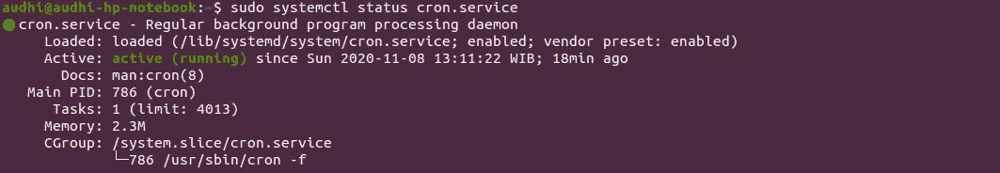
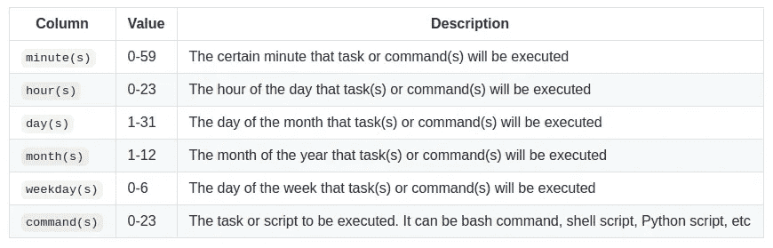
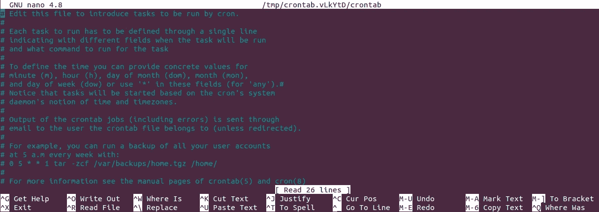

# Linux 服务器中的 Cron 作业入门:初学者完全教程

> 原文：<https://towardsdatascience.com/create-your-first-cronjob-on-the-linux-server-74e2fdc76e78?source=collection_archive---------4----------------------->


照片由 [Sai Kiran Anagani](https://unsplash.com/@_imkiran?utm_source=medium&utm_medium=referral) 在 [Unsplash](https://unsplash.com?utm_source=medium&utm_medium=referral) 上拍摄

## [动手教程](https://towardsdatascience.com/tagged/hands-on-tutorials)

## 使用 cron 自动化您的日常工作

## 目录(仅适用于 web)

```
1 [What are cron, cron job, and crontab?](#bed8)
2 [Understand a cron job syntax](#4a20)
3 [How to handle an error on your cron job](#f0c2)
  • [Send output to a specific file](#5f39)
  • [Use /dev/null](#99b9)
4 [Write a simple cron automation script](#d7e8)
5 [Conclusion](#2c02)
6 [References](#62e2)
```

## 什么是 cron、cron job 和 crontab？

Cron 是一个帮助 Linux 用户安排任何任务的系统。然而，cron 作业是在给定时间段内运行的任何定义的任务。它可以是一个 shell 脚本或一个简单的 bash 命令。Cron job 帮助我们自动化我们的日常任务，它可以是每小时，每天，每月等。

> **注意:**在大多数 Linux 系统中，我们必须获得系统管理员的许可，才能定义`**crontab**`中列出的特定 cron 作业

同时，crontab 代表 cron 表。这是一个包含 cron 作业列表的 Linux 系统文件。我们在 crontab 中定义我们的任务——bash 命令、shell 脚本、Python 脚本等等。

```
**# Check cron service on Linux system**
sudo systemctl status cron.service
```



检查 Linux 系统上的 cron 服务(图片由作者提供)

## 理解 cron 作业语法

是时候在`**crontab**`上学习 cron 作业语法了。

*   `**crontab -a <filename>**`:新建一个`**<filename>**`作为 crontab 文件
*   `**crontab -e**`:编辑我们的 crontab 文件，或者创建一个不存在的文件
*   `**crontab -l**`:显示我们的 crontab 文件
*   `**crontab -r**`:删除我们的 crontab 文件
*   显示我们上次编辑 crontab 文件的时间

```
**minute(s) hour(s) day(s) month(s) weekday(s) command(s)**
```



crontab 文件中六列的描述(图片由作者提供)

> **注意:**日名 0–6 以星期日开始。我们可以很容易地确定我们在 https://crontab.guru/的行程

## 如何处理 cron 作业中的错误

如果 cron 作业遇到错误，默认情况下，它会向系统管理员发送一封电子邮件。相反，当我们遇到错误时，我们将找出两种常见的方法。

## **1 将输出发送到特定文件**

这是一种常见的方式，我总是在我的 cron 工作中使用它。很简单。我们只需要创建一个文件来保存我们的 cron 作业日志。它将打印出输出，以防作业正确完成，或者如果失败，打印出一个错误。

在本教程中，它只是创建了一个`**log.out**`文件。输出将被重定向到`**log.out**`。

```
* * * * * cd /home/audhi && /bin/bash shell-script.sh >> log.out
```

crontab 文件中上述语法的描述如下。

*   `*** * * * ***`意味着一个任务将在一周的每一天、每月的每一天、每小时的每一分钟被执行
*   目录将切换到 shell-script.sh 所在的`**/home/audhi**`
*   `**/bin/bash**`是 *Bash shell* 的路径和可执行文件
*   `**>>**` 符号将把输出附加到一个现有文件中(`**log.out**`)，而单个`**>**`符号将覆盖该文件
*   `**shell-script.sh**`是某个 shell 脚本



Linux 系统上的 crontab 文件(图片由作者提供)

> 注意:我们需要在 crontab 中编写完整清晰的命令。需要使用`**cd**`指定文件位置

## 2 使用/dev/null

我们可以轻松地将 cron 作业日志和错误发送到`**dev/null**`，而不是通过电子邮件发送警报。无论我们向`**dev/null**`发送或写入什么，都将被丢弃。

```
* * * * * cd /home/audhi && /bin/bash shell-script.sh > /dev/null 2>&1
```

命令的简短描述:

*   `**> /dev/null**`告诉 cron 将输出(STDOUT)重定向到`**/dev/null**`
*   `**2**`是*标准错误* (STDERR)的文件描述符
*   `**&**`是文件描述符的符号(没有它，后面的`**1**`将是文件名)
*   `**1**`是*标准输出* (STDOUT)的文件描述符

> **注意:**2>&1 告诉 cron 将所有错误(STDERR)重定向到与标准输出(STDOUT)相同的位置

## 编写一个简单的 cron 自动化脚本

为了完成本文，我创建了一个 Python 脚本来演示如何使用 cron 作业。这个 Python 脚本将从印度尼西亚最大的在线新闻之一 [*Kompas News*](https://www.kompas.com/covid-19) 中收集新冠肺炎数据。你可以在我的 [**GitHub repo**](https://github.com/audhiaprilliant/Web-Scraping-Covid19-Kompas-News) 找到我的新冠肺炎数据网页抓取的 Python 脚本。它的文件名是`**Web Scraping Covid-19 Kompas News.py**`。

打开我们的终端，键入`**crontab -e**`打开一个 crontab 文件。然后，向下滚动并键入以下命令。

```
5 16 * * * cd 'covid19 data' && /usr/bin/python3 'Web Scraping Covid-19 Kompas News.py' >> test.out
```

crontab 文件中上述语法的描述如下。

*   crontab 位于`***/home***` 而我的脚本在`***/home/covid19 data***`****所以我们需要先切换到`***/home/covid19 data***`****
*   ****`**python3**`解释器位于`**/usr/bin/python3**`****
*   ****输出将被重定向到`***/home/covid19 data***`中的`**test.out**`文件****

> ****注意: cron 使用本地时间****

****还可以学习***Apache air flow***作为作业编排来自动化常规任务！****

****[](https://medium.com/analytics-vidhya/apache-airflow-as-job-orchestration-e207ba5b4ac5) [## Apache Airflow 作为新冠肺炎数据的作业编排(通过电子邮件和电报发送通知)

### 印度尼西亚新冠肺炎数据的网络采集

medium.com](https://medium.com/analytics-vidhya/apache-airflow-as-job-orchestration-e207ba5b4ac5) 

## 结论

cron 作业在 Linux 系统上运行，以运行和执行我们的常规任务(终端命令)。关于 cron 作业，要学习的最重要的事情是终端上的 bash 命令，如何设置我们的任务调度，并确保在我们的脚本在生产环境中运行时捕捉到所有的可能性，以便我们可以防止错误。

## 参考

[1] Schkn。[*Linux 上的 Cron Jobs 和 Crontab 讲解*](https://devconnected.com/cron-jobs-and-crontab-on-linux-explained/)(2019)[https://dev connected . com/Cron-Jobs-and-Crontab-on-Linux-Explained/](https://devconnected.com/cron-jobs-and-crontab-on-linux-explained/)。

[2] C .默里。 [*用实例了解 Linux 中的 Crontab*](https://linuxhandbook.com/crontab/#quick-introduction-to-key-cron-concepts)(2019)[https://Linux handbook . com/Crontab/# quick-introduction-to-key-cron-concepts](https://linuxhandbook.com/crontab/#quick-introduction-to-key-cron-concepts)。

[3]阿加莎。克龙约伯: [*潘端冷卡普 untuk 佩穆拉 2020*](https://www.hostinger.co.id/tutorial/cron-job/)(2020)。****