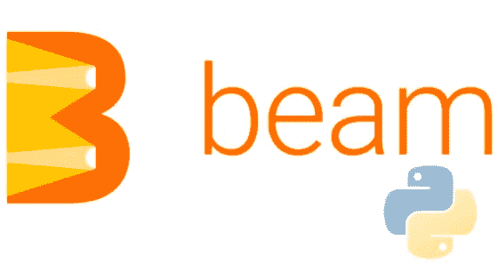

# 在 Apache Beam 中创建您的第一个 ETL 管道

> 原文：<https://towardsdatascience.com/create-your-first-etl-pipeline-in-apache-beam-767b62a38489?source=collection_archive---------19----------------------->

在这篇文章中，我将为您的 Python 应用程序介绍另一个 ETL 工具，叫做 *Apache Beam* 。

# 什么是阿帕奇光束？

根据维基百科:

> Apache Beam 是一个开源的**统一编程模型**，用于定义和执行数据处理管道，包括 ETL、批处理和流(连续)处理..

与[气流](http://blog.adnansiddiqi.me/getting-started-with-apache-airflow/)和[路易吉](http://blog.adnansiddiqi.me/create-your-first-etl-in-luigi/)不同，阿帕奇 Beam 不是服务器。它是一个包含一组 API 的编程模型。目前，它们可用于 Java、Python 和 Go 编程语言。典型的基于 Apache Beam 的管道如下所示:

*(图片来源:*[https://beam . Apache . org/images/design-your-pipeline-linear . SVG)](https://beam.apache.org/images/design-your-pipeline-linear.svg))

从左边开始，从数据库中获取数据(*提取*)，然后经过多个转换步骤，最后将其存储(*加载*)到数据库中。

让我们讨论一些 Apache Beam 中使用的术语:

*   ***管道*** :-一条管道封装了整个数据处理体验；从数据采集到加载到数据存储。
*   ***p 集合*** :-是数据的集合。数据可以是来自固定源的*有界的*或来自单个或多个流的*无界的*。
*   ***PTransform* :-** 它是一个作用于*p 集合中每个元素的进程。*
*   ——一个可移植的 API 层，帮助创建在不同引擎或运行程序上执行的管道。目前支持 Direct Runner(用于本地开发或测试目的)、 *Apache Apex、Apache Flink、Gearpump、Apache Spark* 和 *Google DataFlow。*

# 发展

使用`pip`安装 Python SDK:

`pip install apache-beam`

Apache Beam SDK 现在已经安装好了，现在我们将创建一个简单的管道，它将从文本字段中读取行，转换大小写，然后反转。

以下是管道的完整程序:

导入必要的库后，我们将调用`PipelineOptions`进行配置。例如，如果你正在使用谷歌云数据流，那么你需要传递必要的选项，如项目名称或云名称等。您还可以在它的`flag`参数中传递命令行参数，例如，输入和输出文件名。

第一步是数据摄取或获取，我们将调用`ReadFromText`从文本文件中读取数据。管道符号(|)是一个重载操作符，它将`PTransform`应用于`PCollection`。如果你使用过 Linux 管道，你应该不难理解。在我们的例子中，集合是通过`ReadFromText`产生的，然后通过`ParDo` a 函数传递给`ToLower()`。`Pardo`对`PCollection`的每个元素应用一个函数。在我们的例子中，它运行在文件的每一行。如果您在`ToLower()`函数中添加一个`print()`命令，您会看到它将遍历集合并打印存储在`element`变量中的每一行。我们构造一个 JSON 对象，并将每个元素的内容存储在其中。之后，它通过另一个`PTransform`，这次是通过`ToReverse`来反转内容。最后通过调用`WriteToText`函数将数据存储在文本文件中。当您使用`file_name_suffix`参数时，它会创建带有适当扩展名的输出文件，例如对于我们来说，它创建为`processed-00000-of-00001.txt`。默认情况下，Apache Beam 创建多个输出文件，这是在分布式系统上工作时的一种习惯。这些文件的原始内容是:

> 巴基斯坦的冠状病毒病例在一天内翻了一番，周一迪拜的总数为 106 例:在信德省当局确认 53 例新病例后，巴基斯坦的冠状病毒病例周一已上升至 106 例。信德省现在是巴基斯坦疫情最严重的省份，截至周一下午，共报告了 106 例冠状病毒病例中的 88 例。这是迄今为止该国新型冠状病毒病例增加最多的一次。信德省首席部长法律、反腐败机构和信息顾问穆尔塔扎·瓦哈卜(Murtaza Wahab)周一在推特上说，从与伊朗接壤的塔夫坦边境隔离区返回的 50 人新冠肺炎病毒检测呈阳性

在第一次转换时，它会将所有字符转换成小写。例如如下所示:

> 巴基斯坦的冠状病毒病例在一天内翻了一番，周一迪拜的总数为 106 例:在信德省当局确认 53 例新病例后，巴基斯坦的冠状病毒病例周一已上升至 106 例。

正如你所看到的，我已经返回了一个字典列表。这样做的原因是，如果我不这样做，它会在一行返回一个字符，所以冠状病毒会变成:

> c
> o
> r
> o
> n
> a
> v
> I
> r
> u
> s

这是不希望的。我还不知道为什么会发生这种情况，把一行单词分成单个的字符，但是现在，我找到的解决方法是返回一个字典列表。在最后一次转换中，我不带任何词典返回。运行后，将创建一个名为**processed-00000-of-00001 . txt**的文件，该文件将包含以下内容:

> 从第 601 天起，我就不在这里了
> 
> 。根据第 601 号法令第 35 条的规定，难民事务高级专员办事处将向难民事务高级专员办事处提供援助
> 
> 。你知道吗？我不知道你在说什么。没有任何迹象表明，佛陀 601 号公路上的幸存者已经死亡
> 
> 91-2005 年，全国人大常委会通过了《全国人大常委会关于维护互联网安全的决定》

如您所见，该文件现在包含相同的内容，但顺序相反。

# 结论

Apache Beam 是编写基于 ETL 的应用程序的好工具。我只是讨论了它的基本原理。您可以将它与云解决方案集成，并将数据存储到典型的数据库中。我希望您会发现它很有用，并将在您的下一个应用程序中尝试它。

与往常一样，代码可以在 [Github](https://github.com/kadnan/PythonApacheBeam) 上获得。

*原载于 2020 年 3 月 27 日*[*http://blog . adnansiddiqi . me*](http://blog.adnansiddiqi.me/create-your-first-etl-pipeline-in-apache-beam/)*。*