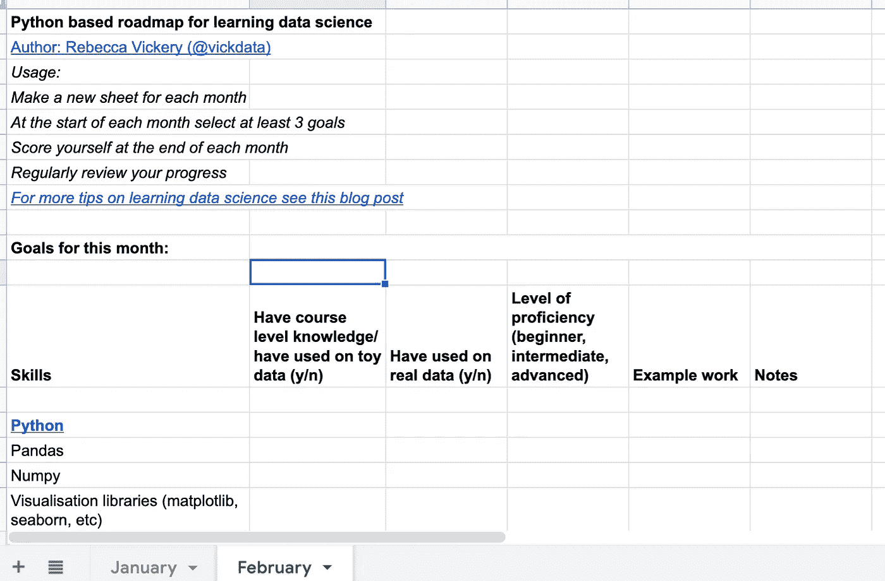

# 创建您自己的数据科学课程

> 原文：<https://towardsdatascience.com/create-your-own-data-science-curriculum-6628b253d50d?source=collection_archive---------11----------------------->

约翰·施诺布里奇在 [Unsplash](https://unsplash.com/s/photos/learning?utm_source=unsplash&utm_medium=referral&utm_content=creditCopyText) 上的照片

## 如何设计个性化的数据科学学习路径

随着数据科学领域在过去十年中的发展，在线课程、学位课程和训练营的数量也在增加，这些课程和训练营有望教会你成为数据科学家所需的一切。尽管这些课程中有许多会为你提供核心原则的坚实基础，但它们绝不是针对你个人的。

随着现在数据科学可用的学习资源数量的增加，对于许多人来说，创建自己的定制学习课程可能是最佳选择。通过创建个性化的学习路径，你将只学习你需要学习的东西，深入到特别适合你的目标的领域，并且在大多数情况下，与支付学位课程或训练营相比，花费要少得多。

在下面的文章中，我将描述为什么为数据科学创建自己的课程是一个好主意，如何开始以及如何在没有老师或讲师的情况下保持继续学习的动力。

## 决定你想成为什么

数据科学是一个广阔的领域，事实上，有许多不同类型的角色可以在数据科学的保护伞下进行分类。就所需的技能组合而言，尤其是某些技能所需的知识深度而言，这些角色各不相同。

例如，机器学习工程师的角色将需要深入的编程和数据工程知识，因此这类角色的课程重点将更接近软件工程技能。而从事新算法和技术研究的数据科学家需要更广泛的数学和统计概念知识。

因此，提前确定你最感兴趣的数据科学领域，然后围绕你需要发展的特定技能设计课程至关重要。

## 你已经知道了什么？

由于数据科学是一个相对较新的领域，许多学习数据科学的人已经拥有了通过以前的工作或学术研究获得的技能和经验。在设计你的课程时，考虑你已经掌握的可以转移的技能是很重要的。

例如，如果你已经获得了一个数学学科的博士学位，那么你可能已经具备了所需的数学概念的必备知识。因此，你的课程可能更适合获取软件工程技能。然而，如果你以前做过软件工程师，这是进入数据科学越来越常见的途径，那么你的重点可能是获取机器学习算法背后的数学和统计学理论知识。

## 你需要学习什么？

一旦你知道了你最感兴趣的数据科学的具体领域，并从以前的研究或工作经验中确定了任何可转移的技能，就该列出你需要学习的技能了。

要做到这一点，首先要看看所有数据科学家都需要的核心技能，不管是在哪个特定领域。如今，这通常是 python、SQL、数据分析、机器和深度学习、数据工程，以及至少对机器和深度学习背后的数学和统计学的基本理解。如果你还没有这些领域的知识或经验，那就把它们添加到你的列表中。

接下来，你需要看一些你感兴趣领域的招聘广告。每份工作列出的要求将会给你一个很好的主意，在这些领域中你需要获得更深层次的知识。然后，您可以将这些添加到您的列表中。

## 确定你的学习风格

不同的人用不同的方式学得最好。有些人通过视觉和听觉方法学得最好，如幻灯片和视频，有些人喜欢单独或集体学习，而另一些人更喜欢通过做来学习。

20 世纪 70 年代，新西兰教师尼尔·弗莱明创造了学习风格的瓦尔克模型。这个模型将学习风格分为七种不同的类型。传统课程假设每个人通过使用特定的媒介都能学得最好。然而，我相信要真正尽可能高效地学习，找到最适合你个人学习风格的合适材料是很重要的。为了了解你是哪种类型的学习者，你可以参加这个[测验](https://arden.ac.uk/what-type-learner-are-you)。

有大量不同的学习材料可用于获取数据科学职业所需的技能。如果你是一个实用的学习者，你可以尝试基于浏览器编程的课程，如 [Dataquest](https://www.dataquest.io/) 和 [codeacademy](https://www.codecademy.com/) ，或者尝试参加 [kaggle](https://www.kaggle.com/) 竞赛。如果你通过讲座和视频学得更好，那么 coursera 有一系列使用这种材料的课程。

## 庆祝你的成功

最后，一旦你确定了你需要学习的技能和你想如何学习它们，你需要决定一种方法来跟踪你的进步，这样你就可以庆祝你的成就。

我建议创建一个学习路线图。这不必是什么花哨的东西，我用谷歌表跟踪我的。重要的是找到一种方法来记录你正在学习的技能，并包括一种方法来标记或记录你在这些技能上的进展。

我用来学习数据科学的路线图如下图所示。这包括一个带有评分系统的谷歌表单上的一长串技能。每月一次，我会对照这个技能和熟练程度列表给自己打分，并与上个月进行比较。

通过记录你的进步，并定期停下来庆祝你的成功，你将保持动力继续学习你的课程。

概括地说，要为学习数据科学创建量身定制的课程，您需要采取以下步骤:

1.  决定你最感兴趣的数据科学的具体领域。
2.  确定你已经拥有的任何可转移的技能。
3.  列出你需要学习的技能。
4.  了解你的学习方式，找到最适合你的资源。
5.  想办法跟踪你的进步，定期庆祝你的成功。

关于学习数据科学的完全免费资源列表，请参见我以前的文章— [如何免费学习数据科学](/how-to-learn-data-science-for-free-eda10f04d083)。

要了解如何加快学习速度，请参见— [学习数据科学的最快方法](/the-fastest-way-to-learn-data-science-6b0a648663bb)。

感谢阅读！