# 用熊猫创建你自己的数据框架

> 原文：<https://towardsdatascience.com/create-your-own-dataframe-with-pandas-c20942d2ff91?source=collection_archive---------67----------------------->

## 创建样本数据框的简单方法


由 [Unsplash](https://unsplash.com/s/photos/pandas?utm_source=unsplash&utm_medium=referral&utm_content=creditCopyText) 上的 [chuttersnap](https://unsplash.com/@chuttersnap?utm_source=unsplash&utm_medium=referral&utm_content=creditCopyText) 拍摄

Pandas 是一个非常强大的 Python 数据分析库，可以加速项目的预处理步骤。在这篇文章中，我将介绍用熊猫创建样本数据框的不同方法。

练习是学习任何学科的关键基础。在编码中更是如此。为了建立流畅的编码技能，练习起着关键的作用。因此，在学习和练习数据分析和操作的基础知识时，创建自己的样本数据框架可能比在网上搜索合适的数据框架更方便。Pandas 提供了许多方法来创建具有所需形状和特征的样本数据帧。

让我们来看看创建自己的数据框架的不同方法。一如既往，我们从进口熊猫开始。

```
import pandas as pd
import numpy as np
```

我们可以创建一个字典并直接将其转换为数据帧:

```
dict_a = {'col_a':[1,2,5,8],
         'col_b':['John','Nancy','Adam','Julia'],
         'col_c':[True,True,False,True]}df_a = pd.DataFrame(dict_a)
```

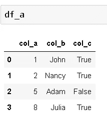

我们甚至不需要指定数据类型，因为 pandas 能够推断出它们:

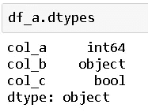

df_a 是一个相对较小的数据帧。对于某些任务，我们可能需要更大的数据框架，但是键入一个有许多条目的字典是乏味的。在这种情况下，我们可以使用 numpy 来创建样本数组。然后，这些数组可以用作字典中的值:

```
dict_b = {'col_a': np.random.randn(50), 
         'col_b': np.random.randint(10, size=50)}df_b = pd.DataFrame(dict_b)df_b.shape
(50,2)
```

**np.random.randn(50)** 创建 50 个正态分布的值， **np.random.randint(10，size=50)** 创建 50 个介于 0 和 10 之间的整数值。正如我们所看到的，结果数据帧的大小是(50，2)。让我们看看前 5 行:

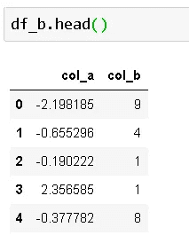

我们还可以用 numpy 创建二维数组，并将这些数组直接转换成数据帧。要用 np.random.randint 创建二维数组，我们需要将一个元组传递给 **size** 参数:

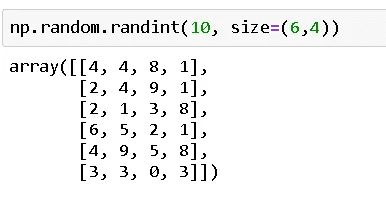

```
df_c = pd.DataFrame(np.random.randint(10, size=(6,4)))
```

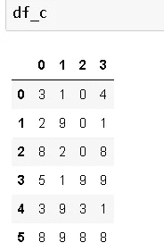

Pandas 分配整数列名，但是我们可以使用**列**参数来改变它:

```
df_d = pd.DataFrame(np.random.randint(10, size=(6,4)), 
columns=['a','b','c','d'])
```

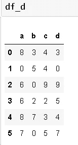

我们也可以改变索引值。这次让我们使用 np.random.randn 创建一个二维数组:

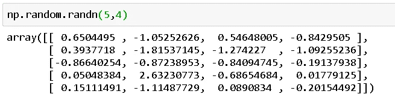

然后我们将使用 pandas 的 **date_range** 函数定义一个时间序列索引。然后将该索引传递给**索引**参数:

```
index = pd.date_range('2020-01-01','2020-01-05')df_e = pd.DataFrame(np.random.randn(5,4),
                    columns=['a','b','c','d'],
                    index=index)
```

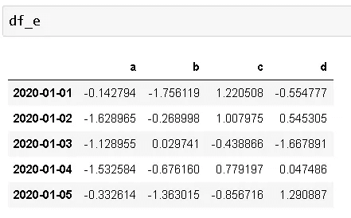

我们还可以使用 dtype 参数指定数据类型。回想一下我们创建的第一个数据帧。熊猫从值中推断出数据类型。让我们用指定的数据类型创建相同的数据帧:

```
dict_a = {'col_a':[1,2,5,8],
         'col_b':['John','Nancy','Adam','Julia'],
         'col_c':[True,True,False,True]}df_a = pd.DataFrame(dict_a, dtype='category')
```

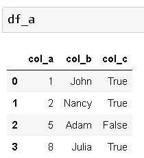

数据帧看起来相同，但数据类型不同:

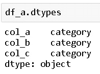

我们也可以使用多个字典来创建一个数据框架。我们创建一个字典列表，并将其输入到 pd。数据帧函数。字典的值将按照它们在列表中的顺序插入数据帧:

```
dict_a = {'col_a':[1,2,5,8],
         'col_b':['John','Nancy','Adam','Julia'],
         'col_c':[True,True,False,True]}dict_b = {'col_a':[1,7,9,18],
         'col_b':['a','d','c','t'],
         'col_c':[True,False,False,True]}list_g = [dict_a, dict_b]df_g = pd.DataFrame(list_g)
```

但是，通过这种方式，字典的值将被合并并放入数据帧的一个单元格中:

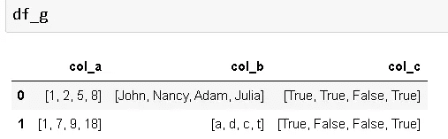

熊猫的一大优点是通常有多种方法来完成一项任务。所以，千万不要把自己局限在一种方式上，去寻找不同的方式和解决方法。用这种观点处理简单的任务是很重要的，因为这也有助于解决复杂的问题。

感谢您的阅读。如果您有任何反馈，请告诉我。