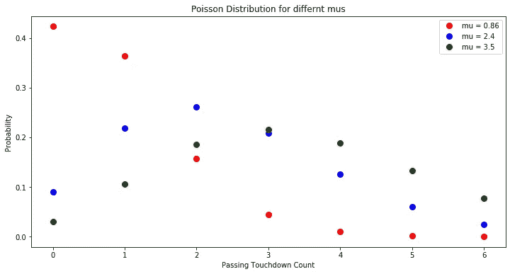
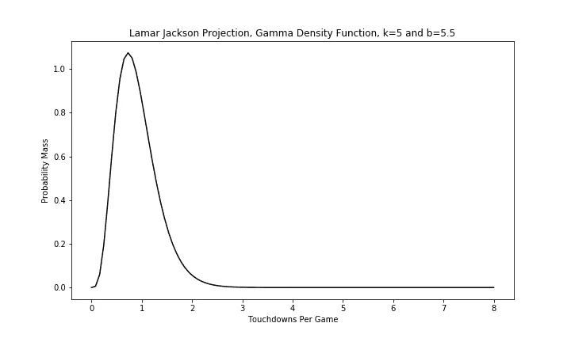
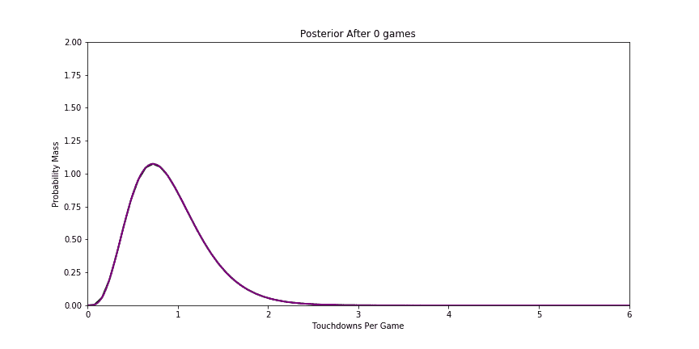
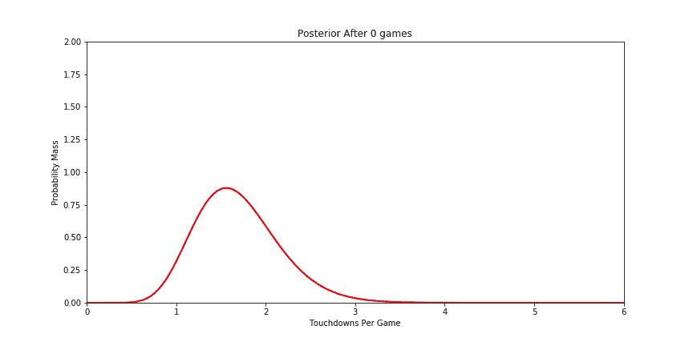
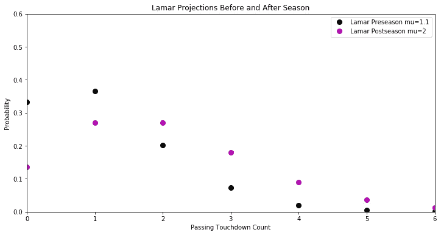
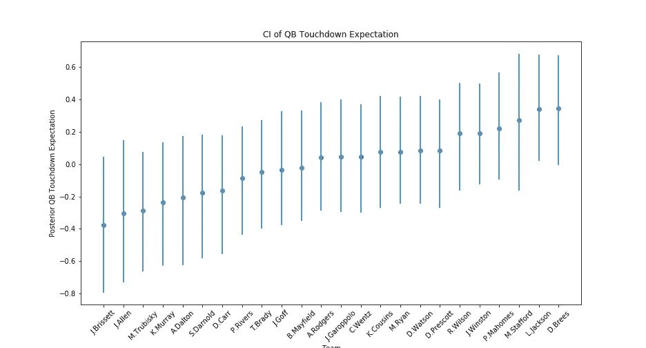
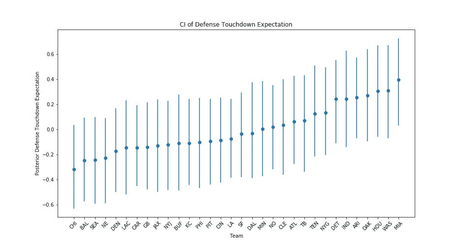
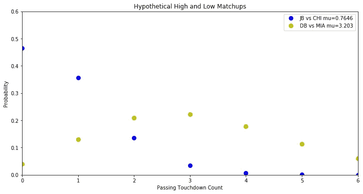
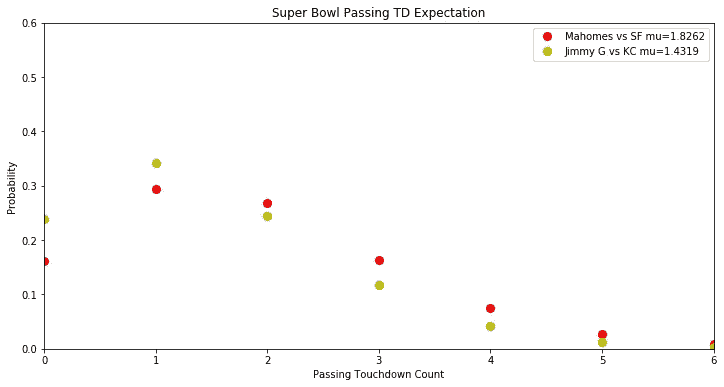

# 用 Python 创建自己的 NFL 触地得分道具

> 原文：<https://towardsdatascience.com/create-your-own-nfl-touchdown-props-with-python-b3896f19a588?source=collection_archive---------32----------------------->


Izaac Crayton 在 [Unsplash](https://unsplash.com/s/photos/nfl?utm_source=unsplash&utm_medium=referral&utm_content=creditCopyText) 上拍摄的照片

## 用泊松分布模拟离散事件的统计框架

# 动机

我很兴奋地展示一些推断方法来估计触地道具，因为这些方法本身非常强大，并且有多种应用。最大的好处是，根据定义，推断方法估计目标变量的潜在分布。在这种情况下，这意味着我知道一个球员投出 2 次触地得分、3 次触地得分、4 次触地得分或 10 次触地得分的可能性有多大，而不仅仅是一个平均值。了解整个分布很重要，因为道具从来不会问你点估计。当然，除了 props 之外，这些发行版还有许多应用。例如，您可能想知道在一段固定的 DNA 上由于辐射导致的预期突变的数量，或者一年中由于机械故障导致的飞机坠毁的数量。运动更有趣，但我不得不承认它们在现实生活中不那么重要。

其次，相对于传统的统计技术，过去我在黑盒机器学习模型方面有着不成比例的经验。从 Keras API 导入密集层可以解决很多问题，但这并不令人满意。很难回答这样的问题，这个模型是否过拟合？我的模型在做什么？有了一点经验，用推理来回答这类问题就容易多了。

# 贝叶斯推理

当我谈到推理模型时，我通常指的是贝叶斯推理。贝叶斯推理允许我们使用先验信息来估计我们的目标。你很少会对你试图估算的东西毫无头绪。贝叶斯推理允许我们创建一个“弱信息”先验。我知道一个球员每场比赛的传球触地得分是积极的。我知道这不会是什么荒谬的事情，比如每场比赛 20 次触地得分。我可以在制作模型时使用这类信息。

假设我们想估计拉马尔·杰克逊在 2019 赛季第 3 周的传球达阵输出。我从小到大上的统计课对这个问题没有很好的解决方法。一种方法可能是平均他在第一周和第二周的产量，并以此作为猜测。或者，我们可以使用上一季的平均值。很明显，这两种方法都有缺陷。在第一周和第二周，他平均 3.5 次传球达阵。熟悉足球的人都知道，场均 3.5 次传球达阵在低量传球进攻中是完全史无前例的。他还打了一个非常弱的迈阿密海豚队，这将夸大他的数字。去年，他在常规赛中平均每场比赛有 0.86 次触地得分。即使有更大的样本量，这也不能令人满意。他很年轻，他可能在休赛期取得了一些进步。该团队还致力于围绕他的技能与人员。

很容易说他的传球触地得分会在 0.85 到 3.5 之间。很难说他的传球输出会在 0.85 到 3.5 之间的哪个点结束。这就是贝叶斯推理可以帮助我们的地方。

## 边际可能性

贝叶斯方法为我们提供了一种数学上可靠的方法，将先验估计与小样本数据结合起来。我想远离密集的数学，但我也认为很重要的是要注意到，在我们拥有强大的个人电脑之前，贝叶斯推理是不太可能的。如果非要我猜的话，这就是为什么它们在传统的统计学课上不被强调的原因。贝叶斯推断需要估计[边际可能性](https://en.wikipedia.org/wiki/Marginal_likelihood)，那是极其困难的。这是维基百科的解释:

不幸的是，边际可能性通常很难计算。已知一小类分布的精确解，特别是当被边缘化的参数是数据分布的 [*共轭先验*](https://en.wikipedia.org/wiki/Conjugate_prior) *时。在其他情况下，需要某种* [*数值积分*](https://en.wikipedia.org/wiki/Numerical_integration) *方法，要么是一般方法如* [*高斯积分*](https://en.wikipedia.org/wiki/Gaussian_integration) *或* [*蒙特卡罗方法*](https://en.wikipedia.org/wiki/Monte_Carlo_method) *，要么是专门用于统计问题的方法如* [*拉普拉斯近似*](https://en.wikipedia.org/wiki/Laplace_approximation)*[](https://en.wikipedia.org/wiki/Gibbs_sampling)*

**实际上，这意味着你可以成为一名世界级的数学家，或者安装 Python 和 R 包来为你完成所有繁重的工作(繁重的工作意味着从后面采样数千次来代替求解积分)。**

# **泊松分布**

**泊松分布对于我们的着陆推进估算是理想的。如果您不熟悉它们，您可以将它们视为在固定时间段内对计数进行建模的一种良好而简单的方法。例如，假设我每天喝大约 0.86 杯咖啡。我每天咖啡摄入量的泊松分布可以用均值为 0.86 的泊松分布来建模。与正态分布不同，我不需要知道标准差或任何其他参数。方差等于平均值。**

**那似乎好得难以置信。有时候就是！在现实世界中，随着时间的推移，数据科学家很可能需要更多的参数来更好地建模计数。然而，泊松分布本身是非常强大的，没有进一步的复杂性。**

**我们可以使用相同的统计框架来模拟我一天喝的咖啡量和拉马尔在一场比赛中触地得分的次数，这很酷。在这篇文章中，我将把重点放在他身上，因为他是一个有趣的案例。他被幻想足球专家预测为 2019-20 年任何 16 场比赛首发中触地得分最低的球员，但最终获得了最多的触地得分。这并不一定意味着幻想分析师的工作很糟糕。离群发生！**

****

**如果 mu = 0.86，你会期望大约 41%的时间没有传球触地得分。大约 23%的情况下，你会期望两个或更多。**

**以下是使用泊松建模所需的假设:**

1.  **接地计数是离散的，不能为负✅**
2.  **触地得分是✅的独立项目**
3.  **触地得分的平均发生率是常数✅**

**好吧，我承认，这些假设并不完美。在现实世界中，假设几乎从来都不是！平均速度是复杂的，比如两分钟的训练和更多的传球。还有其他可能的方法，如负二项分布或有序逻辑回归。在这种情况下，我认为 Poisson 会以更低的复杂性提供类似的性能。其他离散概率分布值得今后进一步探讨。无论你选择哪种方法，请注意小样本是一个问题，因为一个赛季只有 16 场比赛。**

# **制作一个先验**

**我需要预先估计一个赛季中一个四分卫每场比赛会投多少次达阵。用外行人的话来说，我是在用以前的足球知识对每个四分卫会投多少次达阵做出有根据的猜测。如果我觉得懒，我可以用全联盟的平均值。然而，仅仅一个平均值就从我们的模型中窃取了有用的信息。我们只有 16 个数据点(有时更少！)来计算这些 QB 在传球达阵方面有多好。所以，让我们用更有力、更有信息的先验知识。**

**我查阅了 2014 年整个赛季的共识幻想足球预测。根据这些预测，我将专家意见作为先验。我可以更肯定他们会接近真相。当然，我在赛季后写这篇文章，拉马尔度过了职业生涯的一年。我知道追溯过去，那些专家会错的。让我们假装我不知道，因为如果我已经知道了未来，统计分析还有什么意义呢？经过一番计算，我发现每场比赛的实际传球得分与专家意见的方差为 0.22。**

**下面是我用[NFL scraper](https://github.com/maksimhorowitz/nflscrapR)数据逐季查找每场比赛达阵的 python 代码块。**

**我正试着练习一些 R(感谢反馈)。[这里是 R](https://gist.github.com/btatkinson/8449bf2ee89d792853d0ade980cc81a2) 中相同的代码。**

**对于先验我们可以使用什么样的分布？我不想向你抛出另一种分布，但是第三种分布使得数学计算非常简单。我要讲的第三种分布是伽玛分布。伽马分布被称为泊松分布的共轭先验。**

**与正态分布不同，伽马分布由形状参数 *k* 和速率参数 *β* 定义。现在，我只有平均值和方差。这些可以用一点代数很容易地转换:**

**平均值= *k / β***

**方差= *k / β***

**对于平均值，我使用 FantasyPros 共识预测值代入 1.1 TD/G 的平均预测值。对于方差，我使用 0.22，这是我之前找到的。在这一切之后，我们终于有了拉马尔·杰克逊传球达阵的先验，这是基于对 2019 年的共识幻想预测:**

****

**检查你的先验是否有意义总是一个好主意。请注意，在 1.1 下有很大的可能性，但在 0 时可能性接近于零。从历史触地得分率来看，传球触地得分率几乎为零有点荒谬。此外，我们现在知道拉马尔·杰克逊在 MVP 赛季的场均得分约为 2.4。我们预计 2.4 有非零的可能性，但仍然非常小。这与分布是一致的。**

# **更新先验**

****

**更新我们的伽马分布出奇的容易。我们实际上只是将数据添加到形状和速率参数中:**

```
**import scipy.stats as ss
import numpy as np# k = shape parameter (found above)
# b = rate parameter# 100 decimals between 0 and 8 to create a smooth line
x = np.linspace(start=0, stop=8, num=100) # y = np.array([ ... season touchdown counts ])def posterior(x,y): shape = k + y.sum()
    rate = b + y.size

    return ss.gamma.pdf(x, shape, scale=1/rate), shape, rate**
```

**函数只有 3 行，说明 Gamma 是个不错的选择！请注意，随着季节数据量的增加，我们对先验的依赖越来越少。此外，随着猜测的进行，我们会变得更加确定。通过许多比赛，我们可以对速度非常有信心。不幸的是，对于我们这些糟糕的数据科学家来说，由于伤病、自由球员签约、教练变更等原因，达阵率可能会随着时间而改变。这种复杂性破坏了我们的假设，因此分析并不完美。**

**让我们快速检查一个案例，在这个案例中，触地率与期望值相差不远。例如，德肖恩·沃森在 16 场比赛中预计有 27 次触地得分，实际上在 15 场比赛中有 26 次:**

****

**在这种情况下，我们验证了我们的先验，并且越来越确定我们是对的！我们得到的德尚沃森的泊松分布在赛季前后看起来完全一样。然而拉马尔:**

****

**拉马尔在一场对抗普通防守的比赛中 0 次触地得分的概率从大约 32%到大约 13%！**

# **调整防御**

**如果我们要创造令人尊敬的预测，我们需要更多的信息，而不仅仅是谁在打四分卫。我将展示如何调整防御，并将其他效果留给您尝试建模。例如，您可能有多种方法来包括主场优势、每场比赛的传球码数或维加斯总分。然而，在如此小的样本量下，你能模拟的效果是有限的。准确的主场优势可能需要多个赛季的数据。**

**防御调整可能是戏剧性的。例如，新英格兰全年只允许 13 次传球触地得分。迈阿密在他们的第一场比赛中让了 5 分。我用现代的 R 和 Python 包，实际上建模这些效果真的很容易。这就是所谓的泊松回归。我们简单地构造一个线性函数:**

***theta =拦截+QB _ 随机 _ 效果+防御 _ 随机 _ 效果***

**这里的截距项本质上是一个联盟平均值。QB 的“随机效应”是他们投掷达阵球的技巧。投很多传球达阵的 QBs 会有相对高的随机效应，而防很多达阵的防守会有负的随机效应。**

**我们也可以像 QBs 一样给出防御的模型先验。我使用 5 年的加权平均值作为先验，除了两个例外——亚利桑那州和旧金山——我在我的代码中解释了这一点(链接如下)。**

**唯一复杂的部分是，我们不能把*θ*代入泊松分布。我们需要一个[链接函数](https://en.wikipedia.org/wiki/Generalized_linear_model#Link_function)来模拟数据的平均值。对于泊松，这意味着使用 *lambda = exp(theta)。*我不打算在这里深究链接函数，但是它们在所有类型的回归中都是常见的。**

**在 Python 中，我使用 PyMC3 对 QBs 建模。这些不是你唯一可以使用的软件包。其实我一般用 pystan。以下是两者的模型代码:**

# ****结果****

**终于！说实话，我以为这篇文章会短很多。这是我对 QB 通过触地投影的结果:**

****

**“CI”代表可信区间。类似于置信区间，但是如果你把两者混为一谈，会有人发疯的。**

**这里有一个防御的例子:**

****

**由于样本量小，这些误差线很宽。比如马特·斯塔福德，只打了 8 场。因此，他的误差线比其他人更宽。在我看来，QBs 和 defenses 的排名大致正确。你可以看到幻想足球预测先验的影响，因为尽管拉马尔投出更多的达阵，但布里斯的排名在拉马尔之前。也有可能是拉马尔打的防守更轻松。前科是一种特征，而不是缺陷。信息丰富、准确的先验通常有助于模型的准确性。我们不想对一个赛季反应过度，说拉马尔是联盟中最好的达阵传球手，而在赛季初我们认为他是最差的。前科也不占数据优势，他还是排第二！一个可能的改进是对我们不确定的年轻 QB 使用较高的方差先验，而对已经在联盟中存在很长时间的 QB 使用较低的方差先验。**

**我们免费得到一个很好的特写。这些排名自然会根据日程安排的强度进行调整。在收集了一个赛季的数据之后，让我们来比较一些假设的比赛。最低预期的传球触地得分比赛将是雅各比·布里塞特对阵芝加哥。最高分是德鲁·布里斯对迈阿密。这些分布应该类似于拉马尔季前赛和季后赛，但由于防守调整，稍微更具戏剧性:**

****

**根据模型，布里塞特几乎有 50%的机会不掷达阵传球。预计 Brees 将投出 3 分，但有很大范围的可能结果。**

# **放映超级碗**

**我想重申，即使我显示出价值，我也不建议下这些赌注。几乎可以肯定，这种模式过于简单，无法超越市场线。我用季后赛数据更新了数据，找到了帕特·马霍斯和吉米·G 的泊松分布:**

****

**好，我们可以用这种方法计算这些人覆盖任何触地问题的概率。我查了 DK Sportsbook 的超级碗传球触地得分线。他们有 Pat Mahomes 在-215/+168 超过 1.5 传球 TDs，Jimmy Garappalo 在-112/-112 超过/低于 1.5 传球 TDs。使用泊松回归方法，我有 54%的 Mahomes 通过两个或更多的 TD，有 42%的 Jimmy Garappalo 通过两个或更多的 TD。使用一个隐含的概率计算器，这意味着我显示吉米 G 的价值在-138 以下。我显示了+117 以下的值。**

**Mahomes 在他的 18 场比赛中有 7 场没有得到 2 分，面对 SF 的强大防守，我认为这就是为什么泊松模型可能低估了他的传球得分。此外，他带伤打了几场比赛，这可能降低了他的“真实”总得分。**

**实际上，我认为市场可能会有点符合我的数字。他对阵绿湾只传了 8 次，酋长队跑位防守弱。我可能错了。与他们今年的大多数比赛不同，49 人队在这场比赛中更有可能落后，他们在本赛季的几次比赛中得了很多分。**

# **结论**

**虽然这是一个简单的模型，但泊松回归是一种具有多种应用的强大方法。就像在足球比赛中，人们也可以模仿其他类型的达阵或拦截来命名一对情侣。我喜欢通过这个模型工作，我计划在未来做类似的贝叶斯推理方法。这里是我为这篇文章创建的笔记本的链接。另外，[这里有一个类似的例子](https://docs.pymc.io/notebooks/rugby_analytics.html)我跟踪模拟橄榄球比分。**