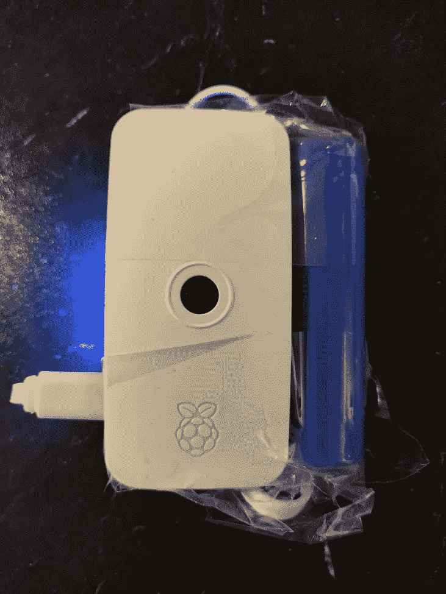

# 使用 RaspberryPi 和 Tensorflow 创建您自己的智能婴儿监视器

> 原文：<https://towardsdatascience.com/create-your-own-smart-baby-monitor-with-a-raspberrypi-and-tensorflow-5b25713410ca?source=collection_archive---------2----------------------->


这个故事的更新版本可以在 [*Platypush 博客*](https://blog.platypush.tech/article/Create-your-smart-baby-monitor-with-Platypush-and-Tensorflow) *上找到。*

你们中的一些人可能已经注意到，距离我的上一篇文章已经有一段时间了。这是因为在此期间，我已经成为一名父亲，我不得不暂时从我的项目中抽出时间来处理一些(还)不能自动化的父母任务。

或者，他们能吗？虽然我们可能还需要几年时间才能拥有完全负责给儿子换尿布的机器人(假设有足够多的疯狂父母同意在自己的孩子身上测试这种设备)，但有一些风险较小的父母职责为自动化提供了一些空间。

作为一名父亲，我首先意识到的一件事是，婴儿真的会哭，即使我在家，我也不一定能听到儿子的哭声。商用婴儿监听器通常会填补这一空白，它们充当对讲机，让您即使在另一个房间也能听到宝宝的声音。但我很快意识到，商用婴儿监视器比我想要的理想设备还要笨。它们检测不到宝宝的哭声——它们只是像对讲机一样将声音从声源传到扬声器。当他们移动到不同的房间时，由父母来移动扬声器，因为他们不能在任何其他现有的音频基础设施上播放声音。它们通常配备低功率扬声器，并且通常不能连接到外部扬声器——这意味着如果我在另一个房间播放音乐，我可能会错过我宝宝的哭声，即使显示器与我在同一个房间。而且大多数都是低功率无线电波，这意味着如果婴儿在他/她的房间里，你必须走一小段路到地下室，它们通常不会工作。

所以我带来了一份智能婴儿监视器的说明书。

*   它应该可以在任何简单便宜的东西上运行，比如带有廉价 USB 麦克风的 RaspberryPi。
*   它应该能够检测到我宝宝的哭声，并在他开始/停止哭泣时通知我(最好是在我的手机上)，或者跟踪我仪表盘上的数据点，或者在我儿子哭泣时执行任何我想执行的任务。它不应该只是充当一个无声的对讲机，将声音从一个声源传递到一种兼容设备。
*   它应该能够在任何设备上流式传输音频——我自己的扬声器，我的智能手机，我的电脑等。
*   无论声源和扬声器之间的距离有多远，它都可以工作，不需要在房子里到处移动扬声器。
*   它还应该配备一个摄像头，这样我就可以实时检查我的宝宝在做什么，或者当他开始哭的时候，我可以拍一张照片或一个简短的视频，以检查一切都好。

让我们看看如何使用我们最喜欢的开源工具来完成这项工作。

# 录制一些音频样本

首先，获得一个 RaspberryPi，并在 SD 卡上闪存任何兼容的 Linux OS 最好使用任何 RaspberryPi 3 或更高版本来运行 Tensorflow 模型。还需要一个兼容的 USB 麦克风——任何东西都可以，真的。

然后安装我们需要的依赖项:

```
[sudo] apt-get install ffmpeg lame libatlas-base-dev alsa-utils
[sudo] pip3 install tensorflow
```

作为第一步，我们必须在婴儿哭和不哭的地方记录足够的音频样本，我们稍后将使用这些样本来训练音频检测模型。*注意:在这个例子中，我将展示如何使用声音检测来识别婴儿的哭声，但同样的程序可以用于检测任何类型的声音——只要它们足够长(例如，警报或邻居的钻孔声)，并且在背景噪音中足够大。*

首先，看看可识别的音频输入设备:

```
arecord -l
```

在我的 RaspberryPi 上，我得到以下输出(注意，我有两个 USB 麦克风):

```
**** List of CAPTURE Hardware Devices ****
card 1: Device [USB PnP Sound Device], device 0: USB Audio [USB Audio]
  Subdevices: 0/1
  Subdevice #0: subdevice #0
card 2: Device_1 [USB PnP Sound Device], device 0: USB Audio [USB Audio]
  Subdevices: 0/1
  Subdevice #0: subdevice #0
```

我想用第二个麦克风来录音——那就是`card 2, device 0`。识别它的 ALSA 方式是`hw:2,0`(直接访问硬件设备)或`plughw:2,0`(如果需要，推断采样率和格式转换插件)。请确保 SD 卡上有足够的空间，或者插入外部 USB 驱动器，然后开始录制一些音频:

```
arecord -D plughw:2,0 -c 1 -f cd | lame - audio.mp3
```

当你的宝宝在同一个房间时，录下几分钟或几个小时的音频——最好是长时间的沉默、婴儿啼哭和其他不相关的声音——完成后按 Ctrl-C 键。尽可能多次重复该过程，以获取一天中不同时刻或不同日期的音频样本。

# 标记音频样本

一旦你有了足够的音频样本，就该把它们复制到你的电脑上来训练模型了——要么使用`scp`来复制文件，要么直接从 SD 卡/USB 驱动器中复制。

让我们把它们都放在同一个目录下，例如`~/datasets/sound-detect/audio`。此外，让我们为每个示例创建一个新文件夹。每个文件夹将包含一个音频文件(名为`audio.mp3`)和一个标签文件(名为`labels.json`)，我们将使用它们来标记音频文件中的负/正音频片段。因此，原始数据集的结构类似于:

```
~/datasets/sound-detect/audio
  -> sample_1
    -> audio.mp3
    -> labels.json -> sample_2
    -> audio.mp3
    -> labels.json ...
```

现在无聊的部分来了:给录制的音频文件贴标签——如果它们包含你自己的宝宝几个小时的哭声，这可能是特别自虐的。在您最喜欢的音频播放器或 Audacity 中打开每个数据集音频文件，并在每个样本目录中创建新的`labels.json`文件。确定哭泣开始和结束的确切时间，并在`labels.json`中以`time_string -> label`的形式作为键值结构报告它们。示例:

```
{
  "00:00": "negative",
  "02:13": "positive",
  "04:57": "negative",
  "15:41": "positive",
  "18:24": "negative"
}
```

在上面的例子中，00:00 和 02:12 之间的所有音频段将被标记为负，02:13 和 04:56 之间的所有音频段将被标记为正，依此类推。

# 生成数据集

一旦您标记了所有音频样本，让我们继续生成将被馈送到 Tensorflow 模型的数据集。我创建了一个通用库和一套声音监听工具，名为 *micmon* 。让我们从安装开始:

```
git clone git@github.com:/BlackLight/micmon.git
cd micmon
[sudo] pip3 install -r requirements.txt
[sudo] python3 setup.py build install
```

该模型旨在处理频率样本，而不是原始音频。原因是，如果我们想要检测特定的声音，该声音将具有特定的“频谱”特征，即基频(或基频通常可能落入的狭窄范围)和以特定比率绑定到基频的特定谐波集。此外，这些频率之间的比率既不受振幅的影响(无论输入音量如何，频率比率都是恒定的)，也不受相位的影响(无论何时开始录制，连续声音都将具有相同的频谱特征)。与我们简单地将原始音频样本馈送到模型的情况相比，这种幅度和时间不变属性使得这种方法更有可能训练稳健的声音检测模型。此外，该模型可以更简单(我们可以在不影响性能的情况下轻松地将频率分组到频段中，因此我们可以有效地执行降维)，更轻便(无论样本持续时间如何，该模型都将有 50 到 100 个频带作为输入值，而一秒钟的原始音频通常包含 44100 个数据点，输入的长度会随着样本持续时间的增加而增加)，并且更不容易过拟合。

`micmon`提供计算音频样本某些片段的 [FFT](https://en.wikipedia.org/wiki/Fast_Fourier_transform) (快速傅立叶变换)的逻辑，使用低通和高通滤波器将产生的频谱分组，并将结果保存到一组 numpy 压缩(`.npz`)文件中。您可以在命令行上通过`micmon-datagen`命令来完成:

```
micmon-datagen \
    --low 250 --high 2500 --bins 100 \
    --sample-duration 2 --channels 1 \
    ~/datasets/sound-detect/audio  ~/datasets/sound-detect/data
```

在上面的例子中，我们从存储在`~/dataset/sound-detect/audio`下的原始音频样本生成数据集，并将结果频谱数据存储到`~/datasets/sound-detect/data`。`--low`和`--high`分别标识在结果频谱中要考虑的最低和最高频率。默认值分别为 20 Hz(人耳可听到的最低频率)和 20 kHz(健康和年轻人耳可听到的最高频率)。但是，您通常可能想要限制此范围，以尽可能多地采集您想要检测的声音，并尽可能多地限制任何其他类型的音频背景和不相关的泛音。我发现在我的情况下，250-2500 赫兹的范围足以检测婴儿的哭声。婴儿的哭声通常很高(考虑到歌剧女高音可以达到的最高音约为 1000 Hz)，通常你可能希望至少将最高频率加倍，以确保获得足够的高次谐波(谐波是实际上赋予声音音色或颜色的较高频率)，但不会太高，以免被其他背景声音的谐波污染频谱。我还截掉了 250 赫兹以下的任何东西——婴儿的哭声在这些低频上可能不会发生太多，包含它们也可能会扭曲检测。一个好的方法是在 Audacity 或任何均衡器/频谱分析仪中打开一些阳性音频样本，检查哪些频率在阳性样本中占主导地位，并将数据集集中在这些频率周围。`--bins`指定频率空间的组数(默认值:100)。较高数量的仓意味着较高的频率分辨率/粒度，但如果太高，可能会使模型易于过拟合。

该脚本将原始音频分割成更小的片段，并计算每个片段的频谱“签名”。`--sample-duration`指定这些片段的长度(默认值:2 秒)。对于持续时间较长的声音，较高的值可能效果更好，但它会减少检测时间，并且可能会在声音较短时失败。较低的值可能更适合较短的声音，但如果声音较长，则采集的片段可能没有足够的信息来可靠地识别声音。

`micmon-datagen`脚本的另一种方法是通过提供的`micmon` API 创建自己的脚本来生成数据集。示例:

无论您使用的是`micmon-datagen`还是`micmon` Python API，在这个过程的最后，您应该会在`~/datasets/sound-detect/data`下找到一堆`.npz`文件，每个文件对应原始数据集中的一个带标签的音频文件。我们可以使用这个数据集来训练我们的神经网络进行声音检测。

# 训练模型

`micmon`使用 Tensorflow+Keras 定义和训练模型。使用提供的 Python API 可以很容易地做到这一点。示例:

运行这个脚本之后(并且对模型的准确性感到满意之后)，您会发现您的新模型保存在`~/models/sound-detect`下。在我的情况下，从我的婴儿房间收集大约 5 个小时的声音，并定义一个良好的频率范围来训练一个准确率为 98%的模型就足够了。如果你在你的电脑上训练了这个模型，只要把它复制到 RaspberryPi 就可以开始下一步了。

# 使用模型进行预测

是时候制作一个脚本了，它使用之前根据麦克风的实时音频数据训练的模型，并在我们的宝宝哭泣时通知我们:

在 RaspberryPi 上运行脚本，让它运行一会儿——如果在过去 2 秒内没有检测到哭声，它将打印`negative`,否则打印`positive`。

然而，如果我们的孩子在哭，那么简单地在标准输出中打印一条消息的脚本没有多大用处——我们希望得到通知！让我们用[板推](https://github.com/BlackLight/platypush)盖住这个部分。在本例中，我们将使用`[pushbullet](https://platypush.readthedocs.io/en/latest/platypush/plugins/pushbullet.html)`集成在检测到哭泣时向我们的手机发送消息。让我们安装 Redis(Platypush 用来接收消息)和 Platypush，并集成 HTTP 和 Pushbullet:

```
[sudo] apt-get install redis-server
[sudo] systemctl start redis-server.service
[sudo] systemctl enable redis-server.service
[sudo] pip3 install 'platypush[http,pushbullet]'
```

在你的智能手机上安装 Pushbullet 应用程序，前往 pushbullet.com 获取 API 令牌。然后创建一个`~/.config/platypush/config.yaml`文件，启用 HTTP 和 Pushbullet 集成:

```
backend.http:
  enabled: Truepushbullet:
  token: YOUR_TOKEN
```

现在，让我们修改前面的脚本，使它触发一个可以被 Platypush 钩子捕获的`[CustomEvent](https://platypush.readthedocs.io/en/latest/platypush/events/custom.html)`,而不是将消息输出到标准输出:

将上面的脚本保存为例如`~/bin/micmon_detect.py`。只有在`window_length`秒的滑动窗口内检测到至少`positive_samples`个样本时，脚本才会触发一个事件(这是为了减少由预测错误或临时故障引起的噪声)，并且只有当当前预测从负变为正或相反时，脚本才会触发一个事件。然后该事件通过`RedisBus`被分派给 Platypush。该脚本还应该具有足够的通用性，可以处理任何声音模型(不一定是哭泣的婴儿)、任何肯定/否定标签、任何频率范围和任何类型的输出事件。

现在让我们创建一个 Platypush 钩子来对事件做出反应，并向我们的设备发送通知。首先，准备 Platypush 脚本目录(如果还没有创建的话):

```
mkdir -p ~/.config/platypush/scripts
cd ~/.config/platypush/scripts# Define the directory as a module
touch __init__.py# Create a script for the baby-cry events
vi babymonitor.py
```

`babymonitor.py`的内容:

现在为 Platypush 创建一个服务文件(如果它还不存在的话),并启动/启用该服务，这样它将在终止或重启时自动重启:

```
mkdir -p ~/.config/systemd/user
wget -O ~/.config/systemd/user/platypush.service \
    [https://raw.githubusercontent.com/BlackLight/platypush/master/examples/systemd/platypush.service](https://raw.githubusercontent.com/BlackLight/platypush/master/examples/systemd/platypush.service)systemctl --user start platypush.service
systemctl --user enable platypush.service
```

并为婴儿监视器创建一个服务文件—例如`~/.config/systemd/user/babymonitor.service`:

```
[Unit]
Description=Monitor to detect my baby's cries
After=network.target sound.target[Service]
ExecStart=/home/pi/bin/micmon_detect.py -i plughw:2,0 -e baby-cry -w 10 -n 2 ~/models/sound-detect
Restart=always
RestartSec=10[Install]
WantedBy=default.target
```

该服务将启动 ALSA 设备`plughw:2,0`上的麦克风监视器，如果在过去 10 秒内检测到至少 2 个 2 秒钟的正样本且先前状态为`negative`，则该服务将触发一个带有`state=positive`的`baby-cry`事件，如果在过去 10 秒内检测到不到 2 个正样本且先前状态为`positive`，则该服务将触发`state=negative`事件。然后，我们可以启动/启用服务:

```
systemctl --user start babymonitor.service
systemctl --user enable babymonitor.service
```

确认一旦婴儿开始哭闹，你的手机就会收到通知。如果你不这样做，你可以检查你应用到你的音频样本的标签，你的神经网络的结构和参数，或者样本长度/窗口/频带参数。

此外，考虑这是自动化的一个相对基本的例子——可以随意添加更多的自动化任务。例如，您可以使用`[tts](https://platypush.readthedocs.io/en/latest/platypush/plugins/tts.html)`插件向另一个 Platypush 设备(例如，在您的卧室或客厅)发送请求，大声说出婴儿在哭。您还可以扩展`micmon_detect.py`脚本，以便捕获的音频样本也可以通过 HTTP 传输——例如使用 Flask wrapper 和用于音频转换的`ffmpeg`。另一个有趣的用例是当婴儿开始/停止哭泣时将数据点发送到您的本地数据库(您可以参考我以前的文章[如何使用 Platypush+PostgreSQL+Mosquitto+Grafana 来创建您灵活和自我管理的仪表板](/how-to-build-your-home-infrastructure-for-data-collection-and-visualization-and-be-the-real-owner-af9b33723b0c)):这是一组有用的数据，用于跟踪您的婴儿何时睡觉、醒来或需要喂食。同样，监视我的孩子是开发`micmon`的主要动机，但完全相同的程序可以用来训练和使用模型来检测任何类型的声音。最后，你可以考虑使用一个好的电源组或一组锂电池，让你的声音监测器可以移动。

# 婴儿照相机

一旦你有了一个好的音频源和一种方法来检测一个积极的音频序列何时开始/停止，你可能想要添加一个视频源来关注你的宝宝。在我的第一次设置中，我在用于音频检测的 RaspberryPi 3 上安装了一个 PiCamera，我发现这个配置很不实用。一个 RaspberryPi 3 放在它的盒子里，附带一组电池和一个不知何故粘在顶部的相机可能会很笨重，如果你正在寻找一个可以轻松安装在支架或柔性臂上的轻型相机，你可以四处移动，随时随地关注你的宝宝。我最终选择了一个更小的 RaspberryPi Zero，配有 PiCamera 兼容的外壳和一个小的电源组。



我的婴儿监视器相机模块的第一个原型

像在另一个设备上一样，插入一个兼容 RaspberryPi 操作系统的 SD 卡。然后将兼容 RaspberryPi 的相机插入其插槽，确保相机模块在`raspi-config`中启用，并安装 Platypush 和 PiCamera 集成:

```
[sudo] pip3 install 'platypush[http,camera,picamera]'
```

然后在`~/.config/platypush/config.yaml`中添加摄像头配置:

```
camera.pi:
    listen_port: 5001
```

您已经可以在 Platypush restart 上检查此配置，并通过 HTTP:

```
wget [http://raspberry-pi:8008/camera/pi/photo.jpg](http://turing:8008/camera/pi/photo.jpg)
```

或者在浏览器中打开视频源:

```
http://raspberry-pi:8008/camera/pi/video.mjpg
```

或者您可以创建一个钩子，当应用程序启动时，它通过 TCP/H264 开始流式传输摄像机输入:

```
mkdir -p ~/.config/platypush/scripts
cd ~/.config/platypush/scripts
touch __init__.py
vi camera.py
```

`camera.py`的内容:

您将能够在 VLC 等地播放提要:

```
vlc tcp/h264://raspberry-pi:5001
```

或者在你的手机上通过 VLC 应用程序或像 [RPi 相机浏览器](https://play.google.com/store/apps/details?id=ca.frozen.rpicameraviewer&hl=en_US&gl=US)这样的应用程序。

# 音频监视器

最后一步是建立一个直接的麦克风流，从你的宝宝的 RaspberryPi 到你想要使用的客户端。当婴儿哭泣时，Tensorflow 模型可以很好地推动你，但我们都知道，机器学习模型并不是因为达到 100%的准确率而臭名昭著。有时你可能只是坐在另一个房间里，想听到宝宝房间里发生的事情。

我为此制作了一个名为 [*micstream*](https://github.com/BlackLight/micstream/) 的工具/库——它实际上可以用于任何想要通过 HTTP/mp3 从麦克风设置音频馈送的情况。注意:如果您使用麦克风向 Tensorflow 模型提供音频，那么您将需要另一个麦克风进行流式传输。

只需克隆存储库并安装软件(唯一的依赖是系统上安装的`ffmpeg`可执行文件):

```
git clone [https://github.com/BlackLight/micstream.git](https://github.com/BlackLight/micstream/)
cd micstream
[sudo] python3 setup.py install
```

您可以通过`micstream --help`获得可用选项的完整列表。例如，如果您想在第三个音频输入设备(使用`arecord -l`获取完整列表)上设置流，在`/baby.mp3`端点上，监听端口 8088，比特率为 96 kbps，那么命令将是:

```
micstream -i plughw:3,0 -e '/baby.mp3' -b 96 -p 8088
```

你现在可以简单地从任何浏览器或音频播放器中打开`[http://your-rpi:8088/baby.mp3](http://your-rpi:8088/baby.mp3)`,你将拥有来自婴儿监视器的实时音频。