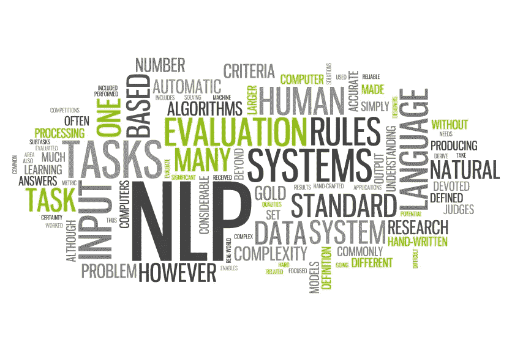
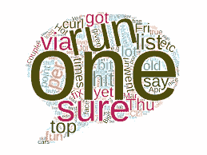

# 创建您自己的单词云

> 原文：<https://towardsdatascience.com/create-your-own-word-cloud-705798556574?source=collection_archive---------38----------------------->

## 学习使用 Python 构建一个非常简单的单词云，只需几行代码！

大家好！难道我们都没有看到如此有趣和新形式的单词云被展示出来，并想知道我们是否也可以生成这样的单词云。如果我告诉你一个不超过 20 行代码的 *Python 程序**是可能的呢？让我们开始吧！*

***

图像来自信号源( [1](https://adaringadventure.com/word-cloud-nlp/) 和 [2](https://algorithmia.com/algorithms/nlp/DocumentClassifier) )* 

## *概观*

*在这个故事中，我将向你展示一个非常简单的代码，告诉你如何从任何文本数据中构建和生成一个非常简单的单词云。*

## *数据*

*为了生成这个词云，我将使用一个数据集，该数据集最初是为了构建一个*垃圾评论分类器*而创建的。*

*文件`'Youtube05-Shakira.csv'`是由评论 ID、作者、日期、内容和类别等 5 列组成的数据集。“内容”和“类别”列用于建立机器学习模型，以将消息分类为垃圾消息。*

*为了生成我们的单词云，我将只在“内容”栏中使用单词。*

## *步骤 1:导入库*

*任何 python 程序的第一步总是在*导入库*。对于这段代码，我们只需要*三个* *库*，其中两个应该已经安装在您的 Python 工作空间中了。在此程序之前，唯一需要额外安装的库是' ***wordcloud*** '库，可以使用' ***pip*** '命令轻松安装。*

```
*# Importing the Librariesfrom wordcloud import WordCloud, STOPWORDS
import pandas as pd
import matplotlib.pyplot as plt*
```

## *步骤 2:读取数据文件*

*下一步，我们将读取数据文件(。csv 文件)并存储在一个 ***熊猫数据帧*** 中。在处理大型数据集时，pandas 数据框总是更容易、更快速地使用。我们的单词云生成所需的列可以很容易地从 pandas 数据框中访问。*

```
*# Read 'Youtube05-Shakira.csv' filedata = pd.read_csv(r"Youtube05-Shakira.csv", encoding ="latin-1")*
```

## *步骤 3:设置注释和停用词*

*在这一步中，我们为单词云生成初始化两个重要的字符串。*

*'***comment _ words***'是用于在单行文本中存储内容列的所有单词的字符串*

*‘***stop _ words***’用于存储所有英语中非常常用的单词，如‘the’，‘a’，‘an’，‘in’。这些单词将在稍后生成单词云时被过滤。*

## *步骤 4:遍历数据文件*

*既然我们已经将数据文件存储到了 pandas dataframe 中，现在我们必须将“内容”列的每一行转换成一个很长的单行文本。*

*第一步是将 ***拆分*** 一行中的每个单词(一个注释有有限的单词数)并将其存储在一个变量中。`separate = i.split()`*

*拆分单词后，为了所有单词的同质性，我们使用`.lower()`函数将所有单词转换成小写的*。**

**最后，我们 ***连接*** 所有单词，并使用函数`.join()`将其存储到变量‘comment _ words’中。现在，变量‘comment _ words’***comment _ words***包含了生成我们的单词云所需的一个长文本中的所有单词。**

```
**# Iterating through the .csv data file 
for i in data.CONTENT: 
    i = str(i) 
    separate = i.split() 
    for j in range(len(separate)): 
        separate[j] = separate[j].lower() 

    comment_words += " ".join(separate)+" "**
```

## **步骤 5:创建单词云**

**在这一步，我们最终使用' ***WordCloud*** '函数生成单词云。在此，我们将使用两个变量'*停止字*和'*注释字*'。该代码不言自明，易于理解。**

```
**# Creating the Word Cloud
final_wordcloud = WordCloud(width = 800, height = 800, 
                background_color ='black', 
                stopwords = stop_words, 
                min_font_size = 10).generate(comment_words)**
```

## **步骤 6:显示单词云**

**最后一步是显示我们刚刚使用上面的代码生成的单词云。'***matplotlib . py plot***'库用于显示 word cloud。看看下面生成的字云！**

```
**# Displaying the WordCloud                    
plt.figure(figsize = (10, 10), facecolor = None) 
plt.imshow(final_wordcloud) 
plt.axis("off") 
plt.tight_layout(pad = 0) 

plt.show()**
```

****

**生成的词云**

**万岁！您现在已经理解了如何使用 Python 和几行代码生成一个非常简单和基本的单词云。你现在可以以此为基础*生成各种形状*和类型的文字云！**

**我正在分享一个到我的 github 库的链接，在那里有 ***中的全部代码。ipynb*** 文件可供您使用！**

**[](https://github.com/mk-gurucharan/Word-Cloud) [## mk-gurucharan/Word-Cloud

### 这是从一个“.”构造单词云的代码。csv”文件。单词云(也称为标签云)是一种简单的可视化…

github.com](https://github.com/mk-gurucharan/Word-Cloud) 

虽然，这并不是机器学习的一部分，这是人工智能的另一个重要领域*(NLP)的最基本的运用之一。所以，继续尝试这个新领域的自然语言处理。到那时，快乐的机器学习！***