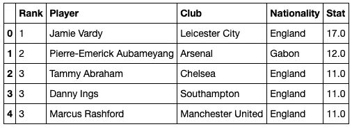
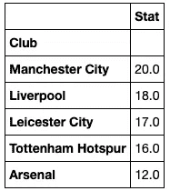
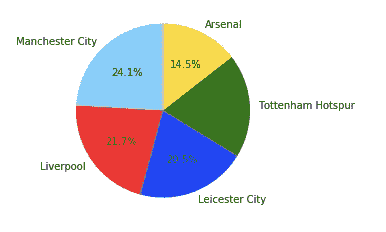
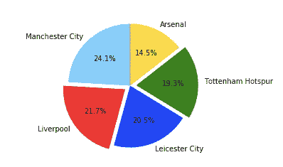
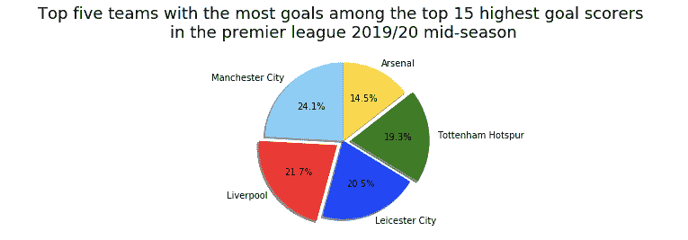
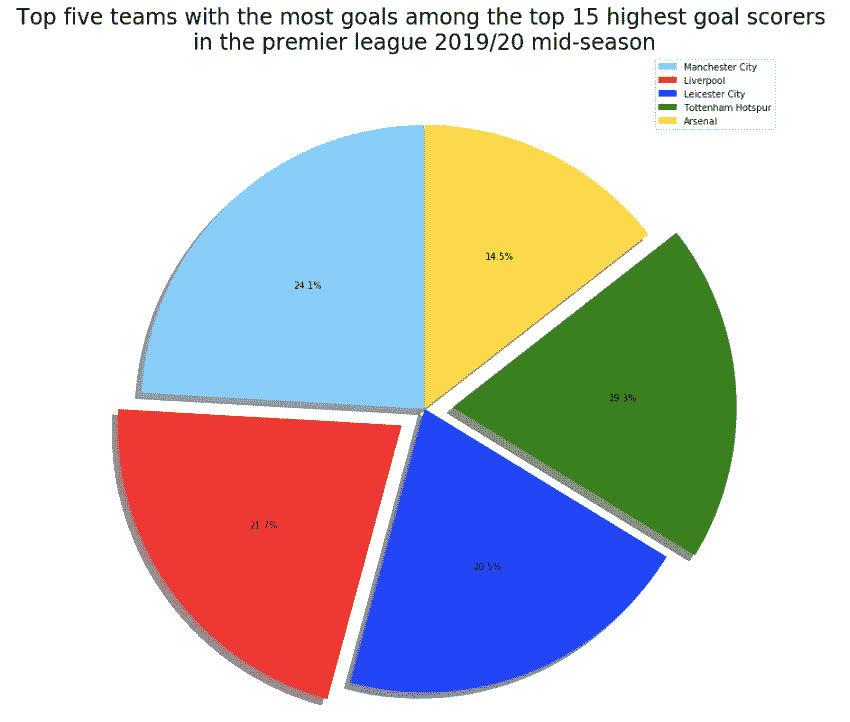

# 使用 Matplotlib 创建基本饼图

> 原文：<https://towardsdatascience.com/creating-a-basic-pie-chart-using-matplotlib-16dd3bf540b6?source=collection_archive---------11----------------------->


图片鸣谢:[https://www . can va . com/design/DADyheAuwPg/cktbidgv 6 CW 60 nvqxcsw 4 w/edit？category=tACFakiSKJ8](https://www.canva.com/design/DADyheAuwPg/CktbIdGv6Cw60nVQXcSw4w/edit?category=tACFakiSKJ8)

## 如何使用饼图来描述您的数据。

饼图用于以突出每个数据点对整体的贡献(即 100%)的格式呈现分类数据。图表的形状是圆形的，就像一个饼图，每个数据点都以一定的百分比表示，同时从饼图中取一部分，形状像一个切片。它在饼图中的份额越大，数据点在饼图中所占的比例就越大。

# 如何在 Jupyter 笔记本中使用饼图

## 获取数据集

该数据集是从英格兰超级联赛网站上获得的，并收集了英格兰超级联赛中得分最高的前 15 名球员。然后，他们被操纵去找出英超球队是如何在这个表格中被代表的。



左图，英超 2019/20 赛季中期前五名球员。右边是前 15 名进球最多的球队中进球最多的前五支球队。

获得数据集后，下一步是导入数据可视化包进行分析。

## 导入数据可视化包

为构建饼图而导入的数据可视化包称为 Matplotlib，它是使用以下代码集导入的:

```
*## Import data visualization packages*
**import** **matplotlib.pyplot** **as** **plt**
%matplotlib inline
```

## 制作饼图

我们的目标是构建一个饼图，代表英超联赛中进球最多的前 15 支球队中进球最多的前 5 支球队。首先，将构建一个非常基本的饼图。饼图是使用以下代码制作的:

```
labels = df_score_2.index
colors = ['lightskyblue', 'red', 'blue', 'green', 'gold']
plt.pie(df_score_2['Stat'], labels= labels, colors=colors, startangle=90, autopct='**%.1f%%**')
plt.show()
```

*标签= df_score_2.index* 用于存储表格的索引，作为饼图的标签。*标签*是五个队的名字。*颜色= ['亮天蓝色'，'红色'，'蓝色'，'绿色'，'金色']* 将用于代表饼状图中五支英超球队的每一片，作为他们的颜色。应使用 *plt.pie(df_score_2['Stat']，labels= labels，colors=colors，startangle=90，autopct = '****% . 1f % %*%***')*创建饼图。 *df_score_2['Stat']* 包含各队的数值，该数值应除以总数并乘以 100。它们切片的大小与它们的比例有关。*标签=标签*是饼图中每个扇区的标签。 *colors = colors* 用于高亮显示每个切片的颜色。startangle=90 代表饼图开始构建的角度。*autopct = '****% . 1f % %****'*用于格式化百分比在饼图上的显示方式。最后， *plt.show()* 用于显示饼图。



一个饼图，显示前 15 名进球最多的球队中进球最多的前 5 支球队。

## 增强饼图

上面的饼状图是一个草稿饼状图，可以通过添加更多代码来改进。假设利物浦将对阵托特纳姆热刺，两支球队都希望在视觉上更加突出。这可以使用下面编写的一组代码来完成:

```
*## for exploding the pie chart* 
labels = df_score_2.index 
colors = ['lightskyblue', 'red', 'blue', 'green', 'gold']
explode =(0,0.1,0,0.1,0) 
plt.pie(df_score_2['Stat'], explode = explode,labels= labels, colors=colors, startangle=90, autopct='**%.1f%%**') 
plt.show()
```

除了添加了新的一行代码 *explode =(0，0.1，0，0.1，0)* 之外，上面的代码没有任何变化。添加这行代码并明确表示括号中的第二个和第四个成员的值是 0.1，将会把利物浦和托特纳姆热刺队从馅饼中剔除。然后，一个新命令 *explode = explode* 被添加到 *plt.pie* 函数中。



一个改进的饼状图显示了前 15 名进球最多的球队中进球最多的前 5 支球队，剔除了利物浦和热刺。

## 增强饼图 II

使用下面的代码，可以通过包含更多细节的标题和添加阴影使饼图看起来更坚实来进一步改进饼图。

```
*## Adding a title to the pie chart and a shadow to the chart* 
labels = df_score_2.index 
colors = ['lightskyblue', 'red', 'blue', 'green', 'gold'] 
explode =(0,0.1,0,0.1,0)
plt.pie(df_score_2['Stat'], explode = explode,labels= labels, colors=colors, startangle=90, autopct='**%.1f%%**', shadow = **True**) plt.title("Top five teams with the most goals among the top 15 highest goal scorers **\n**in the premier league 2019/20 mid-season", fontsize = 18) 
plt.show()
```

函数 plt.pie 中增加了 *shadow = True* 命令，使饼状图看起来更优雅。 *plt.title("英超 2019/20 赛季中期前 15 名进球最多的球队****\ n****" fontsize = 18)*代码也被用来给饼状图添加标题。



一个改进的饼状图，显示了前 15 名进球最多的球队中进球最多的前 5 支球队，其中主要剔除了利物浦和热刺。

## 增强饼图 III

可以对饼图进行更多的改进，使其更具结构性和可展示性。可以添加图例，可以放大饼图，可以增强图片的结构。

```
*## Adding a legend to the chart and increasing its size* 
labels = df_score_2.index 
colors = [‘lightskyblue’, ‘red’, ‘blue’, ‘green’, ‘gold’] 
explode =(0,0.1,0,0.1,0) 
fig, ax1 = plt.subplots(figsize = (24,12)) 
ax1.pie(df_score_2[‘Stat’], explode = explode, colors=colors, startangle=90, autopct=’**%.1f%%**’, shadow = **True**) 
plt.title(“Top five teams with the most goals among the top 15 highest goal scorers **\n**in the premier league 2019/20 mid-season”, fontsize = 24) 
ax1.legend(labels, loc = “upper right”) 
plt.tight_layout() 
plt.show()
```

新增加的内容包括添加 *fig，ax1 = plt.subplots(figsize = (24，12))* 这是在使饼状图的绘图功能分配*给 ax1 时用于放大饼状图的代码。**PLT . pie*变成 *ax1.pie.* 然后用 *ax1.legend(labels，loc = "upper right")* 给饼状图添加图例，用*标签*作为图例，图例位于图的右上角。 *plt.tight_layout()* 用于将饼状图更好的固定到图中。



一个改进的饼状图，显示了前 15 名进球最多的球队中进球最多的前 5 支球队，其中主要剔除了利物浦和热刺。

上面的饼状图是饼状图漂亮的表现形式，也是如何将饼状图放到饼状图中的一个例子。

饼图在对合计总值的数据进行分类时非常有用，可以显示每个类别在饼图中所占的比重。例如，大学校园中的种族代表或街区中的车辆品牌所有权。