# 用 Python 创建漂亮的 Web API

> 原文：<https://towardsdatascience.com/creating-a-beautiful-web-api-in-python-6415a40789af?source=collection_archive---------2----------------------->

## 使用可持续的编码实践，用 Python、Flask 和 MongoDB 创建一个完整的 web API。

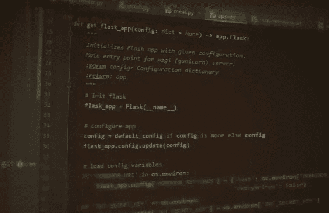

Flask 和 MongoDB

创建一个带有数据库后台的网站或 API 是一个很棒的编程项目，但是它可能很难开始，因为有太多的概念要处理。本指南旨在帮助您从头到尾使用 Python Flask 和 MongoDB 构建您的第一个(或第五个)API。

开始之前:本指南是针对初学者/中级水平的。我希望了解一点 python 知识和面向对象编程的基础知识。至于我自己，我的背景是物理、数学和机器学习——但是网络方面的东西总是让人望而生畏。很容易找到每一部分的单独教程，但本教程更多的是将所有部分放在一起，以制作可持续的代码。希望这份指南能帮你减轻压力。

> 一旦你理解了这些步骤以及每个部分是如何组合在一起的，我*强烈*建议你更详细地了解每个组件。另一个建议是:试着事后自己从头开始重建整个系统。

这里是我们将要研究的所有技术和工具的分类(不要担心这个列表的大小，大多数都不太有威胁性！):

# 什么是 Web API？

*   带示例的 Web APIs 介绍

# MongoDB:

*   MongoDB 简介
*   安装和启动服务器
*   添加一些数据并运行测试查询

# 烧瓶:

*   烧瓶介绍
*   Flask-MongoEngine { *用于以面向对象的方式处理 MongoDB*
*   用于加密密码 }的 Flask-Bcrypt {
*   *Flask-RESTful { *用于构建 REST API*}*
*   *flask-JWT-扩展{ *用于认证和授权**

# *邮递员:*

*   *邮递员介绍*
*   *采样数据并使用 GET、PUT、POST、DELETE 请求*

# *托管您的 API:*

*   *在本地计算机上运行和测试*
*   *使用 gunicorn 在 Heroku 上公开托管 API*
*   *(将来可能会添加在 Google 云平台上托管的可选指南)*

*好了，我们开始吧！*

*抓取 GitHub 模板代码:*

```
*git clone -b template [https://github.com/jrbarhydt/FlaskWebAPI.git](https://github.com/jrbarhydt/FlaskWebAPI.git)*
```

*或者自己动手建造:*

```
*│
│   app.py
│   Procfile
│   requirements.txt
│   runtime.txt
│
├───api
│       authentication.py
│       meal.py
│       routes.py
│       user.py
│       __init__.py
│
├───models
│       meals.py
│       users.py
│       __init__.py
│
├───resources
│       meal_data.csv
│       user_data.csv
│
└───tools
        load_data.py
        __init__.py*
```

# *什么是 Web API？*

*Web API(应用程序编程接口)允许您通过 Web 提供数据，通常是 JSON 或 XML 格式。通常，这是通过公开端点来发出请求来实现的。*

*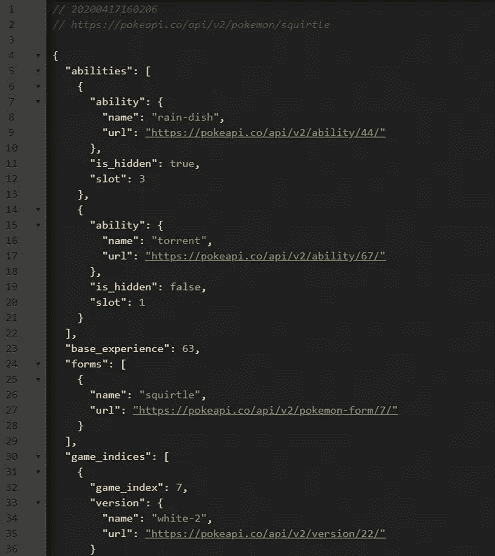*

*一个例子是口袋妖怪 API([*https://pokeapi.co/*](https://pokeapi.co/))，它可以让你访问口袋妖怪数据库。试试下面的链接，获取你想知道的关于杰尼龟的所有数据！*

*[*https://pokeapi.co/api/v2/pokemon/squirtle*](https://pokeapi.co/api/v2/pokemon/squirtle)*

*你可能会注意到有一个巨大的文本墙返回！这就是为什么我喜欢使用 Chrome 的 [**JSON Viewer**](https://chrome.google.com/webstore/detail/json-viewer/gbmdgpbipfallnflgajpaliibnhdgobh?hl=en-US) 扩展，以更可读的格式查看数据，如图所示。*

*让我们分解杰尼龟链接，了解一点关于端点(或者我们在 Flask 中称之为“路由”)的知识*

**

*入口点(左框)和端点(右框)*

*按照惯例，一个 API 将有一个入口点。这就像文件资源管理器中的根文件夹。可以有任意数量的端点(从现在开始我将称之为‘路由’)。)*

*根据给定的路由，数据可以以不同的形式传递。尝试导航到/pokemon 路径，您将获得所有 pokemon 的数据，而不仅仅是杰尼龟的数据。*

*对于我们的 API，我们将创建一个餐馆数据库，用户可以在其中注册、登录、保存他们的详细信息，并保存他们最喜欢的饭菜的列表。一些用户将被允许执行管理任务，如删除用户或访问任何用户的膳食列表。*

# *MongoDB { () }*

***MongoDB 简介:***

*为您的项目选择正确的数据库类型非常重要。传统的 SQL 数据库将信息存储在表中。这与 noSQL 数据库形成对比。*

*MongoDB 是一个 noSQL 数据库，以 JSON 格式存储数据。与表相反，JSON 形成了一个树形数据结构。单个记录被称为“文档”*

*(我会推荐盯着上面的口袋妖怪 JSON 数据，直到你确信那是一棵树而不是一张桌子。)*

****安装并启动服务器:****

*你可以在 https://www.mongodb.com/download-center/community[](https://www.mongodb.com/download-center/community)*获得 MongoDB 的免费版本**

**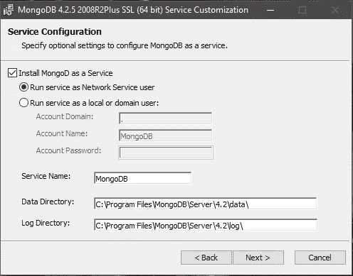**

**默认安装选项**

**目前默认设置是好的。Compass 是可选的，我们不会在本教程中使用它。无论您在哪里安装 MongoDB 和您的数据库，一定要记住位置。**

****启动服务器:***C:\ Program Files \ MongoDB \ Server \ 4.2 \ bin \ mongod . exe***

**让您的服务器在后台运行，您现在可以从 mongo shell 访问您的数据库，或者我们将在后面看到，也可以从 python 访问。这是一个不安全的服务器，稍后我们将添加授权。**

****启动 Mongo Shell:***C:\ Program Files \ MongoDB \ Server \ 4.2 \ bin \ Mongo . exe***

> **我建议你在玩[https://docs.mongodb.com/manual/reference/mongo-shell/](https://docs.mongodb.com/manual/reference/mongo-shell/)的时候看看 MongoDB 文档**

**让我们在数据库中插入一些记录(文件)。(您可以复制这些内容，然后使用右键将它们粘贴到 mongo 命令 shell 中。)**

```
**use test_dbdb.meals.insert({"name": "Mystery Pie", "description": "Not even the baker knows what's inside..."})db.meals.insert({"name": "Apple Pie", "description": "A delicious, home-made apple pie. Best served on a window sill in the summer."})**
```

**“use”将选择一个 db(或创建一个)，您可能会注意到我们插入的记录是 JSON 格式的。此外，如果集合不存在，mongo 会自动创建它。以上，我们的集合叫做‘饭’。**

**通过将以下内容粘贴到 mongo 来验证一切正常。**

```
**show databasesshow collectionsdb.meals.find()db.meals.find({"name": "Apple Pie"})**
```

**使用数据库。<collection>。find()将返回所有数据，我们可以通过将 JSON 作为参数传递给 find()方法来进行过滤。</collection>**

**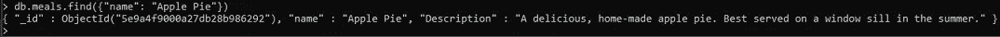**

**您添加的每个项目都有一个唯一的 ObjectId。这在以后引用其他集合(比如用户)中的项目时会很方便。**

> **尝试制作数据库、集合和文档。你现在已经有了运行数据库的**非常** **基础知识**。**

**为了安全起见，请为您的数据库设置管理员凭据。(也许不要让你的密码成为“密码”)**

```
**use admin
db.createUser(
  {
    user: "admin",
    pwd: "password",
    roles: [ { role: "userAdminAnyDatabase", db: "admin" }, "readWriteAnyDatabase" ]
  }
)
db.adminCommand( { shutdown: 1 } )**
```

**最后一个命令将关闭我们的服务器。要在启用身份验证的情况下启动服务器，请改为从终端运行。**

```
**mongod --auth**
```

**运行此服务器时，如果不先进行身份验证，您将无法执行任何操作。您可以通过重新启动 mongo.exe 并尝试访问一些数据来测试这一点。在 mongo shell 中输入以下内容以登录并获得访问权限。**

```
**use admin
db.auth("admin", "password")**
```

**我们现在有了安全的数据库服务器，所以是时候开始构建 API 了。**

# **烧瓶\\_**

**Flask 是一个轻量级的 web 框架。使用 Flask，您可以挑选您的站点需要的组件和扩展。我喜欢这个方面，因为模块化的本质允许你构建一切，没有太多的混乱。**

**我们将使用的主要 Flask 扩展是 Flask MongoEngine 和 Flask RESTful。第一个将让我们为我们的数据构建类作为模板，而后者是为构建 API 而设计的，并使过程更简单。**

**此外，我们将使用 JWT 扩展和 BCrypt，但我将在后面介绍它们。**

**现在，是编码时间了…**

**创建一个干净的虚拟环境，并获得烧瓶。**

> **如果你不熟悉虚拟环境，这不会伤害我的感情，但你绝对应该看看[https://docs.python.org/3/tutorial/venv.html](https://docs.python.org/3/tutorial/venv.html)**

```
**pip install Flask**
```

**现在，在深入研究之前，我想在这里对我的编码方法做一些评论。以下是我收录的一些东西:**

*   **我已经记录了每个部分。如果我不得不在几个月后回到这段代码来添加新特性、修复某些东西，或者甚至是重温一些我不得不解决的问题，这可能会非常有帮助。**
*   **我有一个默认配置，这对测试很有用。在生产环境中，您可以轻松地将非测试信息传递到函数中。(如果不使用配置调用函数，将使用默认值)**
*   **我使用 Python 的类型提示来跟踪参数和返回值类型。**
*   **我在一个函数中创建并返回了应用程序。这对测试和可伸缩性也有好处。例如，您可以使用不同的配置运行 get_flask_app 两次。**
*   **我添加了 __main__ 入口点，所以如果我照原样执行这个脚本，它将在调试模式下启动。稍后我将介绍 gunicorn 的发布。**

**粘贴以下代码。**

*   **app.py**

**您现在可以运行 app.py，并且您将托管一个 Flask 服务器。不过，它还不能做任何事情。**

**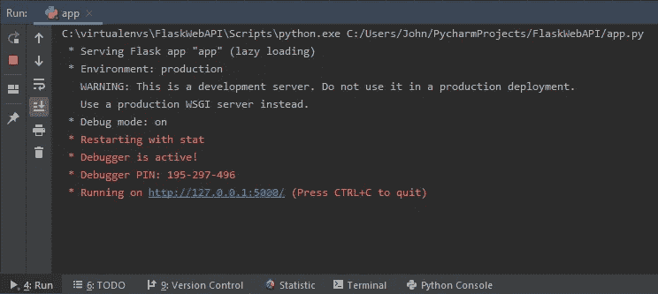**

**在调试模式下运行 Flask 服务器:使用 PyCharm Community Edition**

**烧瓶-MongoEngine:**

**获取 Flask-MongoEngine，以及用于密码加密的 BCrypt。**

```
**pip install flask-mongoengine
pip install flask-bcrypt**
```

> **查看文档了解更多细节和实现示例。[http://docs . mongoengine . org/projects/flask-mongoengine/en/latest/](http://docs.mongoengine.org/projects/flask-mongoengine/en/latest/)**
> 
> **Flask-MongoEngine 还附带了 MongoEngine 和 PyMongo。您可能会发现这些库本身很有趣。也看看他们的文件！http://docs.mongoengine.org/
> [https://pymongo.readthedocs.io/en/stable/](https://pymongo.readthedocs.io/en/stable/)
> 我们不会使用 PyMongo，但是如果你非常习惯使用 mongo shell，你可能会喜欢这个包。它使用的 python 命令与您在 mongo shell 中输入的命令几乎相同！**

**我们将为用户创建一个类模型，为用餐创建另一个类模型。这些将存在于模型文件夹中。将下面的膳食类与我们通过 shell 放入 mongo 的条目进行比较。如您所见，MongoEngine 更加面向对象。**

*   **models/meals.py(无文档)**

```
**from mongoengine import Document, StringField, FloatField

class Meals(Document):
    name = StringField(required=True)
    description = StringField()
    price = FloatField()
    image_url = StringField()**
```

**在做用户之前，我会补充一些文档。我想展示原始代码和文档完整的版本之间的区别。在示例部分中，包含了可以直接运行或使用 doctest 运行的代码。我喜欢添加 doctest 风格的注释，因为它们既是一个测试，也是一个使用示例。**

```
**:: Execute a doctest in the terminal
python -m doctest api/meals.py**
```

> **文档中所有以 **> > >** 开头的代码都将由 doctest 运行。**

*   **models/meals.py(带文档)**

**Users 类稍微复杂一些。有一个用于确定访问级别的字段，一个用于验证电话号码的字段，Users 类覆盖了 Document.save()方法，因此我们可以在保存到数据库之前生成一个密码散列。这样，如果我们的数据库遭到破坏，攻击者将无法获得实际的密码。**

> **这是关于 Flask-BCrypt 的文件。
> 
> 了解更多慢哈希和盐，在这里！【https://crackstation.net/hashing-security.htm】T5
> **

*   **模型/用户. py**

**恭喜，现在 MongoEngine 模型完成了！接下来，我们将为 API 构建接口。**

****烧瓶-RESTful****

```
**pip install flask-restful**
```

**Flask-RESTful 库需要一个非常类似 MongoEngine 的设置，我们将为每个 API 交互创建一个类。这些类被称为资源。在 Flask 中，将资源连接到端点被称为**路由**。这就是我们所说的路线。**

**我们的 API 将有几条路线。一个用于身份验证(注册和登录)，另一个用于用户(获取、上传或删除用户数据)，另一个用于用餐(获取、上传或发布)。**

**我们最终将需要使用 web 令牌来访问所有数据，但是首先我们将添加进行第一次 API 调用所必需的基础知识。**

> **点击这里了解更多关于 JSON Web 令牌的信息
> [https://jwt.io/](https://jwt.io/)**

**现在，要获得我们的第一个 API 调用:**

*   **api/meal.py**

```
**# flask packages
from flask import jsonify
from flask_restful import Resource

# mongo-engine models
from models.meals import Meals

class MealsApi(Resource):
    def get(self):
        output = Meals.objects()
        return jsonify({'result': output})**
```

**当我们向正确的路由发出 get 请求时，这个类的 GET()方法将被调用。这个方法返回 Meals 中的所有对象(我们目前有 2 个),并将它们转换成 JSON 响应。**

**所以，现在我们需要指定正确的路径来访问它。将以下内容添加到路线中。**

*   **api/routes.py**

```
**from api.meal import MealsApi

def create_routes(api):
    api.add_resource(MealsApi, '/meal/')**
```

**在这里，我们添加了刚刚创建的 MealsApi 资源，并将其命名为“/meal/”端点。因此，现在我们有了一个完整的路线，就像使用 PokeAPI 一样，我们可以开始提供数据！在设置 app.py 之后。**

**更新导入部分以获取 app.py 中的必要模块**

```
**# flask packages
from flask import Flask, app
from flask_restful import Api
from flask_mongoengine import MongoEngine# local packages
from api.routes import create_routes**
```

**在 app.py 中的 get_flask_app()的末尾添加以下行，以便设置 RESTful API 和 MongoEngine。**

```
**# init api and routes
api = Api(app=flask_app)
create_routes(api=api)# init mongoengine
db = MongoEngine(app=flask_app)return flask_app**
```

**试试看。运行 app.py，您将看到显示的默认 URL。你可以导航到[http://127 . 0 . 0 . 1:5000/meal/](http://127.0.0.1:5000/meal/)获得 MongoDB 数据库中所有餐食的打印输出。(你还需要让 mongod.exe 来运行这个功能)**

**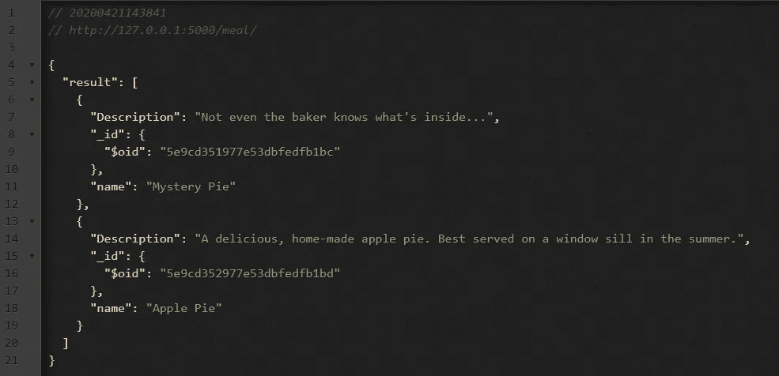**

**太好了。现在，我们将通过执行相同的步骤来继续其余的资源和路线。我还会添加文档。**

**身份验证允许用户在访问数据之前登录。我们有两条路线，一条是唱歌的路线，另一条是登录的路线。SignUpApi 类与对用户模型的 POST 请求相同，只是它不需要预先认证(因为用户还没有注册)。**

**关于这些类的编码有几点注意事项:**

*   **post()方法是静态的，因为该类没有特殊的上下文，比如需要 JSON Web 令牌。**
*   **get、post、put 和 delete 返回类型是 Response，这是 Flask 从 Werkzeug 继承的一个类，但是不需要理解底层机制。它只是处理 HTTP 通信的东西。当您将字典对象传递到 Flask.jsonify 时，flask 会负责这一点。**
*   **如果用户(* *数据)中的星号对您来说很陌生，不要担心，这只是使用字典将参数传递到类或方法的一种简洁方式。**

> **看看[字典拆包](https://python-reference.readthedocs.io/en/latest/docs/operators/dict_unpack.html)了解更多。**

*   **LoginApi 检查给定的密码是否匹配，如果匹配，则创建 web 令牌。这些令牌允许用户继续使用 API，而不需要为每个请求登录。生成了刷新令牌，但在本教程中没有使用。这将允许用户在令牌过期后继续他们的会话。**

> **点击此处了解有关使用令牌保护数据安全的更多信息【https://auth0.com/docs/tokens/concepts/access-tokens T2**

**这是完整的验证码。**

*   **API/认证. py**

**错误消息应该是不言自明的。**

*   **api/errors.py**

**关于两餐 api 资源有两件事要提一下。首先，你会注意到一些方法现在有了参数。这是由 routes.py 处理的，它将阻止来自端点的参数。更多信息请见下面的路线部分。其次，您会注意到在一些方法之前有@jwt_required 装饰符。这一行允许您强制使用 web 令牌来访问数据。**

> **如果你过去没有用过装饰师，我建议你多学一点。它们可以非常方便地为一个方法快速添加功能。【https://realpython.com/primer-on-python-decorators/】T5
> **

**下面是代码。**

*   **api/meal.py**

**routes.py 的一个新增功能超级重要。您会注意到一个参数在端点内部传递。参数通过将名称放在尖括号内来表示。Flask RESTful 将识别这些括号，并将值传递给 get()、post()、put()或 delete()方法。**

*   **api/routes.py**

**user.py 中的代码与上面的 meal.py 中使用的代码非常相似。**

*   **api/user.py**

**最后，不要忘记更新 app.py。除了添加新的导入和初始化 JWT，我们还必须在默认配置中添加一个 jwt 秘钥。显然，您不希望您的产品代码使用这个键，但是就像默认的用户名和密码一样，这些只是为了测试而指定的。在生产设置中，您可以将配置文件保存在其他地方，并将其传递给 get_flask_app()方法。app.py 的最终版本如下。**

*   **app.py**

**不要忘记添加 flask-jwt-extended**

```
**pip install flask-jwt-extended**
```

**就是这样。现在 API 已经完成了。嗯，算是吧。我们没有一个好的方法来测试它的每一个方面(比如创建一个新用户，等等。)虽然这可以使用请求库在 python 中直接完成，但我将使用 Postman。我发现这是测试 API 的一个很好的方法。**

# **邮递员(/)**

**我不会解释 Postman 带给你的所有乐趣，我会带你一步一步地注册、登录和添加数据。这将让你开始，但里面有很多伟大的功能。**

> **下载邮递员在[postman.com/downloads](http://postman.com/downloads)**

**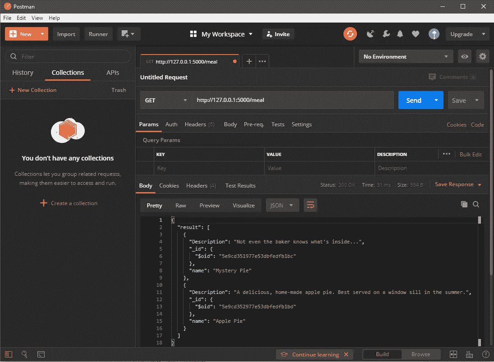**

**您可以在上面看到 get 请求的结果。这与我们之前在 mongod.exe 和 app.py 都运行的情况下，在网络浏览器中输入“http://127.0.0.1:5000/meal”得到的结果相同。**

*   **如果你再试一次，就会失败！你能猜到原因吗？向下滚动寻找答案，但如果你能自己想出答案就加分了。**

**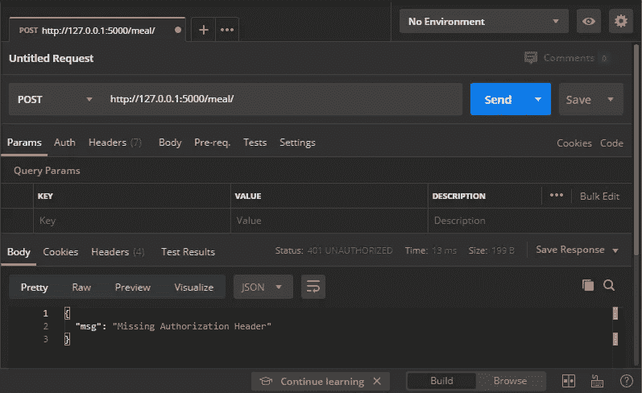**

**给你个提示…**

**我们没有网络令牌！**

**要获得一个，我们需要登录。为了登录，我们需要注册。**

**好，那我们报名吧。设置一个 **POST** 请求，并将 url 设置为[http://127 . 0 . 0 . 1:5000/authentic ation/sign up/](http://127.0.0.1:5000/authentication/signup/)并添加一个**主体**，类型为 **raw JSON** 。在正文中输入以下内容，然后单击 Send。**

```
**{
 "email": "[test@not-a-fake-email.com](mailto:test@not-a-fake-email.com)",
 "password": "hunter2",
 "access": {
  "admin": "True"
 },
 "name": "testy buddy",
 "phone": "555-555-5432"
}**
```

**该响应包括唯一的 user_id。这对需要它的路线也有帮助。**

**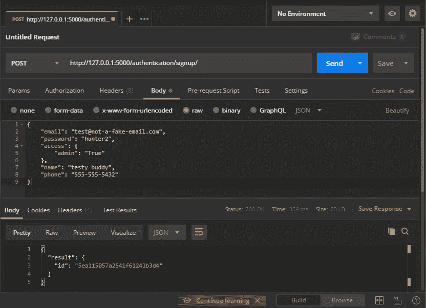**

**现在，我们将登录以获取我们的 web 令牌。有趣的事实是，您唯一的 user_id 也将被编码在 web 令牌中，因此没有必要记住它。您可以在 MealApi 类的 meal.py 中看到 get_jwt_identity()方法。**

> **如果您喜欢冒险，您甚至可以更改我们路线中的“/user/ <user_id>”端点。因为我们可以使用 get_jwt_identity()从 web 令牌中获取这些信息，所以我们可以使用单个端点来获取单个用户。也许可以尝试“user/get_user/”并在 MealApi 中放弃 user_id 参数。</user_id>**

**为了登录，我们将通过[登录路径](http://127.0.0.1:5000/authentication/login/)发布电子邮件和密码。**

```
**{
 "email": "[test@not-a-fake-email.com](mailto:test@not-a-fake-email.com)",
 "password": "hunter2"
}**
```

**您可以看到 API 令牌被成功返回。**

**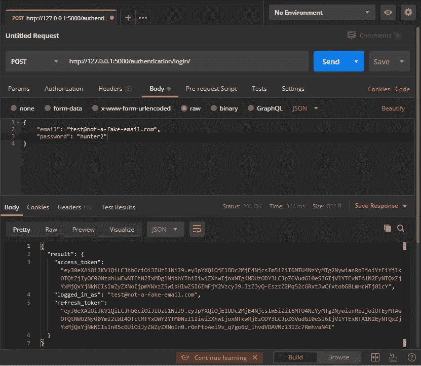**

**我们可以复制访问令牌并将其粘贴到授权头中。**

**再次尝试从 [**餐端点**](http://127.0.0.1:5000/meal/) 访问一个 **GET** 请求，但这次将 **access_token** 放入**授权**标签的 **Token** 字段，选择**无记名令牌**作为**类型**。看看你，跟随着一堆网络术语！**

**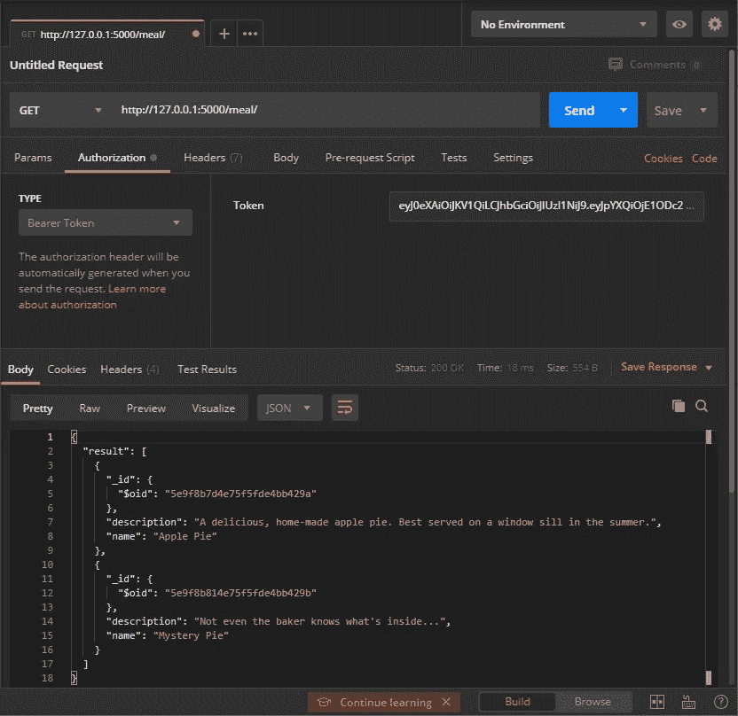**

**通过内部 Web API 访问 MongoDB 数据**

**现在，您可以添加自己的数据来填充数据库。或者您可以使用 resources/meal_data.tsv 和 resources/user_data.tsv，它们包含许多条目。我建议您编写自己的脚本来完成这项工作，但是如果您只想输入一些测试数据，我将包括 tools/load_data.load_all()。**

**下面是数据:**

*   **resources/meal_data.csv**

**[右击该链接并保存](https://gist.githubusercontent.com/jrbarhydt/c9bf0b2a2a1b1905fe0c9b6a669fecc4/raw/4658802dc2f1fea91d625646fc737a6d9b7b5e70/meal_data.csv)**

*   **资源/用户数据. csv**

**[右击该链接并保存](https://gist.githubusercontent.com/jrbarhydt/c9bf0b2a2a1b1905fe0c9b6a669fecc4/raw/51d7a3d814ddf0fbbc6942d2033f3503788e2e39/user_data.csv)**

**以下是我制作的用于将数据加载到 MongoDB 的工具:**

*   **工具/get_random_document.py**

*   **工具/load_data.py**

*   **tools/mongo_loader.py**

# **托管您的 API**

**到目前为止，一切都在本地运行。为了让任何人通过互联网访问您的 API，您必须在某个公共可访问的地方托管一个 web 服务器和数据库服务器。有许多方法可以做到这一点，但是我将介绍使用 Heroku 进行部署。**

# **Heroku [K]**

**一个简单的方法是用 Heroku 实现主机和 API。Heroku 非常简单，因为它允许您拥有一个专门针对 web 服务器的 git 存储库。**

**首先，在[https://www.heroku.com/](https://www.heroku.com/)上建立一个免费账户，登录后，从主菜单中选择“创建新应用”。您将在*<your-app-name>. heroku app . com*创建一个独特的应用名称**

**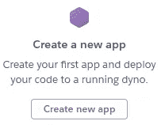**

**首先，为了让 Heroku 知道如何运行您的应用程序，它将在您的主项目目录中查找三个文件。**

*   **Procfile:这是一个 shell 脚本命令，Heroku 将首先运行它。在我们的例子中，它启动 gunicorn 的方式与我们之前在本地启动它的方式相同。**

```
**web: gunicorn 'app:get_flask_app()'**
```

*   **requirements.txt:这包含了我们使用的所有 python 包。你可以通过运行 *pip freeze 来获得这个列表。我会把我的列表粘贴在下面，你的可能会略有不同。***

```
**aniso8601==8.0.0
bcrypt==3.1.7
cffi==1.14.0
click==7.1.1
Flask==1.1.2
Flask-Bcrypt==0.7.1
Flask-JWT-Extended==3.24.1
flask-mongoengine==0.9.5
Flask-RESTful==0.3.8
Flask-WTF==0.14.3
gunicorn==20.0.4
itsdangerous==1.1.0
Jinja2==2.11.2
MarkupSafe==1.1.1
mongoengine==0.19.1
pycparser==2.20
PyJWT==1.7.1
pymongo==3.10.1
pytz==2019.3
six==1.14.0
Werkzeug==1.0.1
WTForms==2.2.1**
```

*   **这告诉 Heroku 我们使用的是哪个版本的 python**

```
**python-3.7.6**
```

**最后，这里是 Heroku 网页上的选项卡列表，您将配置这些选项卡来启动和运行您的 API。**

*   ****资源**:在附加组件中，搜索 *mLab MongoDB* 并将其添加到你的应用中。你可以选择免费版本。你将不得不为此输入你的支付细节，但只要你坚持使用免费版本，你就不会被收费。**
*   ****部署**:连接你的 GitHub 账号，选择包含你所有 API 项目文件的 GitHub 项目。您可以让 Heroku 从主分支自动部署。**

> **如果不想使用 GitHub 账号，也可以选择用 Heroku CLI 部署。如果你选择这种方法，Heroku 网站上有安装应用程序的说明。**

*   ****设置**:在配置变量下，点击显示配置变量，得到重要变量列表。这里需要两个变量:URI 和 JWT 密钥。秘密密钥是私有的，由您决定，因为它允许对 web 令牌进行加密/解密。**

**好了，应该就这些了。您可以在 Activity 选项卡中查看构建是否成功，或者读取构建日志等。**

**现在，使用 Postman 和以前一样尝试，除了这次使用新的公共 API URL 和端点。**

**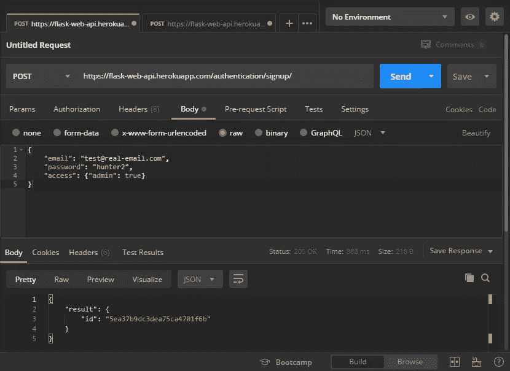**

**向 Postman 注册公共 Web API**

****

**使用 Postman 登录公共 Web API**

**对于另一个挑战，看看你能否将你的数据加载到公共网站上。你可以使用 load_data.py，但是你必须使用 Heroku 给你的 MONGODB_URI 和新的 JWT_SECRET_KEY。下面是一个示例脚本。**

```
**from tools.load_data import load_all

MONGODB_URI = 'YOUR-URI-HERE'
JWT_SECRET_KEY = 'YOUR-KEY-HERE'
new_config = {'MONGODB_SETTINGS': {'host': MONGODB_URI, 'retryWrites': False}, 
              'JWT_SECRET_KEY': JWT_SECRET_KEY}

load_all(new_config)**
```

# **延伸阅读:**

*   **DataCamp 有大量与数据相关的教程。你也可以在 MongoDB 上进行更多的练习。**

**[](https://www.datacamp.com/courses/introduction-to-using-mongodb-for-data-science-with-python) [## Python 中使用 MongoDB 进行数据科学的介绍

### 这一章是关于获得诺贝尔奖数据结构的鸟瞰图。您将关联 MongoDB 文档…

www.datacamp.com](https://www.datacamp.com/courses/introduction-to-using-mongodb-for-data-science-with-python) 

*   RealPython 有很多学习 Python 的好材料。我特别喜欢他们的烧瓶教程。

[](https://realpython.com/tutorials/flask/) [## 烧瓶教程-真正的 Python

### Flask 是一个流行的 Python web 框架，这意味着它是一个第三方 Python 库，用于开发 web…

realpython.com](https://realpython.com/tutorials/flask/) 

# 参考资料:

为了生成合成数据，我使用了这些:

[](https://pypi.org/project/loremipsum/) [## 氯丙嗪

### Lorem Ipsum 文本生成器

pypi.org](https://pypi.org/project/loremipsum/) [](https://www.fakenamegenerator.com/) [## 在假名生成器中获得一个全新的身份

### 4808 Parker DriveBeachwood，OH 44122 邮箱 BryanDAdams @ teleworm.us 网站 partprocure.com 浏览器用户代理…

www.fakenamegenerator.com](https://www.fakenamegenerator.com/) 

以下是我在文章中提到的一些好东西。

[](https://pokeapi.co/) [## 波凯 API

### 一个开放的用于神奇宝贝数据的 RESTful API

pokeapi.co](https://pokeapi.co/) [](https://chrome.google.com/webstore/detail/json-viewer/gbmdgpbipfallnflgajpaliibnhdgobh?hl=en-US) [## JSON 查看器

### 你的眼睛所见过的最漂亮的可定制的 JSON/JSONP 荧光笔。开源于…

chrome.google.com](https://chrome.google.com/webstore/detail/json-viewer/gbmdgpbipfallnflgajpaliibnhdgobh?hl=en-US)  [## 12.虚拟环境和包- Python 3.8.2 文档

### Python 应用程序通常会使用不属于标准库的包和模块。应用程序…

docs.python.org](https://docs.python.org/3/tutorial/venv.html) [](https://docs.mongodb.com/manual/reference/mongo-shell/) [## mongo Shell 快速参考- MongoDB 手册

### 编辑描述

docs.mongodb.com](https://docs.mongodb.com/manual/reference/mongo-shell/)  [## Flask-MongoEngine-Flask-MongoEngine 0 . 9 . 5 文档

### 提供与 MongoEngine 集成的 Flask 扩展。有关 MongoEngine 的更多信息，请查看…

docs.mongoengine.org](http://docs.mongoengine.org/projects/flask-mongoengine/en/latest/)  [## 安全加盐密码散列法——如何正确使用

### 在用户的哈希列表中搜索哈希(apple)...:匹配[alice3，0bob0，charles8]在…中搜索哈希(蓝莓)

crackstation.net](https://crackstation.net/hashing-security.htm)**