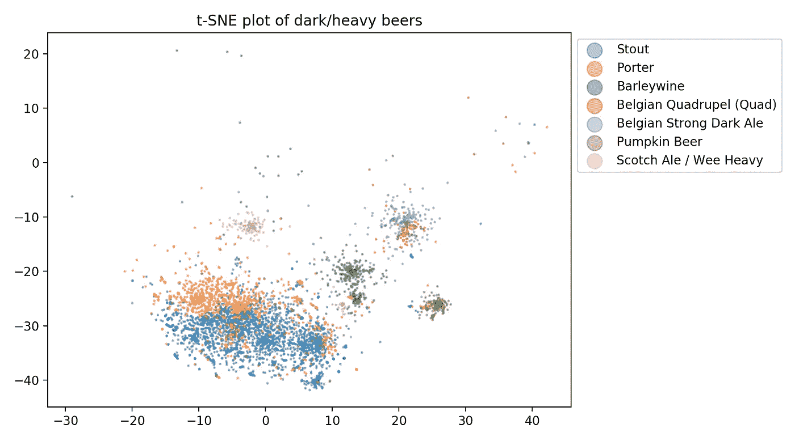

# 用 Doc2Vec 创建啤酒推荐器

> 原文：<https://towardsdatascience.com/creating-a-brewery-recommender-with-doc2vec-15ca20e28e7a?source=collection_archive---------42----------------------->

## 我是如何培训和评估基于内容的啤酒厂旅行者推荐系统的


图片由 [StockSnap](https://pixabay.com/users/StockSnap-894430/?utm_source=link-attribution&amp;utm_medium=referral&amp;utm_campaign=image&amp;utm_content=2631121) 来自 [Pixabay](https://pixabay.com/?utm_source=link-attribution&amp;utm_medium=referral&amp;utm_campaign=image&amp;utm_content=2631121)

在这篇文章中，我将讲述我是如何培训和评估我的酿酒厂推荐人的。部署模型可以在这里找到:【https://tinyurl.com/beer30rec】T4。Beer30 是一款基于内容的啤酒厂旅行者推荐产品！如果你有兴趣，[这里有一个项目回购](https://github.com/aabrahamson3/beer30)的链接。

我尝试用 PySpark 和 Surprise 创建一个协作过滤器，遗憾的是结果并不是很好([这里是我最初的 EDA](https://medium.com/@aabrahamson3/my-brewery-recommender-initial-eda-ec579e0fb3c) 查看数据集的数字评级信息，但它与本部分不太相关)。该计划是让一名新用户对他们尝试过的一些啤酒进行评级，然后该模型会将他们与类似的用户进行匹配，并根据匹配的用户口味进行推荐。某些啤酒被如此多的用户评为如此之高，以至于最终严重偏离了模型，它们实际上总是被推荐。我试着做了一个新用户，并给许多评级最高/炒作桶陈年黑啤酒都打了 1 分(5 分制)。然后，当查询推荐时，该模型仍然会对桶装陈酿黑啤酒进行高度排序！所以真的，它根本不起作用。

我决定把重点放在文本评论上，因为它们充满了丰富的描述性词语。通过只看文本评论，并在啤酒中进行比较，我开始转向训练一个基于内容的推荐者。在研究潜在模型时，我突然意识到 Doc2Vec 可能会工作得很好——我可以将每种独特的啤酒标记为独特的文档。模型创建的超维空间将是啤酒的映射！

**现在让我们开始吧！**


图片来自 [Pixabay](https://pixabay.com/?utm_source=link-attribution&amp;utm_medium=referral&amp;utm_campaign=image&amp;utm_content=498257) 的 [Ryan McGuire](https://pixabay.com/users/RyanMcGuire-123690/?utm_source=link-attribution&amp;utm_medium=referral&amp;utm_campaign=image&amp;utm_content=498257)

## 查看文本评论

我想展示一些文本数据中丰富的描述性词汇的例子。以下是一些摘录:

```
On-tap at Local Option. A - Pours black, tan head, thin ring, no lace or cap. S - Nice level of roast, chocolate, caramel, and coffee. There's a nice chocolate roasty sweetness that keeps me coming back for me. T - Dark chocolate, roast, coffee beans, oak, burnt sugars. The chocolate and roast once again have me in love with this one. The coffee notes are nice as well with a touch of vanilla. M - Medium body, good carbonation, smooth, rich, creamy finish. D - A really nice porter...I had to get another after my initial pour. Would def have again if it's floating around town...would probably even seek out just to have it again.
_______________________________________________________________
pours a hazy, almost cloudy, autumn gold. Apparently unfiltered. Rich, off-white head settles to a tight, solid cap of foam. Aroma is straight up Belgian yeast, with the overripe fruit esters of banana and melon skin, and a hint of spice. Taste has a nice balance of sweet honey malts and tangy, bubblegum-y yeast. Floral, lemony hops come in strong, with a surprising cilantro-like soapy bitterness. Any sweetness begins to yield to dry, crackery malts and tart apple. All that's missing is a nice wedge of brie. Bitterness in the finish lingers a bit long for my taste and is my only real complaint. Nice rustic quality to it that is suggestive of a farmhouse ale or biere de garde. Terrific, weighty mouthfeel for a regular BPA without become heavy or cloying. A brisk carbonation helps in that regard, as does the dry finish. A bit too bitter for the style perhaps, but pair it with some rich cheese, a baguette and some fig preserves and you have a great picnic.
_______________________________________________________________
Pours a creamy opaque light straw yellow with a whispy frothy white head. Nose is of citrus skin and light pine. Taste is a thing of beauty! A nice citrus punch in the mouth. Both peeland zest as well as juice of oranges, grapefruit and lemon. Nice malt backbone although minimal presence, you know its there because the hoppyness of this beer is perfectly balanced. Meadium creamy body. Smooth to drink. Finishes with with a Nice pungent citrus bitterness that leaves you craving the next sip to start the process over again. By far my favorite Treehouse brew of the 4 or 5 I’ve had
```

这篇文章肯定有一些有趣的细微差别。例如，在第二个例子中:“可能对风格来说有点太苦了”——模型将重点放在“苦”上，但在这个例子中，它不是一个有益的特性。我想探索的是情感分析。我最初的想法是平均每种啤酒的情绪，然后将其纳入推荐。

你会注意到的一件事是，人们确实经常提到啤酒风格。我努力把它们包括进来或者指定为停用词(被删除)，决定把它们留在里面，因为有很多不同的方式来列出一种风格。我宁愿包括所有的，然后只删除其中的一部分。

## 准备数据

将 beers 和 reviews csv 文件加载到 Panda 的 DataFrame 中，然后用自定义函数(来自 my functions.py 文件)处理它们。我们还将生成一组停用词！这些包括这个用例的一些自定义单词:关于倒啤酒的单词，他们使用的是哪种杯子(郁金香、斯尼夫特、品脱、玻璃杯)以及与啤酒如何储存有关的单词(罐、瓶、盖、软木塞)。它还删除了评论少于 10 条的啤酒，以及一贯评价啤酒过低或过高的用户。最后，它删除了奇怪的 unicode 字符和没有文本的评论。你最终会得到不到 200 万条评论。

```
reviews = pd.read_csv('reviews.csv')
beers = pd.read_csv('beers.csv')cleaned_reviews_df = functions.preprocess_reviews(reviews, beers)my_stop_words = functions.make_stop_words()
```

在 Doc2Vec 中，每个文档都有一个标签。在这种情况下，每个啤酒评论都是一个文档，我们将用啤酒的 beer_id 标记每个评论。该模型将建立一个空间，其中每种啤酒都有自己的向量，这些向量基于该啤酒的所有评论集合中的单词。现在，我们将做一些自然语言处理预处理，然后在每个评论中提取所有单词。

```
# initiate a Lancaster Stemmer, and stem beer reviews while tagging them for Doc2Vecls = LancasterStemmer()tagged_stem_docs = functions.stem_tag_docs(cleaned_reviews_df,\ my_stop_words)
```

这最后一步需要一些时间，因为它要遍历近 200 万条评论中的每一个词。接下来，我们将实例化一个 Doc2Vec 对象，并让它从文本语料库中的所有唯一单词构建一个词汇表。然后我们将训练模型。这些步骤在我的笔记本电脑上花费了一个多小时，但我也在我的最终模型中训练了 20 个纪元(下面的代码只有 1 个)。

```
# Instantiate a Doc2Vec modelmodel = Doc2Vec(dm=0, dbow_words=1, min_count=4, negative=3,
                hs=0, sample=1e-4, window=5, size=100, workers=8)# Build the vocab from the tagged documents
model.build_vocab(tagged_stem_docs, progress_per = 100)# Train the model from the tagged documents
model.train(tagged_stem_docs, total_examples=model.corpus_count, epochs=1)
```

模型训练的时候去散步什么的吧！之后，您可以使用我的位置过滤器开始探索酿酒厂！下面的代码是一个例子，展示了如何用关键词或者特定的啤酒进行搜索。

该模型还将 vocab 单词映射到与文档相同的空间中，因此您可以匹配哪些啤酒最接近某个单词。如果你搜索一种特定的啤酒，这是一种啤酒与啤酒的比较。

```
# Search based on a keyword
vec = model['bourbon']
similar_beers = model.docvecs.most_similar([vec], topn=5000)# Search based on a specific beer, where the string is the beer_id
similar_beers = model.docvecs.most_similar('55401')# load lookup dictionary pickle file
file = open('lookup_dict.pickle', 'rb')
lookup_dict = pickle.load(file)
file.close# You can try changing the location data, if you'd like. I'm going with my hometown for these examples
functions.location_filter2(similar_beers, lookup_dict, 'WA', 'Seattle', 3)# output of the keyword search, keys are the unique brewery ID. Values are a tuple that contain the Brewery Name, Beer ID, and Beer Name
{20680: ('Fremont Brewing Company', '140119', 'Bourbon Barrel Aged Dark Star'),
 17005: ('Two Beers Brewing Co.', '105241', 'Overhang (Alta Series)'),
 29693: ("Reuben's Brews", '90460', 'Imperial Stout - Bourbon Barrel-Aged')}
```

万岁！我们做到了！

# 可视化模型

评估这样的模型很有挑战性，因为没有定量的方法来这样做。但是可视化模型的一个很好的方法是使用一种叫做 t-SNE(t-分布式随机邻居嵌入)的技术。它是一种降维形式，类似于主成分分析。

让我们导入必要的包。

```
from sklearn.manifold import TSNE
import matplotlib.pyplot as plt
from functions import make_tsne_subset
```

下面的代码将创建一个包含 22，514 个元素的数组(X )(每种啤酒一个元素)。然后，我们用文档向量拟合/转换 t-SNE 对象，并将输出数组转换为数据帧，以便用 Matplotlib 绘图。

```
# doc_tags is just a list of every unique document tag/beer_id
doc_tags = list(model.docvecs.doctags.keys())# get the vector for each doc_tag
X = model[doc_tags]# Fit and transform a t-SNE object with the vector data for dimensionality reductiontsne = TSNE(n_components=2)
X_tsne = tsne.fit_transform(X)
df = pd.DataFrame(X_tsne, index=doc_tags, columns=['x', 'y'])# create a scatterplot of the resulting 2-dimensional data
plt.scatter(df['x'], df['y'], s=0.4, alpha=0.4)
```


高维 beer 向量的二维 t-SNE 图

我们看到这个模型有一些非常大的分离！啤酒风格总是有一点重叠，从图中也可以明显看出这一点。但是有非常明显的分类，我们很快就会看到啤酒风格的巨大差异。

模型本身没有被提供在啤酒数据集中列出的啤酒的风格，它只在用户提供的文本评论上被训练。然而，个人有时会在评论中提及啤酒风格。有 **112 种独特的风格，**所以为了简单起见，我们将一些风格进行分类。例如，有一吨不同风格的 IPA，淡色啤酒，黑啤酒等。下面让任何风格的 IPA 都只是‘IPA’。俄罗斯帝国黑啤、美国黑啤、出口黑啤等都将是:黑啤。下面的代码可以做到这一点。这是一种粗线条的绘画，但它有助于视觉化

```
# Reduces number of unique beer styles from 112 to 64beers['style'] = beers['style'].apply(lambda x: 'IPA' if 'IPA' in x else x)
beers['style'] = beers['style'].apply(lambda x: 'Stout' if 'Stout' in x else x)
beers['style'] = beers['style'].apply(lambda x: 'Lager' if 'Lager' in x else x)
beers['style'] = beers['style'].apply(lambda x: 'Porter' if 'Porter' in x else x)
beers['style'] = beers['style'].apply(lambda x: 'Lager' if 'Lager' in x else x)
beers['style'] = beers['style'].apply(lambda x: 'German' if 'German' in x else x)
beers['style'] = beers['style'].apply(lambda x: 'Pale' if 'Pale' in x else x)
beers['style'] = beers['style'].apply(lambda x: 'Barleywine' if 'Barleywine' in x else x)# This is for matching Doc2Vec Doc Tags to the beer dataframe
beers['id'] = beers['id'].astype(str)
```

现在让我们绘制啤酒风格的子集，看看分离！

```
# iterates through every unique beer style and plots with color
fig = plt.figure()
ax = plt.subplot(111)
for style in beers['style'].unique():
    style_subset = make_tsne_subset(df, beers, style)
    plt.scatter(style_subset['x'],style_subset['y'], s=0.4, alpha=0.4)
```


这本身并不是很好的视觉化，因为有 64 种风格，没有足够的颜色来涵盖每一种！例如，不同组中的红色都是不同的组。

中间和顶部的紫色/蓝色集群是所有的“淡色”和“IPA”啤酒。

但是让我们仔细看看其他一些风格！

```
dark_styles = ['Stout', 'Porter', 'Barleywine', 'Belgian Quadrupel (Quad)', 'Belgian Strong Dark Ale', 'Pumpkin Beer','Scotch Ale / Wee Heavy']fig = plt.figure(figsize=(9,5))
ax = plt.subplot(111)for style in dark_styles:
    style_subset = make_tsne_subset(df, beers, style)
    plt.scatter(style_subset['x'],style_subset['y'], s=1.5, alpha=0.4)ax.legend(dark_styles,\
          bbox_to_anchor =(1,1), markerscale=10)plt.title('t-SNE plot of dark/heavy beers')
plt.tight_layout()
```



看那个！一些有趣的事情:
-比利时四倍啤酒和比利时浓黑啤酒密切相关，并形成他们自己独立的集群
-我们可以看到大麦酒的两个不同的集群-记得我们将英国和美国的大麦酒合并为一个类别！
——南瓜啤酒都是自带的(苏格兰麦芽酒也一样)！这一组中的黑啤酒和搬运工，无疑是南瓜品种，但我的重新标记使他们被放入更广泛的类别
-黑啤酒/搬运工，风格上有很多重叠，但在各种子风格中仍然有一些明显的聚类

现在让我们看看酸味“谱”上的东西:

```
sour_styles = ['Berliner Weisse', 'Belgian Saison', 'Leipzig Gose', 'Belgian Fruit Lambic', 'Belgian Lambic', 'Flanders Oud Bruin', 'Flanders Red Ale','American Wild Ale', 'Belgian Gueuze']fig = plt.figure(figsize=(7,5))
ax = plt.subplot(111)

for style in sour_styles:
    style_subset = make_tsne_subset(df, beers, style)
    plt.scatter(style_subset['x'],style_subset['y'], s=1.5, alpha=0.4)ax.legend(sour_styles,\
          loc=5,bbox_to_anchor =(1.4,0.3), markerscale=10)plt.title('t-SNE plot of sour-ish beers')
plt.tight_layout()
```


有点混乱，但在谈到酸味时也有很多风格重叠。比利时的 Gueuze、Lambic 和 Flanders 啤酒是受保护的风格。许多美国啤酒厂会用传统的方式酿造，但是他们不能给他们的啤酒贴上这样的标签。我想这可以解释右边的重叠部分
——我想两组柏林维斯描述的是更酸(在美国野生麦芽酒里)和不那么酸(在 Gose 集群附近)

总的来说，我对这个模型以及它是如何从杂乱多变的评论数据中学习的非常满意。如果你想看看互动和部署版本，请访问这里:【https://tinyurl.com/beer30rec