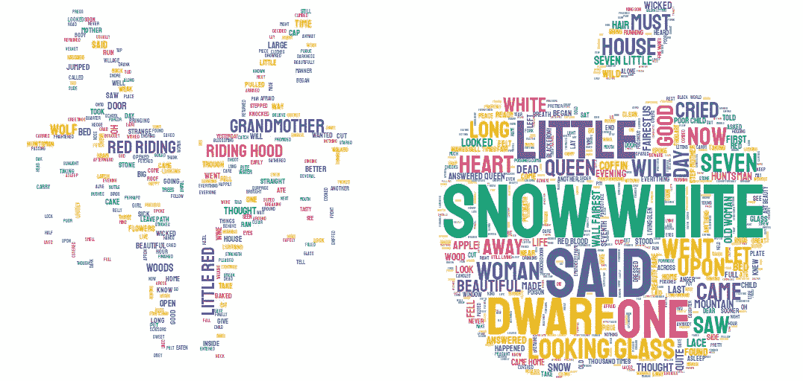
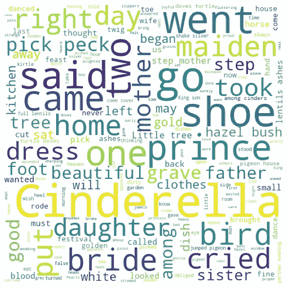
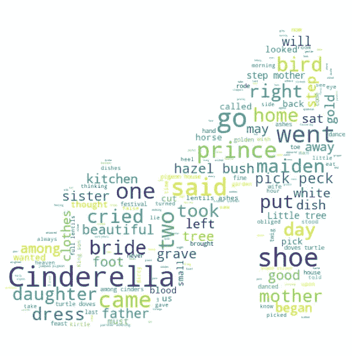
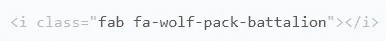
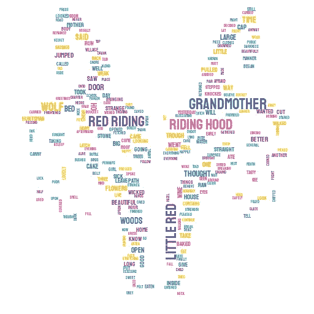

# 创建更吸引人的 Word 云演示文稿

> 原文：<https://towardsdatascience.com/creating-a-catchier-word-cloud-presentation-e17fa2c1ef46?source=collection_archive---------41----------------------->

## 为了更好地吸引听众的注意力并传达你的观点



作者创造的形象

作为一名数据科学家甚至是数据爱好者，有时您会从事文本分析项目。在这个分析过程中，我们一直做的一件事是以词云的形式呈现最频繁出现的词。

如果你不知道什么是单词云，你可以看看上面的图片。就是一个词云的例子。单词出现的频率越高，它们在单词云中的大小就越大。这个词云有助于展示你的洞察力，以吸引任何不知情的观众。

问题是，大多数单词云演示都是乏味的，无聊的——它只是一堆单词，没有能力抓住观众的心。就看下面的云这个词。



作者创造的形象

当你看到上面的单词 cloud 时，你意识到它是来自[格林兄弟灰姑娘故事](https://www.grimmstories.com/en/grimm_fairy-tales/aschenputtel)的单词 cloud。你之所以意识到这一点，是因为频繁出现的单词显示的是灰姑娘的单词。

好吧，为了吸引人的展示，我们可以用其他形式来展示。例如以拖鞋的形式。



作者创造的形象

那么，我们如何将我们的单词云重塑成更好的形式呢？

# **stylecloud**

我们可以通过使用名为 [stylecloud](https://github.com/minimaxir/stylecloud) 的 python 包来创建一个很酷的单词云。

这个软件包让我们用几行代码创建一个快速、时尚的单词云。让我们从安装包开始。对于还没有基础 word cloud 包的人，我们也可以下载。

```
pip install wordcloud
pip install stylecloud
```

当你安装好这些包后，我们就可以创建我们的单词云了。要定义你想要的单词云的形状，你需要从 [fontawesome](https://fontawesome.com/) 网站找到你想要的图标。

在这里，您需要选择图标并找到图标上方的类参数。它应该显示类似这样的内容。



在那之后，你需要准备你想要的文本来显示在你的单词云中。在我的情况下，我会尝试呈现[格林的红色小红帽](https://www.grimmstories.com/en/grimm_fairy-tales/little_red_cap)单词云。

现在，让我们尝试运行该命令。

```
import stylecloud#We would use gen_stylecloud to shape our word cloud. I put my text #into a variable called "red". 
#For parameter, icon_name is the class name from the font awesome that you choose and output_name is the name of the filestylecloud.gen_stylecloud(red, icon_name= "fab fa-wolf-pack-battalion", output_name = 'red.png')
```

如果你用和我一样的图标，它会像这样显示云这个词。



作者创建的图像

输出是本地文件夹中的图像文件。您可以在 jupyter 笔记本或您使用的任何 IDE 的同一文件夹中找到它。

那么，如果你想创建一个词云，但你自己的形状呢？在这种情况下，我们需要稍微解决一下。

# 字云与我们自己的形状

当我们为单词云创建形状时，我们实际上创建了一个遮罩作为放置单词的指导。

要遮罩单词云，我们需要首先从我们想要的图像中创建遮罩。我之前的情况是灰姑娘的鞋跟，就是这个样子。


作者创造的形象

为了确保单词云具有您想要的适当形状，您需要将形状设置为全彩色(除白色之外的任何颜色),并且在您不希望放置单词的任何地方将背景设置为全白色(#FF 或#FFFFFF)。

图像准备好了，现在我们可以试着先创建蒙版。掩码首先需要转换成一个数字数组。我们将使用 PIL 软件包中的数字和图像来实现这一点。

```
import numpy as np
from PIL import Image#My file name is called 'cinderella-heel.png'
mask = np.array(Image.open('cinderella-heel.png'))
```

当我们有了遮罩，我们现在就可以创建成形的单词云了。你可以按照我的命令行来创建单词云。我将使用我之前提到的灰姑娘故事，并将其输入到名为“cinder”的变量中。

```
from wordcloud import WordCloud, STOPWORDS
import matplotlib.pyplot as plt#Here we specify the width, height, background color, stopwords to use and the mask. The wordsword_cloud = WordCloud(width = 500, height = 500, background_color='white', stopwords=STOPWORDS, mask=mask).generate(cinder)plt.figure(figsize=(10,8))
plt.imshow(word_cloud)
plt.axis('off')
plt.tight_layout(pad=0)
plt.show()
```


作者创造的形象

就是这样。现在，您可以创建一个吸引人的可展示的单词云来展示您的演示文稿。

# **结论**

词云通常用于文本分析，以找到令人兴奋的见解。问题是，它太乏味了。

出于这个原因，我们可以将单词 cloud 塑造成更好的形式，以获得更好的美感。

我们可以使用**样式云**来创建一个快速漂亮的单词云，或者使用遮罩技术来创建你自己的形状。

希望有帮助！

# 如果你喜欢我的内容，并想获得更多关于数据或作为数据科学家的日常生活的深入知识，请考虑在这里订阅我的[时事通讯。](https://cornellius.substack.com/welcome)

> 如果您没有订阅为中等会员，请考虑通过[我的推荐](https://cornelliusyudhawijaya.medium.com/membership)订阅。