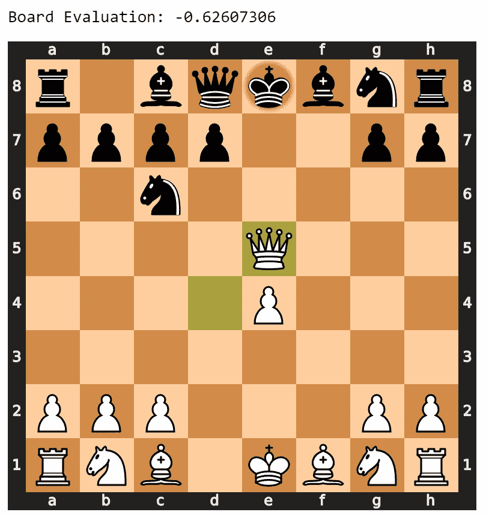
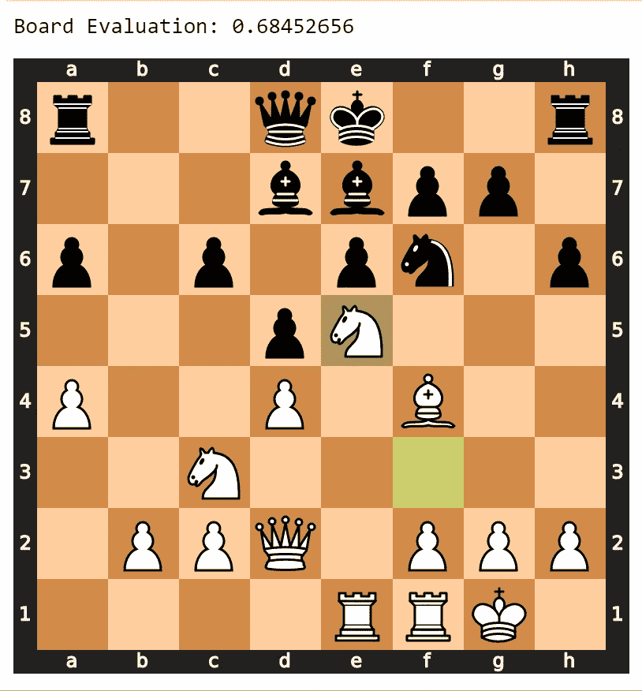

# 使用深度学习来训练深度搜索象棋算法

> 原文：<https://towardsdatascience.com/creating-a-chess-engine-with-deep-learning-b9477ff3ee3d?source=collection_archive---------28----------------------->

## 以及理解神经网络如何被用来间接解决问题


哈桑·帕夏在 [Unsplash](https://unsplash.com/s/photos/chess?utm_source=unsplash&utm_medium=referral&utm_content=creditCopyText) 上的照片

在大多数国际象棋引擎中，搜索算法和启发式函数为国际象棋人工智能提供了对最佳走法的主要洞察力。大部分的编程和这背后的大部分“大脑”是启发式函数。

我说的启发式函数是什么意思？启发式函数是指对棋盘进行一定的度量，对每个度量赋予一定的权重，最后计算出每个棋手优势的一个数值的函数。国际象棋中的启发式函数通常考虑基本的东西，如棋子结构、中心控制和国王安全，但它也可以包括更复杂的计算，如节奏和采用不同战术的机会。

一个经验丰富、编程熟练的棋手能够构造一个好的启发式函数。不幸的是，我不是那种经验丰富的棋手。我已经决定使用神经网络为我创建一个启发式函数。

# 概念:

该程序的概念是使用神经网络来评估电路板，然后安装搜索算法，检查所有未来位置并找到最高值，有点像最小-最大树。

# 程序:

## 步骤 1-访问数据:

```
from pandas import read_csv
import numpy as np
import chess
import osdf = read_csv('C:\\Users\\v_sim\\Desktop\\Files\\Data\\chess.csv')
df = df[df['winner']!='draw']
moves = df['moves'].values[:100]
winner = df['winner'].values
X = []
y = []
```

该脚本从我的电脑中提取 csv 文件，并导入程序运行所需的导入内容。Pandas 用于 csv 数据提取，numpy 用于数组操作，chess 用于现成的棋盘，空列表用于表示网络的 X 和 y 值。

## 步骤 2-数据先决条件:

```
def make_matrix(board): 
    pgn = board.epd()
    foo = []  
    pieces = pgn.split(" ", 1)[0]
    rows = pieces.split("/")
    for row in rows:
        foo2 = []  
        for thing in row:
            if thing.isdigit():
                for i in range(0, int(thing)):
                    foo2.append('.')
            else:
                foo2.append(thing)
        foo.append(foo2)
    return foodef translate(matrix,chess_dict):
    rows = []
    for row in matrix:
        terms = []
        for term in row:
            terms.append(chess_dict[term])
        rows.append(terms)
    return rowschess_dict = {
    'p' : [1,0,0,0,0,0,0,0,0,0,0,0],
    'P' : [0,0,0,0,0,0,1,0,0,0,0,0],
    'n' : [0,1,0,0,0,0,0,0,0,0,0,0],
    'N' : [0,0,0,0,0,0,0,1,0,0,0,0],
    'b' : [0,0,1,0,0,0,0,0,0,0,0,0],
    'B' : [0,0,0,0,0,0,0,0,1,0,0,0],
    'r' : [0,0,0,1,0,0,0,0,0,0,0,0],
    'R' : [0,0,0,0,0,0,0,0,0,1,0,0],
    'q' : [0,0,0,0,1,0,0,0,0,0,0,0],
    'Q' : [0,0,0,0,0,0,0,0,0,0,1,0],
    'k' : [0,0,0,0,0,1,0,0,0,0,0,0],
    'K' : [0,0,0,0,0,0,0,0,0,0,0,1],
    '.' : [0,0,0,0,0,0,0,0,0,0,0,0],
}
```

这个脚本能够将类板转换成一个一键编码的棋盘。这是通过首先访问板的 epd 形式，然后将其分成行，最后使用字典翻译所有的方块来完成的。

## 步骤 3-创建数据集:

```
for game in moves:
    index = list(moves).index(game)
    all_moves = game.split()
    total_moves = len(all_moves)
    if winner[index] == 'black':
        game_winner = -1
    else:
        game_winner = 1
    board = chess.Board()
    for i in range(len(all_moves)):
        board.push_san(all_moves[i])
        value = game_winner * (i/total_moves)
        matrix = make_matrix(board.copy())
        rows = translate(matrix,chess_dict)
        X.append([rows])
        y.append(value)
X = np.array(X).reshape(len(X),8,8,12)
y = np.array(y)
X.shape
```

信不信由你，这是所有奇迹发生的地方。神经网络将直接跳到将死，而不是使用棋子结构和发展来计算玩家的优势。
我加载的数据集包括超过 14000 盘棋，给出了开局和走法的详细信息。我将为网络合成的数据将通过学习值“在玩家 X 将死之前还有多少步”来尝试和计算启发值。它通过数以千计的游戏来学习这种模式，直到它牢牢掌握了玩家的优势。

## 步骤 4-初始化神经网络:

```
from keras import callbacks, optimizers
from keras.layers import (LSTM, BatchNormalization, Dense, Dropout, Flatten,
                          TimeDistributed)
from keras.layers.convolutional import Conv2D, MaxPooling2D
from keras.models import Sequential, load_model, model_from_json
model = Sequential()
model.add(Conv2D(filters=64, kernel_size=1, activation='relu', input_shape=(8,8,12)))
model.add(MaxPooling2D())
model.add(Conv2D(filters=24, kernel_size=1, activation='relu'))
model.add(MaxPooling2D())
model.add(Conv2D(filters=10, kernel_size=1, activation='relu'))
model.add(Flatten())
model.add(BatchNormalization())
model.add(Dense(1,activation = 'tanh'))model.predict(X)
```

这是一个基本的卷积神经网络，除了在前向传播回路的末端使用双曲正切。在这种情况下使用双曲正切，因为每个棋盘的属性值可以在-1 和 1 之间，这完全符合双曲正切的范围。

## 步骤 5-训练网络:

```
from matplotlib import pyplot as plt
model.compile(optimizer='Nadam', loss='mse')
dirx = 'C:\\Users\\v_sim\\Desktop\\Files\\Programs\\ML\\Best Models'
os.chdir(dirx)
h5 = 'chess' + '_best_model' + '.h5'
checkpoint = callbacks.ModelCheckpoint(h5,
                                           monitor='loss',
                                           verbose=0,
                                           save_best_only=True,
                                           save_weights_only=True,
                                           mode='auto',
                                           period=1)
es = callbacks.EarlyStopping(monitor='loss', mode='min', verbose=1, patience=5000/10)
callback = [checkpoint,es]
json = 'chess' + '_best_model' + '.json'
model_json = model.to_json()
with open(json, "w") as json_file:
    json_file.write(model_json)
print('Training Network...')
history = model.fit(X,y,epochs = 1000,verbose = 2,callbacks = callback)
plt.plot(history.history['loss'])
```

这是使用顺序 keras 模型进行机器学习的简单训练设置。

## 步骤 6-观察评估:

```
randint = np.random.randint(1,len(moves))
randint2 = np.random.randint(1,len(moves[randint].split()))
board = chess.Board()
for i in range(randint2):
    board.push_san(moves[randint].split()[i])
matrix = make_matrix(board.copy())
rows = translate(matrix,chess_dict)
print('Board Evaluation:',model.predict([rows])[0][0])
board
```

这一步是可选的，只是为了看看你的网络评估是否合理。当使用上述训练参数训练神经网络时，以下是一些结果:



这个评价是对的。白棋处于很大的劣势，将他的白皇后移动到 c6 上的骑士可以拿的方格内。这就给了黑棋很大的物质优势。

请记住，范围在-1 和 1 之间，-1 代表将死黑色，1 代表将死白色

这个确切值的原因还不清楚，但是神经网络是一个黑盒:它没有明确定义的规则来计算这个值



这一评估表明，机器人理解发展的概念，以及发展如何导致将死。白棋对中锋有绝对的控制，有车沿着 e 档支援。

骑士在中心有一个强大的前哨，盯着 f7 上的兵。在正确的支持下，对 f7 卒的攻击可以导致对皇后和石头的分叉。此外，没有兵可以攻击黑夜，除非 f6 上的骑士离开。

## 步骤 7-深度搜索算法:

```
import chess
flatten = lambda l: [item for sublist in l for item in sublist]
def search_positions(board,depth):
    #legal_moves = str(boards[depth][board].legal_moves)[38:-2].replace(',','').split()
    depth_list = []
    for i in range(depth+1):
        depth_list.append([])
    depth_list[0].append(board)
    for layer in depth_list:
        layer_set = []
        try:
            stet = flatten(layer)
        except:
            stet = layer
        for i in range(len(stet)):
            legal_moves = str(stet[i].legal_moves)[38:-2].replace(',','').split()
            legal_moveset = []
            for move in legal_moves:
                neo_board = stet[i].copy()
                neo_board.push_san(move)
                legal_moveset.append(neo_board)
            layer_set.append(legal_moveset)
        if depth_list.index(layer)+1 == len(depth_list):
            break
        depth_list[depth_list.index(layer)+1] = layer_set
    return depth_list

boards = search_positions(chess.Board(),2)
```

我不会深入研究我的深度搜索算法是如何工作的，它只是使用 python-chess 库中的合法走法和基本的列表函数来创建一个可能走法的树。

因为我只使用深度 2，所以我只需要评估最后一组移动。当考虑每一步棋的最坏情况时，检查哪一步棋有最好的最坏情况，也就是在这种情况下最好的棋。

为了在不使用其他复杂的迭代器工具的情况下评估棋盘，我想到了一个有趣的“try:，except:”结构的应用程序，它将自己索引到下一个列表中，直到找到一个棋盘:

```
def evaluate(lst):
    for i in range(len(lst)):
        try:
            matrix = make_matrix(lst[i])
            rows = translate(matrix,chess_dict)
            lst[i] = model.predict([rows])
        except:
            evaluate(lst[i])
    return lstevaluation = evaluate(boards[-1])
```

酷吧？

```
maximum = 0
for term in evaluation:
    if np.mean(term) > maximum:
        maximum = np.mean(term)
        index = evaluation.index(term)
```

这个最后的脚本向你展示了在给定的情况下最好的行动。

# 结论:

我认为这个程序是一个有趣的案例，其中神经网络不是最终的解决因素，而是机器学习问题最终解决方案的垫脚石。我认为，人们低估了神经网络绕过复杂的中间障碍的能力，这些障碍阻止人们达到目标。

希望更多的人在更复杂的项目中使用神经网络作为中间步骤。

# 我的链接:

如果你想看更多我的内容，点击这个 [**链接**](https://linktr.ee/victorsi) 。