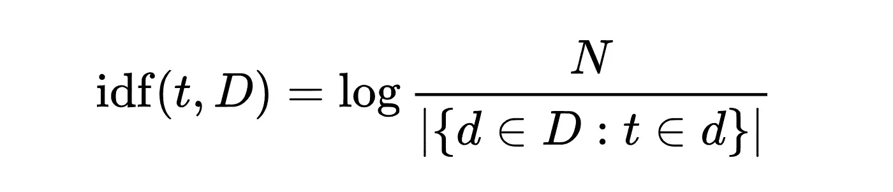
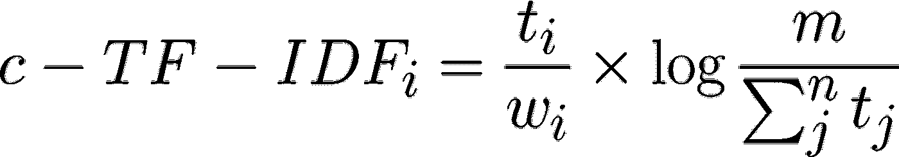
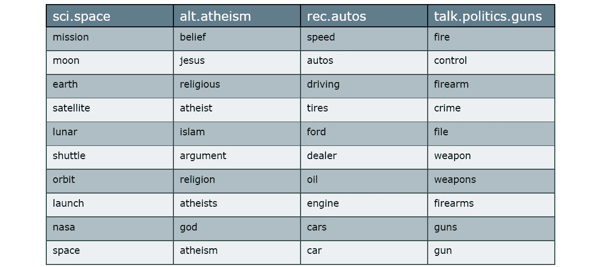
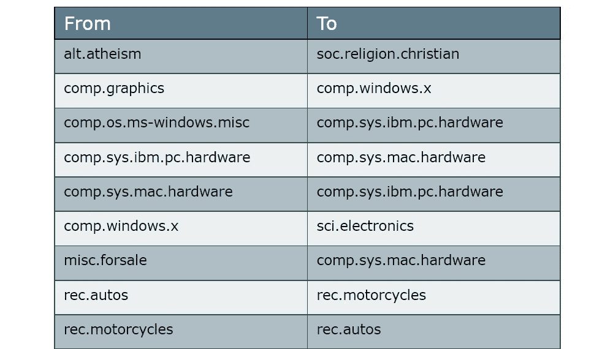
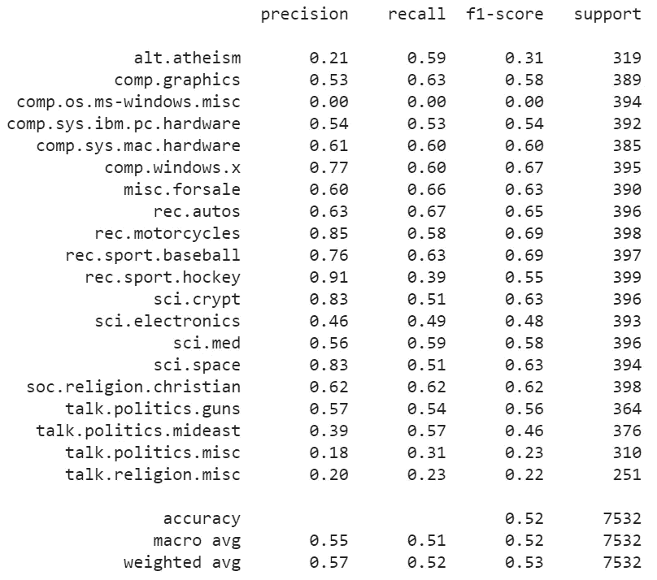

# 使用 Scikit-Learn 创建基于类的 TF-IDF

> 原文：<https://towardsdatascience.com/creating-a-class-based-tf-idf-with-scikit-learn-caea7b15b858?source=collection_archive---------12----------------------->

作者与[https://www.woordwolk.nl/](https://www.woordwolk.nl/)一起创作

## 自然语言处理

## 提取每个类别的信息词

在我之前的一篇帖子中，我谈到了与 **BERT** 的[主题建模，其中涉及到一个基于](https://github.com/MaartenGr/BERTopic)[类的版本 **TF-IDF**](https://github.com/MaartenGr/cTFIDF) 。这个版本的 TF-IDF 允许我从一组文档中提取有趣的主题。

我认为深入一点这个方法可能会很有趣，因为它可以用于更多的应用，而不仅仅是主题建模！

可能的应用概述:

*   **每个班级的信息词汇**:哪些词汇让一个班级与众不同？
*   **类别减少:**使用 c-TF-IDF 减少类别数量
*   **半监督建模:**仅使用余弦相似度和 c-TF-IDF 来预测未见过的文档的类别

本文将主要讨论`**c-TF-IDF**`的应用，但也会给出一些模型的背景。

如果你想跳过所有这些，直接进入**代码**你可以从回购 [**这里**](https://github.com/MaartenGr/cTFIDF) **开始。**

# 基于类的 TF-IDF

在探讨这种基于类的 TF-IDF 的可能性之前，让我们先看看 TF-IDF 是如何工作的，以及我们需要采取哪些步骤来将其转换为 c-TF-IDF。

## TF-IDF

TF-IDF 是一种从文本文档生成特征的方法，它是两种方法相乘的结果:

*   词频( **TF** )
*   逆文档频率( **IDF** )

*词频*仅仅是文档中的原始字数，其中每个字数被认为是一个特征。

*逆文档频率*通过计算一个单词在一个文档中的频率与它在所有其他文档中的频率相比，来提取**某些单词的信息量**。

逆文档频率。此处检索到。

你可以想象诸如`the`、`and`、`I`等词语。是非常常见的单词，但包含的信息非常少，因为它们几乎出现在每个文档中。逆文档频率惩罚过于常见的单词。

结果是一个稀疏的特征矩阵，可用于特征提取、预测建模和文档相似性。

## 将 TF-IDF 转化为 c-TF-IDF

基于类的 TF-IDF 的目标是为单个类中的所有文档提供相同的**类向量**。为了做到这一点，我们必须开始从基于类的角度而不是单个文档的角度来看待 TF-IDF。

如果文档不是个体，而是一个更大的集体的一部分，那么通过将所有文档**加入到一个类中，实际上把它们看作个体可能会很有趣。**

结果将是一个非常长的文档，它本身实际上是不可读的。想象一下阅读一份由 10 000 页组成的文档！

然而，这允许我们开始从基于类的角度来看待 TF-IDF。

然后，不是将 TF-IDF 应用于新创建的长文档，我们必须考虑到，自从我们合并文档以来，TF-IDF 将采用类的数量而不是文档的数量。

对 TF-IDF 的所有这些更改导致以下公式:

图片由作者提供。

其中为每个类别`**i**`提取每个单词`**t**`的**频率**并除以单词总数`**w**`。这个动作可以看作是对课堂上常用词的一种正则化形式。接下来，未连接的文档总数`**m**`除以所有类别`**n**`中单词`**t**`的总频率。

## 密码

当我在 BERT 帖子的[主题建模中介绍 c-TF-IDF 时，我使用了一种低效的方法来计算 c-TF-IDF。](/topic-modeling-with-bert-779f7db187e6)

从那以后，我创建了一个 c-TF-IDF 版本，它不仅允许大幅加速，而且还利用了 T21 Scikit-Learn 中的 TFidfTransformer，它允许我们使用 sci kit-Learn 提供的稳定性。

正如你所看到的，我们从`TfidfTransformer`开始，只采用拟合和变换的方法使其成为`CtfidfVectorizer`。矢量器接收包含原始计数数据的稀疏矩阵。

创建 c-TF-IDF 矩阵的最基本示例如下:

我们确保类中的所有文档在通过 CountVectorizer 之前被合并在一起，以计算最终通过 CTFIDFVectorizer 的原始计数数据。

**注**:通过`CTFIDFVectorizer`的`n_samples`是未接合**单据的总数。这是必要的，因为如果通过的是**合并的**文档数，IDF 值会变得太小。**

# 应用程序

如前所述，c-TF-IDF 大概有三种使用情况:

*   与其他所有的单词相比，哪些单词是某一特定类别的典型单词？
*   如何才能减少使用 c-TF-IDF 的班级数量？
*   如何在预测建模中使用 c-TF-IDF？

## 每类信息词

与 TF-IDF 相比，c-TF-IDF 的独特之处在于我们可以采用它来搜索组成特定类别的单词。

如果我们有一个被标记为 **space** 的类，那么我们会期望找到与空间相关的单词，对吗？

为此，我们只需提取 c-TF-IDF 矩阵，并找出每类中的最高值:

每类中价值最高的单词。图片由作者提供。

不出所料，这些单词很好地代表了它们所属的类别。您可以将此 c-TF-IDF 过程视为该课程内容的总结。

## 班级缩减

有时，拥有多个类可能不利于清晰的分析。您可能需要一个更全面的概述来了解数据中的主要类。

幸运的是，我们可以使用 c-TF-IDF 将类的数量减少到您想要的任何值。

我们可以通过将所有类别的 c-TF-IDF 向量相互比较来做到这一点，以便合并最相似的类别:

在合并之前提取最相似的类。图片由作者提供。

在 c-TF-IDF 向量上使用余弦相似性似乎有效！我们正确地发现，类`atheism`和`christian`可以合并成我们所谓的`religion`。我们发现`autos`和`motorcycles`的结果相似，它们可以组合在一起。

使用这种方法，我们可以选择最相似的类，只要它们足够相似，就可以进行组合。

## 半监督建模

使用 c-TF-IDF，我们甚至可以直接执行半监督建模，而不需要预测模型。

我们首先为训练数据创建一个 c-TF-IDF 矩阵。结果是每个类的一个向量，它应该代表那个类的内容。最后，我们检查以前未见过的数据，该向量与所有类别的向量有多相似:

虽然我们可以看到结果没有什么值得大书特书的，准确率大约为 **50%** …这个准确率比随机猜测的类别 **5%要好得多。**

在没有任何复杂的预测模型的情况下，我们设法用一个快速且相对简单的模型获得了相当不错的准确性。我们甚至没有对数据进行预处理！

# 感谢您的阅读！

如果你像我一样，对人工智能、数据科学或心理学充满热情，请随时在 [LinkedIn](https://www.linkedin.com/in/mgrootendorst/) 上添加我，或者在 [Twitter](https://twitter.com/MaartenGr) 上关注我。

本文中的所有示例和代码都可以在这里找到:

 [## MaartenGr/cTFIDF

### c-TF-IDF 是一个基于类的 TF-IDF 过程，可用于根据文本文档生成特征…

github.com](https://github.com/MaartenGr/cTFIDF)