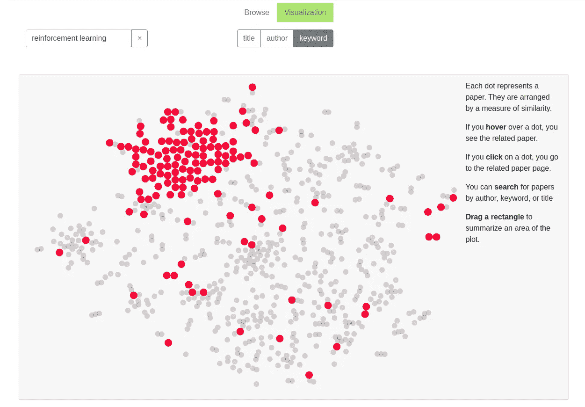

# 为 TensorFlow 代理创建自定义环境—井字游戏示例

> 原文：<https://towardsdatascience.com/creating-a-custom-environment-for-tensorflow-agent-tic-tac-toe-example-b66902f73059?source=collection_archive---------29----------------------->

## 关于自定义 TF-Agent 环境的介绍性博客

# 背景

强化学习是人工智能的一个新兴领域，在游戏、机器人、制造和航空航天等领域显示了很大的前景。在 21 世纪 10 年代中期，强化学习在围棋和国际象棋等游戏中击败人类冠军后，获得了牵引力。谷歌收购了 DeepMind[3]，这是一家备受尊敬的人工智能初创公司，为 2010 年的大多数强化学习突破做出了贡献。类似地，OpenAI 在 2015 年末由埃隆·马斯克、萨姆·奥特曼和其他人[4]创立，他们承诺投入 10 亿美元进行人工智能领域的研究。OpenAI 表示，他们的目标是以造福全人类的方式促进和发展友好的人工智能。 [OpenAI 的项目 OpenAI Five](https://openai.com/projects/five/) ，在 Dota 2 游戏上展示了达到专家级性能、学习人机合作、互联网规模操作的能力[5]。最近，谷歌在芯片布局上使用了强化学习，这是芯片设计过程中最复杂和最耗时的阶段之一，目标是最小化 PPA(功率、性能和面积)，并表明生成的布局是超人的[6]。

强化学习自 20 世纪 50 年代就已经出现，在游戏和机器控制中产生了许多有趣的应用。直到 2013 年，DeepMind 的研究人员展示了它在 Atari 游戏中的使用，在大多数游戏中，它的表现都超过了人类，他们才获得了头条新闻[8]。决定性的改进是使用神经网络来学习 Q 值[9]。与人工智能的其他领域一样，神经网络随着深度强化学习的引入，彻底改变了强化学习领域[9]。从那以后，强化学习无处不在，并以前所未有的规模普及开来。在最近的 ICLR 会议(ICLR 2020)中，我们可以看到强化学习是最常见的标签[10]。



ICLR 强化学习集群

# 那么，什么是强化学习呢？

与标签数据可用的监督机器学习不同，强化学习不提供明确的标签数据。在强化学习中，一个主体在某个环境中执行一些动作，由于这些动作，环境的状态发生变化。基于环境对某些行为给出的反馈(奖励或惩罚)，算法学习最优策略。一个学习自己走路的孩子类似于强化学习范例。平衡自己的孩子是奖励阶段，而失去平衡的孩子是惩罚或失败阶段。更多的理论解释可以在强化学习入门博客上找到，如果读者对强化学习不熟悉，强烈建议他/她这样做。

# TF-代理

TF-Agents 是 TensorFlow 中用于强化学习的库，它通过提供各种经过良好测试、可修改和可扩展的模块化组件，使强化学习算法的设计和实现变得更加容易。这有助于研究人员和开发人员快速建立原型和基准。

可以使用以下代码安装 TF-Agents 稳定版:

```
*pip install --user tf-agents
pip install --user tensorflow==2.1.0*
```

更多关于 TF-Agents 的细节可以在[这里](https://www.tensorflow.org/agents)找到。

## 环境

环境是代理执行动作的环境或设置。代理与环境交互，环境的状态发生变化。在某些应用程序上实现强化学习算法时，需要应用程序的环境。尽管 TensorFlow 为一些流行的问题(如 CartPole)提供了环境，但我们还是遇到了需要构建自定义环境的情况。在这里，我将通过构建一个自定义环境来展示井字游戏的实现。

## 井字游戏的自定义环境

为了更专注于构建定制环境，我们简化了井字游戏。简化的井字游戏只有一个玩家，而不是两个玩家。玩家随机选择位置，如果他/她选择的位置已经被选择，游戏结束。

让我们首先从所需的导入开始。

```
import tensorflow as tf
import numpy as npfrom tf_agents.environments import py_environment
from tf_agents.environments import tf_environment
from tf_agents.environments import tf_py_environment
from tf_agents.environments import utils
from tf_agents.specs import array_spec
from tf_agents.environments import wrappers
from tf_agents.environments import suite_gym
from tf_agents.trajectories import time_step as ts
```

环境可以是 Python 环境或 TensorFlow 环境。Python 环境实现起来很简单，但是 TensorFlow 环境更高效，并且允许自然并行化。我们在这里做的是创建 Python 环境，并使用我们的一个包装器将其自动转换为 TensorFlow 环境。

## 成分

创建自定义环境主要由四种方法组成: *action_spec* 、 *observation_spec* 、 *_reset* 和 *_step* 。让我们看看它们各自的含义:

*action_spec* :描述步骤
*observation_spec* 所期望的动作的规格(*tensor spec*);定义环境
*_reset* 所提供的观测的规格(*tensor spec*)；重置环境
*_ 步骤*后返回当前情况(*时间步长*)；应用动作并返回新的

## SimplifiedTicTacToe 类

现在，让我们开始创建 *SimplifiedTicTacToe* 类。该类继承自 *py_environment。PyEnvironment* 类，以便提取已经可用的方法和属性。

井字游戏棋盘有九个位置。让我们从 0 到 8(包括 0 和 8)对它们进行标记。玩家可以将标记放在其中一个位置。所以，一个动作是一个从 0 到 8 的值。

观察是环境的状态。观察规范具有由环境提供的观察规范。因为棋盘有 9 个位置，所以观察的形状是(1，9)。如果某个位置被占用，我们可以用 1 表示该位置的状态，否则用 0 表示。最初，棋盘是空的，所以我们用九个零来表示环境的状态。

```
**class SimplifiedTicTacToe**(py_environment**.**PyEnvironment): **def** **__init__**(self):
    self**.**_action_spec **=** array_spec**.**BoundedArraySpec(
        shape**=**(), dtype**=**np**.**int32, minimum**=**0, maximum**=**8, name**=**'play')
    self**.**_observation_spec **=** array_spec**.**BoundedArraySpec(
        shape**=**(1,9), dtype**=**np**.**int32, minimum**=**0, maximum**=**1, name**=**'board')
    self**.**_state **=** [0, 0, 0, 0, 0, 0, 0, 0, 0]
    self**.**_episode_ended **=** False **def** **action_spec**(self):
    **return** self**.**_action_spec **def** **observation_spec**(self):
    **return** self**.**_observation_spec
```

游戏结束后，我们应该重置环境(或状态)。为此，我们可以在我们创建的定制环境中编写一个名为 *_reset* 的方法。该方法必须返回游戏开始时环境的默认状态。

```
def _reset(self):
  # state at the start of the game
  self._state = [0, 0, 0, 0, 0, 0, 0, 0, 0]
  self._episode_ended = False
  return ts.restart(np.array([self._state], dtype=np.int32))
```

这里值得一提的是*第*集和*第*步。一集*是一个游戏的实例(或者游戏的生命)。如果游戏结束或生命减少，该集结束。*另一方面，步长*是在*情节*中单调增加的时间或某个离散值。随着游戏状态的每次改变，步骤*的值*增加，直到游戏结束。*

让我们定义两种方法来检查某个点是否是空的，以及是否所有的点都被占用了。

```
**def** **__is_spot_empty**(self, ind):
    **return** self**.**_state[ind] **==** 0**def** **__all_spots_occupied**(self):
    **return** all(i **==** 1 **for** i **in** self**.**_state)
```

现在，我们需要编写最后一个方法: *_step* 。它应用动作并返回游戏中的新情况。这种情况属于 TensorFlow 中的类*时间步长*。 *TimeStep* 有四个信息:*观察，奖励，step_type* 和*折扣*。关于每个信息的细节可以在[这里](https://www.tensorflow.org/agents/tutorials/2_environments_tutorial#python_environments)找到。

在写 *_step* 方法的同时，先看看插曲是否已经结束。如果已经结束，我们需要调用 *_reset* 方法。否则，我们会查看要标记的位置是否为空。如果不为空，则该集结束。如果该位置为空，我们在该位置放置标记，并查看这是否是最后一步。根据是否是最后一步，我们分别返回终止或转换。

```
**def** **_step**(self, action):    
    **if** self**.**_episode_ended:
        **return** self**.**reset() **if** self**.**__is_spot_empty(action):        
        self**.**_state[action] **=** 1

        **if** self**.**__all_spots_occupied():
            self**.**_episode_ended **=** True
            **return** ts**.**termination(np**.**array([self**.**_state], dtype**=**np**.**int32), 1)
        **else**:
            **return** ts**.**transition(np**.**array([self**.**_state], dtype**=**np**.**int32), reward**=**0.05, discount**=**1.0)
    **else**:
        self**.**_episode_ended **=** True
        **return** ts**.**termination(np**.**array([self**.**_state], dtype**=**np**.**int32), **-**1)
```

每走一步给予 0.05 的奖励。当我们所有的 9 个位置都成交时，奖励值为 1。如果游戏结束时少于 9 个位置记号，则获得负奖励-1。在这里，使用 1.0 的折扣，以便没有关于时间/步骤的报酬衰减。

现在，让我们创建张量流环境。

```
python_environment = SimplifiedTicTacToe()
tf_env = tf_py_environment.TFPyEnvironment(python_environment)
```

**万岁**！已经创建了 *TensorFlow 环境*！

## 让我们来玩吧！

现在，我们来玩 10000 集的游戏。

```
time_step = tf_env.reset()
rewards = []
steps = []
number_of_episodes = 10000for _ in range(number_of_episodes):
  reward_t = 0
  steps_t = 0
  tf_env.reset()
  while True:
    action = tf.random.uniform([1], 0, 9, dtype=tf.int32)
    next_time_step = tf_env.step(action)
    if tf_env.current_time_step().is_last():
      break
    episode_steps += 1
    episode_reward += next_time_step.reward.numpy()
  rewards.append(episode_reward)
  steps.append(episode_steps)
```

我想知道平均步数。所以，我执行下面的代码。

```
mean_no_of_steps = np.mean(steps)
```

我得到的平均步数为 ***3.4452*** 。这意味着人们可以期待游戏在第四步结束。我们播放了 10000 集。因此，我们相信均值能够很好地估计分布的期望。因此，让我们找出随机变量的理论期望，并看看它如何与我们通过实验估计的相吻合。

## 步骤数的期望值

设 ***X*** 为随机变量，表示重复发生后的步数。

***X*** 由九个随机变量组成， *X_1，X_2，…，X_9* 。*如果直到第 *i* 步没有重复，X_i* 为 1。我们需要找到 ***X*** 的期望。

对于 *i 的某个值，X _ I = 0；对于 *j > i* 的所有值，X_j = 0* 。

所以，*E[X]= E[X _ 1]+E[X _ 2 | X _ 1]+…+E[X _ 9 | X _ 1，…，X_8]*

现在，我们来计算 *E[X_i | X_1，…，X_(i - 1)]* 的值。

如果直到第 *i* 步没有重复，随机变量 *X_i* 为 *1* 。这种可能性是:

*P(第 I 步之前不重复)=第 I 步之前不重复排列的数目/第 I 步之前排列的总数
= P(9，i) / (9 ^ i)*

概率乘以 *1* 给出概率本身。所以期望变成了这些概率的总和。

因此，期望是:

*E[X] =从 i=1 到 i=9 的和(P(9，I)/(9 ^ I))*≈***3.46***

另一种找到期望值的优雅方法可以在这里找到——感谢 [Henk Brozius](https://www.quora.com/profile/Henk-Brozius) 。

理论预期非常非常接近实验预期。这给了我一些满足感。

这就是如何在 TensorFlow 中创建自定义环境。TF-Agents 提供了模块化的组件，使得原型开发更加容易。你有了一个良好的开端。我们可以用 TF-Agents 做更多的事情。继续探索！天空是无限的！

强烈建议感兴趣的读者点击以下链接，了解有关创建自定义 TensorFlow 环境的更多信息。

1.  环境:[https://www . tensor flow . org/agents/tutorials/2 _ environments _ tutorial](https://www.tensorflow.org/agents/tutorials/2_environments_tutorial)
2.  TF _ agents . specs . bounddarrayspec:[https://www . tensor flow . org/agents/API _ docs/python/TF _ agents/specs/bounddarrayspec](https://www.tensorflow.org/agents/api_docs/python/tf_agents/specs/BoundedArraySpec)

如果您有任何问题或意见或困惑，请在此随意评论。我会尽力回答他们。

# 参考

1.  [https://www . new scientist . com/article/2132086-deep minds-ai-beats-worlds-best-go-player-in-latest-face-off/](https://www.newscientist.com/article/2132086-deepminds-ai-beats-worlds-best-go-player-in-latest-face-off/)
2.  [https://www . the guardian . com/technology/2017/dec/07/alpha zero-Google-deep mind-ai-beats-champion-program-teaching-self-to-play-four-hours](https://www.theguardian.com/technology/2017/dec/07/alphazero-google-deepmind-ai-beats-champion-program-teaching-itself-to-play-four-hours)
3.  [https://techcrunch.com/2014/01/26/google-deepmind/](https://techcrunch.com/2014/01/26/google-deepmind/)
4.  [https://openai.com/blog/introducing-openai/](https://openai.com/blog/introducing-openai/)
5.  [https://openai.com/projects/five/](https://openai.com/projects/five/)
6.  [https://ai . Google blog . com/2020/04/chip-design-with-deep-reinforcement . html](https://ai.googleblog.com/2020/04/chip-design-with-deep-reinforcement.html)
7.  [http://incompleteideas.net/book/first/ebook/node12.html](http://incompleteideas.net/book/first/ebook/node12.html)
8.  [https://arxiv.org/abs/1312.5602](https://arxiv.org/abs/1312.5602)
9.  aurélien géRon——使用 Scikit-Learn、Keras 和 TensorFlow 进行动手机器学习 _ 构建智能系统的概念、工具和技术(2019 年，O'Reilly Media)
10.  [https://iclr.cc/virtual_2020/paper_vis.html](https://iclr.cc/virtual_2020/paper_vis.html)
11.  [https://www.tensorflow.org/agents](https://www.tensorflow.org/agents)
12.  https://www . quora . com/subscribe-we-are-drawing-a-number-random-from-the-list-of-numbers-1-9-After-drawing-the-numbers-is-replaced-How-we-can-find-the-expected-number-drawing-After-the-we-conference-the-first-repetition/answer/Henk-Brozius？_ _ filter _ _ = all&_ _ nsrc _ _ = 1&_ _ sncid _ _ = 5298994587&_ _ snid 3 _ _ = 8434034083