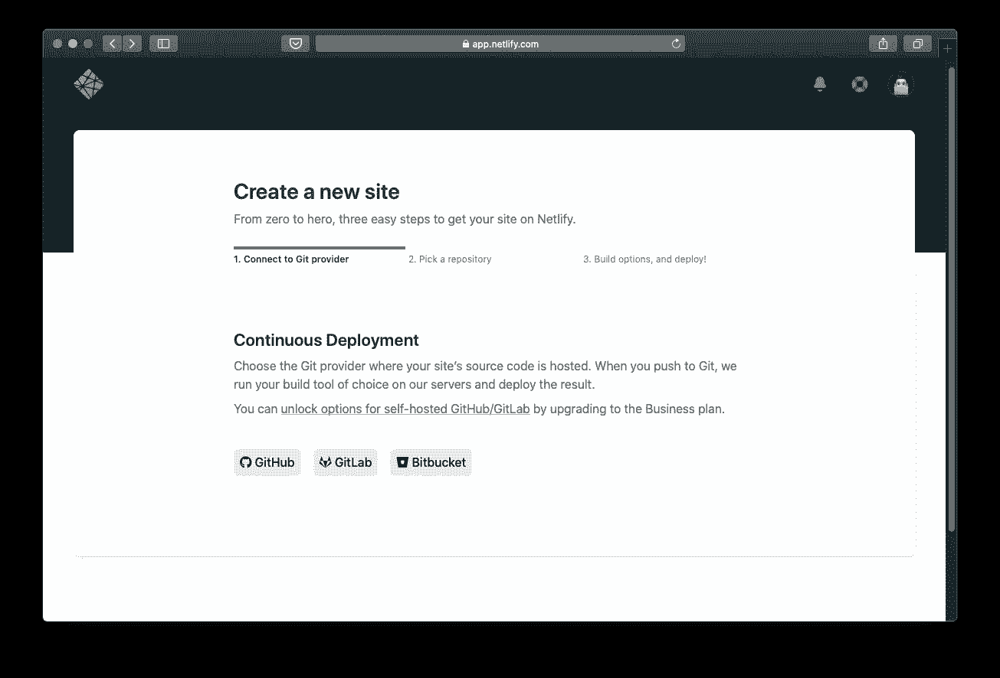

# 创建数据科学家的个人网站(与 Hugo 和 Netlify 一起)

> 原文：<https://towardsdatascience.com/creating-a-data-scientists-personal-website-with-hugo-and-netlify-c0e041da9fc0?source=collection_archive---------28----------------------->

图片来源:[https://unsplash.com/@andrewtneel](https://unsplash.com/@andrewtneel)

## [入门](https://towardsdatascience.com/tagged/getting-started)

## 在个人网站上分享你的项目、博客和出版物会让你成为真正的专业人士

作为一名数据科学家，拥有一个个人页面来展示我的项目和博客似乎是合适的。这让整个事情更加专业。

我一生中的大部分时间都是一名学者，我总是在我的大学网络中拥有一个个人页面来分享一个小博客和项目。去年年底读完博士后，我就一直渴望能搬到另一个地方。为此继续使用大学资源是没有意义的，即使它们对我来说仍然是可用的。

于是我的旅程开始了。我开始了创建新网站的新冒险，并向我的朋友寻求帮助。其中一个用 [WordPress](https://wordpress.com/) ，另一个试图说服我用 [Wix](http://www.wix.com/) 。但出于某种原因，我并不认为它们是数据科学家和计算机工程师的最佳选择。他们只是太“容易”和“受欢迎”，这不是我们做事的方式，对不对？另一个朋友告诉我关于 GitHub 的[页面系统。但这也没有说服我。](https://pages.github.com/)

当时，在一个随机的页面上，在一个随机的博客中阅读了一篇随机的文字，我读到了以下内容:*用* [*雨果*](https://gohugo.io/) *部署到*[*Netlify*](https://www.netlify.com/)*。我立刻产生了兴趣。那个随机的家伙(或者女孩，我甚至不知道)甚至没有尝试，最终启发我如何开发和部署我自己的页面。*

好吧，那是关于什么的？

# 雨果

Hugo 是一个搭建网站的框架。它很强大，有一个很棒的社区，里面有很多问题和答案，还有一堆由用户创建和分享的主题。

创建一个 Hugo 网站真的很容易，你可以按照[这个入门指南](https://gohugo.io/getting-started/quick-start/)立刻部署你自己的网站。我最喜欢 Hugo 的一点是它对开发者友好(你真的会觉得你在开发什么东西，而不仅仅是扮演网页设计师)，易于学习，高度可扩展。真的，你可以让你的网站变得尽可能复杂，或者保持简单。你喜欢怎么做就怎么做。

# 网络生活

[Netlify](https://www.netlify.com/) 是一个从 Git 存储库(比如 GitHub、GitLab 或 BitBucket)构建和部署站点的平台。它提供持续部署服务、全球 CDN、超快速 DNS、原子部署、即时缓存失效、一键式 SSL、基于浏览器的界面、CLI 和许多其他用于管理 Hugo 网站的功能。

有很多方法可以部署你的 Hugo 网站并把它放到网上。你可以在这个页面查看一些教程[的列表。然而，我发现 Netlify 是一个很好的选择，它提供了一些优秀的资源，即使是在免费层。](https://gohugo.io/hosting-and-deployment/)

# 部署站点

这比听起来容易得多，可以在 30 分钟左右完成(如果你打字和做决定的速度很快，15 分钟)。遵循这三个步骤:

1.  让网站运行起来。[跟随雨果教程](https://gohugo.io/getting-started/quick-start/)。
2.  在你最喜欢的平台上为你的站点创建一个 git 存储库(我用的是 GitHub)。然后，您可以使用 Netlify 在线部署您的站点。你应该这样做:

2.1:在存储库的根目录下创建一个 netlify.toml 文件。这个文件配置 Hugo 和 Netlify 如何协同工作。然后，复制粘贴以下代码:

2.2.:在 [Netlify](https://www.netlify.com) 创建账户，并在`**New site from Git**`点击。

从 Git 创建新站点。作者图片

2.3.:选择您的 Git 提供商和保存您的站点的存储库。

为持续部署选择 Git 存储库。作者图片

2.4.:在 Netlify 配置站点的构建选项和部署，如下图所示。(PS:标准是从您的`master`分支部署，但是您可以设置您喜欢的任何分支)

Hugo 的 Netlify 构建选项。作者图片

现在点击`**Deploy site**`，瞧，你的网站就建成了，并且马上就可以上线了。

3.您将在概述页面中注意到，您部署的站点域包含一个 Netlify 扩展名。你可以就这么用，但是你需要自己的域名(一个合适的 ***www。<您的姓名或昵称>。com*** )如果要花哨的话。

你可以通过 Netlify 获得一个自定义域名(你需要付费，ofc)，或者你可以在 [GoDaddy](https://www.godaddy.com/) 、 [Google Domains](https://domains.google.com/r) 或者你选择的任何其他服务上注册你的域名。我选择了谷歌域名。只是因为。配置您的自定义域很容易，我不会在这里讨论它，因为它根据您使用的服务而有所不同。但是 Netlify 提供的这个文档会教你所有你需要的东西。PS:您的自定义域名可能需要几个小时才能开始为您的网站工作，DNS 相关的问题。

# 恭喜你，你有你的网站了:)

现在你完成了。如果您是程序员、数据科学家或任何相关人员，您可能以前就已经使用过持续部署。那我就不用告诉你了，更新你的站点所要做的就是提交(或者合并)到你的存储库的主分支。如果你不是，你可能根本没有遵循这个教程。
我希望你在新页面上分享你的作品时过得愉快！