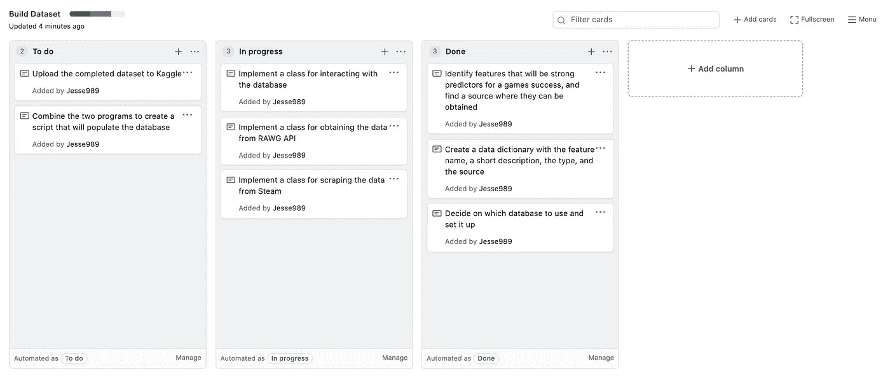
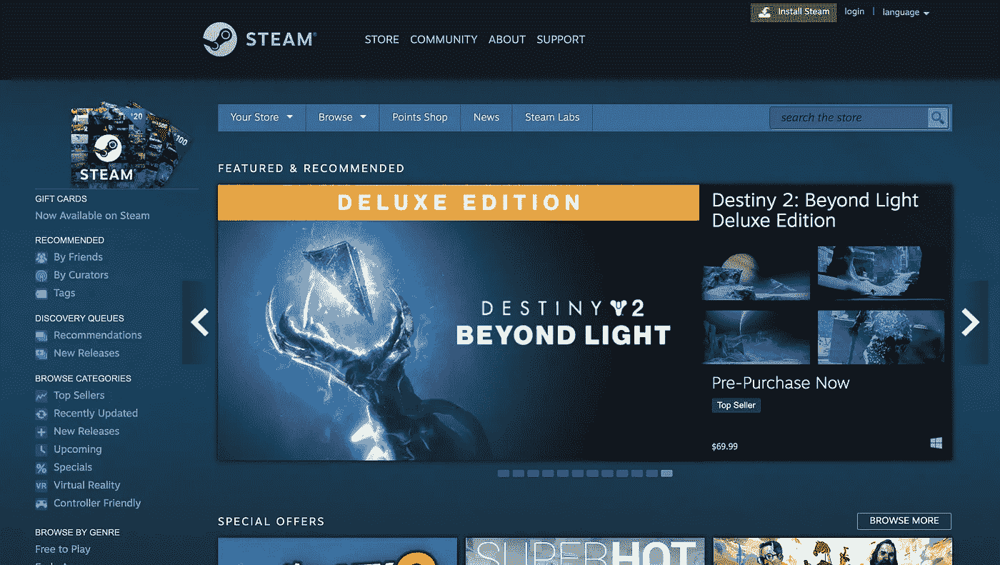
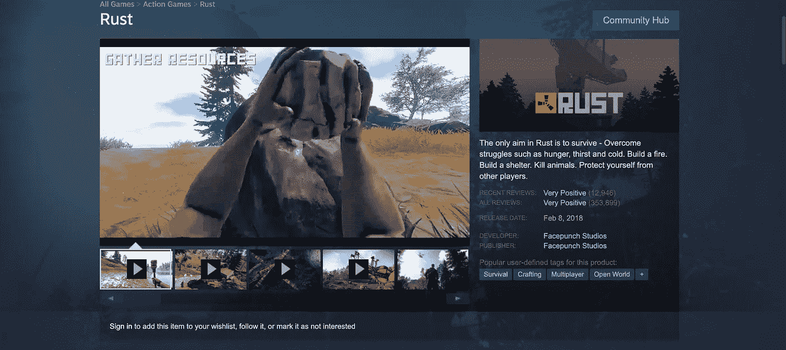
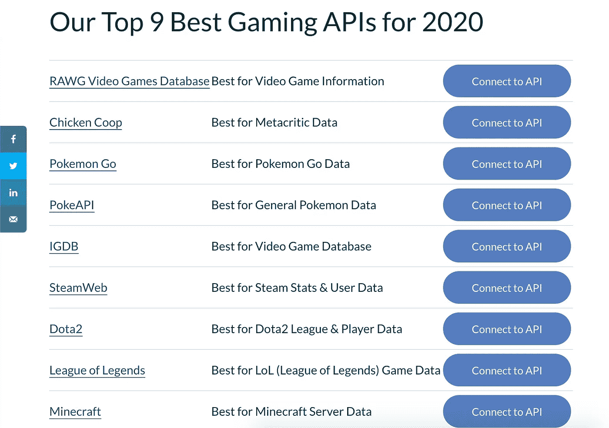
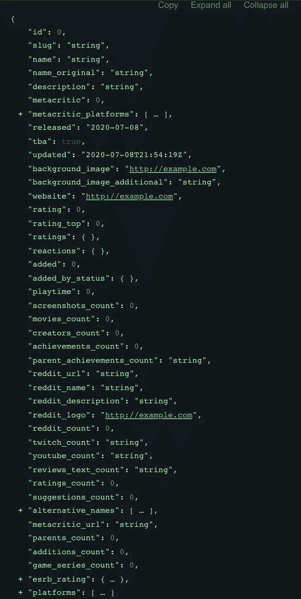
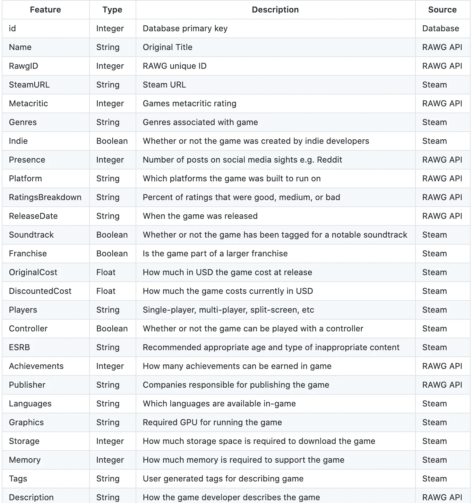
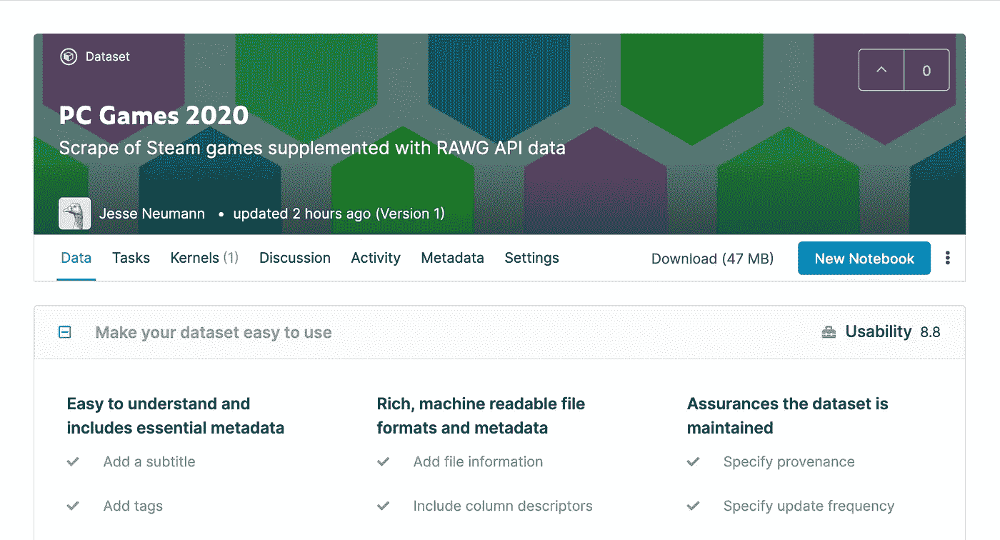

# 从头开始创建数据集

> 原文：<https://towardsdatascience.com/creating-a-dataset-from-scratch-b8e2f8752436?source=collection_archive---------47----------------------->

## 使用 web 抓取、API 调用和 Python OOP


凯文·Ku 在 [Unsplash](https://unsplash.com?utm_source=medium&utm_medium=referral) 上的照片

# 关于

这篇博客介绍了创建用于大型数据科学项目的数据集的整个过程。

数据科学项目包括模拟视频游戏的成功，发现个别功能的重要性，然后创建一个交互式网络应用程序。

web 应用程序将允许游戏开发者输入和修改游戏设计，以便在给定开发者可用资源的情况下最大化预测的成功。

# 规划

任何项目最重要的一个方面，也是最容易被忽视的一个方面是项目规划。

有一个计划将确保你不断地朝着你的目标前进，并且你的最终项目将会更好地组织并且更快地完成(如果你像我一样，你很容易被新的功能想法分散注意力)。

到目前为止，我发现最好的方法是使用 github 项目资源库的规划部分。我使用这个部分来建立一个自动化看板风格的项目板，它将在您为特定问题合并一个拉式请求之后自动完成步骤。

设置评估板很简单:

1.  转到您的项目报告，然后单击“项目”选项卡。
2.  填写表格并点击“创建项目”


填写项目信息，并选择使用哪种风格的板

现在我们已经设置了项目板，接下来删除作为模板一部分出现的默认信息卡。

之后，开始为成功完成项目所需的每个主要步骤添加卡片:

1.  确定对游戏成功有很强预测力的特征，并找到可以获得这些特征的来源
2.  使用特征名称、简短描述、类型和来源创建数据字典
3.  决定使用哪个数据库并设置它
4.  实现一个与数据库交互的类
5.  实现一个从 Steam 中抓取数据的类
6.  实施从 RAWG API 获取数据的程序
7.  将这两个程序结合起来，创建一个将填充数据库的脚本
8.  将完成的数据集上传到 Kaggle

这是我们的项目板，卡片稍微移动了一下，以说明如何跟踪您的工作流程:



现在，当您开始处理项目时，您可以选择当前正在处理的卡片，然后单击“…”并将其转换为一个问题。这将使您能够提交一个“拉”请求，该请求将自动关闭该问题并将其移至“完成”列。

这是几乎完成的项目板的样子:


几乎完成的项目:大多数卡片都是已关闭的问题，已经被移到“完成”栏

现在我们已经有了一个大纲和一个项目板，我们可以确保任何时候我们在卡片上工作都是朝着最终目标前进。不要再被添加酷(不必要的？)功能是我们随时想出来的。

# 履行

现在我们已经有了计划，是时候开始实施我们的每一张卡了。不是所有的卡都需要编码或拉请求，尤其是在我们开发架构的早期阶段。

## 识别特征和来源

首先从 Steam store 开始，这是最大的 PC 游戏在线市场，也是最活跃的在线游戏社区之一。

谷歌蒸汽商店会给我们这个链接:[https://store.steampowered.com/](https://store.steampowered.com/)

点击链接将带我们进入主页:



Steam 商店主页

点击一个随机的游戏会显示出哪些数据是可用的，我们可以决定这些数据是否是一个有价值的预测。

这里有一个随机游戏页面:



点击了我看到的第一个游戏

我们可以立即看到一些对我们的数据集有用的数据点。

当我们开始从 API 源中寻找补充数据时，让我们记住这些数据点。

在谷歌搜索“游戏开发者 API”并点击第一个不是广告的结果后，我们来到了 https://rapidapi.com/blog/top-video-game-apis/的。



【https://rapidapi.com/blog/top-video-game-apis/ 

几个 API 专用于特定的游戏，如*《我的世界》*和*英雄联盟*，对我们的数据集没有用处。

然而，列表上的第一个 API 是 [RAWG 视频游戏数据库 API](https://rapidapi.com/accujazz/api/rawg-video-games-database) ，这听起来很有希望，尽管我不知道“RAWG”代表什么。

我们可以检查不同的响应模式，并确定任何听起来与我们的数据集相关的功能:



我们可以再次看到对我们的数据集有用的几个特征。让我们将这两个资源放在手边，并拿出我们希望数据集包含的完整要素列表。

## 数据字典

创建解释每个变量的高质量数据字典不仅是最佳实践，而且对于我们将完成的项目中的几项任务也非常有用。

使用 markdown 创建表格既快速又简单，并为我们提供了所有功能的清晰概览:



数据字典使项目变得更加容易

我们现在有了一个好看的数据字典，它将成为数据集的真实来源。

对数据集的任何更改都应该首先记录在数据字典中，然后由各个类实现。

## 设置数据库

最糟糕的感觉之一是当你的抓取程序在 8 个小时后抛出一个错误，并且所有收集到的数据都被删除了。

为了避免这种不好的感觉，我们将在运行抓取程序时使用一个简单的数据库来保存数据。

我们需要数据库做的就是保存我们的数据，让我们知道一个游戏是否已经被保存，这样我们就可以避免冗余。

有几个数据库选项可以用于这个简单的项目，但是我们将使用 [sqlite3](https://www.sqlite.org/index.html) 。这将在我们的本地系统上为我们提供一个超级简单的数据库，我们可以使用 SQL 与之交互。

为了更好地组织我们的代码，并把 SQL 都放在一个地方，我们将创建一个类来管理我们的数据库并与之交互。然而，我们需要添加的一个重要方法是将数据库保存为“csv”文件的能力。

# 密码

为了避免花 200 个小时阅读这篇文章，我不会在课堂上深入讨论细节。

我计划就如何创建每个单独的类创建一些简短的博客，但是现在你可以在这里查看完整的代码库:

https://github.com/Jesse989/game-oracle

另外，如果您有任何意见、问题或建议，请联系我。我真的很感谢有机会讨论这些事情。

## 数据库客户端:

这基本上是一个用于管理数据库和处理 SQL 的实用程序类，因此我们不必多次重写查询。

另外，我给了它一个’。to_csv()'方法，该方法将创建一个包含我们的“游戏”表的全部内容的 csv 文件。

现在我们有了持久化数据的方法，让我们集中精力寻找我们想要保存的数据。因为我们要处理两个数据源，所以创建两个独立的类是有意义的，每个数据源一个类。

## Steam 游戏信息

首先是想出一种从 Steam store 获取数据的方法。为此，我们将编写一个使用一些基本 python 抓取库的类； [*请求*](https://2.python-requests.org/en/v2.8.1/) ， [*BeautifulSoup*](https://www.crummy.com/software/BeautifulSoup/bs4/doc/) ，python 库 [*re*](https://docs.python.org/3/library/re.html) (正则表达式)。

这个对象将负责请求单个游戏 url，然后使用 BeautifulSoup 搜索和 regex 的组合解析所需的信息。

如你所见，该类主要由两个公共方法组成:“get_game_html”和“strip_features”。

第一个方法从指定的 url 获取页面，然后在生成的 html 上调用第二个方法。

“strip_features”方法是构建整个 results 对象的地方，它主要包括使用私有的 helper 方法来组成最终的游戏 dict。

现在我们已经完成了获取数据的前半部分，让我们继续创建将与 RAWG API 交互的类。

## RAWG

处理 API 绝对是这两个任务中比较容易的一个，正如你所看到的，这个类几乎只有一半的代码行。

这个类的目标是拥有一个接口，我们可以用它来调用 API 并将响应解析成数据库的正确格式。

这个类公开了一个公共方法“get_game ”,它需要一个表示游戏标题的字符串。

然后，它发出一个 API 请求，搜索与我们传入的字符串同名的游戏。我们假设响应列表中的第一个游戏是正确的，肯定不是最佳策略，尽管它在我们的例子中是有效的。

然后，我们用新获得的 RAWG ID 发送另一个请求，这将把我们正在寻找的完整游戏信息发回给我们。

其余的私有 helper 方法解析响应数据，并将其形成数据库的正确格式。

## 把所有的放在一起

现在我们已经有了获取数据并将其保存在数据库中的工具，我们只需要创建一个将编排这些过程的类。

## 蒸汽履带车

这个类的主要目的是获取我们想要的游戏在数据集中的 URL，然后遍历这个列表并使用我们之前定义的类来获取和保存每个游戏的结果数据。

这个类介绍了另一个有用的工具， [*【硒】*](https://www.selenium.dev/) 。尽管 Selenium 已经成为数据科学家 web scraping toolkit 中的一个标准，但它的创建是为了测试 web 浏览的自动化。

我们在这里使用 Selenium 而不是 Requests，因为当我们向下滚动时，结果页面会逐渐加载。使用 Selenium，我们将自动执行滚动操作，并在到达底部时保存整个页面源代码。

然后，我们可以将 html 加载到 BeautifulSoup 中，并去掉所有单独的游戏 URL。

我选择以这种方式创建 url 列表的原因之一是，结果是按受欢迎程度排序的。这意味着我们的数据库索引将固有地代表游戏的流行程度，我们可以在我们的分析和建模中使用它。

要运行爬网程序，请执行以下操作:

```
# instantiate our crawler
sc = SteamCrawl()# start the process
sc.crawl()
```

然后，爬虫将从保存的 html 中提取所有单独的 url，并开始遍历每个单独的游戏 URL。首先爬虫会检查并且确定游戏还没有被保存。如果是，那么我们移动到下一个 url，如果不是，那么我们使用我们的游戏解析器和 RAWG API 获取信息，并将新信息插入数据库。


做好等待的准备，大概花了 11 个小时

声明:程序在列表中的最后一个游戏上抛出了一个错误。谢天谢地，游戏已经保存在数据库中，所以我可以调用。数据库客户端上的“to_csv”。

```
# Using the crawlers database client 'to_csv' method we created
sc.dbc.to_csv('games.csv')
```

## 检查数据

现在我们的数据库有了一个 csv 文件，我们可以检查它，看看我们的程序在获取尽可能多的数据方面做得如何。

```
games_df = pd.read_csv('games.csv')
games_df.info()
```


好的，所以稍后肯定会有一些擦洗工作

从上面的信息中，我们可以看到有一些问题(没有为任何游戏收集' Publisher '，这肯定是代码中的一个疏忽)，但总的来说，数据集似乎与我们预期的相当接近。

在清理和输入之后，我们应该有一个非常可靠的数据集，可以用来回答我们最初的问题。

```
games_df.head()
```


写几个剧本，然后祈祷 11 个小时，还不错。

## 上传到 Kaggle:

既然我们已经做了这么多工作，我们与数据科学界分享这些工作是有意义的。最好的方法是把它上传到 Kaggle.com，在那里，任何数据科学家都可以从中受益。

我们导航到 https://www.kaggle.com/datasets 的，点击“新建数据集”按钮。这将打开一个弹出窗口，要求我们拖动或上传所需的文件。像往常一样，Kaggle 让我们创建数据集变得非常容易。



为其命名、描述、标记等。给我们的可用性评分是 8.8 分

上传后，我们将被重定向到数据集的登录页面。为了使我们的数据集更加可用，并给它一个更高的可用性分数，我们确保浏览并填写尽可能多的信息。

以下是新创建的数据集的链接:

【https://www.kaggle.com/jesneuman/pc-games 

## 结论

在本文中，我们使用 web 抓取和 API 调用从头开始创建数据集。这是收集数据的两种最常见的方法，拥有这些技能将极大地提高您收集见解和创建建议的能力。

非常感谢您花时间阅读我的文章。我希望它信息丰富，简明扼要。如果没有，请让我知道我该如何改进它！

请留下评论、问题、建议或任何反馈，因为我真的很感激有机会与他人交流并作为一名数据科学家成长。

免责声明:尽管我确实试图编写高质量的符合最佳实践的代码，但我绝不是专家，并且这些代码可能并不代表实现这一点的“最佳”方式。

如果您对任何代码、程序、写作等有任何建议。我也很想听听这些。