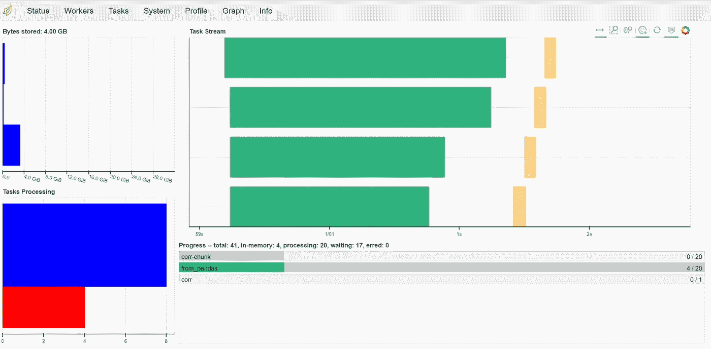

# 用 Python 和 Dask 创建分布式计算机集群

> 原文：<https://towardsdatascience.com/creating-a-distributed-computer-cluster-with-python-and-dask-5dd7e5cc5b2f?source=collection_archive---------30----------------------->

## 如何在您的家庭网络上建立分布式计算机集群，并使用它来计算大型相关矩阵。


由[泰勒维克](https://unsplash.com/@tvick?utm_source=medium&utm_medium=referral)在 [Unsplash](https://unsplash.com?utm_source=medium&utm_medium=referral) 上拍摄的照片

计算相关矩阵会非常快地消耗大量的计算资源。幸运的是，相关性(和协方差)计算可以智能地分成多个过程，并分布在许多计算机上。

在本文中，我们将使用 Dask for Python 来管理局域网中多台计算机之间的大型相关矩阵的并行计算。

# 什么是相关矩阵

相关矩阵显示了两个变量之间的线性统计关系。众所周知，相关性并不意味着因果关系，但我们仍然经常利用它来理解我们所处理的数据集。

如果你只是想在你自己的家庭计算机集群上计算相关性矩阵，那么跳过这一节，但是如果你对如何用数学方法计算相关性感兴趣，那么继续读下去。

直观显示这些步骤的一个简单方法是在 Excel 中重新创建，因此我将向您展示如何在 Excel 中计算三组外汇数据之间的相关性和协方差。

首先，我们获取三组时间序列数据，按每种货币对的列进行排列，然后获取每组汇率的平均值(值的总和除以值的数量):


然后，对于每个时间序列数据点，我们计算该点与平均值的差值:


然后，我们对这些差异进行平方，这将给出每个数据集的方差。


然后，我们计算平方值范围的总和，除以我们的样本大小减一，得到我们的方差，例如 GBPUSD 为 0.0013%，如第 3 行所示。我们从数据点的计数中减去 1，因为这是我们数据集的样本(我们没有每一个历史数据点)，而不是整个人口。这就是所谓的“样本方差”。如果我们有全部人口，我们不会减去一个。


我们还可以计算这一阶段的标准差，它就是方差的平方根:


我们可以通过将每个时间点的两个“均值差”值相乘来计算两个给定数据集之间的协方差。以下示例显示了 GBPUSD 和 JPYUSD 的单一时间点协方差计算:


我们称 GBPUSD 数据集为 A，JPYUSD 数据集为 B，依此类推。有了四个单独的数据集，我们就有 6 个组合用于协方差计算:AB、AC、AD、BC、BD 和 CD。所有这些都是以相同的方式计算的，即乘以每个时间点每个数据集平均值的差值。

然后，我们取这些值的平均值，就像我们对方差所做的一样，从分母中减去一，得到协方差:


最后，我们可以通过将协方差除以两个标准差的乘积来计算这两个数据集的相关性:


在数学上，我们可以将其表示为:


这可能看起来令人望而生畏，但这正是我们已经计算过的。请看右边的等式，分数的顶部表示“取数据集 X 中每个数据点与数据集 X 的平均值之差，然后乘以数据集 Y 中的等效计算结果”，然后将所有这些值相加。带有下标 I 的 x 仅表示数据集 x 的给定点，而 x̅表示数据集的平均值。y 值也是如此。

分母也是说，对于 X 上的每一个点，从那个点减去 X 的平均值，然后平方你得到的值。把所有这些加在一起，对 y 做同样的事情。现在把这两个值相乘，然后求这个数的平方根。结果是两个数据集的标准差的乘积。

这正是我们刚刚为自己计算的，也是我们今天正在做的，只是我们使用家用计算机集群来计算大量金融工具在大量时间点的相关性。

# **设置环境**

***网络***

第一步是在构成集群的每台计算机上建立计算环境。您将需要确保计算机可以在本地网络上看到彼此(通过防火墙例外)。您还需要记下每台计算机的 IP 地址。

在 Windows 上，您可以在命令提示符下键入:

```
ipconfig
```

这将为您提供本地网络上的 IP 地址。在 Linux 机器上，您可以键入:

```
hostname -I
```

或者在 OSX，下面的内容应该有用:

```
ipconfig getifaddr en0
```

您应该记下每台机器上的每个 IP 地址，因为您将需要它来设置集群。您还可以通过运行以下命令来检查每台计算机是否可以看到其他计算机:

```
ping <Target IP Address>
```

如果有数据响应，那么两台计算机可以互相看到对方，如果没有，您需要仔细检查 IP 地址，并确保防火墙没有阻止通信。

我们将使用三台计算机作为小型集群的一部分，它们分别是 192.168.1.1、192.168.2 和 192.168.1.3。

***Python 和*Dask**

需要注意的非常重要的一点是**每台计算机**上的每个 Python 环境必须相同。如果库版本中存在不一致，这可能会导致问题。

如果更简单的话，可以使用 Anaconda 或类似的工具创建一个新的 Python 环境，其中包含您将使用的库的匹配版本，比如 Numpy 和 Pandas。

您还需要在每台计算机上安装 Dask 本身。您可以使用 Conda 实现这一点:

```
conda install dask distributed -c conda-forge
```

或者您可以使用画中画:

```
python -m pip install dask distributed --upgrade
```

现在，您应该在集群中的所有计算机上安装了一致的 Python，并且具有匹配的库版本。

# 获取数据

在这个例子中，我使用的是每日股票数据的大型数据集。这包括 2000 年至 2020 年约 7000 只美国股票的每日收盘价。在我的集群中的任何一台个人计算机上进行计算都是非常耗时的。当我最初尝试计算时，由于在写入页面文件时遇到内存限制，系统在几个小时后崩溃。

这些数据存储在一个大型 SQL 表中，我们将按顺序访问每个股票，然后进行合并。事实证明，这比用 Python 执行操作要快得多。

我们还将使用 MySQL 数据库连接器的不同实现。标准的 MySQL 连接器库在处理大型数据集时相对较慢，因为它本身是用 Python 编写的。此连接器的 C 实现必须更快，您可以在这里找到安装细节:

 [## MySQLdb 用户指南- MySQLdb 1.2.4b4 文档

### MySQLdb 是流行的 MySQL 数据库服务器的接口，它提供 Python 数据库 API。文件有…

mysqlclient.readthedocs.io](https://mysqlclient.readthedocs.io/user_guide.html) 

一旦安装了 MySQLdb，您就可以开始查询数据了。我首先从表中提取所有唯一的、按时间顺序排列的日期列表。这将是整个数据库中每个时间步长的黄金来源。

然后，我逐个提取股票的时间序列数据，并将其左连接到黄金时间序列源。然后，我将这个单独的数据帧添加到一个数据帧列表中，每个数据帧对应一只被提取的股票。我推迟了合并操作，将每个股票时间序列合并成一个数据集。

这种查询方法本身可以并行化，而从表中提取所有数据的单个查询是不可能的。

这给我们留下了一个带有公共时间序列索引的数据集列表，然后我们可以使用它。

这里我们提取股票列表，构建时间序列的黄金来源，然后遍历列表，以这种通用格式提取每只股票的时间序列数据。

我们从中提取股票数据的查询:

```
SELECT date, close as {} FROM history where stock = '{}'
```

获取股票的收盘价，并用该股票的代码命名该列。这意味着，我们将有 7，000 个列，每个列的名称都是“close ”,而不是 7，000 个列，每个列都用相关的股票代码命名，并映射到一个公共的时间序列。这就好办多了。

# 计算相关矩阵

好消息来了。我们将得到最终格式的数据，并开始计算相关矩阵。

这里，我们为列表中的每个数据帧设置日期索引，并将它们合并在一起。因为我们根据相关的股票代码来命名每一列，所以现在我们有了一个大表，它有一个作为索引的公共日期列表和一个针对每只股票的带标签的列。我们将通过删除所有“NaN”值的列来简化表格，这里没有相关数据。

这正是我们计算相关矩阵所需的格式，因此我们将:

```
import dask.dataframe as dd
```

并创建 Dask 数据帧

```
merged = dd.from_pandas(merged, 20)
```

此时，您需要做出一个重要的设计决策，该决策将显著影响相关矩阵的处理速度。

在这里，我们将 Pandas 数据帧转换为 Dask 数据帧，我们还必须指定一个数字，这里是“20”，表示数据集中的分区数量。

出于并行计算的目的，每个分区将被视为独立的单元。例如，如果您选择“1”，相关矩阵将由单个 CPU 上的单个线程计算，您将不会获得任何并行化优势。

另一方面，如果您将这个数字设置得太高，您的性能会受到影响，因为加载和处理每个任务会产生开销。

最初，我将它设置为小型集群中计算机上的线程数。然而，我很快发现其中一台机器慢得多，两台速度较快的机器闲置着，等待这台机器完成。为了减轻这种情况，我增加了进程的数量，以便速度较快的计算机可以继续处理后面的任务，而速度较慢的计算机可以继续处理最初分配的进程。

做出这个决定后，我们将合并的数据帧从 Float 32 数据类型转换为 Float 16 数据类型，因为额外的精度是不必要的，并且会减慢我们接下来的计算。

然后我们运行关键线路:

```
merged = merged.corr().compute()
```

这里有两个函数，*。corr()* 计算我们的相关矩阵，以及*。compute()* 发送给 Dask 进行计算。

在这个处理之后，我们将得到一个关联矩阵，显示每只股票之间的关联。下面是这种情况的简化示意图(由于我们没有计算矩阵，所以数据是虚构的

你会注意到这里有很多重复和不必要的数据。AAPL 和 APPL 的相关系数是 1。AMZN 与 AMZN 的相关性为 1。这将是你整个矩阵对角线上的情况。

同样，也有重复。AMZN 与 AAPL 的相关性显然与 AAPL 与 AMZN 的相关性相同(这是一回事！).

当您要将这些数据保存回数据集中时，复制所有这些数据是没有意义的，尤其是对于如此大的数据集。所以让我们摆脱这种重复。

您会注意到，不必要的数据值形成了数据集的一半，横跨一个对角线形状。所以在我们保存这个数据集之前，让我们屏蔽掉对角线。

```
corrs = merged.mask(np.tril(np.ones(merged.shape)).astype(np.bool))
```

这条线就是这么做的。它以我们的相关矩阵的形式创建了一个 1 的矩阵。然后，它使用 Numpy 返回数据的副本，并使用 tril()函数对给定的对角线进行清零。然后，通过将这些零转换为 bool 类型，它将这些零转换为 False 条件。最后，它使用 Pandas 将此作为掩膜应用于数据集，并将其保存为我们新的相关矩阵。

然后，我们可以将这个简化的矩阵转换成表格，然后上传回我们的数据库。

```
levels = merged.columns.nlevels...df1 = corrs.stack(list(range(levels))).reset_index()
del df1["level_0"]
del df1["level_2"]
df1.columns = ["Stock 1", "Stock 2", "Correlation"] 
print("Uploading SQL")
df1.to_sql("correlations", con=engine, if_exists='append', chunksize=1000, index=False) 
print("Process Complete")
```

在这里，我们使用 stack()函数将它转换回数据库的一个表。这给了我们一个类似这样的表格:

您可以看到，没有重复的值或冗余的 1 来显示股票与自身的相关性。然后，可以将其上传回数据库，整个过程就完成了。

# 矩阵的分布式计算

我们必须在代码中添加最后一行，也是至关重要的一行，但是首先我们需要创建我们的集群。

在每台计算机上，您都需要使用 Python 终端。如果您正在使用 Anaconda，您可以使用 GUI 启动终端，或者您可以进入 Anaconda 提示符并使用以下命令选择您的环境:

```
conda activate <environment>
```

您现在需要决定哪台计算机将充当调度程序并管理任务的分配，哪台计算机将充当工作程序。计算机完全有可能既是调度者又是工作者。

在调度器上，继续在 Python 终端中输入以下内容:

```
dask-scheduler
```

这将启动调度程序并管理集群的工作流。记下您完成此操作的本地网络 IP 地址，在我们的示例中，我们将使用 192.168.1.1。

我们希望这台机器也作为一个工作者，所以我们将打开另一个 Python 终端并键入:

```
dask-worker 192.168.1.1:8786
```

这应该表明我们已经在 worker 和 scheduler 之间建立了连接。

现在，我们需要在集群中的其他每台计算机上重复这个命令，每台计算机都指向位于 192.168.1.1 的调度程序。

我之前提到其中一台电脑比其他的慢。然而，它有两倍的 RAM，可以方便地在最后组装相关矩阵。我没有将它从集群中完全删除，而是决定通过限制 Dask 可用的线程数量来限制它可以运行的进程数量。您可以通过将以下内容附加到 Dask-worker 指令中来实现这一点:

```
dask-worker 192.168.1.1:8786 --nprocs 1--nthreads 1
```

现在您的集群已经启动并运行了，您可以在代码中添加关键的一行了。将以下内容添加到 Python 文件的顶部附近(或者在任何情况下，添加到对。corr()。计算():

```
client = _get_global_client() or Client('192.168.1.1:8786')
```

确保将 IP 地址替换为调度程序的 IP 地址。这将把 Dask 指向调度程序来管理计算。

现在，你可以运行你的程序了。

# 监控计算

Dask 提供了一个很好的仪表盘来监控你的计算进度。

转到 192.168.1.1:8787(或使用端口 8787 建立调度程序的任何 IP 地址)。

这将向您显示 Dask 仪表板，以便您可以跟踪进度并监控内核和内存的利用情况。


*集群的内存和 CPU 使用情况*

上面的“Workers”页面显示了集群中的节点及其当前的利用率水平。您可以使用它来跟踪哪些工作做得最多，并确保这保持在一个可接受的范围内。值得注意的是，CPU 利用率百分比是基于每个内核的，因此如果使用两个内核，您可以获得 200%的 CPU 利用率，如果使用八个内核，则可以获得 800%的 CPU 利用率。



Dask 仪表板状态屏幕

状态屏幕显示正在进行的任务的明细。上面的屏幕截图显示，我们已经将 20 个分区中的 4 个从 Pandas 数据帧转换为 Dask 数据帧，其他的正在整个集群中工作。我们还可以看到，我们已经存储了超过 4 GB 的数据，未来还会有更多。


Dask 仪表板图形屏幕

图形屏幕以图形方式显示任务是如何划分的。我们可以看到，每个分区都被单独处理，因此如预期的那样有 20 个分区。每个分区经历三个阶段，阶段 0，在那里它从 Pandas 转换到 Dask，阶段 1，在那里计算该特定分区的相关矩阵，以及阶段 3，在那里组合所有分区并计算互相关。


Dask 仪表板系统屏幕

系统屏幕显示当前系统的资源利用情况，包括 CPU、内存和带宽。这向您显示了在任何给定时间集群消耗了多少计算能力，对于查看网络上当前的压力和负载非常有用。

您可以使用这些屏幕来观察您的计算进度，您将逐渐看到各种任务在完成计算后变成绿色。然后，结果将通过网络传播到单个节点，该节点将编译结果并将其返回到您的 Python 程序。

正如你已经编码的那样，生成的矩阵将被精简到相关的对角线部分，制成表格，并上传到你的数据库。

# 结论

现在，您已经成功地设置了一个计算机集群，并使用它来计算相关矩阵，简化您的结果，并将其存储起来以供进一步分析。

您可以使用这些核心组件对您的集群做更多有趣的事情，从机器学习到统计分析。

让我知道你进展如何。

*可以在 Twitter 上关注我* [*@mgrint*](https://twitter.com/mgrint) *或者在*[*https://Grint . tech*](https://grint.tech/)*查看更多来自我。发邮件给我*[*matt @ Grint . tech*](mailto:matt@grint.tech)*。*