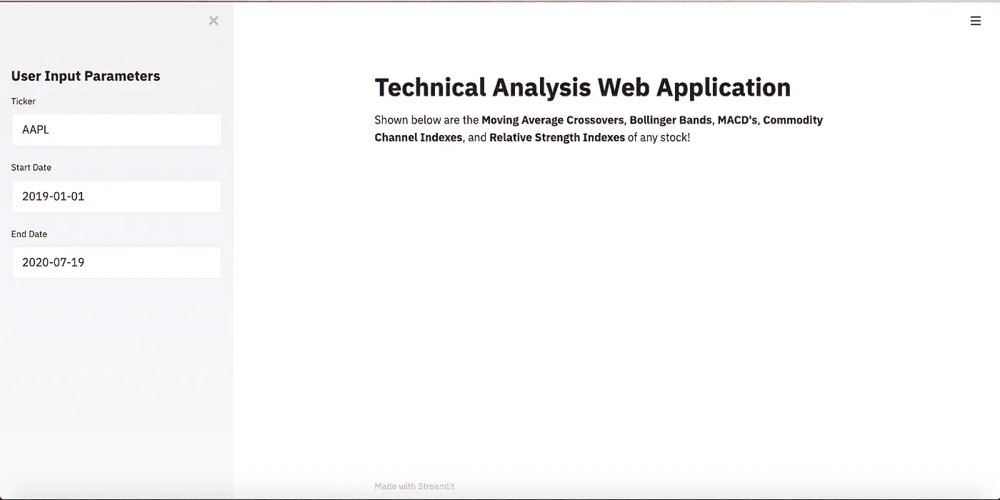
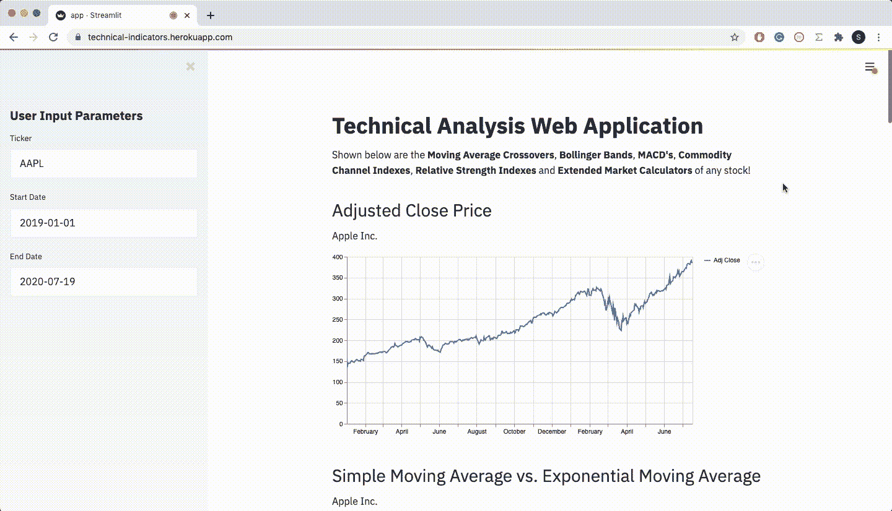

# 在 3 分钟内创建一个财务 Web 应用程序！

> 原文：<https://towardsdatascience.com/creating-a-finance-web-app-in-3-minutes-8273d56a39f8?source=collection_archive---------14----------------------->

## 了解如何使用 Python 中的 Streamlit 创建技术分析应用程序！


图片由[洛伦佐·卡法罗](https://pixabay.com/users/3844328-3844328/?utm_source=link-attribution&amp;utm_medium=referral&amp;utm_campaign=image&amp;utm_content=1863880)从[皮克斯拜](https://pixabay.com/?utm_source=link-attribution&amp;utm_medium=referral&amp;utm_campaign=image&amp;utm_content=1863880)拍摄

任何数据驱动项目的一个重要部分是它能够被容易地解释和查看，甚至对于那些事先可能对数据一无所知的人。**Python 中的 Streamlit 介绍！**

[**Streamlit**](https://streamlit.io/) 是一个极其易用和直观的工具，用于在 Python 中构建高度交互式、数据驱动的 web 应用程序。有了这个工具，您可以只关注数据方面，而不用担心使用 Flask 或 Django 进行繁琐的部署。

这个过程是完全直观的，到本文结束时，您也应该能够在几分钟内部署您的 web 应用程序，并且只需要几行代码！

## 设置项目

要开始使用我们的 Streamlit web 应用程序，我们必须首先使用 PyPi (Python 的包管理器)下载它。对于您可能没有的任何包(包括 streamlit ),只需在您的终端中键入以下内容，我们就可以开始了。

```
pip install streamlit
```

如果您的计算机上没有安装 pip，您可以快速浏览一下[这篇文章](https://pip.pypa.io/en/stable/installing/)并在安装后返回这里。

## 开始项目！

导入依赖项

首先，我们必须导入整个程序中需要的所有依赖项。我们将使用的主要库是 Yfinance、Streamlit 和 TaLib。Yfinance 将允许我们接收任何股票的历史股价，Streamlit 将允许我们将 web 应用程序部署到本地主机上，TaLib 将允许我们计算稍后将在应用程序上显示的技术指标。

现在我们已经设置了依赖项，我们终于可以开始构建我们的应用程序了！

设置 web 应用程序！

首先，为了运行程序，到你的终端键入命令*streamlit run file _ name . py*。用您选择从此程序创建的文件名替换 file_name.py。然后，一个 web 应用程序将在您的本地主机上打开！

为了在网站上写文章，我们可以使用。Streamlit 中的 write()方法。为了显示更大更粗的文本，我们可以在前面使用一个标签(# ), Streamlit 会自动改变文本，使其看起来像一个标题(Markdown formatting)。要加粗文本，我们可以简单地用两个星号将我们想要加粗的文本括起来。

接下来，我们可以使用 header 方法创建一个标题，并设置一个函数来获取用户的输入。因为我们正在创建一个技术分析 web 应用程序，所以我们需要一个股票代码、开始日期和结束日期。我们可以将值自动设置在那里，以防用户没有输入自己的值。在这种情况下，我使用苹果公司的股票代码(AAPL)，2019-01-01 作为开始日期，今天作为结束日期。

为了使 web 应用程序看起来更好，我们可以创建一个向 Yahoo Finance 发送请求的函数，并检索我们输入的任何股票的公司名称！

我们可以使用 pandas.to_datetime()方法将开始和结束日期从字符串转换为日期时间格式，这样我们就不会在以后出现任何错误。最后，我们可以用前面提到的 Yfinance 模块检索历史股票数据。只是为了跟踪我们目前所处的位置，这是 web 应用程序现在应该呈现的样子。



到目前为止，web 应用程序应该是什么样子！

现在，剩下的工作就是创建我们将要显示的图表。

计算并绘制技术指标！

正如我之前提到的，奇妙的 TaLib 库使得计算我们将要绘制的技术指标变得简单得可笑。对于这个项目，我选择了流行的指标，如移动平均线交叉，布林线，移动平均线收敛发散，商品通道指数，相对强度指数，和总成交量。要想更深入地了解这些指标能显示什么，我建议在[Investopedia.com](https://www.investopedia.com/)上查找它们。

对于这一部分代码，我们将显示每个指标的三个主要部分。首先，我们必须使用 TaLib 计算指标，然后我们必须设置一个包含指标实际内容的标题，最后，我们可以使用 streamlit.line_chart()显示图表。这就够了！

现在，我们有了一个完全交互式的、实时的、响应迅速的、易于使用的 web 应用程序，只需几分钟，代码不到 100 行。如果你一直遵循这段代码，我们应该有一个类似的网站如下。



网站现在应该是什么样子！

我已经在下面的 GitHub 要点中包含了这个程序的全部代码！

# 后续步骤

在接下来的步骤中，你可以扩展我们显示的数据，因为 Streamlit 允许用户显示几乎任何类型的数据，包括熊猫数据帧。或者您可以决定使用 Heroku 将它部署到云上(如果您想这么做，请查看汉密尔顿·张的文章[)。既然您已经知道如何创建自己的数据 web 应用程序，那么这种可能性真的是无穷无尽的！](/from-streamlit-to-heroku-62a655b7319)

非常感谢你的阅读，我希望你喜欢它！

*注意:如果您正在将这个特定的应用程序部署到 Heroku，请记住从 requirements.txt 中删除 TaLib，而是为它添加一个*[*build pack*](https://github.com/numrut/heroku-buildpack-python-talib)*！*

如果你喜欢这篇文章，可以看看下面我写的其他一些 Python for Finance 文章！

[](/parse-thousands-of-stock-recommendations-in-minutes-with-python-6e3e562f156d) [## 使用 Python 在几分钟内解析数千份股票推荐！

### 了解如何在不到 3 分钟的时间内解析顶级分析师的数千条建议！

towardsdatascience.com](/parse-thousands-of-stock-recommendations-in-minutes-with-python-6e3e562f156d) [](/stock-news-sentiment-analysis-with-python-193d4b4378d4) [## 用 Python 进行股票新闻情绪分析！

### 对财经新闻进行秒级情感分析！

towardsdatascience.com](/stock-news-sentiment-analysis-with-python-193d4b4378d4) [](/creating-a-finance-web-app-in-3-minutes-8273d56a39f8) [## 在 3 分钟内创建一个财务 Web 应用程序！

### 了解如何使用 Python 中的 Streamlit 创建技术分析应用程序！

towardsdatascience.com](/creating-a-finance-web-app-in-3-minutes-8273d56a39f8)