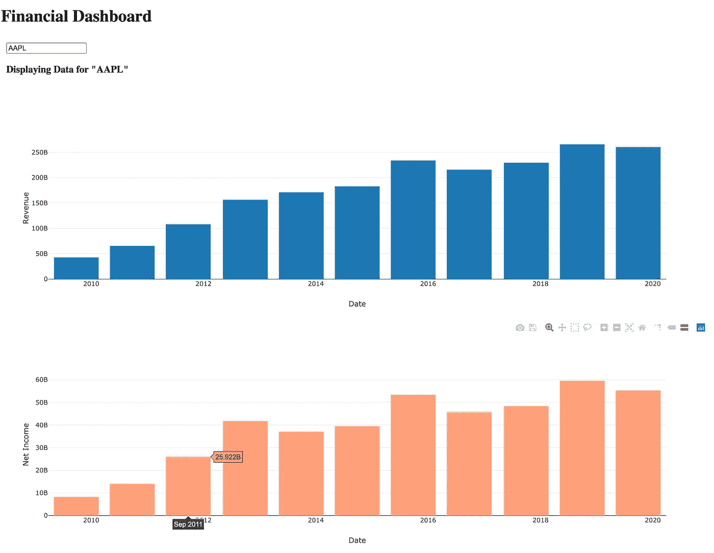

# 使用 Python 创建财务仪表板

> 原文：<https://towardsdatascience.com/creating-a-financial-dashboard-with-python-6d8583e38b57?source=collection_archive---------20----------------------->

## 用 Dash、Plotly 和 Python 构建财务仪表盘

这篇文章将会和我之前的有所不同。我们不会使用 Python 来分析财务数据或评估公司价值。相反，我们将学习**如何使用 [Plotly 和 Dash](https://plotly.com/) 用 Python** 创建一个财务仪表板。下面是我们将建立什么样的样本！



使用 Python 的财务仪表板

# 使用 Python 的交互式仪表盘

Plotly 是一个伟大的免费 Python 库，用于创建交互式图形和仪表板。 [Plotly 文档](https://dash.plotly.com/installation)非常棒，对于开始创建我们自己的交互式图形来说已经足够了，不需要了解 HTML、CSS 或 JavaScript。当然，先前的 HTML 知识会对你有利，但这不是必需的。

在这篇文章中，我将介绍拥有一个可工作的交互式仪表板的基本部分。

我们将建立一个非常基本的仪表板，在这里**我们将在几秒钟内输入一家公司的股票** **和**，**我们将在屏幕上看到两个财务条形图** **显示一段时间内公司的收入和净收入**。

一旦你很好地理解了我们在做什么以及 Dash 是如何工作的，你就能够自己创建更高级的仪表板了。

## 在 Python 中启动我们的财务仪表板—安装 Dash

首先，在开始安装 Dash 的代码之前。我们可以通过在终端中运行下面的命令很容易地做到这一点。如果您已经安装了 Dash，可以跳过这一部分。

```
pip install dash==1.12.0
```

很好，有了这一行代码，您已经安装了运行 Dash 所需的所有组件。

## Dash 如何工作

我们用 Dash 做的是创建一个将在我们本地服务器上运行的应用程序(我稍后将创建一个帖子，展示如何用 Heroku 在线发布它)。

**Dash 应用由两部分组成**。一个**布局组件**，我们将需要输入 HTML 来创建页面的设计。**和定义应用功能**的第二组件。

为了用 Python 创建我们的财务仪表板，我们将有一个非常基本的布局。让我们开始我们的交互式仪表板，并在下一部分提供基本布局。

# 创建财务仪表板布局

我们将在一个标准的 Python 文件中编写代码，例如， *dashboard_fin.py* 。首先，我们导入所有需要的包。使用核心 Dash 功能需要以下四行代码。它们取自 Dash 文档。如果您想了解每个软件包提供的更多信息，请随意查看:

```
import dash 
import dash_core_components as dcc 
import dash_html_components as html 
from dash.dependencies import Input, Output
```

**核心组件**是我们将使用**在我们的财务仪表板中创建交互式仪表盘图**的组件。这个 ***HTML* 组件将被用来构建和设计页面**的布局。最后，我们还从 dash 依赖项中导入输入和输出。

*输入*将是用户在仪表板中输入的信息。这些输入将进入 Python 函数，以便返回某些数据。

*另一侧的输出*将成为我们绘制数据的图形占位符。我们将构建一个 Python 函数，它将接受输入，转换输入，并以图形的形式返回输出，以包含在 HTML 布局部分中。

然后，我们将使用*请求*从 API 获取数据，并使用*构建我们的图表。*

```
import requests 
import plotly.graph_objects as go
```

接下来，我们可以通过传递下面的代码行来创建应用程序。这将创建一个包含我们的应用程序的对象:

```
app = dash.Dash()
```

最后，我们准备创建页面布局。我们将有一个 *H1* 标题，然后是一个 *Div* 部分，包含我们的输入文本框和两个图形:

```
app.layout = html.Div([
  html.H1('Financial Dashboard'),html.Div([
  dcc.Input(id='company_selection',value='AAPL'),
  html.H3(id='text'),
  dcc.Graph(id ='revenue'),
  dcc.Graph(id ='netincome'),
  ],style= {'padding':10})
])
```

因此，在我们的 *Div* 部分中有三个元素:

*   **输入**:文本框，用户将在其中输入要求财务数据的公司名称。
*   **图形**:这是显示图形的占位符。它将是我们财务仪表板的主要组成部分。图形数据和类型将构建在我们的 Python 函数中。
*   **H3** :占位符，显示我们正在显示数据的公司的名称。

请注意，每个组件的 id 将在稍后的 Python 函数中用作引用，以便传递数据或输出数据。它是布局和财务仪表板功能之间的链接。

# 在我们的 Python 财务仪表板中构建功能

现在我们已经准备好了布局，我们可以简单地创建一个函数来获取数据并创建一个交互式图形。我们将使用 [financialmodelingprep](https://financialmodelingprep.com/) 来检索公司的财务状况。它每月提供 250 个免费的 API 调用。

对于我们的 Python 财务仪表板，我将只检索公司*收入*和净收入*收入*。由于我在之前的帖子中已经多次提到过这个部分，所以我将不再赘述如何检索财务数据的细节。

然后，我们的函数将返回字典形式的数据点，我们将使用 Plotly 来构建图形。更多关于如何绘制图表的细节可以在这里找到。然后，我们使用一个 *app.callback() decorator* 来将输入和输出链接到我们的 Dash 布局组件。[这是让我们的财务仪表板能够互动并响应用户输入的部分](https://dash.plotly.com/basic-callbacks)。

我们将有两个功能。每个功能都将在我们的财务仪表板中显示单个条形图的数据。第一个，它将绘制一段时间内公司的收入。

```
[@app](http://twitter.com/app).callback(Output('revenue','figure'),
              [Input('company_selection','value')])
def retrieve_revenue(company):
  demo = 'your api key'
  stock = company
  print(stock)
  IS = requests.get(f'[https://financialmodelingprep.com/api/v3/financials/income-statement/{company}?apikey={demo}'](https://financialmodelingprep.com/api/v3/financials/income-statement/{company}?apikey={demo}'))
  IS = IS.json()
  IS = IS['financials']
  Revenues = []
  Dates = []
  count = 0
  for item in IS:
    Revenues.append(float(IS[count]['Revenue']))
    Dates.append(IS[count]['date'])
    count += 1
  print(Revenues)datapoints = {'data': [go.Bar(x=Dates, y=Revenues)],'layout': dict(xaxis={'title':'Date'},
                                                                      yaxis={'title':'Revenue'},
                                                                            )}return datapoints
```

而第二个函数将绘制公司随时间的净收入。注意，这两个函数几乎是相同的。我们只改变了 id 和字典键来从 API 中提取净收入*。*

```
[@app](http://twitter.com/app).callback(Output('netincome','figure'),
              [Input('company_selection','value')])
def retrieve_revenue(company):
  demo = 'your api key'
  stock = company
  IS = requests.get(f'[https://financialmodelingprep.com/api/v3/financials/income-statement/{company}?apikey={demo}'](https://financialmodelingprep.com/api/v3/financials/income-statement/{company}?apikey={demo}'))
  IS = IS.json()
  IS = IS['financials']
  Revenues = []
  Dates = []
  count = 0
  for item in IS:
    Revenues.append(float(IS[count]['Net Income']))
    Dates.append(IS[count]['date'])
    count += 1

  datapoints = {'data': [go.Bar(x=Dates, y=Revenues,marker_color='lightsalmon',name='Net Income')],
  'layout': dict(xaxis={'title':'Date'},
                yaxis={'title':'Net Income'},
                  )}return datapoints
```

# 仪表板输入-输出链接

这两个函数都返回用户在财务仪表板输入框中请求的公司财务数据。例如，如果用户传递股票代码 *AAPL* ，Python 函数将把 *AAPL* 作为输入，并将其传递给 url 请求，以便检索苹果的财务数据。

然后，我们将每年的*收入*(或*净收入*)和*日期*添加到一个 Python 列表中，并将它们传递给 *go。条形图*图创建一个条形图。

最后，该函数返回一个包含图形数据点和布局的字典，然后在具有相同 *id* 的 HTML 图形占位符中输出。

为了让用户知道我们正在显示数据的公司的名称，我们可以在 HTML 布局中添加一个链接到我们的 H3 部分的附加函数:

```
[@app](http://twitter.com/app).callback(
    Output(component_id='text', component_property='children'),
    [Input(component_id='company_selection', component_property='value')]
)
def update_output_div(input_value):
    return 'Displaying Data for "{}"'.format(input_value)
```

# 启动财务仪表板

要运行财务仪表板，我们只需添加以下代码行，并从终端运行我们的 python 脚本。

```
if __name__ == '__main__':
    app.run_server(debug=True)
```

然后，该应用程序将在您的本地服务器上运行于*[*http://127 . 0 . 0 . 1:8050/*。你可以简单地在浏览器中复制并粘贴网址，你应该能看到类似下面的内容。只需在文本框中输入任何一家公司的股票代码，图表就会交互更新！](http://127.0.0.1:8050/.)*

**

*带破折号的财务仪表板*

***如果图形没有显示，请确保您也已经安装了**[](https://plotly.com/python/getting-started/)****。*****

***现在，您应该准备开始构建自己的更高级的仪表板了。订阅我的社交媒体频道，在我的下一篇文章中了解如何在线发布仪表板。***

***查看我一步一步解释代码的视频教程:***

```
***import dash
import dash_core_components as dcc
import dash_html_components as html 
from dash.dependencies import Input, Output import requests 
import plotly.graph_objects as goapp = dash.Dash() app.layout = html.Div([ 
  html.H1('Financial Dashboard'), 
  html.Div([ dcc.Input(id='company_selection',value='AAPL'), 
  html.H3(id='text'), dcc.Graph(id ='revenue'),
  dcc.Graph(id ='netincome'), ],style= {'padding':10})
 ]) 
@app.callback(Output('revenue','figure'),         [Input('company_selection','value')])
def retrieve_revenue(company):
  demo = 'your api key' 
  stock = company print(stock)
  IS = requests.get(f'https://financialmodelingprep.com/api/v3/financials/income-statement/{company}?apikey={demo}')IS = IS.json()
IS = IS['financials'] 
Revenues = []
Dates = []
count = 0for item in IS:
   Revenues.append(float(IS[count]['Revenue'])) 
   Dates.append(IS[count]['date']) 
   count += 1 datapoints = {'data': [go.Bar(x=Dates, y=Revenues)],'layout':   dict(xaxis={'title':'Date'}, yaxis={'title':'Revenue'}, )} return datapoints @app.callback(Output('netincome','figure'), [Input('company_selection','value')]) 
def retrieve_revenue(company): demo = 'your api key' 
stock = company 
IS = requests.get(f'https://financialmodelingprep.com/api/v3/financials/income-statement/{company}?apikey={demo}') 
IS = IS.json() 
IS = IS['financials'] 
Revenues = [] 
Dates = [] 
count = 0 for item in IS: 
  Revenues.append(float(IS[count]['Net Income']))   
  Dates.append(IS[count]['date'])
  count += 1datapoints = {'data': [go.Bar(x=Dates, y=Revenues,marker_color='lightsalmon',name='Net Income')], 'layout': dict(xaxis={'title':'Date'}, yaxis={'title':'Net Income'}, )}return datapoints @app.callback( Output(component_id='text', component_property='children'), [Input(component_id='company_selection', component_property='value')] ) 
def update_output_div(input_value): 
  return 'Displaying Data for "{}"'.format(input_value)if __name__ == '__main__': app.run_server(debug=True)***
```

****原载于 2020 年 6 月 14 日 https://codingandfun.com*[](https://codingandfun.com/creating-a-dashboard-with-python/)**。*****