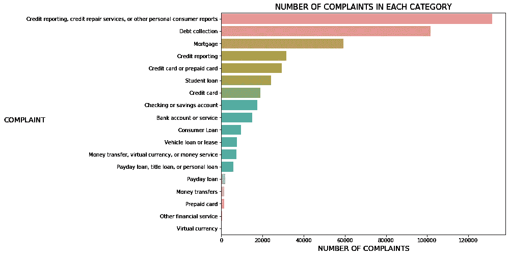

# 创建一个 Flask 应用程序，使用自然语言处理对消费者投诉进行分类(使用 TFIDF/Word2Vec 进行多类分类)

> 原文：<https://towardsdatascience.com/creating-a-flask-app-to-classify-consumer-complaints-using-natural-language-processing-6c8778c9eb48?source=collection_archive---------27----------------------->

在本系列的第 1 部分中，我将介绍获得产生这些分类的工作模型的工作流程。这篇文章将在第 2 部分继续，其中涉及到构建这个模型的 Flask 应用程序。因此，如果你只是对烧瓶部分感兴趣，点击 ***这里(仍在生产)*** 前往那个职位！

事不宜迟，让我们直接进入本系列的第 1 部分。

```
I am dissatisfied with the current outcome of a dispute that was initiated with Discover Card regarding a single transaction that occurred on XXXX/XXXX/2015 in the amount of {$280.00}. I have corresponded with Discover Card at least four times since XXXX/XXXX/2015 ( which I have enclosed as an attachment to this complaint ). I believe that the credit card issuer has violated consumer protection laws by failing to implement the Special Rule for Credit Card Purchase protection despite overwhelming paperwork evidence submitted by me that shows the merchant has conducted business in bad faith less favorable to the consumer. I have sustained a monetary loss as a result of merchants bad faith and intent. I have patiently utilized the internal Discover Card dispute process over the past three months with the credit card issuer always favoring the merchant ; I have repeatedly submitted irrefutable paperwork evidence that has shown that the merchant has conducted business in bad faith. I have tried in good faith to address my complaint with the merchant and Discover Card but believe that I will not receive a favorable outcome. I suffered a work-related injury in XXXX and am now permanently XXXX. My income has dropped substantially in the past 5 years and I am now on a low fixed income. On XXXX separate occasions from XXXX to XXXX I had zero income and had to use my Sams Club card to purchase food, thus running up debt out of necessity. I am currently in the process of attempting to pay down my Sams Club ( Synchrony Bank ) card, and stopped using the card some time ago. I have always made at least minimum payments and have never missed a payment. Despite this, my interest rate has been unilaterally raised three times in the past two years, and is now at 23.15 %. I called a Sams Club account rep today to file a complaint over the phone, because I am never going to be able to pay down this card when I am paying almost {$50.00} a month in interest and can only afford to pay the minimum payment + {$4.00} or {$5.00} dollars. They would not work with me, which I expected. In my opinion, Synchrony Bank is taking unfair advantage of recent interest rate hikes to gouge customers, especially those who are financially unable to make substantial monthly payments on their accounts. Therefore I am contacting the CFPB to file a complaint through which I might receive some relief.
```

# 停下来。

你读了上面的文字墙了吗？很可能你没有(因为我也不会)。谁有时间去阅读一整块没有标题、没有摘要和糟糕的格式(粗体、空格等等)的文本呢？)可能与你无关？

如果你真的读了上面的文字，你会意识到它们实际上是客户投诉。正如盖茨先生曾经提到的:


如果他这么说，那一定是真的。(图片来源:[图片](https://me.me/i/your-most-unhappy-customers-are-your-greatest-source-of-learning-21856189) via [me.me](https://me.me/) )

我们可以从顾客的投诉中学到很多东西。最好的品牌总是与他们的消费者联系在一起，并围绕他们做出决定(想想派拉蒙，因为糟糕的评论和随之而来的无数迷因，派拉蒙实际上推迟了索尼克电影的上映日期，并改变了我们最喜欢的蓝色刺猬的设计)。


真正可怕的设计(左)，但值得称赞的是你，派拉蒙，重新设计(右)和倾听你的观众(来源:[汤姆·巴特勒](https://www.yahoo.com/author/tom-butler)通过 [sg.news](https://sg.news.yahoo.com/sonic-hedgehog-trailer-sega-redesign-133549564.html) )

理解你的客户固然重要，但这并不能改变这样一个事实:愤怒的客户发来的一大堆文字不仅让人难以通读，还会让人失去动力。很多时候，这不仅仅是一个投诉。


好的，是的，如果你仔细看，他们都是同样的抱怨。但是你明白我的意思。

通常，在银行(或任何大公司的客户服务部门)，他们每天都会看到数以千计这样的投诉，它们不会像上面这些投诉那样措辞和格式令人愉快。


客户投诉的实际图像(来源:via [yandex](https://yandex.fr/news/story/Penzenskij_chinovnik_nabrosilsya_s_kulakami_na_zhurnalista--174f8bff44d7cae0ccd8bb37b57a21f8?lr=143&stid=Gn7E&persistent_id=89413115&lang=ruuk&rubric=Penza&from=story) )

此外，消费者自己可能会将投诉归入错误的部门，而审查每一项投诉并将其转交给相关部门处理将是一项巨大的痛苦。不用说，这些缓慢的处理时间也会导致对客户的缓慢响应时间，从而导致您已经愤怒的客户变得更加愤怒。

伙计，如果有什么方法可以快速分类每一个抱怨来加快你的阅读过程就好了。

# 项目目标

事实证明是有的，这正是这个项目的目的。在我的项目中，我开发了一个模型，可以根据产品类型对客户投诉进行正确分类，准确率达到 83%**。**


该应用程序利用机器学习算法结合自然语言处理(NLP)方法来处理文本，以预测投诉所指的产品类型。

# 定义问题

这本质上是一个 ***监督(标签)*** 文本多类分类问题，我们的目标是用一个新的输入(投诉)进行预测(分配到正确的类别)。在下面的步骤中，我将带您完成以下内容:

*   数据探索(了解数据集)
*   数据(文本)预处理和在 NLP 项目中可能采取的一般步骤
*   型号选择以及为什么使用 Micro-F1 作为评估指标
*   选定型号的最终测试和结果

在本系列的第 2 部分中…

*   Flask 应用程序演示&如何构建一个

这个项目的所有代码都可以在我的 github 上找到。如果你需要任何澄清，请随时给我留言。

# 第一部分:数据

用来训练这个模型的数据取自 [***这里***](http://catalog.data.gov/dataset/consumer-complaint-database) 。并且对每一列的含义的解释可以在 [***这里***](https://cfpb.github.io/api/ccdb/fields.html) 找到。它本质上是一个由消费者金融保护局(CFPB)提供的关于金融产品和服务投诉的标签数据集。

我们观察到数据集包含 1，437，716 行数据，以及许多许多包含空值的行。

```
<class 'pandas.core.frame.DataFrame'>
RangeIndex: 1437716 entries, 0 to 1437715
Data columns (total 18 columns):
Date received                   1437716 non-null object
Product                         1437716 non-null object
Sub-product                     1202551 non-null object
Issue                           1437716 non-null object
Sub-issue                       887045 non-null object
Consumer complaint narrative    463991 non-null object
Company public response         530104 non-null object
Company                         1437716 non-null object
State                           1414039 non-null object
ZIP code                        1304830 non-null object
Tags                            196144 non-null object
Consumer consent provided?      831624 non-null object
Submitted via                   1437716 non-null object
Date sent to company            1437716 non-null object
Company response to consumer    1437715 non-null object
Timely response?                1437716 non-null object
Consumer disputed?              768482 non-null object
Complaint ID                    1437716 non-null int64
dtypes: int64(1), object(17)
memory usage: 197.4+ MB
```

然而，由于我们只分析投诉本身，我们只需要`Product`和`Consumer Complaint Narrative`列。

在只保留我们需要的列、删除空值并将它们重命名为更好使用的名称之后，我们只剩下 463，991 行数据:

```
<class 'pandas.core.frame.DataFrame'>
Int64Index: 463991 entries, 4 to 1437711
Data columns (total 2 columns):
PRODUCT               463991 non-null object
CONSUMER_COMPLAINT    463991 non-null object
dtypes: object(2)
memory usage: 10.6+ MB
```

在`PRODUCT`列上做一点 EDA(探索性数据分析),我们观察到 18 个类，分布如下:



然而，有些类别(产品)是重叠的。例如，`Credit card or prepaid card`与`Credit card`和`Prepaid card`冲突。此外，还有一个问题是要对 463，991 行执行分析(我怀疑您的笔记本电脑是否能够在这个项目的后期处理和模型训练。我的不行)。

在删除了一些产品类别、合并了一些类别并减少了 90%的观察数量之后(具体情况可以在我的 jupyter 笔记本上的[我的 github](https://github.com/xianjinseow92/projects/tree/master/Project_4_Consumer_Complaint_Text_MultiClassifier/notebooks) 中找到)，我们还剩下大约 30，000 行投诉(对于 8GB ram 的笔记本电脑来说，这是可以管理的)。

```
<class 'pandas.core.frame.DataFrame'>
Int64Index: 31942 entries, 72 to 1437623
Data columns (total 2 columns):
PRODUCT               31942 non-null object
CONSUMER_COMPLAINT    31942 non-null object
dtypes: object(2)
memory usage: 748.6+ KB
```

具有以下分布:


不算太寒酸。现在我们准备对我们的投诉数据进行一些文本预处理！

# 第 2 部分:文本预处理

## 第 2.1 节:简单地说，自然语言预处理

现在我们有了数据，我们需要完成清理过程。对于一般的文本数据集，这通常包括:

*   删除标点符号
*   删除停用词(如“the”、“this”、“what”)
*   小写字母
*   标记化
*   词干化/词尾化(通过删除诸如“-ed”、“-ing”等后缀，将单词简化为基本形式)

如果您正在处理在线文本和评论，您将需要进一步删除超链接、用户名和自动消息等项目。

您所做的预处理因项目而异，为此，除了词干化和词汇化之外，我取得了最好的准确度分数。我考虑过使用二元语法，但是这导致我经常遇到内存问题，因此我只能考虑一元语法(标准的单词标记化)。

下面是一个删除标点符号、删除停用词、小写字母及其后的标记化的示例。


删除标点符号


停用词删除


用小写字体书写


标记化

## 第 2.2 节:矢量化

为了将单词转化为机器学习算法可以理解和处理的东西，我们需要做一些叫做 ***矢量化*** 的事情。简而言之，这是将单词转化为多维向量的过程，其方式是将单词的含义或上下文与向量指向的位置相关联。**从某种意义上来说，矢量化允许计算机通过将相似的词义映射到相似的向量空间来量化词义。**

## 第 2.3 节:词频—逆文档频率矢量化

对于这个应用程序，我们需要**基于上下文的**矢量化。这就是术语频率逆文档频率矢量化的用武之地(TF-IDF)。这种矢量化方法查看一个单词在注释中出现的次数相对于它在其他注释中出现的次数。**两件事导致 TF-IDF 得分更高:**

1.  **该词在被评分的具体投诉中出现的频率较高。**
2.  **该词在所有其他投诉中出现的频率较低。**

# 第 3 部分:培训方法

## 第 3.1 节:模型评估分数

在多类场景中，按照二进制分类不再像 Precision、Recall 和 F1 那么简单(就像我之前的项目[对违约者进行分类](/catching-a-welcher-classifying-a-credit-card-defaulter-f4b21547a618))。这是一个全新的水平。如果您需要更好地理解多分类场景中模型使用的评估指标，我建议参考 [Boaz Shmueli](/multi-class-metrics-made-simple-part-i-precision-and-recall-9250280bddc2) 关于多分类器中评估指标的解释。他很好地解释了关于精确度、召回和 F1 评分的 ***二进制*** 和 ***多类*** 分类指标。

和这个多分类案例一样，我决定使用 ***Micro-F1*** 作为模型间的评价指标，因为它衡量模型的 ***整体精度*** 。

## 第 3.2 节:使用的模型

我已经决定使用以下模型进行多类文本分类:

1.  多项式朴素贝叶斯
2.  高斯朴素贝叶斯
3.  逻辑回归
4.  随机森林
5.  线性 SVC

# 第 4 部分:型号选择

每个模型都在分层的***【5 折分裂训练-验证(整个数据集的 80)***上*交叉验证。剩下的 20%的数据被保留下来，用于模拟我们最终选择的模型在现实生活中的表现，在现实生活中，它必须处理从未见过的输入。*

*像往常一样，如何做到这一点的代码可以在我的 jupyter 笔记本(笔记本的第 3 部分)的 github 上找到。*

*从我们的初步培训结果中，我们看到:*

**

*逻辑回归给了我们 83%的最高准确率。*

*83%是相当高的准确率。但是我们能做得更好吗？我们不能确定是否会更好，但我们可以一直尝试，努力改进。*

## *第 4.1 节:斯坦福手套和谷歌的 Word2Vec*

*我们可以在将投诉输入到我们的分类器之前，利用嵌入在投诉上的单词，而不是利用矢量化(我们上面使用的 Tf-idfVectorizer)。要了解更多关于 WordEmbeddings 的内容，你可以在这里找到它[。](/the-three-main-branches-of-word-embeddings-7b90fa36dfb9)*

*一些方法，如 Word2Vec 和 [spaCy](https://spacy.io/models) 涉及预先训练的、数千兆字节的模型，这些模型在数十万(如果不是数百万的话)文档上训练，然后将单词的含义减少到一组数百个数字。一般来说，这些模型在保持单词的上下文和含义方面非常出色，但是它们速度慢且庞大。*

*对于这个项目，我选择了使用斯坦福德的手套(越来越复杂)和谷歌的 Word2Vec。*

## *第 4.2 节:tfidf 矢量器和 word 嵌入结果*

**

*综合所有测试结果，我们发现普通 TFidfVectorizer 比 WordEmbeddings 要好得多，最高准确率为 83%。*

**

*因此， ***使用逻辑回归的 TfidfVectorizer***被选为本项目使用的文本预处理和模型组合。*

# *第 5 部分:在看不见的数据上测试我们最终选择的逻辑回归分类器*

*还记得我们之前保留的没有在交叉验证中使用的 20%的数据吗？接下来，我们使用它来评估我们的模型在看不见的数据上的表现(即，它在现实生活中的表现)。*

**

*这个模型在看不见的数据上给了我们 83%的准确率！ 表示它可以在 83%的时间内正确地对投诉进行分类！现在我们有了自己的模型，我们终于可以看到它的实际应用了！*

# *第 6 部分:烧瓶演示*

*为了能够以用户友好的方式使用我们的模型，我创建了一个 Flask 应用程序，允许输入投诉。此后，该应用程序将预测投诉属于哪个产品类别。参考这个 ***post (WIP)*** 了解一下 Flask app 是怎么创建的！*

```
*I am dissatisfied with the current outcome of a dispute that was initiated with Discover Card regarding a single transaction that occurred on XXXX/XXXX/2015 in the amount of {$280.00}. I have corresponded with Discover Card at least four times since XXXX/XXXX/2015 ( which I have enclosed as an attachment to this complaint ). I believe that the credit card issuer has violated consumer protection laws by failing to implement the Special Rule for Credit Card Purchase protection despite overwhelming paperwork evidence submitted by me that shows the merchant has conducted business in bad faith less favorable to the consumer. I have sustained a monetary loss as a result of merchants bad faith and intent. I have patiently utilized the internal Discover Card dispute process over the past three months with the credit card issuer always favoring the merchant ; I have repeatedly submitted irrefutable paperwork evidence that has shown that the merchant has conducted business in bad faith. I have tried in good faith to address my complaint with the merchant and Discover Card but believe that I will not receive a favorable outcome.*
```

*还记得我们在帖子开头看到的这面可怕的文字墙吗？让我们来测试一下我们的模型。花点时间读读它，猜猜它属于哪一类。*

**

*现在让我们来测试一下我们的应用程序。*

*有没有得出和 app 一样的结论？现在让我们用一个更难的投诉来试试，充满了错别字、大写字母和千年行话。*

```
*Omg where is my money?????? AOSINIONSAD WHY DID YOU GUYS TAKE MY MONEY AWAY. SAOIDNSIOADNOIAODNNIOASDNSADNOSDNOASDNI TRANSFERRED IT LAST NIGHT AND I WOKE UP TO NOTHING IN!!!!!! MY BANK ACCOUNT. HELP PLEASE!!!!!!!!!!!!!!!!!!!!!!!!!!!!!I NEED THE MONEY OR ELSE I WILL BE HUNTED BY LOAN SHARKS!!!!!!!!YOU *(#&$) PEOPLE HAVE NO RIGHT TO DO THIS TO ME!!!! I NEED MY MONEY!!!!*
```

*我们看到该应用程序可以正确无误地处理混乱的投诉，并正确地将它们归类到哪个产品类别。*

# *第 7 部分:应用优势*

*使用这个应用程序可以带来很多好处，从解放人力到提高筛选客户投诉的效率。*

**

# *第 8 节:未来的工作*

*作为对该应用程序的增强，以提高其实用性，我们或许可以研究以下内容:*

**

****话题总结*** 目前 app 只将投诉归入正确的产品类别。虽然它确实将投诉归入了正确的类别，但客户投诉专员仍然需要通读投诉本身。这将是很好的应用程序也能够提供一个简短的投诉是什么的摘要。这将是一个有趣的话题，可以研究和设计如何创建这个功能。*

****投诉优先级*** 我们还可以考虑实施情感分析，以提供某种投诉优先级。听起来更愤怒的投诉(即愤怒的客户)可以被给予更高的优先级，因为愤怒的客户往往会提供最多的问题。因此，我们的应用程序将为客户投诉官自动排序，以确定哪些投诉需要紧急处理。*

*   *问是否有人愿意一起工作，可以给我发短信*

# *第九节:离别赠言*

*这绝不是一篇短文，希望在你的数据科学之旅中是一篇信息丰富的文章。感谢您花时间阅读到这里。*

*如果你学到了什么，觉得这很有帮助，或者认为它可能会帮助这个领域的人，请与他人分享这篇文章！*

*和往常一样，在 xianjinseow92@gmail.com，你可以随时通过我的 Linkedin 或 gmail 联系我！*

*干杯。*