# 创建一个全自动的每日幻想运动策略

> 原文：<https://towardsdatascience.com/creating-a-fully-automated-daily-fantasy-sports-strategy-6842d2e1ccb6?source=collection_archive---------6----------------------->

## 虽然我在 DFS 中没有盈利——但我非常接近，并且很开心地制定了一个策略，在实时 NBA DFS 比赛中部署真金白银。

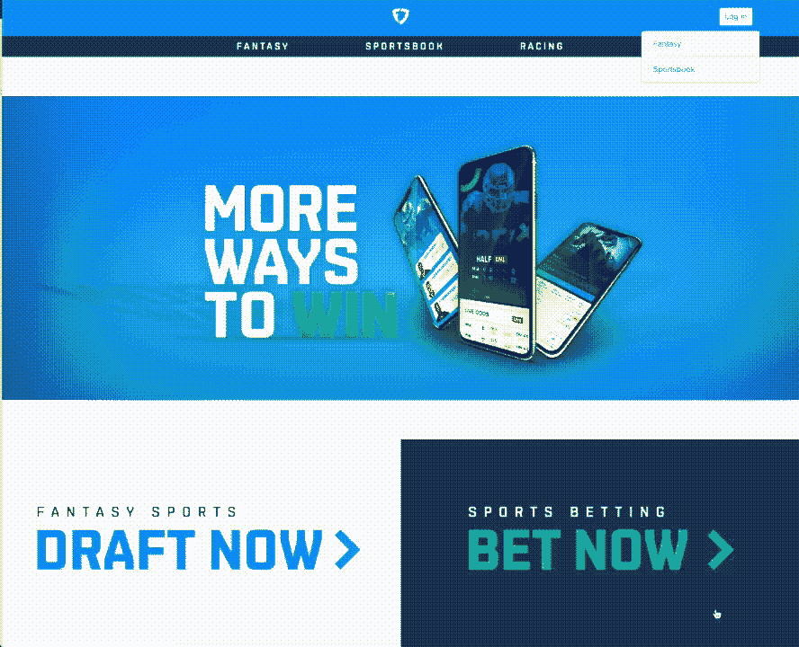

DFS 自动化策略的最后一步:在 FanDuel 上自动加入比赛。由于该网站是基于 JS 的，我们必须模拟一个真正的网络浏览器，并点击网站进入竞争

2018 年末，我(在我哥哥扎克的帮助下)着手创建一个全自动的每日幻想体育(DFS)战略。我的目标是在假期期间做一个有趣的兼职项目，而不是赚钱——我从来没有玩过任何日常幻想游戏，但我是一个半铁杆篮球迷，也是一个铁杆数据迷。

下面是我如何在 2018 年底的两个月时间里制定了一个 DFS 战略的故事，虽然不太有利可图，但完全不干涉，超过了平均的 DraftKings 球员，总体胜率为 40%，并在 2018-19 NBA 赛季的前 5 个月中的 2 个月实现了盈利。

从一开始，我就列出了这个项目的一些要求。我最初将范围限制在 NBA 双打和 DraftKings 上的 50/50 比赛。

## 要求

1.  **自动化**:整个流水线都要自动化，包括参赛。
2.  **可回溯测试**:策略应该是完全可回溯测试的。我们应该能够验证对管道的任何部分所做的任何更改都会带来比过去更好的性能。
3.  **人工干预**:不需要任何“专家知识”。例如，如果勒布朗在与科怀比赛时一直表现不佳，策略应该找出这一点，而不是被明确告知。
4.  **可复制**:使用的任何数据都应该是公开信息(即没有订阅服务，没有像现金额度这样的私人历史数据)。
5.  **可扩展**:管道应该扩展到多个平台和运动，只需最少的额外工作。
6.  **快速:**开发应该是流畅的——管道的每一步都应该能够独立运行，长时间运行或 I/O 密集型的部分应该很少执行并且离线。

# 管道

这里有一个“实时模式”管道步骤的概述，或每天运行的进入幻想联盟的过程。“模拟模式”(回溯测试)只是其中一些步骤的重组和循环——我们将在后面讨论。

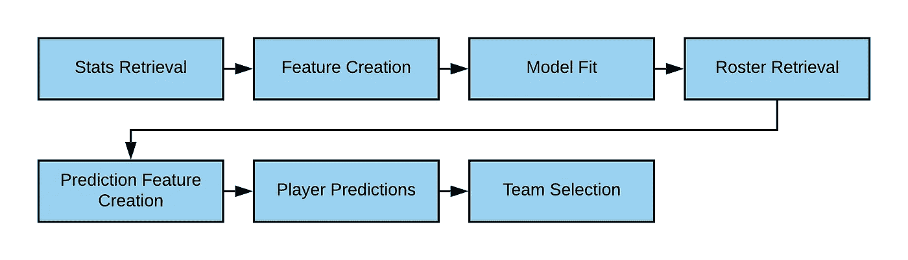

“实时模式”管道步骤

1.  统计数据检索:我们从检索历史数据开始，我们将使用这些数据作为每个玩家预测的基础。对于 NBA 来说，这包括从[篮球参考](https://www.basketball-reference.com/)收集的每场比赛的球员和球队统计数据，以及辅助数据，如投注线和预测的首发阵容。
2.  **特征创建:**使用这些统计数据，我们构建派生的*特征*，这将是学习算法的基础。
3.  **模型拟合:**使用这些衍生特征，我们拟合一个模型，该模型创建了从*特征*到*幻想点*的映射。
4.  **花名册检索:**检索当天符合条件的球员、伤病情况、比赛，以及最重要的每位球员的成本(薪水)。
5.  **预测特征创建:**应用我们用来创建*特征*的相同过程，将花名册数据转换成我们用来创建球员模型的完全相同的*特征*。
6.  **预测:**使用我们之前创建的模型和*预测功能*，我们进行幻想点预测。
7.  **团队选择:**我们运行一个线性优化(根据薪水和职位限制最大化预测的幻想点数)来产生我们将加入的团队。
8.  **联赛参赛:**我们使用一个 [Selenium](https://selenium.dev/) 机器人来导航幻想场地，找到目标比赛(例如，50/50 全石板，25 美元参赛费)，并进入我们的团队。

在接下来的几节中，我将深入一些(希望如此)有趣的具体步骤。

# 特征创建

在理想世界中，我们可以给一个学习算法原始数据，然后弹出我们想要的信息(幻想点预测)。这是图像识别和自然语言处理等许多领域的当前最新技术。虽然对于这个问题来说这很有可能，但我采用了创建手工特征的方法，提前“手动”提取高阶信息，而不是让学习算法来做这件事。

为了创建这些特性，我构建了一个名为“特性框架”的工具，它允许我们的特性被表达为一个[有向无环图](https://en.wikipedia.org/wiki/Directed_acyclic_graph) (DAG)。注意，这不是我的新想法，这是研究驱动交易的常见模式。这种方法有两个主要优点:

1.  我们不必为依赖于相同或重叠子特征的多个特征重复计算。
2.  框架一起处理连接特性——我们不必明确地说*幻想点*需要在*幻想点之前计算。*

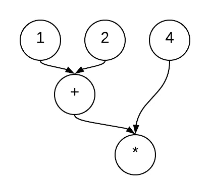

计算的 DAG 表示(1 + 2) * 4 = 12

## **案例分析:防守 vs 站位**

我们将“防守对位置”(DVP)定义为在预先定义的时间范围内，对手在给定位置允许的历史得分。在 NBA DFS 中，如果对手通常允许针对给定位置的超大分数，这可能会很有趣(想象一下霍福德对约基奇的比赛)。

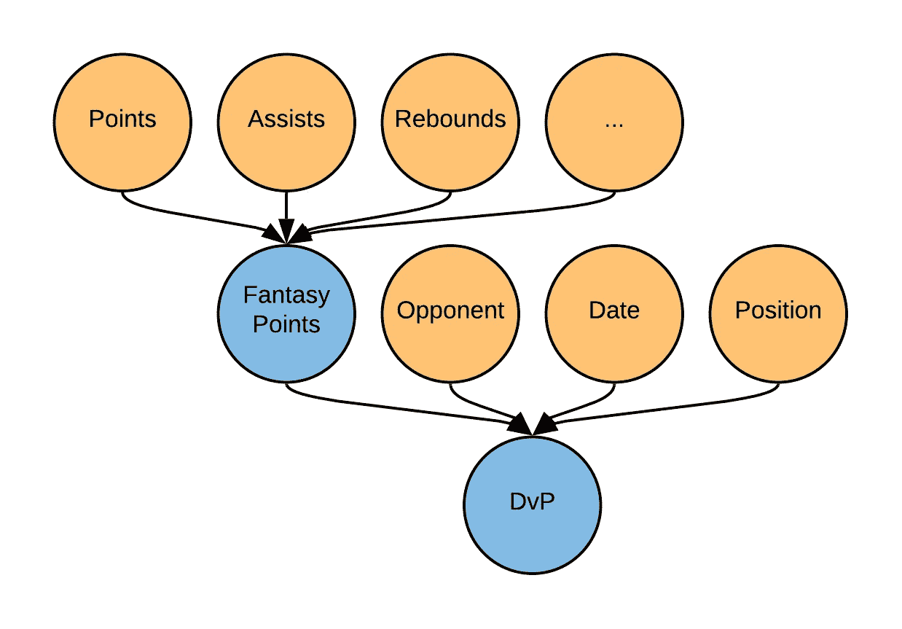

DvP 特征的 DAG 表示。请注意，尽管许多要素都依赖于这种计算，但幻想点只计算一次。

当我们完成特征创建过程时，我们将有一个二维矩阵(玩家-游戏特征)用于学习算法:

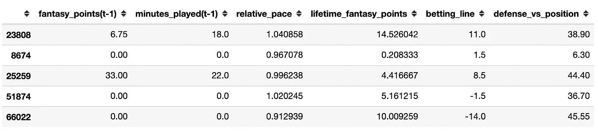

上面的列是特征值的例子，其中行对应于唯一的玩家-游戏组合。我们明确地不给算法“过度指定”的信息，比如该行对应于哪个玩家。

# 模型创建

该模型的目的是考虑*特征*(具体来说，玩家历史表现的各个方面)并预测他们在给定游戏中会获得多少幻想点数。我们使用所有可用的历史数据来拟合该模型，2018-19 赛季的历史数据约为 60，000 行(也使用 2017-18 年的数据)。

需要注意的是，在这个问题的表述中，我们试图最小化(*预测的优点* - *实现的优点)*。这至少有两个潜在的缺点:

1.  这种方法对每个玩家和每个游戏都一视同仁，而实际上，有些玩家可能比其他人更重要。
2.  最小化玩家预测的误差可能与赢得比赛没有直接关系。

这里有一个关于前 5 个游戏的跟踪幻想点数的线性回归的输出权重的例子，这是我们能做的最简单的模型。交叉验证的平均误差(MAE)为 **6.4** *幻想点*。

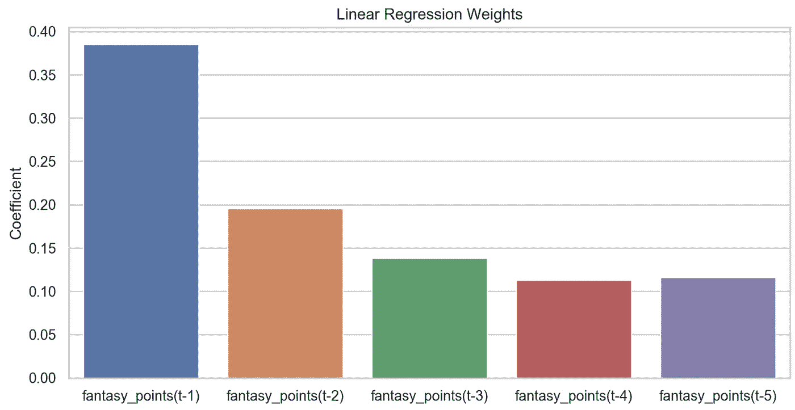

简单变量的线性回归系数——这些系数验证了我们的直觉，即最近的游戏更能预测性能

## 非线性拟合

我们可以通过使用更现代、也是最重要的非线性拟合算法来大幅改善这些拟合结果。在尝试了许多非线性模型，如 SVM、神经网络和决策树之后， [XGB 模型](https://en.wikipedia.org/wiki/XGBoost)表现最佳。这并不令人惊讶，因为 XGB 经常在关于表格数据的 [Kaggle](https://www.kaggle.com/) 获奖条目中使用。即使在这一组简单的功能上，XGB 也将交叉验证的 MAE 降低到大约 **6.2** 。在全套功能上，我们使用 XGBoost 可以实现每个玩家只有**5.38*fantasy points****的平均误差。相比之下，FanDuel 的股票预测误差更接近于 **6.0** ，在评估付费订阅模式时，我找不到任何低于 **5.5** 的预测。*

*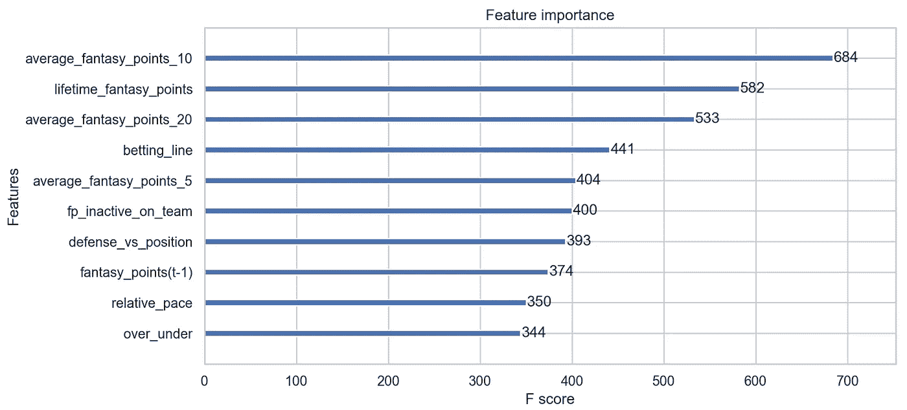*

*XGB 回归函数下特性的相对重要性——有趣的是，我们的衍生特性(如“相对速度”)和其他数据挖掘特性(如“投注线”)正在增值！*

# *预言；预测；预告*

*预测是将先前拟合的模型应用于日数据以获得幻想点预测的流水线步骤。对于线性回归模型，计算是简单的点积:*

*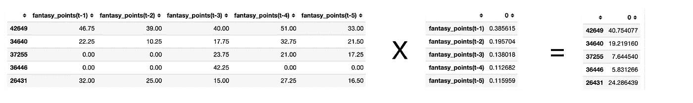*

*线性回归预测是*特征*系数*的简单点积*

*XGB 预测是通过遍历决策树进行的。下面是 XGB 模型对 2019 年 1 月 30 日艾尔·霍福德*幻想点*的预测(27.6)的细分。*

*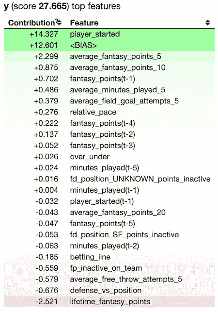*

*2019 年 1 月 30 日艾尔·霍福德 XGB 预测分解。*

# *回溯测试*

*许多(通常比我好得多的)DFS 玩家采取的方法中的一个陷阱是无法评估他们的策略改变是否成功。如果没有回溯测试的能力，可能就没有足够的数据来自信地说变革是有益的。为了解决这个问题，我确保管道的每一部分都可以在过去的任何日期重新运行(当然不考虑未来)。以下是模拟的步骤:*

*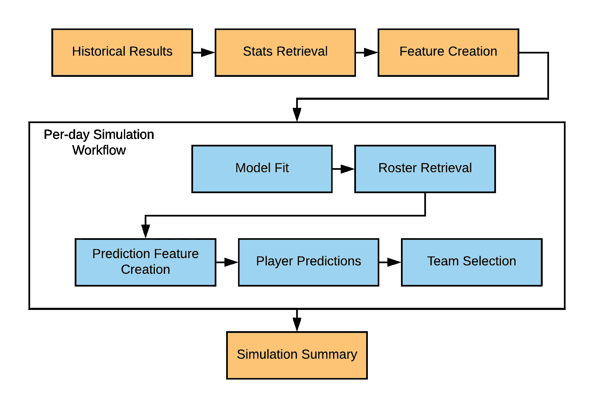*

*模拟工作流—我们可以并行化机器中的部件(每天模拟)，这意味着只要有足够的计算，工作流就和“实时模式”版本一样快！*

*为了确定过去比赛的现金额度，我们可以使用 [RotoGrinders ResultsDB](https://rotogrinders.com/resultsdb) 从 DraftKings 的“双倍”比赛中获得历史现金额度。请注意，当我在管道上工作时，我使用了我参加的 Fanduel 50/50 竞赛的私有结果。*

*回溯测试工作流程如下:*

1.  *创建可能具有某种预测能力的特征(例如，DvP)*
2.  *检查模型误差的一些度量是否减少*
3.  *验证历史比赛成绩有所提高*

*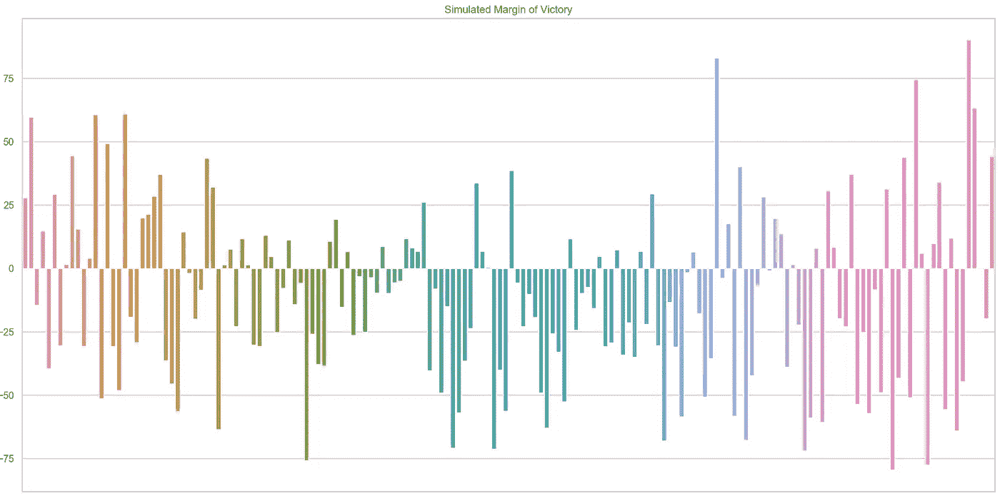*

*2018-19 赛季模拟胜率。管道开始时相当强劲，在 60 天内赢得率超过 60%，然后稳定在 40%左右。*

*虽然我没有记录我所做的改进，但是回溯测试框架允许我们迭代地添加回特性，以查看它们如何改进我们的性能。从这些结果中，我们可以验证:*

1.  *新功能减少了模型误差*
2.  *模型误差减少导致竞争绩效提高*

*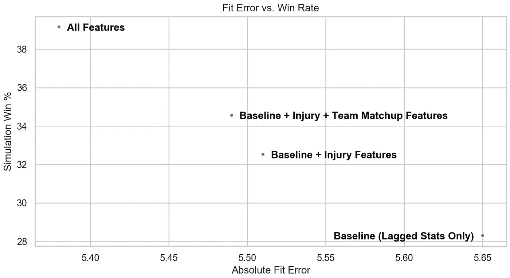*

*拟合误差(MAE)与模拟胜率。我们可以看到，拟合误差越低，模拟成功率越高。*

*最终，我们的模型在整个赛季中取得的最佳成绩是 39%的胜率，其中 50%在我们评估的双倍现金额度中是有利可图的(在 50/50 竞争中，截止值为约 56%)。我们在赛季的前两个月也做得更好。我推测，算法没有考虑到的功能，如球员匹配，在赛季结束时变得越来越重要。*

*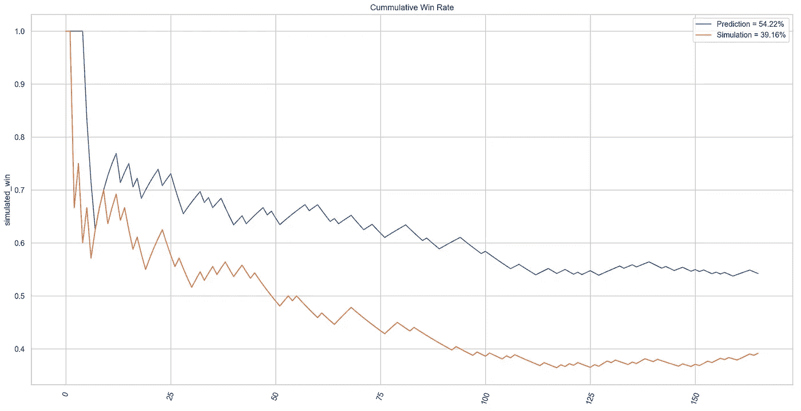*

*2018 赛季的累计胜率:模拟胜率为 39.16%，预测胜率为 54%——根据 DraftKings 的统计，比普通玩家要好！*

# *其他 DFS 的经验教训*

*如果你阅读这篇文章是为了学习如何成为一名盈利的 DFS 玩家，很遗憾我不能帮你实现这个目标——但是我可以分享我学到的一些东西，这些东西似乎对(在某种程度上)具有竞争力是必要的。很可能通过一些额外的“秘方”或预测的调整，一个经验丰富的玩家可以在一个几乎自动化的系统下变得有利可图。*

1.  *有时你可能真的认为一个想法很棒，但它并没有改善你的策略，甚至导致倒退！*
2.  ***首发阵容:**你必须得到正确的首发阵容/后期抓痕才有机会参赛，即使每五场比赛中有一场搞糟也能侵蚀你的优势。*
3.  ***受伤&替补球员:** DFS，尤其是 NBA 50/50，通常会选择一个球员，考虑到他们的工资和球队中新受伤的球员*。如果一个球员因为他上面的先发球员受伤而比正常情况下多打了 3 分钟，你需要让他在你的阵容中才有机会竞争。DFS 的竞争如此激烈，以至于这些“不用动脑筋”的选择(通常是你可能没听说过的球员)通常在 50/50 中拥有 80%以上的所有权。**
4.  ****位置可以是一个有噪声的变量:**位置，以及由其产生的所有特征(如 DvP)都可以是有噪声的。像勒布朗这样的球员可以被列为职业球员，而事实上在某些情况下，他可能更像一个职业球员。我们真正想要提取的东西可能因用例而异，但通常我们更感兴趣的是匹配，而不是特定的位置，这可能是一个稀疏的数据点，人类可以更好地分析它。确定“可能的匹配”的算法可能是这个子问题上的一个进步。**
5.  ****DFS 很难:**根据 DraftKings 的数据，只有 14%的玩家在一个月内盈利。这个自动化系统在 2018-19 赛季的 5 个日历月中有 2 个月盈利，这使得它远远领先于普通人类玩家。即使有一个能给出不错的基线预测的系统，你仍然需要在球场上有很大的优势来克服 DraftKings 和 fan 决斗在 50/50 和双冠王联赛中约 8%的差距。**

# **结论**

**目前，DFS 问题可能需要大量的人工努力才能解决。尽管我们能够在 DraftKings 上取得超过普通玩家的表现，但我们离盈利战略还有很长的路要走。最重要的是，我从构建这个项目中获得了很多乐趣，并了解了很多关于 DFS 和机器学习的实际应用。如果任何读者对该项目有任何疑问，请随时与我们联系！**