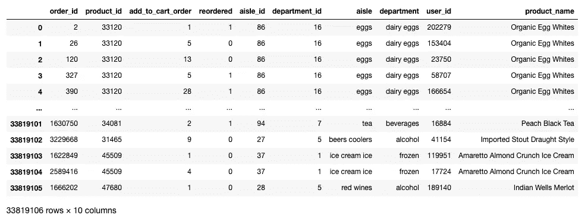

# 为 Instacart 创建杂货产品推荐器

> 原文：<https://towardsdatascience.com/creating-a-grocery-product-recommender-for-instacart-c1b6bdf5ae13?source=collection_archive---------16----------------------->


斯科特·沃曼在 [Unsplash](https://unsplash.com?utm_source=medium&utm_medium=referral) 上的照片

## 使用 K-Means 聚类和关联规则挖掘向 Instacart 客户推荐产品

在电子商务购物体验中，产品推荐有多种形式:它们可能用于在一个产品的页面上推荐其他产品(例如，亚马逊的“经常一起购买”功能)，或者它们可能用于结账页面，根据客户的总订单向他们显示他们可能感兴趣的产品。在这篇文章中，我将详细介绍我是如何为前一种情况制作推荐器的。

此外，如果推荐是针对特定的客户群，而不是统一的，可能会更有帮助。例如，如果一组顾客倾向于购买大量的非乳制品牛奶替代品，而另一组顾客倾向于购买传统牛奶，那么对这盒麦片提出不同的建议可能是有意义的。为了提供量身定制的推荐，我首先使用 K-Means 聚类根据 Instacart 用户的购买历史对他们进行细分，然后根据这些聚类中的产品关联规则提供推荐。在这篇文章中，我将介绍这个过程，并给出一些推荐的例子。

**数据和 Instacart 背景**

Instacart 是一种在线杂货交付服务，允许用户通过他们的网站或应用程序订购杂货，然后由个人购物者完成并交付——非常类似于 Uber Eats，但用于杂货店。2017 年，他们发布了一年的数据，其中包括来自约 20 万客户的约 330 万份订单。以关系数据库的形式发布，我将单独的表组合在一起执行 EDA，留给我以下内容:



**EDA**

执行 EDA 时，我想回答一些关键问题:

1.  最受欢迎的产品和过道有哪些？
2.  产品组合有多“头重脚轻”？即排名靠前的产品占总订购份额的多少？
3.  订单有多大？

为了大致了解 Instacart 倾向于销售什么，我们可以听从他们的部门销售。Instacart 有 21 个部门位于其产品分类的顶端。以下是他们各自的单位销售份额:


Instacart 似乎是农产品的热门选择。最受欢迎的 Instacart“通道”，其分类中的下一层是水果和蔬菜通道，下图显示了前 10 个通道在总销售额中的单位份额:


总共有 134 个通道，共有 49685 件产品，因此上图显示了产品销售的“头重脚轻”分布，前 3 个通道占售出产品的 25%以上。下图显示了前 3 种产品的单位份额，遵循相同的趋势:


几乎所有排名前 30 的产品都是农产品，在最受欢迎的产品之后，市场份额急剧下降。看看 K-Means 聚类是否可以从这种以农产品为主的分布中揭示出不同的客户群体，这将是一件有趣的事情。

以下是订单大小的描述性特征:

```
count    3.346083e+06
mean     8.457334e+01
std      1.355298e+02
min      1.000000e+00
25%      1.500000e+01
50%      3.600000e+01
75%      1.050000e+02
max      1.058500e+04
```

这是一个分界点为 500 单位的分布图:


图表表明，考虑到订单规模，Instacart 可能还有改进的空间——右偏分布表明，大多数订单可能无法满足各自客户的所有杂货需求，其中一半订单的商品数量少于 36 种。产品推荐系统将让顾客更容易找到他们想要的产品，并向顾客展示他们从未在 Instacart 上购买过的商品。

**主成分分析和 K-均值聚类**

K-Means 聚类的目标是根据客户过去购买的产品将客户分组。为了实现这一点，我打算对从每个客户以前的订单总和中购买的单位份额实施 K-Means。我的第一步是将前面显示的组合表转换成一个表，其中每行代表一个客户，列代表从每个通道购买的份额。下表中有一个示例:


然后，我执行 PCA 来减少 K-Means 算法的特征数量。这将允许我更好地可视化我的集群，并帮助 K-Means 更有效地运行。在决定要使用的成分数量时，我参考了每个成分代表总方差的方差%,并在边际方差相加后选择了一个截止值:

```
from sklearn.decomposition import PCA
import matplotlib.pyplot as plt
pca = PCA(n_components = 30)
principalComponents = pca.fit_transform(aisle_share_pivot)features = range(pca.n_components_)
plt.bar(features, pca.explained_variance_ratio_, color = 'black')
plt.xlabel('PCA features')
plt.ylabel('variance %')
plt.xticks(features)
plt.xticks(rotation = 45)PCA_components = pd.DataFrame(principalComponents)
```


根据图表，发生这种情况的部件是部件 5。然后，我将 sci-kit-learn 的 K-Means 算法应用于 6 个主成分分析，并查看了由此产生的 SSE 曲线:

```
from sklearn.cluster import KMeans
import matplotlib.pyplot as plt
sse = {}
labels = {}
for k in range(2,15):
    kmeans = KMeans(n_clusters = k).fit(PCA_components[[0,1,2,3,4,5]])
    sse[k] = kmeans.inertia_
    labels[k] = kmeans.labels_
plt.figure()
plt.plot(list(sse.keys()), list(sse.values()))
plt.xlabel("Number of cluster")
plt.ylabel("SSE")
plt.show()
```


看起来曲线在第 5 组开始变平，所以我用第 6 组向前移动。以下是绘制在 6 种主成分散点图矩阵上的聚类:


虽然并不完美，但我似乎已经确定了 6 个不同的群体，它们应该会导致过道购买历史的差异。当然，检查这一点的最佳方式是查看每个集群的通道单位购买份额。以下是 Instacart 前 20 名通道的购买份额热图:


这 6 个群体有明显的差异，最明显的是他们购买新鲜水果和新鲜蔬菜的相对数量。鉴于农产品占 Instacart 单位销售额的 25%以上，这是有道理的。每个集群的差异可以通过单独查看来更好地显示出来，我在下面的图表中这样做了:


聚类 0 是重度蔬菜购物者，聚类 1 似乎主要使用 Instacart 购买饮料，聚类 2 有更均衡的调色板，聚类 3 更喜欢包装产品，聚类 4 是重度水果购物者，聚类 5 几乎平等地购买新鲜水果和蔬菜。在购买频率较低的通道中也会发现差异，例如，“婴儿食品配方”在第 5 类中的购买频率排名第 8，但在其他任何类中均未出现在前 10 名中。

Instacart 的业务也感兴趣的是这些集群在用户数量和购买力方面的规模。下表在左侧列中显示了属于每个集群的用户百分比，在右侧显示了属于每个集群的单位购买百分比。


有趣的是，集群 5 代表了大约 35%的用户，但几乎 50%的单位购买量。回想一下，该集群购买最多的通道是新鲜水果和新鲜蔬菜，但数量相等，并且在其前 10 个通道中还有婴儿食品配方。这表明该集群可能包含使用 Instacart 为有婴儿和幼儿的家庭购物的用户，他们似乎是 Instacart 最重要的客户。整个项目可能会进一步进行这种分析，以隔离 Instacart 的最佳客户！然而，在这一点上，我继续创建产品推荐器。

**关联规则挖掘**

随着 200，000 个用户被划分到集群中，我准备通过对订单进行关联规则挖掘来执行购物篮分析。这是通过将总订单表拆分成 6 个不同分类的 6 个表，并找出每个产品之间的关联规则来实现的。关联规则根据产品在同一订单中被一起购买的可能性来指定产品之间的关系。

三个常见的规则是支持，信心和电梯。支持度就是项目集在数据集中出现的频率，计算方法是将频率除以日期集的大小(通过 Wikipedia):


置信度是包含一个项目的交易与包含另一个项目的交易的比例，计算方法是将一个或多个项目的支持度除以分子子集的支持度，根据维基百科:


提升是两个或两个以上项目的观察频率与预期频率之比。它表明两个或多个项目出现的频率是否比它们随机一起出现的频率更高。大于 1 的值表示非随机关系。下面的公式:


我使用一个采用生成器的 python 脚本，针对最低支持度超过 0.01%的所有项目，按集群计算了这些指标。鉴于数据集的规模(330 万份订单，包含约 50，000 种产品)，这是必要的。下表显示了群集 5 按提升排序的输出:


可以看出，整个数据集的最高提升值是彼此相似的产品，这是可以预期的。

**产品推荐者**

为了执行要在产品页面上显示的产品推荐，我编写了一个 python 脚本，它接受 user_id、product_id、所需的提升截止值和要返回的 num_products。通过这些输入，它确定用户的聚类(存储在从聚类分析输出的数据帧中)，过滤包含该聚类的产品关联规则的数据帧，并返回提升大于提升输入的指定数量的产品，优先考虑提升最大的项目。如果符合条件的商品数量少于 num_products，它将返回所有符合条件的商品。推荐器的代码可以在 Github 知识库中找到，链接在文章的末尾。

在下面，我展示了推荐器的运行情况，展示了 5 个聚类的“有机全脂牛奶”的输出，每个聚类限于 5 个项目。

```
cluster 0['Whole Milk Plain Yogurt', 'YoBaby Blueberry Apple Yogurt', 'Organic Muenster Cheese', 'Apples + Strawberries Organic Nibbly Fingers', 'Yo Toddler Organic Strawberry Banana Whole Milk Yogurt']

cluster 1['Beef Tenderloin Steak', 'Original Dairy Free Coconut Milk', 'Pumpkin & Blueberry Cruncy Dog Treats', 'MRS MEYERS   12.5OZ HANDSOAP RHUBAR', 'Organic Sprouted Whole Grain Bread']

cluster 2['Whole Milk Plain Yogurt', 'Organic Skim Milk', "Elmo Mac 'n Cheese With Carrots & Broccoli", 'Kids Sensible Foods Broccoli Littles', 'Apples + Strawberries Organic Nibbly Fingers']

cluster 3['Organic Nonfat Milk', 'Paneer', 'Organic Whole Milk Yogurt', 'Organic Plain Yogurt', 'Extra Light Olive Oil']

cluster 4['Puffed Corn Cereal', 'String Cheese, Mozzarella', 'Cold-Pressed Sweet Greens & Lemon Juice', 'Organic Stage 2 Broccoli Pears & Peas Baby Food', 'Superberry Kombucha']

cluster 5['Whole Milk Plain Yogurt', 'YoTot Organic Raspberry Pear Yogurt', 'Organic Atage 3 Nibbly Fingers Mangoes Carrots', "Elmo Mac 'n Cheese With Carrots & Broccoli", 'Blueberry Whole Milk Yogurt Pouch']
```

上面列出的所有产品都包含有机全脂牛奶在每个聚类中提升最高的产品。可能突出的是，第一组的建议不如其他组的建议直观。这最有可能是因为该集群占不到 1%的单位购买量和不到 2%的用户，并且似乎专门针对非牛奶饮料利用 Instacart。将需要进一步的工作来确定更少的聚类是否是最佳的，但是考虑到来自该组的用户不太可能观看奶制品，生成非直观的推荐不是太大的问题。对于另一个不太常用的产品，下面是“温和的 Salsa Roja”的结果:

```
cluster 0['Thin & Light Tortilla Chips', 'Red Peppers', 'Organic Lemon', 'Organic Cucumber', 'Organic Grape Tomatoes']cluster 2['Real Guacamole', 'Thin & Light Tortilla Chips', 'Original Hummus', 'Organic Reduced Fat 2% Milk', 'Thick & Crispy Tortilla Chips']cluster 4['Organic Raspberries', 'Banana', 'Organic Strawberries', 'Organic Hass Avocado']cluster 5['Thin & Light Tortilla Chips', 'Organic Large Brown Grade AA Cage Free Eggs', 'Organic Reduced Fat 2% Milk', 'Organic Large Grade AA Brown Eggs', 'Thick & Crispy Tortilla Chips']
```

对于该产品，分类 1 和分类 3 没有任何提升超过 1 的项目。

暂时就这样吧！Jupyter 笔记本与 GitHub 的链接在这里是。