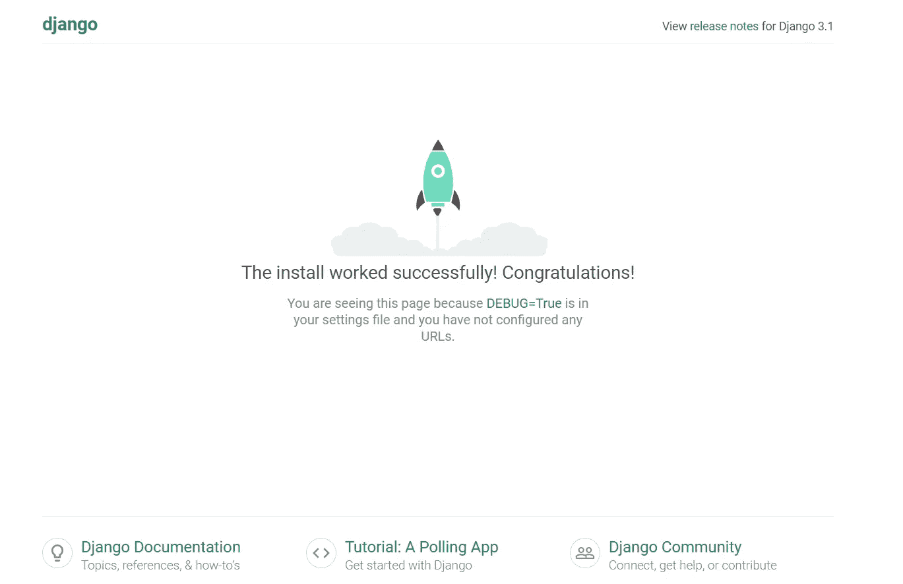
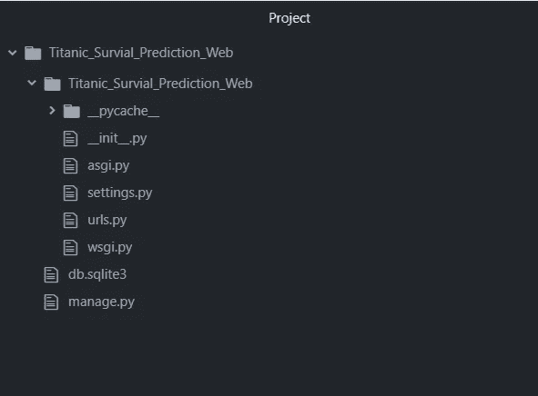
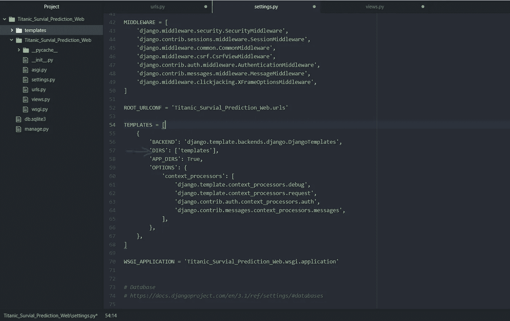

# 使用 Django 创建基于机器学习的 Web 应用程序

> 原文：<https://towardsdatascience.com/creating-a-machine-learning-based-web-application-using-django-5444e0053a09?source=collection_archive---------2----------------------->

## 使用 Python 著名的 Django 框架在 web 上部署您的机器学习模型，并增加其可见性。

本文面向那些希望使用 Python 的 Django 框架将其机器学习模型部署为 Web 应用程序的读者。对于许多数据科学和机器学习爱好者来说，这可能是转换他们的简单。py 模型文件转换成更加动态和强大的 web 应用程序，该应用程序可以接受用户的输入并生成预测。

为了文章的简单起见，我们将更多地关注如何创建一个基于 ML 的 web 应用程序，而不是花费大部分时间来解决一个棘手的机器学习问题。此外，这不是一个完整的 django 教程，而是成为 AI/ML 开发者的一步。

首先，我们将使用著名的 titanic 数据集创建一个简单的 ML 模型，然后将它转换成一个全功能的、基于 web 的动态应用程序。

# 开发机器学习模型

如上所述，我们将研究著名的泰坦尼克号数据集，该数据集用于根据乘客的不同属性(乘客级别、性别、年龄、票价等)预测乘客的存活率。).由于这是一个二元分类问题，我们将使用逻辑回归算法(一个强大而简单的机器学习算法)来创建我们的模型。

可以参考下面的代码来创建分类模型。

> 注意:创建机器学习模型本身是一个完整的详细任务，包含多个步骤(如数据预处理、EDA、特征工程、模型开发、模型验证、调整超参数)。这里我们跳过所有这些步骤，因为我们更感兴趣的是使用这个模型来驱动我们基于 web 的应用程序。

泰坦尼克号生存预测模型

一旦我们创建了我们的最终模型，我们简单地将这个模型存储为一个 ***model.sav*** 文件(使用 pickle)。此外，请注意，我们将 scaler 对象存储为一个 ***scaler.sav*** 文件(因为在将用户输入提供给模型之前，我们将使用相同的缩放对象将用户输入转换为与训练数据相同的级别)。

# **创建我们自己的 Django 项目**

在创建 django 项目之前，首先我们需要使用下面的命令将 django 安装到我们的开发机器上。

> **pip 安装 django**

这将自动安装 django 框架正常运行所需的所有依赖项。如果此命令对您不起作用，请参考下面的链接-

 [## 如何安装 Django | Django 文档| Django

### 这份文件会让你和 Django 一起工作。如果你只是想尝试一下 Django，请直接跳到…

docs.djangoproject.com](https://docs.djangoproject.com/en/3.1/topics/install/) 

一旦你安装了 django，你需要在你的机器上打开命令提示符(Ubuntu 或 Mac 上的终端),然后按照以下步骤操作

1.  **cd 桌面**(你可以移动到任何你想创建项目文件夹的位置)
2.  **mkdir Titanic _ Survial _ Prediction**(你可以为你的网络应用选择任何你想要的名字)
3.  **cd Titanic _ Survial _ Prediction**(将 CD 放入您在上一步刚刚创建的文件夹中)
4.  **django-admin start project Titanic _ Survial _ Prediction _ Web**(该命令将在主项目文件夹中自动创建一个名为*Titanic _ Survial _ Prediction _ Web*的 django 项目)
5.  **CD Titanic _ Survial _ Prediction _ Web**(CD 到上一步创建的 django 项目中)
6.  现在，如果您正确遵循了上述步骤，只需在命令提示符屏幕中键入**python manage . py runserver**，然后将命令提示符上出现的链接( [http://127.0.0.1:8000/](http://127.0.0.1:8000/) )复制到 web 浏览器中。一旦你按下回车键，你就会看到下面的屏幕

Django 默认主页视图

如果上面的网页也出现了，那么您已经成功地完成了创建您自己的 django web 应用程序的第一步。

如果对某些人来说这个网页没有出现，请再次参考上述步骤，看看你是否错过了什么。

现在使用任何 IDE (PyCharm，Atom 等。)打开你的 django 项目(**Titanic _ Survial _ Prediction _ Web**

默认 Django 项目结构

现在，在 urls.py 所在的同一个文件夹中，创建一个名为***‘views . py’的新 python 文件。*** 这个视图文件将负责从使用网页的任何用户那里获得输入，使用相同的输入来生成预测，然后使用网页向用户显示这个预测。

> 此外，我们需要将我们的“model.sav”和“scaler.sav”文件移到与 urls.py 相同的文件夹中。

在继续之前，让我们先完成 django 项目的配置。在我们的主项目文件夹中，创建一个名为***【templates】***的空文件夹(您可以使用任何名称，但建议遵循已定义的框架命名约定)。这个文件夹将保存我们将在项目中使用的所有 html 文件。

现在打开 setting.py 文件，把“模板”(或者你给你的 html 文件夹起的名字)添加到“模板”列表中高亮显示的“DIRS”列表中。

最终项目结构

现在在 urls.py 文件中添加下面的代码来配置我们网站的 URL(不同的网页有不同的 URL)。

urls.py 配置

我们首先在 urls.py 文件中导入了视图文件，然后在 urlpatterns 列表中添加了主页(打开 web 应用程序时的默认页面，而不是 django 默认视图)和结果页面(用于向用户显示结果)的路径，以及它们各自的名称(使用这些名称可以在我们的 html 文件中引用它们)。

现在我们需要在 views.py 文件中定义这两个函数。除了这两个，我们还将创建一个 getPredictions 函数，它能够通过加载我们预先训练好的模型来生成预测。

可以参考下面的代码来完成这项任务。

views.py 文件

result 方法负责收集用户输入的所有信息，然后以键值对的形式返回结果。

> 注意:总是建议在单独的 python 文件中创建 getPredictions 方法，然后将其导入到 views.py 文件中。这里为了保持简单明了，我们将函数放在 views.py 文件中。

现在我们已经完成了后端逻辑，让我们创建网页，通过表单接受用户的输入并显示结果。

在“***”***模板文件夹内，创建一个 index.html 文件。这个 index.html 将是我们的主页，并将有我们的形式，我们将使用从我们的用户输入。

index.html

在继续之前，我们需要了解一些事情。

1.  表单操作参数→收集表单数据的视图，使用此数据生成预测，然后重定向到包含结果的网页。对于 django，我们有一种特殊的方法-***action = " { % URLs ' name _ of _ URL ' % } "***。在我们的例子中，url 的名称是 result(因为我们已经在 urls.py 文件中提供了这个名称)。
2.  此外，我们还需要提供一个 ****** (即跨站点引用伪造令牌)，这使得 django 中的数据处理更加安全。这部分是必须的，因此它应该总是在你的表单标签的第一行。

> 注: **** 都叫做脚本标签。

一旦我们创建了 index.html 文件，我们就需要创建向用户显示预测的 result.html。

result.html

在“ **{{ }}** ”标记中，我们指定了包含结果的键的名称(在我们的例子中是 result)。

完成所有这些步骤后，在命令提示符下按 CTRL + C 停止服务器，然后使用“python manage.py runserver”命令重新启动它。现在在浏览器中重新打开链接。这一次，默认页面将是我们的输入表单的 index.html 网页。

填写相应的数据并提交表单后，您将被重定向到 result.html 页面，该页面将显示您输入数据的预测。

这就是我们如何创建一个简单而强大的基于 ML 的 django web 应用程序，它本质上是动态的(接受用户的输入),并基于机器学习模型进行预测。

如果您想了解更多关于 django 的知识，请参考 django 文档(下面的链接)。

 [## 姜戈

### Django 是一个高级 Python Web 框架，它鼓励快速开发和干净、实用的设计。建造者…

www.djangoproject.com](https://www.djangoproject.com/)