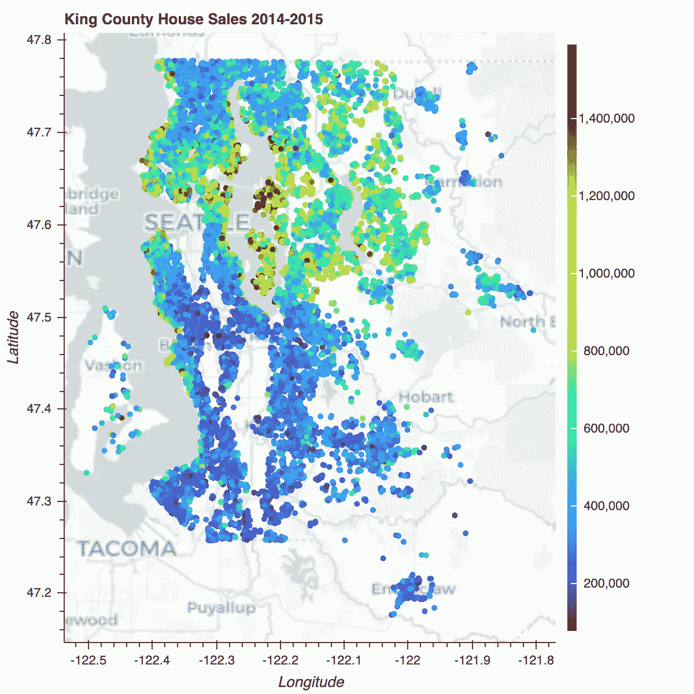
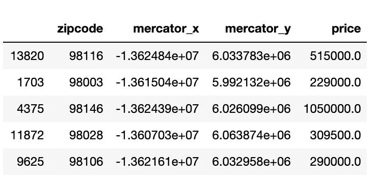
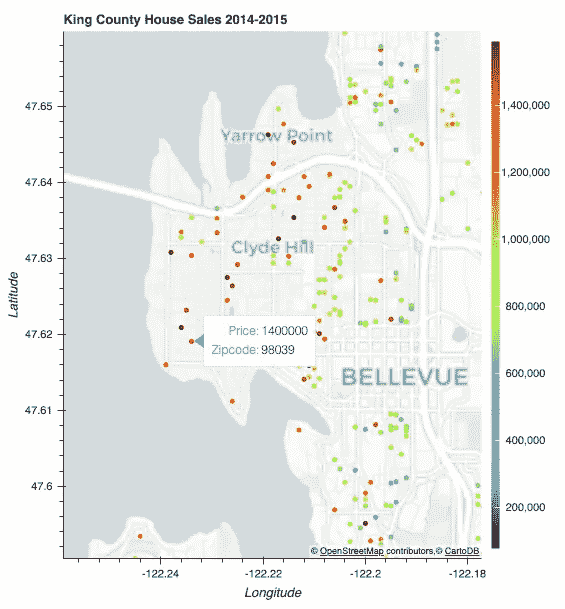

# 创建房屋销售地图

> 原文：<https://towardsdatascience.com/creating-a-map-of-house-sales-42ba1f2c4e7e?source=collection_archive---------45----------------------->

在本教程中，我将指导你一步一步地创建一个使用散景显示房屋销售的地图，并用彩色地图显示销售价格。我想让观众一眼就能分辨出哪个街区的生活成本最高。这也是价格预测建模目的的一个有用的可视化，以了解位置有多重要，以及与位置相关的新功能是否对工程师有用。

我们将使用国王郡地区销售价格的数据集，该数据集可以在 [Kaggle](https://www.kaggle.com/harlfoxem/housesalesprediction) 上找到，但是这些原则也可以应用于您选择的数据集。

这是最终结果:



首先，让我们确保我们的数据集符合目的。请注意，散景需要墨卡托坐标来绘制地图上的数据点。我们的数据集有纬度和经度坐标，所以需要一个函数来转换这些坐标。假设所有数据清理步骤(例如，缺失值)都已完成，数据应该是这样的。

```
df.head() 
```



包含邮政编码、墨卡托 x、墨卡托 y 和价格列的熊猫数据框架

是时候策划了！

我将分解代码并解释每个元素的作用。

让我们从从 Bokeh 进口必要的工具开始。

```
from bokeh.io import output_notebook, show
from bokeh.plotting import figure, ColumnDataSource
from bokeh.tile_providers import get_provider, CARTODBPOSITRON
from bokeh.palettes import Turbo256
from bokeh.transform import linear_cmap
from bokeh.layouts import row, column
from bokeh.models import ColorBar, NumeralTickFormatter
```

散景的突出特点之一是内置的地图拼贴集合。虽然你可以使用谷歌地图，但这需要获得一个 API 密钥。我们将使用 Carto DB。让我们用`get_provider()`功能选择这个图块。

```
chosentile = get_provider(CARTODBPOSITRON)
```

接下来，我们将选择一个调色板的颜色映射。我们希望确保我们的可视化能够有效地辨别出最昂贵的房子在哪里。Bokeh 拥有丰富的预定义调色板选项，根据您希望的粒度，您可以从调色板中选择使用多少种颜色。还有一些具有更大频谱的扩展调色板，这就是我们在这里要做的。

```
palette = Turbo256
```

我们还将定义要使用的数据源，即数据的来源。最常见的类型是`ColumnDataSource`，它接受一个数据参数。一旦创建了`ColumnDataSource`,就可以将它传递给绘图方法的`source`参数，让我们传递一个列的名称作为数据值的替代。

```
source = ColumnDataSource(data=df)
```

接下来，让我们定义我们的颜色映射器。这是一个线性彩色地图，应用于价格领域。我们将低和高参数分别设置为最低和最高价格。

```
color_mapper = linear_cmap(field_name = ‘price’, palette = palette, low = df[‘price’].min(),high = df[‘price’].max())
```

一个简洁的功能是当用户将鼠标悬停在数据点上时包含附加信息。这是使用工具提示定义的。我们选择显示房子的价格和邮政编码。@符号表示该值来自源。

```
tooltips = [(“Price”,”@price”), (“Zipcode”,”@zipcode”)]
```

现在我们准备创建实际的图形。姑且称之为`p`。我们将给它一个标题，并将 x 和 y 轴类型设置为墨卡托，以便在渲染时显示我们更习惯的纬度和经度刻度。为了完整起见，我们还将定义我们的轴标签。

```
p = figure(title = ‘King County House Sales 2014–2015’,
x_axis_type=”mercator”, y_axis_type=”mercator”, 
x_axis_label = ‘Longitude’, y_axis_label = ‘Latitude’, tooltips = tooltips)
```

让我们使用`add_tile()`函数添加我们选择的地图标题。

```
p.add_tile(chosentile)
```

通过将 x 和 y 指定为墨卡托坐标`x_merc`和`y_merc`，每栋房屋将被绘制成一个圆。圆圈的颜色将由我们上面定义的线性颜色图决定。

```
p.circle(x = ‘mercator_x’, y = ‘mercator_y’, color = color_mapper, source=source)
```

让我们添加一个颜色条，它将有助于理解我们的颜色映射。默认情况下，散景在适当的地方使用科学符号，但在这种情况下，我认为对价格使用普通符号看起来更好。默认导致价格标签与颜色条重叠，所以我们需要给`label_standoff`添加一个值。不幸的是，没有直接的方法来添加一个标题到颜色栏，所以现在，我们凑合着没有。

```
color_bar = ColorBar(color_mapper=color_mapper[‘transform’],                     formatter = NumeralTickFormatter(format=”0,0"),
label_standoff = 13, width=8, location=(0,0))
```

让我们通过创建一个布局来指定颜色条应该在图的右边。

```
p.add_layout(color_bar, ‘right’)
```

最后，我们希望地图显示在笔记本和展示。

```
output_notebook()
show(p)
```

哒哒！


带有房屋销售标记的金县地图

从这个图像中，很明显最昂贵的房子位于海滨，尤其是在麦地那、克莱德希尔和默瑟岛。南北之间也有明显的差异，北方要求更高的价格。

我们还可以放大以深入了解特定的街区。



克莱德希尔街区房屋销售

现在你知道了！我希望这个简短的教程对你有用。如果你想进一步调整，我建议你深入 Bokeh 的[文档](https://docs.bokeh.org/en/latest/docs/user_guide.html#userguide)。即使你像我一样是初学者，也很容易理解。我也希望你能给我任何反馈。

要查看我的项目，包括使用线性回归的数据探索和预测建模，[这里的](https://github.com/nadinezab/kc-house-prices-prediction)是 GitHub 链接。