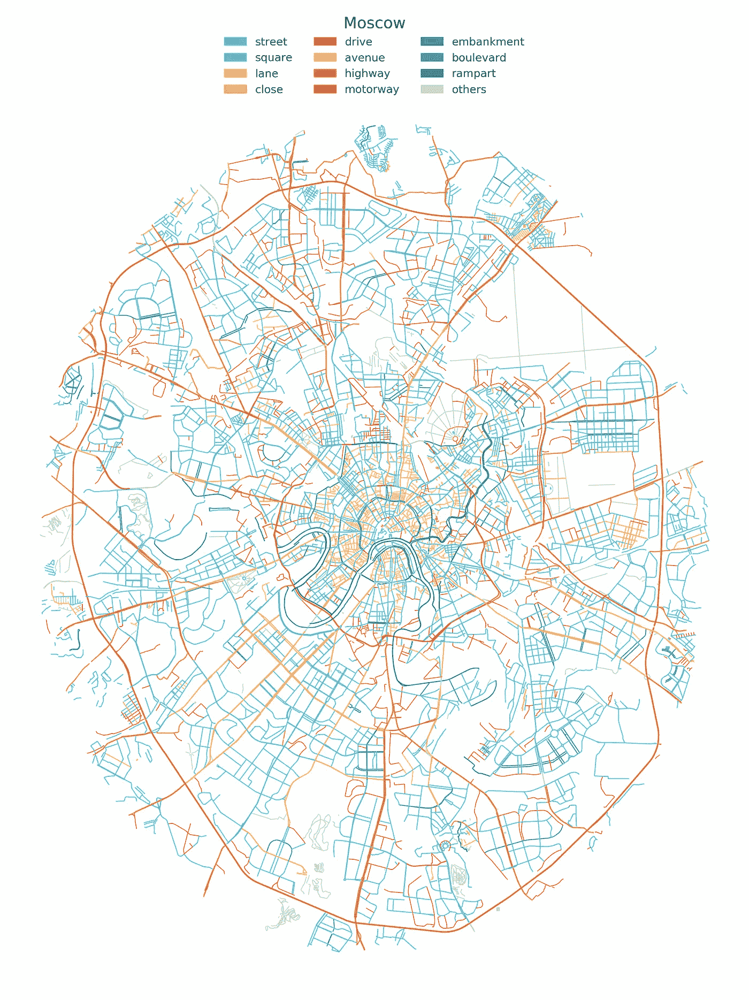
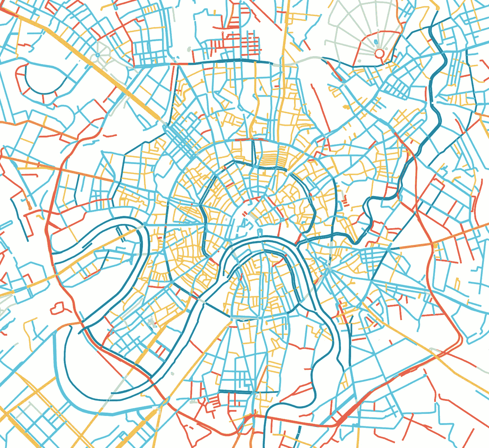

# 使用 GeoPandas 和 Matplotlib 创建街道名称地图

> 原文：<https://towardsdatascience.com/creating-a-map-of-street-designations-with-geopandas-and-matplotlib-7b40e9210737?source=collection_archive---------45----------------------->

*本帖灵感来源于***和* [*城市美丽的隐藏逻辑——全球*](https://erdavis.com/2019/09/20/the-beautiful-hidden-logic-of-cities-worldwide/) *。绘制街道名称可以揭示一些有趣的见解。就像旧金山的西半部由大道和东半部的街道组成。或者说，街道是如何只出现在伦敦历史悠久的* [*市中心，而道路却在外面。我将使用 GeoPandas 和 Matplotlib 为我自己的城市莫斯科创建一个类似的地图，看看我们能发现什么。*](https://erdaviscom.files.wordpress.com/2019/09/london.png)*

*我先说结果；技术细节如下，源 Jupyter 笔记本可以在 [Github](https://github.com/theptyza/map_street_designations) 上找到。*

## *俄罗斯街道名称侧记*

*在俄语中，街道名称可以放在名称前面( ***、улица*** 、пестеля)，或者放在名称后面(малаягрузинская***、улица*** )，如果街道有编号，甚至可以放在中间(1-я ***、улица***энтузиастов).)运用常识，列出所有前缀和后缀，得出以下街道名称列表:*

1.  *улица街*
2.  *шоссе高速公路*
3.  *驱动*
4.  *大道*
5.  *巷*
6.  *бульвар大道*
7.  *площадь广场*
8.  *набережная[naberezhnaya]——路堤*
9.  *уупик[tupik]—关闭*
10.  *вал [val] —壁垒*
11.  *магистраль高速公路*

# *地图*

**

*[更高分辨率的图像](https://github.com/theptyza/map_street_designations/raw/master/images/moscow_english.png)*

*让我们放大城市中心:*

**

*[更高分辨率的图像](https://github.com/theptyza/map_street_designations/raw/master/images/moscow_center_english.png)*

*城市社区的不同特征显而易见。市中心是密集的街道和公园网络。更远的地方*的微孔*消失了。穿过内城[花园环](https://en.wikipedia.org/wiki/Garden_Ring)的唯一大道是[院士萨哈罗夫大道](https://en.wikipedia.org/wiki/Academician_Sakharov_Avenue,_Moscow)，它于 20 世纪 80 年代完工。另一条真实的大街——在 1968 年建成后被命名为[加里宁大街](https://en.wikipedia.org/wiki/New_Arbat_Avenue)——在 1990 年更名为新阿尔巴特*街*。*

*一圈林荫大道勾勒出老城的边界。莫斯科的几条街道名字中都含有“rampart”(俄语为вал — val)一词。我把它们挑出来，只是因为我喜欢强调这些古老的防御工事是如何仍然嵌入在今天的地形中的。直到 1917 年，外围的山谷一直是城市的界限。*

*与规划城市的规则网格相比，莫斯科的街道看起来更像是一个有生命的、不断进化的有机体，有时毫无规律可言。街道变成大道，又回到街道。大道从无到有，通向死胡同。一些街道是真正的高速公路，一些历史上的高速公路已经变成了狭窄的车道，但仍然保留着它的名字。城市街道保留了俄罗斯混乱历史的痕迹，奇怪的过去的坚守者和从未实现的项目的遗迹。*

# *这是怎么做到的*

*我从[http://download.geofabrik.de/](http://download.geofabrik.de/)下载了 OpenStreetMap 数据摘录，特别是[地区](http://download.geofabrik.de/russia/central-fed-district.html)页面上的. shp.zip 文件。在这个档案中有 gis_osm_roads_free_1。*包含道路信息的文件。使用 GeoPandas，我们可以根据这些文件创建地理数据框架。使用 shapely 和 GeoPy，我们定义了一个 21 乘 17 公里的椭圆。它几乎与莫斯科环路相吻合，该环路在 1984 年之前一直是该市的行政边界。*

*地理数据文件列出了所有“道路”，包括车道和公园车道。选择有名称的街道进行绘制。还包括根据绘制的 [OSM 类型](https://wiki.openstreetmap.org/wiki/Key:highway)分类为“主干”或“主要”的 strets。一些立交桥，桥梁和交叉路口被指定为这样，所以他们被显示以填补空白。*

*地图是使用 matplotlib 绘制的，街道名称映射到颜色。为了更好地观察 T2 市区的密集网络，它们被绘制得比其他的更薄。*

*源代码可以在 [Github](https://github.com/theptyza/map_street_designations) 上找到。*