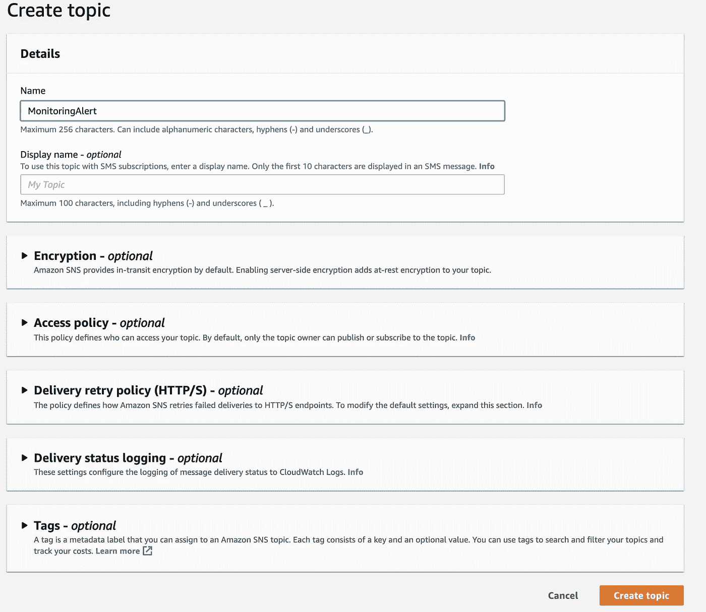
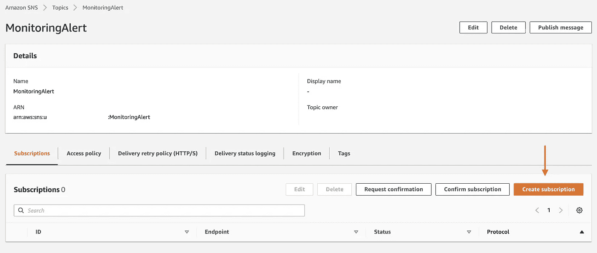
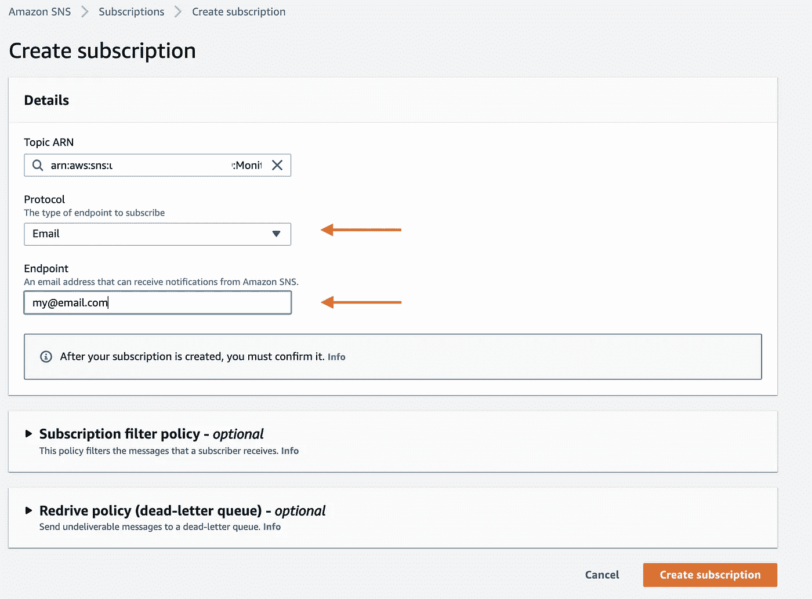
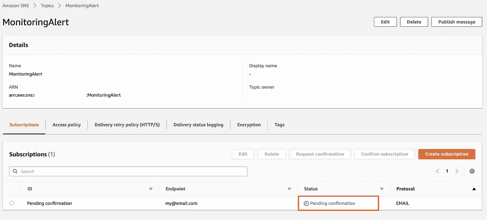
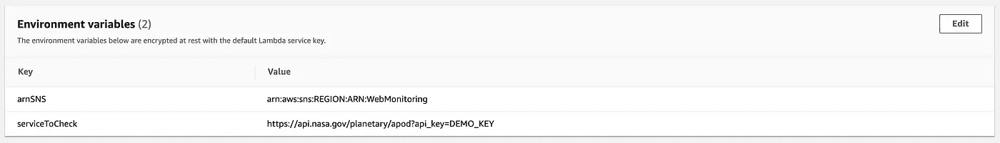
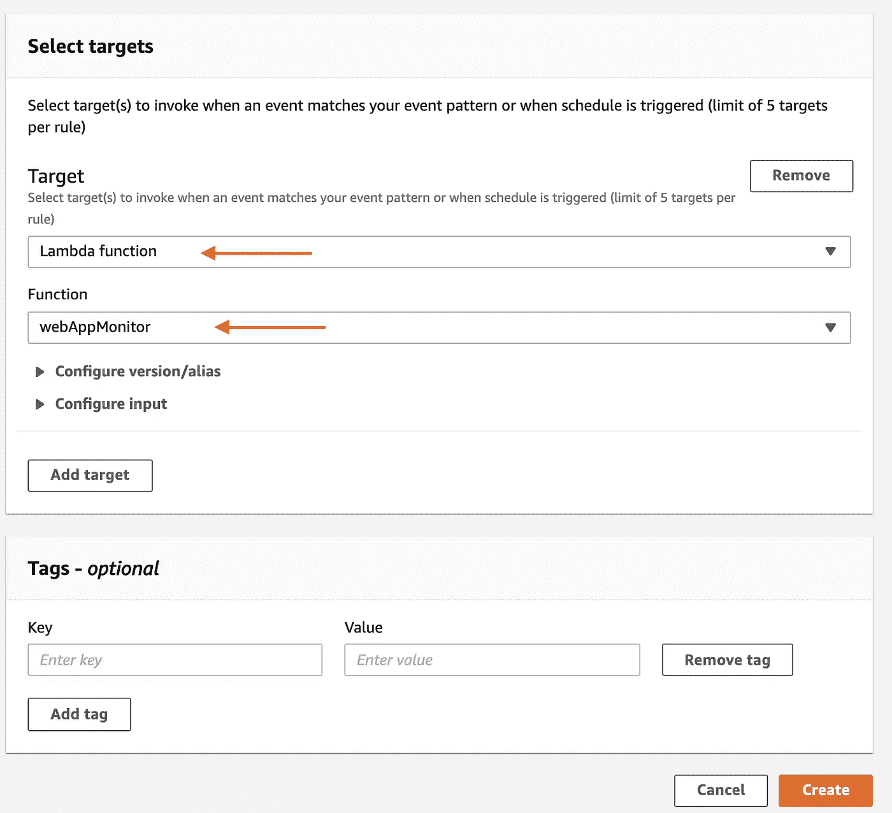
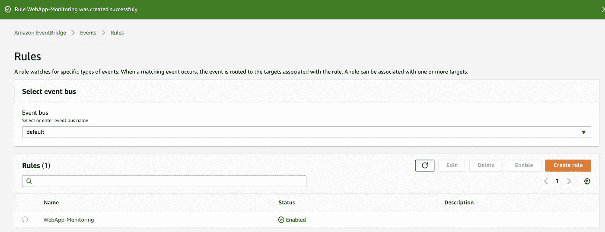

# 使用 EventBridge、AWS Lambda、SNS 和 Node.js 创建监控服务—无服务器优先

> 原文：<https://towardsdatascience.com/creating-a-monitoring-service-with-eventbridge-aws-lambda-sns-and-node-js-serverless-first-3c2eb8b0dad4?source=collection_archive---------38----------------------->

克里斯·利维拉尼在 [Unsplash](https://unsplash.com?utm_source=medium&utm_medium=referral) 上的照片

## 比方说，我们只想检查服务是否正在运行，如果它停止了，您希望得到通知，就这么简单。

此外，这个想法是为了展示我们在 AWS 中使用无服务器概念并尝试总是考虑“无服务器优先”的方法，只使用 3 个服务:Amazon EventBridge、Aws Lambda 和 Amazon Simple Notification Service，可以多么容易地做到这一点。

# 先决条件

*   AWS 帐户
*   Node.js 的基础知识

## 亚马逊简单通知服务——SNS

[SNS](https://aws.amazon.com/sns/) 定义:

> 面向微服务、分布式系统和无服务器应用的完全托管发布/订阅消息

在我们的例子中，我们将使用这个服务来发送电子邮件。

在 SNS 服务中，让我们创建一个主题，我将使用的名称是 *MonitoringAlert*

社交网络话题

创建主题后，现在让我们创建订阅:

SNS 主题已创建

对于订阅，我们需要设置:

协议:电子邮件

端点:您的电子邮件地址

社交网络订阅

下标已创建，状态为“*待确认*”:

SNS 主题等待确认

一旦您确认状态消息将发生变化，您将通过电子邮件收到一个确认链接:

社交网络话题已确认

完成，SNS 话题已经创建并确认。现在是时候创建 Lambda 函数了。

## 自动气象站λ

[λ](https://aws.amazon.com/lambda/)定义:

> 运行代码时不考虑服务器。只为您消耗的计算时间付费。

## λ许可

允许我们成为:

## λ代码

lambda 将负责检查服务是否正在运行，如果出现问题，将触发 SNS:

## λ环境变量

我们的 lambda 函数依赖于两个环境变量:

*   社交网站:社交网站创造的 ARN
*   serviceToCheck:我们想要检查的 URL，我的情况是我使用的是 NASA 的 API (https://api.nasa.gov/planetary/apod？api_key=DEMO_KEY)

AWS Lambda 环境变量

现在我们已经创建了 SNS 主题和 Lambda 函数，是时候使用最新的服务 Amazon EventBrigde 了。

## 亚马逊事件桥

[事件桥](https://aws.amazon.com/eventbridge/)定义:

> 连接您自己的应用程序、SaaS 和 AWS 服务的应用程序数据的无服务器事件总线

在我们的例子中，我们将使用 EventBrigde 作为调度程序，它将以我们定义的频率运行并触发 Lambda 函数。

## 规则模式

关于规则的重要思考是模式。这种模式决定了频率，在我们的例子中，我们将把*计划*设置为每 1 分钟一次的固定频率(您可以根据自己的需求进行替换):

Amazon EventBridge 创建

其次，在目标中，我们将选择 *Lambda 函数*，并在基础中添加我们的 *webAppMonitor:*

Amazon EventBridge 目标

最后，创建了 EventBrigde 规则:

事件桥规则

现在，每次服务离线时，我们都会收到这样的消息:

SNS 通知电子邮件

也就这些了，希望能对你有用:)

你怎么想？有没有其他方法可以解决同样的问题？非常感谢您的反馈。

非常感谢您的宝贵时间！

原帖[https://devan dops . cloud/creating-a-monitoring-service-with-event bridge-AWS-lambda-SNS-and-nodejs-server less-first/](https://devandops.cloud/creating-a-monitoring-service-with-eventbridge-aws-lambda-sns-and-nodejs-serverless-first/)