# 从头开始创建神经网络

> 原文：<https://towardsdatascience.com/creating-a-neural-network-from-scratch-302e8fb61703?source=collection_archive---------17----------------------->

## 通过自己构建算法来理解算法背后的关键概念


[图片由作者提供]

# 在我们开始之前—一点历史…

神经网络已经存在很多年了。事实上，该算法背后的思想是由一位名叫弗兰克·罗森布拉特的心理学家在 60 多年前首次提出的。

然而，直到最近十年开始，这些机器学习模型才开始受到更多的关注，随着 [**这篇**](http://www.cs.toronto.edu/~fritz/absps/ncfast.pdf) 论文的发表，证明了神经网络在机器学习中的用途和有效性。

今天，神经网络是深度学习的核心。人工智能中最复杂的任务通常由人工神经网络来完成，并且有许多库可以用非常少的几行代码来抽象神经网络的创建。

# 目标

在本文中，我们将介绍神经网络背后的基本概念，并理解它们的内部工作原理。我们将通过从头开始创建一个灵活的神经网络来做到这一点。

本文的完整源代码可以在这个链接中找到！👇👇👇

[](https://github.com/jzsiggy/NN-from-scratch) [## jzsiggy/NN-从零开始

### 在 GitHub 上创建一个帐户，为 jzsiggy/NN 从零开始的开发做出贡献。

github.com](https://github.com/jzsiggy/NN-from-scratch) 

我们将看到的代码是用 javascript 编写的，但是，每个概念和步骤都将被深入地记录和解释，所以你可以使用任何你喜欢的语言！

# 在我们继续之前，你必须知道…

神经网络是属于深度学习的一种算法。就此而言，深度学习是机器学习的一个子类，它本身也是人工智能的一个子类。

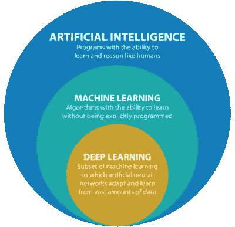

来源—【https://www.qubole.com/ 

机器学习背后的核心思想是，可以训练算法对数据进行分类和处理，而无需明确告知分类的*规则*。

这意味着，我们可以*在大量的*输入/输出*对(即*训练集*)上训练*模型，并在一段时间后，让模型为从未见过的给定输入提出自己的分类规则，而不是让模型基于硬编码指令做出决策。

这个想法在所有机器学习算法上都是有效的。

好了——既然机器学习的基础知识已经讲完了，让我们继续学习神经网络吧！

# 第 1 部分—层？？

让我们来谈谈神经网络的基本结构。数据处理是通过分层进行的。任何网络都有一个输入层，一个隐藏层的子集(我们马上会谈到)，和一个输出层。

网络的每一层由若干个*神经元*组成，每一层的神经元通过*权值*与下一层的神经元相连。

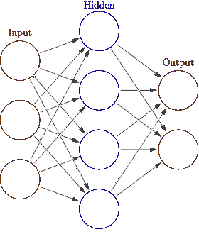

具有 1 个输入层、1 个隐藏层和 1 个输出层的简单网络— [来源:维基百科]

输入层是数据将进入算法的地方。比方说，我们想创建一个网络来预测某个病人患有某种疾病的概率，而不是他所表现出的症状。

在这种情况下，我们的训练数据将被构造成一个*输入/输出*对。输入将是 0 和 1 的数组，代表我们正在分析的症状，输出将是 0 或 1，代表出现“输入”症状的患者的感染状态。

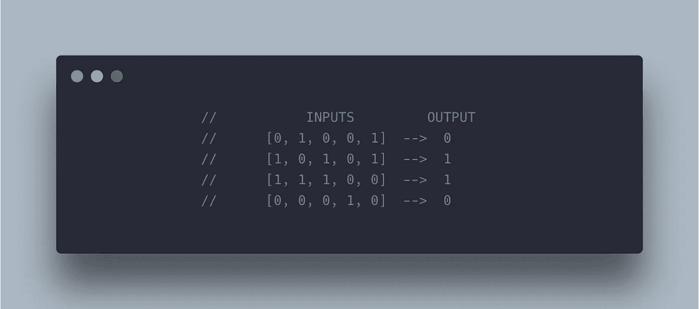

示例 ML 算法的训练数据

如果我们要根据这些数据训练一个神经网络，我们必须有一个包含五个神经元的输入层，每个神经元对应一种症状。我们可以有任意数量的隐藏层，每层中有任意数量的神经元，但我们必须有一个只有一个神经元的输出层。

当算法认为输入代表生病的患者时，输出层中的神经元将具有接近 1 的*激活*，当算法认为输入代表未感染的患者时，输出层中的神经元将具有接近 0 的*激活。*

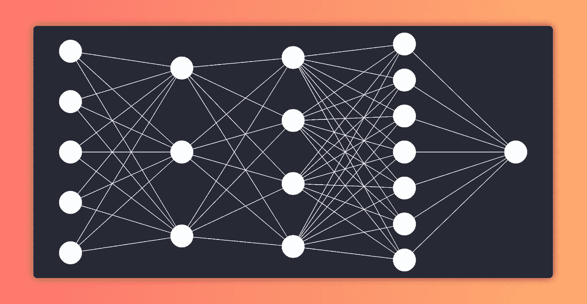

我们示例神经网络的层结构

你可以把神经元的激活想象成它储存的值。第一层中神经元的激活将与我们输入数据的值相同。这些值将通过数学运算转化为下一层的神经元，我们稍后将对此进行检验。

我们输出层中神经元的激活将导致我们网络的预测。(它可能只是一个神经元，就像上面的例子一样)

# 第 2 部分—激活、权重和偏差

> (还有乙状结肠函数！)

好吧，您可能想知道进入输入层的数据是如何穿过网络并最终到达输出层的，这与它是如何进来的完全不同。这个过程称为前馈，完整的解释涉及一些线性代数和矩阵乘法，我们很快就会看到。现在，我们将坚持这个过程背后的想法。

正如我们之前看到的，每个神经元都通过我们称之为*的权重*连接到前一层的神经元。这意味着，比方说，第二层中神经元的*激活*将与该层中神经元在乘以连接它们的权重之前的所有激活的总和相关。

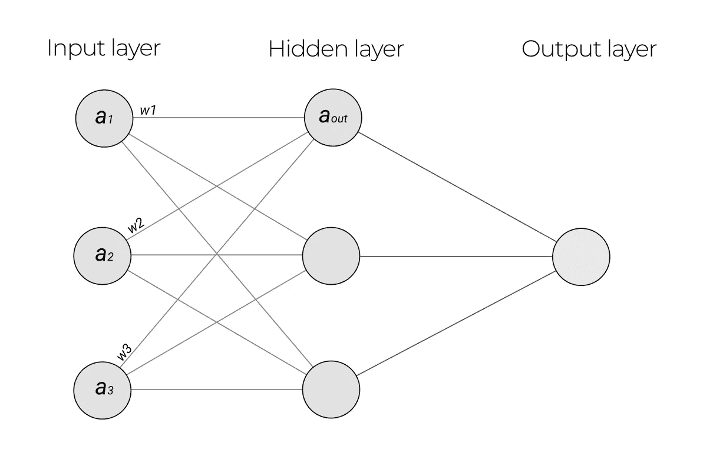

网络表示

如果我们用字母 *a* 表示一个神经元的激活，连接两个神经元的权重为 *w* ，则第二层中单个神经元的激活可以表示为下图所示。

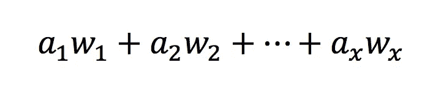

神经元的“激活”

对于这件事，上面的等式实际上是*方式*过于简化了。实际上，这只是计算任何给定神经元激活的第一步。下图将向我们介绍找到最终激活必须执行的剩余操作。

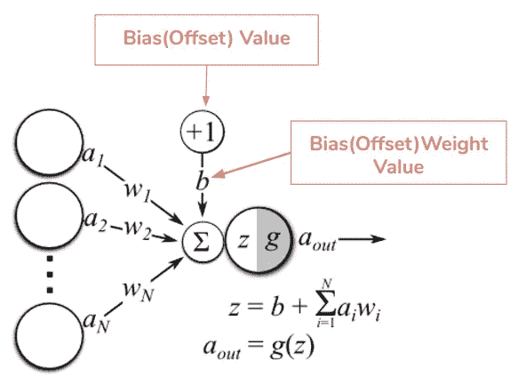

来源——hackernoon.com

我们还没有考虑的两个新因素是:偏差，由字母 *b 表示；*和激活函数，用函数 *g(z)* 表示。

让我们从解决偏见开始。

这里的想法是，每个神经元将有一个唯一的数字，该数字将被添加到先前神经元激活的加权和中。

添加偏差是有用的，这样神经网络可以更好地推广到任何给定的数据。你可以认为它是一个线性函数中的常数 *y=mx+c.*

给每个神经元添加一个偏差对于网络正确处理简单数据来说并不是基本的，然而，当我们处理非常复杂的任务时，它变得不可或缺。

现在我们得到了偏差，我们的激活方程看起来像这样:

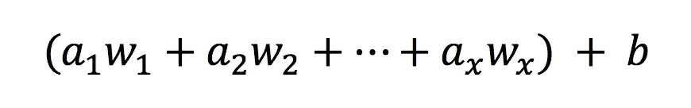

加权总和+偏差

为了理解数据如何在网络中传输，我们必须了解的最后一件事是激活函数。

让我们用字母 *z* 表示给定神经元的加权和加上它的偏差。所述神经元的激活将是应用于 *z* 因子的激活函数的结果。

激活函数用于平滑神经元激活的小变化，并将其保持在 0 和 1 之间。一个非常常见的激活函数，也是我们将在自己的网络中使用的函数，是 sigmoid 函数。

sigmoid 作为激活函数非常有用，因为一旦通过 Sigmoid 函数，远远大于 0 的输入将很快产生非常接近 1 的数字。同样的原理，输入越小，得到的数字就越接近 0。非常接近 0 的输入数字将具有在 0 和 1 之间平滑振荡的值。


Sigmoid 函数

综上所述，我们可以通过将前一层神经元激活的加权和与偏差相加，并将该结果传递给 sigmoid 函数，来找到任何神经元的激活。

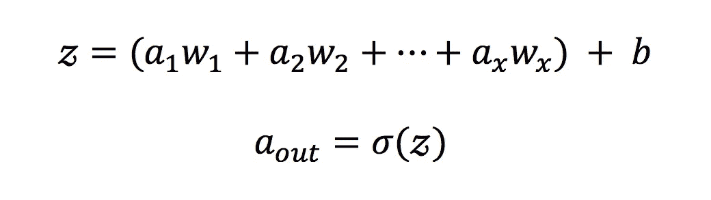

发现神经元的激活

从任何给定的输入中找到输出层中神经元的激活的过程被称为前馈。它的工作原理是从输入层的神经元和连接它们的权重中找到第二层神经元的所有激活。第二层中神经元的激活被用于寻找下一层的激活，如此类推，直到输出层。

权重和偏差都是在未经训练的网络中随机初始化的。训练网络的过程意味着找到这些权重和偏差的值，使任何给定输入的结果输出层极其接近预期输出。

让我们对所有这些进行编码，然后我们将检查如何通过调整这些权重和偏差来训练我们的网络，以获得最佳性能！

# 班级网络{…}

||→[{[{免责声明}]}] ←||

除了 math.js 之外，我们不会在本文中使用任何外部 JS 库来优化矩阵运算*。*

好了——现在让我们开始编码。

让我们从初始化我们的网络类开始。

为了使我们的网络更灵活，更好地概括数据，我们将在类的构造函数中接收层数和每层中神经元的数量。

这里的想法是用一个数组来实例化这个类。数组的每个元素代表一个新的层，每个元素的值是相应层中神经元的数量。

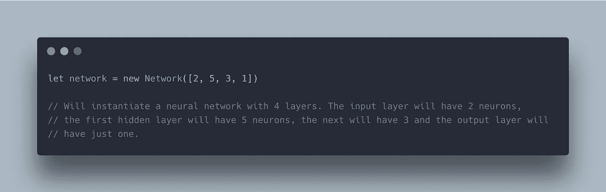

初始化我们的网络

为此，我们将把连接每一层和前一层的权重表示为一个矩阵。这个*权重矩阵*的每一列将代表将前一层的所有神经元连接到下一层的单个神经元的权重。

对于我们网络中的每一层，我们将有一个权重矩阵，权重将随机初始化，值在 0 到 1 之间波动。

为了简化代码，我们将网络神经元的偏差设置为零。

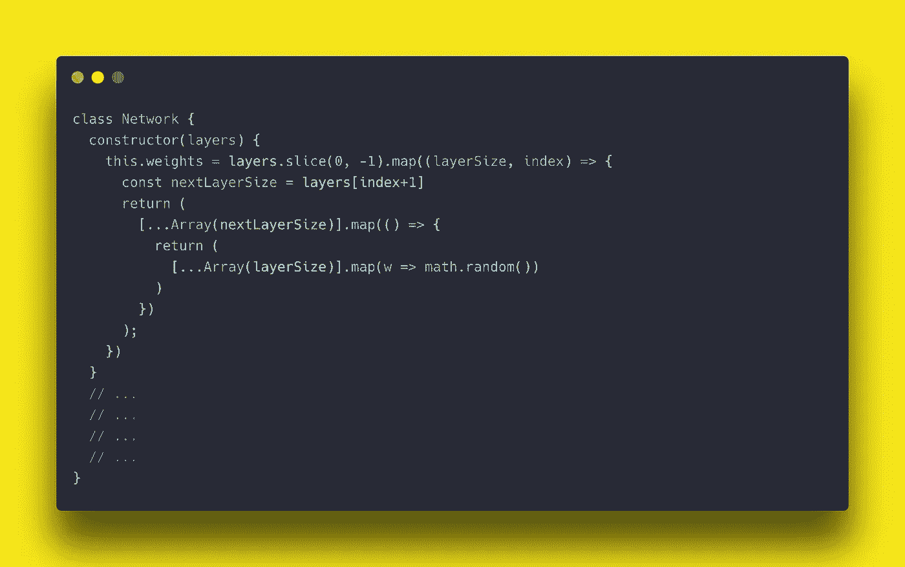

初始化网络类的权重

概括一下:我们网络的权重属性将是一个矩阵列表。每一个矩阵都代表连接一层和下一层的所有权重。

现在我们已经设置了所有的权重，让我们编写前馈方法的代码。

该方法将接收一个以输入为参数的数组。这些输入将被映射到我们网络的输入层。

为了找到下一层的最终激活，我们可以使用输入激活和连接输入层与下一层的权重矩阵之间的点积的结果。

这种代数运算类似于将输入层的每次激活乘以其与第二层中的神经元的连接权重，并对每个神经元的这些乘积求和。然后，我们可以将 sigmoid 函数应用于第二层中的每个结果加权和，以找到所有结果激活。

这些产生的激活将是*点再次乘以*我们的权重数组中的下一个*权重矩阵*，并且点积将经历 sigmoid 函数，从而产生下一层中神经元的激活。这种情况一直发生，直到产生的激活是我们输出层中的激活，因此产生了我们的预测。

为了在代码中实现这一点，我们可以对权重矩阵数组进行循环。循环将从输入与第一个权重矩阵点乘开始，并将 sigmoid 函数应用于结果。由此产生的激活将被映射到一个*激活*变量，该变量将与第二层权重相乘，依此类推。

在每次迭代中，我们将更新*激活*变量，以便*激活*和权重矩阵之间的点积导致下一层的激活(当然，在经历了 sigmoid 之后)。

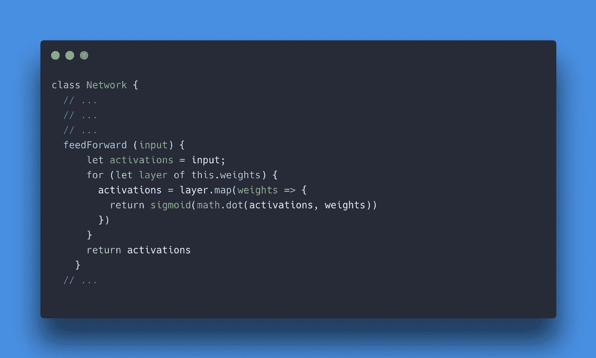

我们网络的前馈方法

为了让上面的代码工作，我们必须首先编写 sigmoid 函数。代码非常简单:

到目前为止，我们网络的完整代码是这样的:

# 第 3 部分:培训—🏃‍♂️ 🏃‍♀ 🏃‍♂️ 🏃‍♀ 🏃‍♂️ 🏃‍♀

现在，我们的网络已经可以做出预测了！！！！

…嗯，不完全是。

我们已经可以通过前馈方法输入一些输入数据并获得一个输出预测，但是我们的权重和偏差具有随机值，所以我们的预测根本不会精确。我们的网络会盲目猜测结果。

我们如何调整这些权重和偏见，让我们的网络停止猜测，开始做出“明智”的决定？

完整的答案涉及偏导数和一些多变量微积分，但现在，让我们坚持计算背后的想法。

让我们的预测更好的第一步是找出它们有多糟糕。

完成这一任务的函数类型被称为*成本*函数。有许多可用的成本函数，但我们将在网络中使用的是*均方误差*函数，或 MSE。

MSE 成本函数背后的思想是将输出层中每个神经元的激活与该输出的期望值进行比较。我们将从预测的激活中减去预期的输出值，并对每个神经元的结果求平方。对所有这些平方误差求和将给出我们的*成本函数的最终值。*

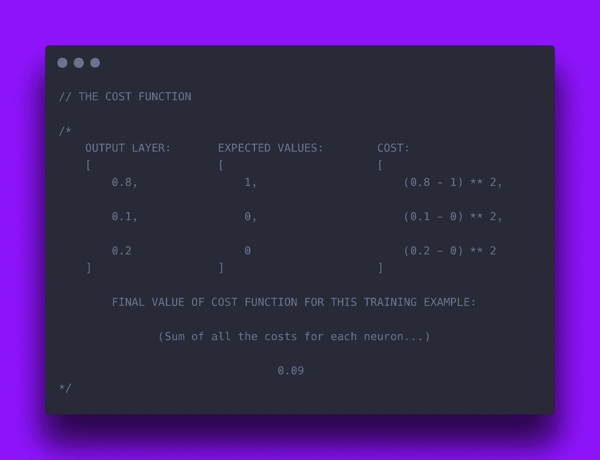

MSE 成本函数示例

这里的想法是调整每层的权重和偏差，以最小化成本函数。MSE 的值越小，我们的预测就越接近实际结果。

这就是偏导数出现的地方。让我们这样来看:每个权重和偏差都是以某种方式作用于成本函数的变量。我们网络中任何层的任何权重的任何变化都会或大或小地影响我们的*成本*。

如果我们可以找到每个权重的偏导数，即单个权重的微小变化对成本函数的结果有多大影响，我们就可以找出如何改变该权重，以最小化我们手头训练示例的成本函数。

例如:当我们计算单个重量的偏导数时，如果我们看到该重量的微小增加将增加成本函数，我们知道我们必须减少该重量以最小化成本。另一方面，如果重量的微小增加降低了成本函数，我们将知道增加这个重量以减少我们的成本。

除了告诉我们应该增加或减少每个重量之外，偏导数还会指出重量应该改变多少。如果通过对权重的值施加微小的推动，我们看到我们的成本函数有显著的变化，我们知道这是一个重要的权重，它的值严重影响我们网络的成本。因此，我们必须对其进行重大更改，以最小化我们的 MSE。倒数也是有效的。

对于我们训练集中的每个训练示例，我们将找到手头示例的成本，并相应地调整所有权重。当我们重复这个过程数千次(如果不是数百万次的话)时——每个训练示例一次——我们将最终得到一个优化的网络，它可以对任何给定的输入做出出色的预测。

为每个神经元寻找最佳偏差的过程非常相似，但由于我们的简单网络将所有偏差设置为零，因此我们不会深入研究偏差计算。

让我们开始编码吧！

# 班级网{…} —续…

让我们首先向我们的*网络*类添加一个方法，该方法计算单个训练示例的成本。

*成本*方法将接收我们的训练集的一个*输入、输出*对。

首先，通过前馈方法从给定的输入中找到网络预测。输出层的激活将存储在*激活*数组中。我们现在将创建一个新的数组，每个元素都是输出神经元的平方误差。

我们将返回数组中所有平方误差的总和。

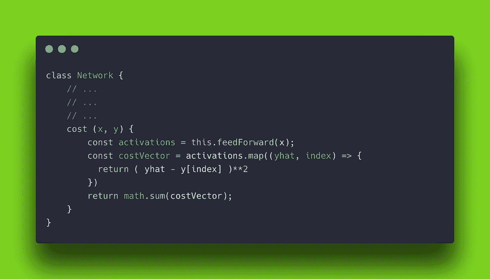

MSE 成本函数

现在我们已经到了网络中最复杂的部分。调整权重以找到最佳网络。计算这些新权重的过程被称为反向传播。

有复杂的算法可以计算出我们的网络中权重相对于成本值的所有偏导数，从而加快训练过程，但为了简单起见，我们将通过数值而不是分析来计算这些导数(目前)。

这意味着我们将选择一个很小的数，比如 0.01，并用这个值来改变给定的权重。然后，我们将重新计算这个调整后的网络的成本函数，看看我们的预测是更好还是更差。

原始成本和我们将权重改变 0.01 后的成本之间的差除以 0.01，是该权重相对于成本函数的偏导数的数值近似值。

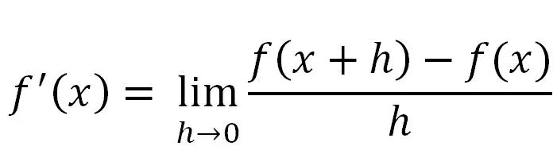

计算导数

让我们给我们的*网络*类添加一个新方法，叫做 backProp。

对于网络的每个权重，我们将计算它对成本的偏导数，并将值存储在一个数组中。该数组的结构将与具有我们网络的所有权重的数组的结构相同，但是不是具有每个权重值，而是具有每个偏导数值。

最后，在我们计算完所有的偏导数之后，我们将遍历权重数组，并从每个权重中减去其相对于成本函数的偏导数。

通过这样做，我们将放大减少成本的权重的值，并减少使成本最大化的权重的值。

backProp 方法将如下所示:

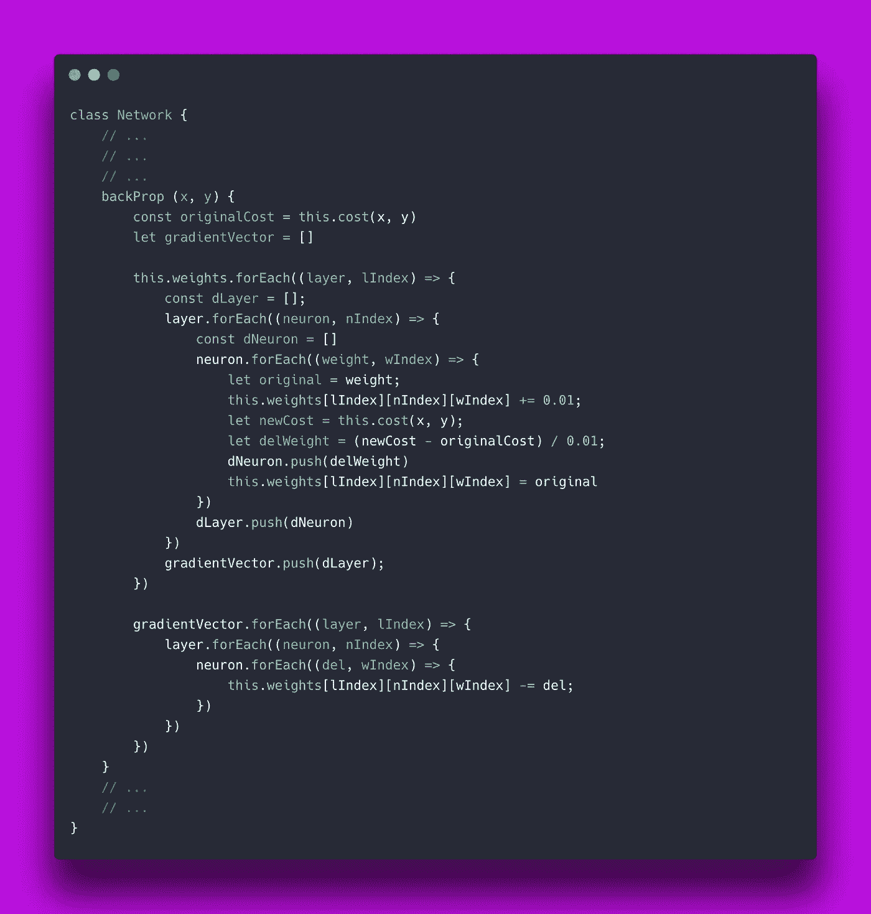

数值反向传播

唷…那是一大堆东西！但是现在我们已经建立并运行了网络的基础部分！

我们要做的最后一件事是创建一个*训练*方法来接收一组*输入/输出*对训练数据，并为每个条目运行反向传播算法。

训练之后，我们将有一个优化了权重的网络，准备好预测任何新输入的输出。

训练方法也将接收一个*时期*值。

*epochs* 值表示网络应该在相同训练数据上训练的次数。当我们没有一个非常大的训练集时，或者在这篇文章的 [**中很好地解释了其他原因时，这可能是有趣的。**](/epoch-vs-iterations-vs-batch-size-4dfb9c7ce9c9)

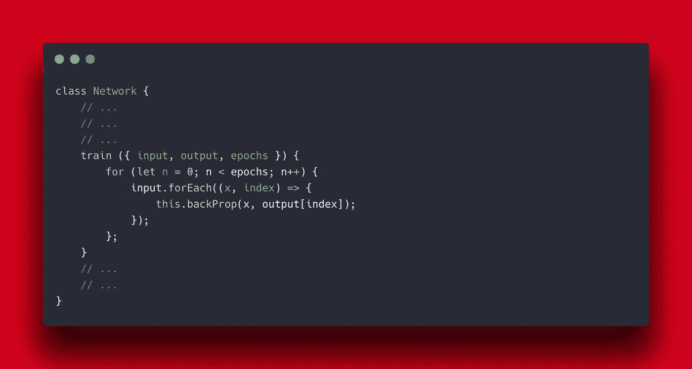

训练方法

我们网络的完整代码现在看起来像这样:

请注意，我们还添加了一个*预测*方法，它只实现前馈方法并返回结果。

现在让我们看看我们可以用我们的网络做些什么！

# 第 4 部分:示例📊 📈 📉

为了证明我们的网络功能，让我们训练一个网络来分类坐标平面上的点。

在这个例子中，让我们画一条穿过平面的对角线。这条线代表函数*y = x。*

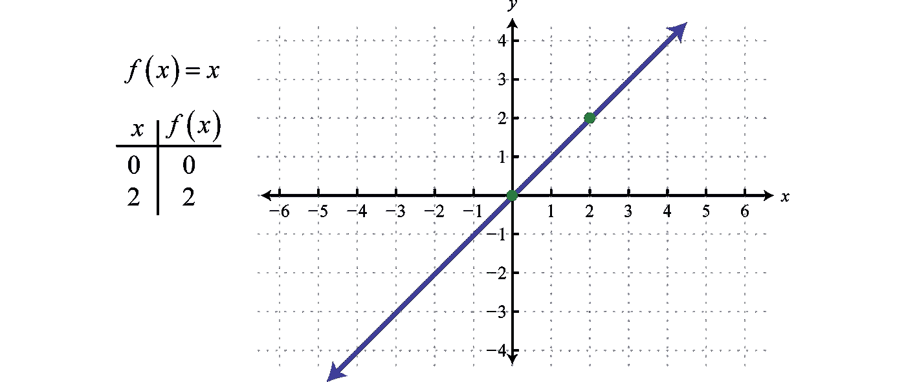

线性函数 y=x

我们将尝试训练我们的网络来将点分类为在线上或线下。

为此，我们将向网络中输入 1，000 个点的示例，并为它们加上正确的标签:如果点在线下，则为 0，如果点在线上，则为 1。

现在，我们只考虑值在 0 和 1 之间的点的 x 和 y 的值。

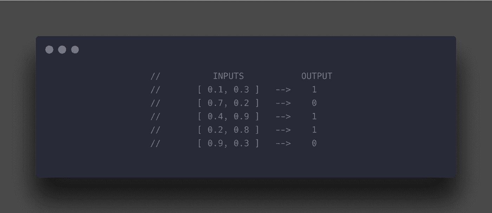

我们网络的培训示例

我已经创建了一个简单的函数来自动化创建训练数据的过程。该函数接收要生成的*输入/输出*对的数量，然后返回输入数组和相应的输出数组。

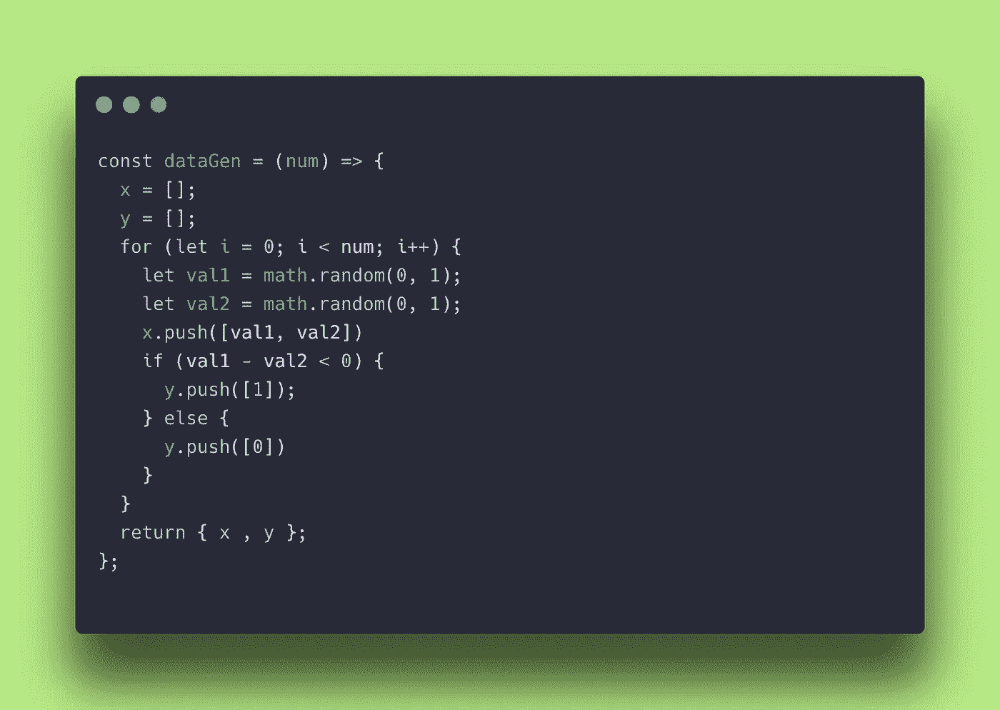

生成训练数据的函数

现在我们可以这样训练我们的网络:

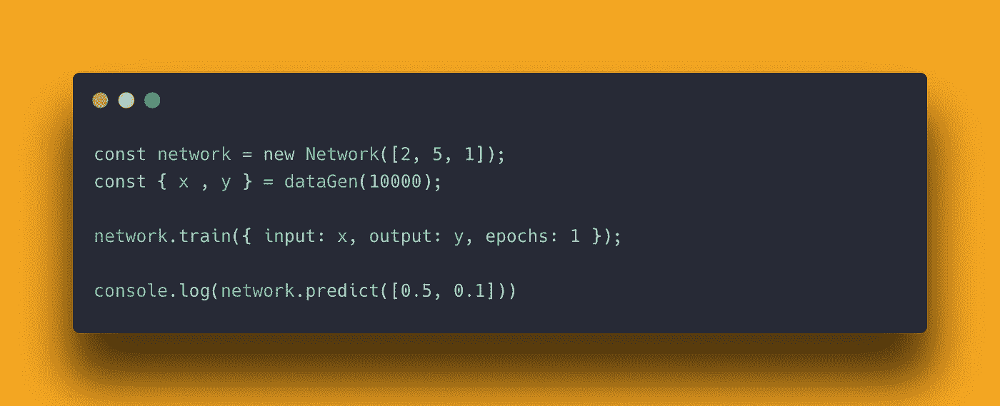

训练我们的网络来分类坐标

在上面的代码中，首先我们初始化一个新的网络，输入层有两个神经元，隐藏层有 5 个神经元，输出层有 1 个神经元。

在第二行中，我们创建了 *x* 和 *y* 训练数据。

接下来，我们用我们生成的带标签的数据训练我们的网络一个时期。

最后，为了看看我们是否能够训练一个精确的网络，我们将检查网络对一个新值的预测，在这个例子中(*0.5；0.1)* 。

我们期望网络将输出分类为 0，因为坐标平面上的这个点在我们正在评估的线之下。

上面代码的输出是

```
node index.js//returns [ 0.000019314711178699818 ]
```

现在让我们试着预测点(0.3，0.7)的输出。预期值应该接近 1。

当我们运行 predict 方法时，返回值是:

```
[ 0.9999203743668156 ]
```

这正是我们预期的结果。我们现在已经创建了一个网络，在经过 10，000 个示例的训练后，该网络可以对坐标网格上的点进行分类。

# 第 5 部分:优化

我们已经完成了一项有趣的任务:理解神经网络的具体细节并自己创建一个，但仍有很大的改进空间。

我们可以对我们的网络进行的第一个改进是解析地而不是数值地实现反向传播算法。

反向传播演算— 3b1b

上面的视频真的很有见地，我强烈推荐你观看！

通过这种算法实现反向传播可以成倍地提高我们的训练时间，并允许我们在更短的时间内训练更复杂的网络。

我们可以对网络进行的另一个调整是给每个神经元增加偏差值。在参考资料部分，你可以找到解释和实现其他神经网络偏差的文章。

最后，我们可以对我们的网络进行的另一个修改是通过*批次*来训练它。这意味着，我们可以计算 100 个训练示例的平均成本，并基于该值调整权重，而不是计算每个训练示例的成本并调整权重。这项技术可以大大加快我们的训练时间！

在我们的网络中，肯定还有许多其他的东西可以调整和修补来提高性能，但是我希望这个简单的例子可以帮助你理解算法背后的关键概念！

我希望你会发现这篇文章很有启发性，并且它可能对你有所帮助！😁😁😁

# 参考

[](http://neuralnetworksanddeeplearning.com/) [## 神经网络和深度学习

### 神经网络和深度学习是一本免费的在线书籍。这本书将教你:神经网络，一个美丽的…

neuralnetworksanddeeplearning.com](http://neuralnetworksanddeeplearning.com/) [](/how-to-build-your-own-neural-network-from-scratch-in-python-68998a08e4f6) [## 如何用 Python 从零开始构建自己的神经网络

### 理解深度学习内部运作的初学者指南

towardsdatascience.com](/how-to-build-your-own-neural-network-from-scratch-in-python-68998a08e4f6) [](https://playground.tensorflow.org/#activation=tanh&batchSize=10&dataset=circle&regDataset=reg-plane&learningRate=0.03&regularizationRate=0&noise=0&networkShape=4,2&seed=0.38334&showTestData=false&discretize=false&percTrainData=50&x=true&y=true&xTimesY=false&xSquared=false&ySquared=false&cosX=false&sinX=false&cosY=false&sinY=false&collectStats=false&problem=classification&initZero=false&hideText=false) [## 张量流-神经网络游乐场

### 这是一种构建从数据中学习的计算机程序的技术。它非常松散地基于我们如何思考…

playground.tensorflow.org](https://playground.tensorflow.org/#activation=tanh&batchSize=10&dataset=circle&regDataset=reg-plane&learningRate=0.03&regularizationRate=0&noise=0&networkShape=4,2&seed=0.38334&showTestData=false&discretize=false&percTrainData=50&x=true&y=true&xTimesY=false&xSquared=false&ySquared=false&cosX=false&sinX=false&cosY=false&sinY=false&collectStats=false&problem=classification&initZero=false&hideText=false) [](https://www.kdnuggets.com/2019/11/build-artificial-neural-network-scratch-part-1.html) [## 从头开始构建人工神经网络:第 1 部分

### 在我以前的文章人工神经网络(ANN)介绍中，我们了解了与…相关的各种概念

www.kdnuggets.com](https://www.kdnuggets.com/2019/11/build-artificial-neural-network-scratch-part-1.html) 

用[https://carbon.now.sh/](https://carbon.now.sh/)制作的代码片段