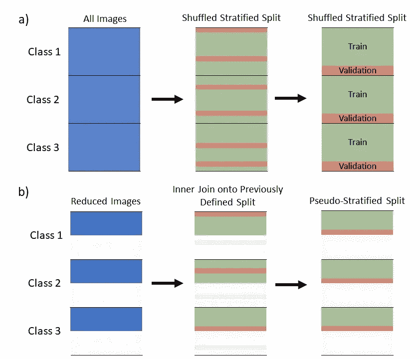
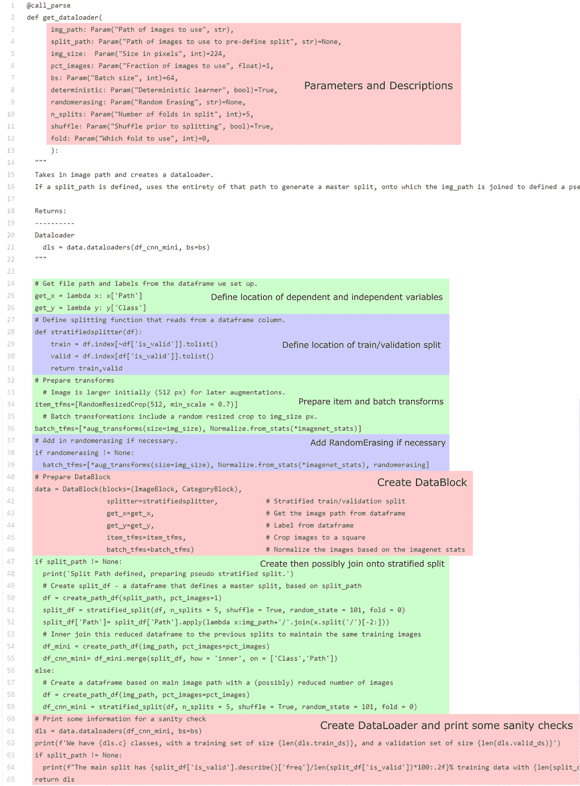
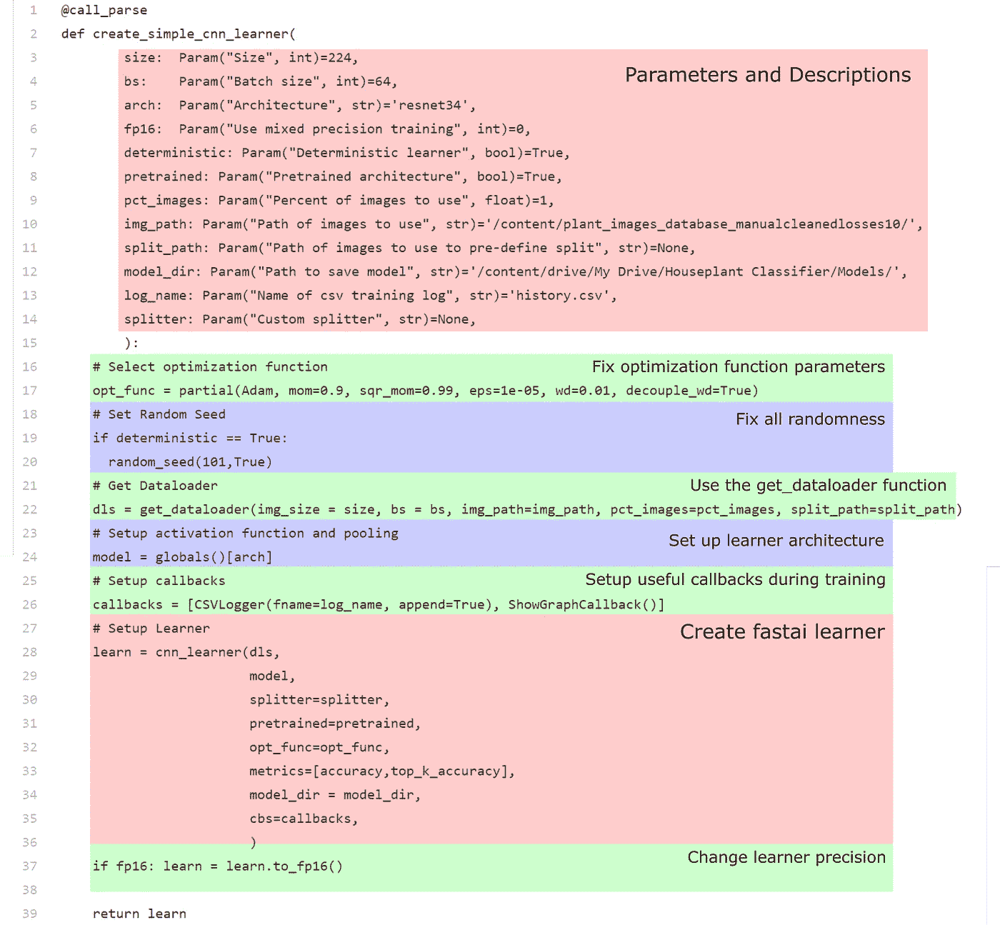
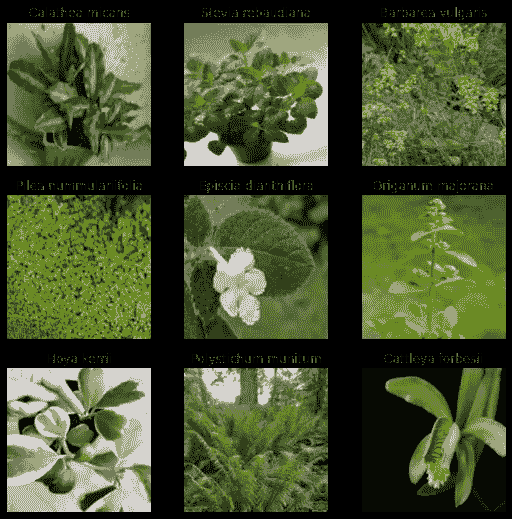
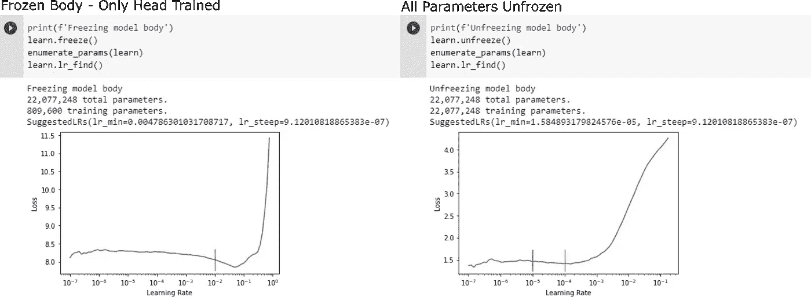
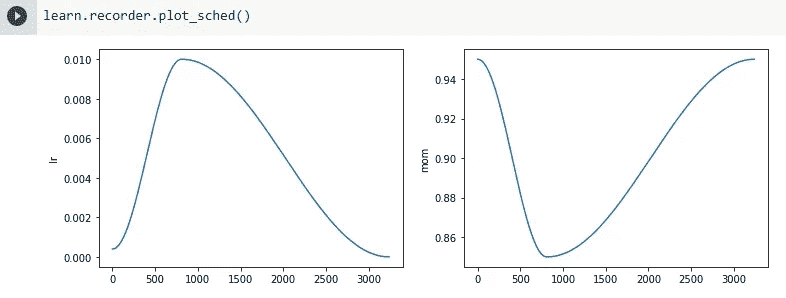
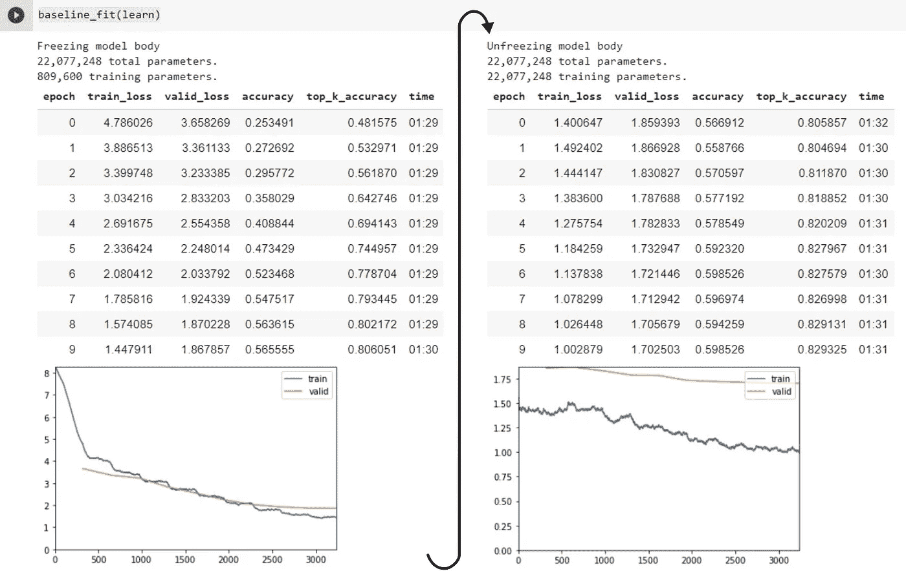
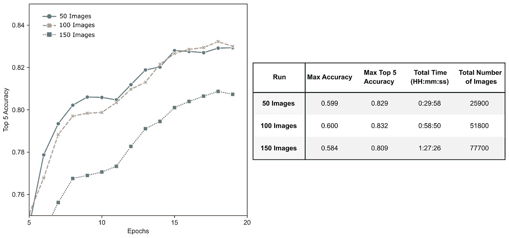
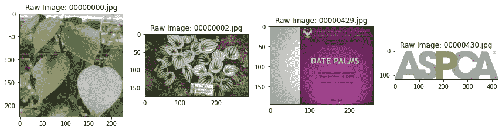

# 可控随机性训练

> 原文：<https://towardsdatascience.com/creating-a-plant-pet-toxicity-classifier-13b8ba6289e6?source=collection_archive---------37----------------------->

## [用 fast.ai 对宠物安全植物进行分类](https://towardsdatascience.com/tagged/petsafe-plants-fastai)

## 创建和比较 fast.ai 学习者


[大卫·克拉克](https://unsplash.com/@mancity17)上[下](https://unsplash.com/)

在[第一部分:建立一个数据库](https://kenichinakanishi.medium.com/creating-a-plant-pet-toxicity-classifier-a29587f3f04c)中，我们已经在网上搜集了关于植物及其对宠物毒性的信息，对照第二个数据库交叉引用了这些字段，然后最终通过 Google Images 下载了每个类别的独特图像。在这一部分，我们将训练基线神经网络(使用新的 fast.ai 框架)，以根据图片识别植物的种类。然后，我们将评估我们收集的数据集对于训练神经网络有多好，并寻找改进的方法。

> **这里的主要目标是比较改变每类图像数量的影响，以及我们如何通过控制随机性来公平地比较每次训练。**

我发现 fast.ai 是一个非常有用的框架(位于 PyTorch 库之上),可以直接用于机器学习。杰瑞米·霍华德(fast.ai 的创始研究员)用了一个类比，类似于学习如何踢足球——我们是想研究如何踢球的精确物理和力学，还是融入其中，边踢边学？后者更吸引人，由于网上有大量的可用资源，我们可以在学习的过程中获得重要的理论知识。其中一个例子是 fast.ai 自己的[书](https://github.com/fastai/fastbook)，它很好地概述了这个过程，并包含了一个关于[数据伦理](https://github.com/fastai/fastbook/blob/master/03_ethics.ipynb)的特别有趣的章节。

# 目录

1.  [一个训练基线](https://medium.com/p/13b8ba6289e6#a60d)
    1.1 - [导入和播种随机性](https://medium.com/p/13b8ba6289e6#b088)
    1.2 - [将数据加载到 Colabs](https://medium.com/p/13b8ba6289e6#5e92)
    1.3 - [数据块和数据加载器](https://medium.com/p/13b8ba6289e6#043b)
    1.4 - [分层拆分](https://medium.com/p/13b8ba6289e6#e4a2)
    1.5 - [创建数据块和数据加载器](https://medium.com/p/13b8ba6289e6#736d)
    1.6 - [创建学习器](https://medium.com/p/13b8ba6289e6#d872)
2.  [训练模型](https://medium.com/p/13b8ba6289e6#826a)
    2.1 - [我们如何选择学习率？](https://medium.com/p/13b8ba6289e6#0a40)
    2.2 - [示例训练运行](https://medium.com/p/13b8ba6289e6#3c2d)
3.  [训练模型](https://medium.com/p/13b8ba6289e6#6feb)
    3.1 - [为什么图像越多越好？](https://medium.com/p/13b8ba6289e6#1539)

# 1.训练基线

## 1.1 -导入和植入随机性

fast.ai 正在[快速更新](https://pypi.org/project/fastai/#history)，这需要安装特定的包版本以实现可再现性。为了便于使用，我们将简单地把我们需要的所有东西(以及我们以后需要的东西)导入到全局名称空间中。

为了比较训练运行，我们需要控制系统中存在的随机性来源(扩充、分裂等。)虽然有很多关于这个主题的[讨论](https://forums.fast.ai/t/solved-reproducibility-where-is-the-randomness-coming-in/31628/23)，但我发现，对于 Colabs 来说，在创建`DataBlock`之前使用下面的函数将允许即使在内核重启之间也能产生可再现的结果。您还需要在您的数据加载器中设置`num_workers = 0 (or 1)`,但是默认情况下它是 0，我们不会在这里更改它。

在 NumPy、PyTorch 和 random 包中设置随机种子。

请注意，如果您调用任何使用随机设置的函数(如`learn.dls.show_batch()`)或更改使用的 GPU(如特斯拉 P100 vs Colabs 上的 V100)，结果将会改变。这可能导致需要在工厂重置运行时并重新连接，直到提供相同的 GPU。

驱动版本和 CUDA 版本的一致性也很重要。

## 1.2 -将数据加载到 Colabs 中

目前，这些数据保存在 Google Drive 中带有类别标签的文件夹中，共有 150 张图片。jpgs)。Colab 可以[直接将](https://colab.research.google.com/notebooks/io.ipynb)链接到您的 Google Drive，但是简单地将您的学习者指向该驱动器并继续进行培训将会大大减慢该过程，因为每批培训都需要不断地传输图像。

为了解决这个问题，我们可以递归地将包含每个子文件夹的文件夹直接复制到当前内核中(但是，如果您有大量小文件，这可能会相对较慢)。

> recursife 意味着`cp`复制目录的内容，如果一个目录有子目录，它们也被复制。

执行主文件夹的递归复制。

如果这种方法太慢，我们可以先下载文件，压缩文件，然后上传到 Google Drive。然后，每当我们需要数据时，我们可以简单地下载该文件并在内核中解压缩。

下载并解压缩包含所有文件夹的文件。

不管怎样，我们在这里所做的确保我们的图像出现在 Colabs 内核上的工作将会在训练中节省大量的时间。

## 1.3 -数据块和数据加载器

现在，我们的数据直接呈现在内核中，可以在训练期间轻松访问。为了使用这些数据，fast.ai 开发了一个名为`DataBlock` API 的灵活系统。在高层次上，`DataBlock`只是在构建批处理和我们的`DataLoaders`时作为一个指令列表。这在 fastai 书的第 5 章中有更详细的讨论。

我们的`DataBlock`会是这样的:

使用的数据块结构。

1.  `blocks = (ImageBlock, CategoryBlock)
    blocks`使用内置块元组指定自变量和因变量类型。在这种情况下，我们传入图像并寻找类别。
2.  `splitter = stratifiedsplitter`
    `splitter`定义使用什么函数将数据分割成训练集和验证集。`stratifiedsplitter`是一个简单的定制函数，它将基于数据帧中的一列进行拆分(我们将在后面看到)，但是可以定义任何类型的拆分——从随机拆分到基于文件夹位置或名称的拆分。
3.  `get_x = get_x`
    `get_x`定义使用什么函数来获取我们数据集中的图像列表。
4.  `get_y = get_y`
    `get_y`定义使用什么函数为数据集创建分类标签。
5.  `item_tfms = item_tfms`
    `item_tfms`是运行在每个单独项目上的代码片段。fastai 包括许多预定义的变换，这个步骤通常用于标准化每个图像的大小。
6.  `batch_tfms = batch_tfms`
    `batch_tfms`作为一个组合操作在 GPU 上只能应用一次。与单独执行操作和多次插值相比，这保持了图像清晰度并减少了伪影的数量。这里通常是定义图像增强步骤(如调整大小和旋转)的地方。

## 1.4 -分层分裂

`splitter`定义了哪些图像将出现在训练数据集和验证数据集中。有许多方法可以实现这一点，但这里我们准备了一个函数，它查看包含每个类的图像的所有文件夹的路径，并返回一个包含将一个类与每个图像配对的数据帧。

一个简单的函数，创建一个数据帧，包含“类”和“路径”列，从路径到文件夹，包含每个类的图像文件夹。

现在我们有了这个数据框架，我们可以选择我们想要如何进行拆分。为了实现未来的 k 折叠验证，让我们准备一种生成分层折叠的方法，它保留了每个类的样本百分比。我们在 sklearn 的`StratifiedKFold`函数的帮助下做到这一点，将数据帧的适当列作为`X`和`y`传入。

使用 sklearn 的 StratifiedKFold 函数，在提供的数据帧上准备分层 k-fold 分割。

太好了！现在我们有了一个 DataFrame(上面例子中的`df_cnn`，它包含了`Class`、`Path`和`is_valid`标签。

此外，由于我们希望尽可能公平地比较具有不同数量图像的数据集之间的训练情况，**我们不想每次都使用随机训练/验证分割**。如果我们这样做，用于训练和验证的图像的差异将固有地改变模型性能。为了对此进行控制，我们首先对所有图像进行随机分层分割(见下面的 *a* )。然后，在我们从数据集中移除任何图像后，我们对之前定义的分割进行内部连接，以便任何图像仍保留在与之前相同的训练或验证集中(创建伪分层分割，参见下面的 *b* ，因为我们不能保证每组中保留的图像的*比例与*完全相同)。

> 修复所有的随机性可能通常不是一个好主意，因为不同运行之间的高变化可能会给你一些错误的提示。如果使用交叉验证，分数的自然变化可以帮助你获得更好的分数。



(a)从所有图像中创建主混洗分层分割。(b)在数据集中的一些图像被移除之后，先前定义的分裂上的内部连接将保持相同的训练/验证分裂。

## 1.5 -创建数据块和数据加载器

如前所述，拆分是在`DataLoader`的`DataBlock`中定义的，这里我们使用一个`get_dataloader`函数来自动化这个过程。



[创建数据块和数据加载器。](https://gist.github.com/kenichinakanishi/c210a52f74a4d17e1462afc0d6087a04)

该功能首先定义`get_x`、`get_y`、`splitter`、`item_tfms`和`batch_tfms`。这里，`get_x`和`get_y`告诉我们的`DataBlock`查看数据帧中适当的列，分别找到图像路径和标签。如前所述，`splitter`使用“is_valid”列将图像识别为训练或验证。

对于我们的变换，我们遵循一个[预调整](https://github.com/fastai/fastbook/blob/master/05_pet_breeds.ipynb)策略，其中`item_tfms`将每个图像调整到一个比目标训练尺寸大得多的尺寸，而`batch_tfms`将所有常见的增强操作(包括调整到最终目标尺寸)组合成一个 GPU 的组合操作。

注意，这里的`batch_tfms`使用由 fastai 定义的基础`aug_transforms`，它应用翻转、旋转、缩放、扭曲、光照变换的[列表，然后使用 ImageNet stats 应用归一化。我们添加一个随机擦除变换的附加条款，这将在后面讨论。最后，如前所述，这些片段中的每一个都被用在了`DataBlock`的定义中。](https://docs.fast.ai/vision.augment#aug_transforms)

然后，我们检查是否已经定义了一组图像的`split_path`，我们应该使用该组图像准备一个“主”分层分割，如果已经定义了，则在我们的`img_path`中应用图像的内部连接来定义我们的伪分层分割。否则，我们为`img_path`中的图像生成分层分割。该过程包含前两个函数(`create_path_df`和`stratified_split`)，采用之前定义的参数。

该函数的输出是一个`DataLoader`，它[表示一个具有扩展功能的数据集上的 Python iterable](https://docs.fast.ai/data.load)，支持自动批处理、混排和多进程数据加载等功能。

## 1.6 -创建学习者

同样，为了让我们接下来的工作更加方便，我们将把目前为止我们编写的所有内容包装到一个函数中，该函数定义了参数，并通过 fastai 便利函数`cnn_learner`提供这些参数，最终得到我们的学习者。



[创建一个基本 cnn 学习者。](https://gist.github.com/kenichinakanishi/00440867d8beac0d4df9cd0c552d0403)

这里，我们为默认的学习者设置一些参数。我们将使用 224x224 像素大小的图像，批量大小为 64。使用预训练的 ResNet34 架构，这是一个经典且可靠的神经网络。在调用`random_seed`函数修复所有随机性之前，我们使用的优化函数(Adam)的参数也在函数体中定义。我们还设置了一系列有用的回调，将结果保存为. csv 格式，并在图中显示训练和验证损失，在训练期间实时显示。最后，在添加切换到混合精度训练的选项之前，我们使用 fastai 便利函数创建学习者，该函数接受我们之前准备的所有单独的项目。

唷！我们准备好训练了。达到这一步需要做很多工作，而且没有必要以这种方式设置。然而，努力将事情包装成一个简单的函数将在以后带来好处，因为我们现在可以轻松地改变一系列参数(以一致的方式)，包括数据集中的图像数量和神经网络的架构。这样做可以让一切变得更整洁，避免每次都需要复制和粘贴代码，从而降低出错的可能性。

# 2.训练模型

正如我们在`create_simple_cnn_learner`函数中看到的，我们将从一个简单但健壮的 CNN 开始，ResNet34。让我们首先创建一个只使用 1/3 数据集的学习者(每个类 150 张图片中的 50 张)。

使用 50 张(共 150 张)图像创建学习者。

然后，我们可以使用以下工具来查看这些图像

```
learn.dls.show_batch(max_n=9)
```



显示一批 9 幅图像。感谢我们随机性的播种，这将是每次都一样。

使用从 [ImageNet](http://www.image-net.org/) 预训练的权重，将使用转移学习程序来微调我们图像的网络。迁移学习背后的基本思想是，由`create_simple_cnn_learner`函数创建的预训练 ResNet34 模型在识别 ImageNet 数据集中存在的东西方面已经有了一个不错的想法。由于我们使用的图像与 ImageNet 中使用的真实图像不会有太大的不同，所以我们不希望过多地改变权重是有道理的。使用迁移学习的理论和决策可能更加细致入微，参见[这篇出色的博客文章以获得更深入的解释](https://blog.slavv.com/a-gentle-intro-to-transfer-learning-2c0b674375a0)。

这里，我们将在解冻所有内容之前，使用冻结的初始层中的权重训练我们的模型(仅训练最后完全连接的层的权重)，并以相对较低的[区别学习速率](/understanding-learning-rates-and-how-it-improves-performance-in-deep-learning-d0d4059c1c10) s 对所有权重进行“微调”训练。这意味着在 fastai 定义的层组中，学习速率将从小(在早期层中)交错到相对较大(当我们接近最终层时)。直观地说，这与每一层所看到的图像细节有关。早期图层倾向于查看图像的大致轮廓，如梯度、边缘和拐角，所有细节的权重都不需要进行任何重大程度的重新训练。对于后面的层反之亦然。

我们将使用迁移学习程序来确定我们的训练结果。

上面的代码展示了我们将在这里用来训练我们的分类器的基本迁移学习过程。固定的学习速率和时期将用于比较训练运行，10 个时期用于训练模型头部，另外 10 个时期用于微调网络。注意,`enumerate_params`是一个小函数，当被调用时，它告诉我们一个给定的学习者有多少冻结和未冻结的参数。

## 2.1 -我们如何选择学习率？

许多优秀的[博客文章](/understanding-learning-rates-and-how-it-improves-performance-in-deep-learning-d0d4059c1c10)解释了为手头的问题选择合适的学习率的重要性。由于这不是这篇文章的重点，我们将不会进入太多的细节。在这里(按照 Leslie N. Smith 的建议，许多人也是这样做的)，我们使用内置的 fastai 函数`learn.lr_find()`来绘制损失与学习率的关系，并在损失仍然改善的最小值之前选择一个值，以确定转移过程中每一步的适当学习率。



learn.lr_find()的结果示例，所选的学习率用红色标记。

在实践中，我们使用`fit_one_cycle`函数，所用的学习率代表余弦退火的[单周期策略](https://fastai1.fast.ai/callbacks.one_cycle.html)中的最大学习率，如下所示。请注意，下面的 x 轴代表通过学习者的批次数量。



余弦退火的单周期策略。

这项政策是 [Leslie Smith 的工作](https://arxiv.org/abs/1803.09820)在超参数(学习率、动量和重量衰减)方面的成果，结合 fastai 的调整，在复杂模型的训练中提供快速结果。直观上，我们可以认为该策略从一个较低的值开始，以预热培训。随着我们的进展，学习率增加，动量减少，以鼓励优化器快速调查损失函数的新区域，作为一种正则化方法，通常落在具有更平坦最小值的区域(这些区域[更擅长泛化](https://arxiv.org/pdf/1706.10239.pdf))。在单周期策略的最后部分，学习率的降低允许优化器在较平坦的区域内进入较陡的局部最小值。参见 Nachiket Tanksdale 的这篇精彩文章，了解更详细的解释。

## 2.2 -训练运行示例

在跑完`baseline_fit(learn)`之后，一次单独的训练跑将会看起来像这样。



训练运行示例。

我们可以看到`ShowGraphCallback()`的用处，它可以在过度训练发生时给我们一个指示。通常，我们可能会寻找训练和验证损失的差异，如果验证损失开始增加，我们应该特别小心。

# 3.训练模型

现在我们已经设置好了一切，我们可以开始做一些有趣的比较。让我们先来比较一下，当我们改变第 1 部分[的数据集合中的图像数量时(在创建学习器时使用`pct_images`参数),我们的前 5 个精度是如何变化的。](/creating-a-plant-pet-toxicity-classifier-a29587f3f04c)



验证准确性随所用图像数量的变化。

虽然总训练时间与图像数量成线性比例，但我们看到，当每类使用 150 幅图像时，模型的前 5 名准确度会下降。啊哦。通常我们会期望更多的图像给我们一个更好的结果！

## 3.1 -为什么图像越多越好？

这个问题与我们为创建数据库而下载的图像的*质量有关。回想一下[每个文件夹的图片都是根据每种植物的学名从谷歌图片上下载的。](https://medium.com/r?url=https%3A%2F%2Ftowardsdatascience.com%2Fcreating-a-plant-pet-toxicity-classifier-a29587f3f04c)让我们来看看一个随机类的早期搜索结果和后期搜索结果，比如说 *Peperomia peltifolia* 。*

**

*从谷歌图片 Peperomia peltifolia。*

*啊哈！在我们可以为每个类生成 150 个独特的图像之前，必须查看 150 多个搜索结果(仅这个随机类就有 430 多个)。)随着我们越来越深入搜索结果，我们的结果会变得越来越不相关。这将产生像图画、图表和事实表这样的图像——它们都不擅长训练我们的模型做我们想要它做的事情(根据自然照片对植物进行分类)。事实上，我们对训练结果的比较表明，由于包含了许多糟糕的训练示例，试图在每个类别中使用超过 100 个图像会开始损害我们的模型。*

*我们希望对这些图像进行一些清理，而不必手动检查 500 多个文件夹中的每个文件。请加入我们的第 3 部分:锁定和删除不良训练数据，我们将研究一些方法来实现这一点。*