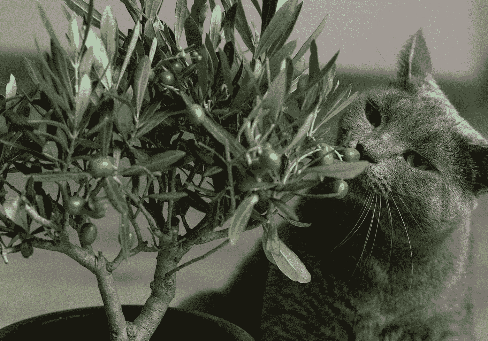
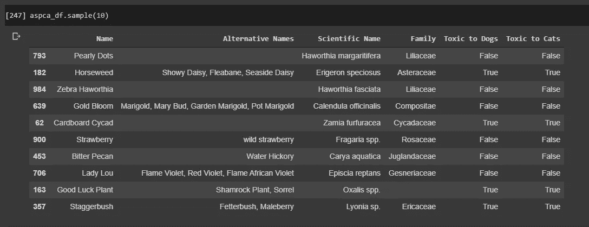
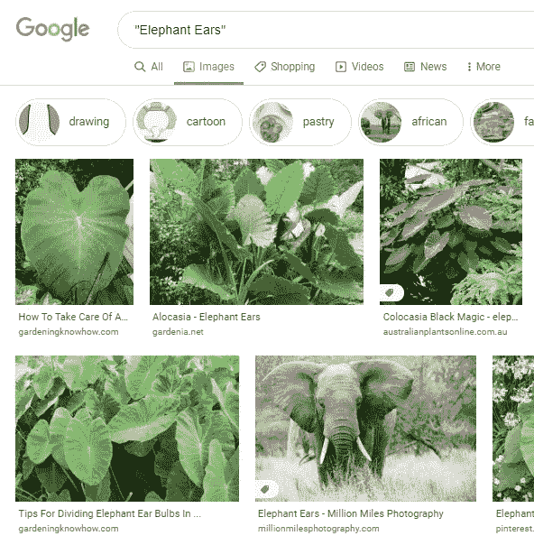
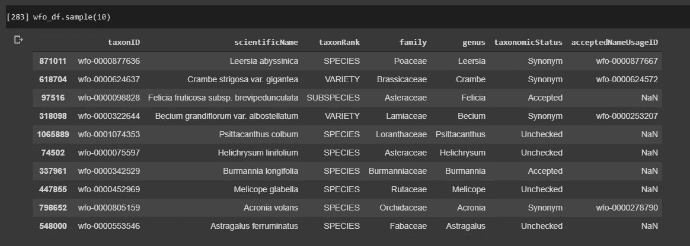
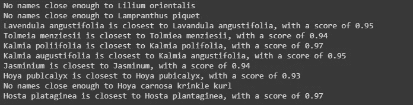
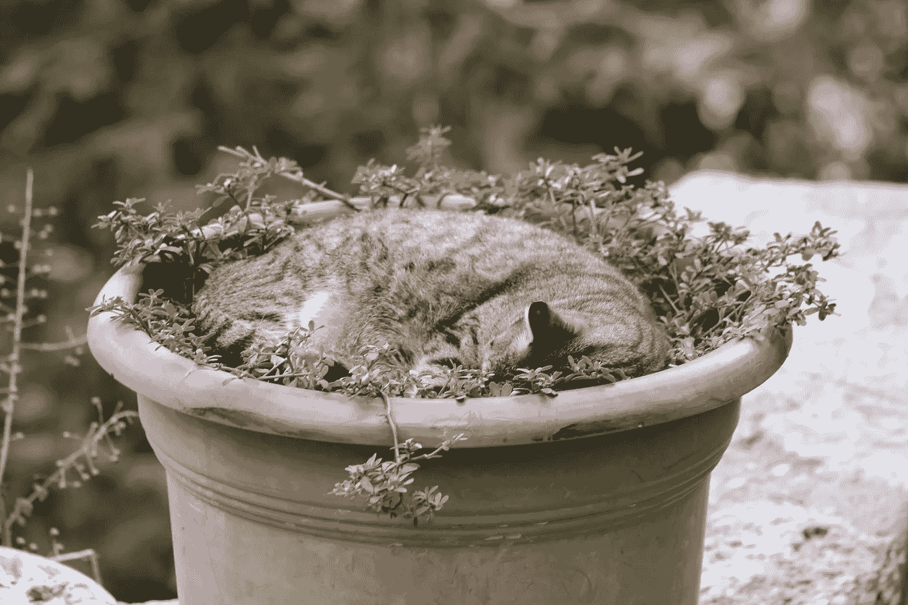

# 建立图像数据库

> 原文：<https://towardsdatascience.com/creating-a-plant-pet-toxicity-classifier-a29587f3f04c?source=collection_archive---------45----------------------->

## [用 fast.ai 对宠物安全植物进行分类](https://towardsdatascience.com/tagged/petsafe-plants-fastai)

## 使用美素、硒和 FastAI

由[米拉达·维杰罗娃](https://unsplash.com/@mili_vigerova?utm_source=unsplash&utm_medium=referral&utm_content=creditCopyText)在 [Unsplash](https://unsplash.com/s/photos/cat-plants?utm_source=unsplash&utm_medium=referral&utm_content=creditCopyText) 上拍摄

进入深度学习领域，有大量高质量的资源，但每个人都同意，有意义的项目对真正掌握诀窍至关重要。

有一个喜欢买植物的未婚妻，和一只喜欢啃植物的猫——我想还有什么比组装一个分类器来告诉我植物是否安全更好的呢！

需要注意的一点是，这里所做的所有工作都是在 Google Colabs 上完成的，所以如果您想在本地机器上做同样的事情，那么设置和导入方面的差异是必要的。用的笔记本可以在我的 [Github](https://github.com/kenichinakanishi/houseplant_classifier) 上找到。

# 步骤 1 —获取数据

不幸的是，我无法在那里找到一个预制的图像数据集，它适合我想在 [Kaggle](https://www.kaggle.com/search?q=plants+tag%3Aplants) 上做的事情，或者使用[谷歌的数据集搜索](https://datasetsearch.research.google.com/search?query=plant&docid=l1iMPxjlp4UiuSjKAAAAAA%3D%3D)。所以，除了自己造还能做什么！

我决定使用 ASPCA 的猫和狗的植物毒性列表，因为我在苗圃的时候已经不止一次地使用过这个网站。这给了我们一个很好的工作核心。为了从网站上抓取这些文本数据，我们可以求助于 [BeautifulSoup](https://www.crummy.com/software/BeautifulSoup/bs4/doc/) ，这是一个 Python 库，用于从 HTML 和 XML 文件中提取数据。

然而，当查看他们的网站时，该表并不是一个易于访问的 html 表，而是将数据存储为面板中的行。幸运的是，BeautifulSoup 为我们提供了一种简单的方法来搜索解析树以找到我们想要的数据。例如:

将原始数据收集在一起后，我们需要进行一些创造性的拆分，将其分成几列:

然后，我们可以对特定于狗的列表重复此过程，然后合并数据帧并清除来自任何条目的 nan:

照片由 [Unsplash](https://unsplash.com/s/photos/cat-computer?utm_source=unsplash&utm_medium=referral&utm_content=creditCopyText) 上的 [Sereja Ris](https://unsplash.com/@kimtheris?utm_source=unsplash&utm_medium=referral&utm_content=creditCopyText) 拍摄

# 第二步——浅层清洁

接下来，我们可以开始浅层清理，包括查看数据集，决定我们要使用哪些关键要素，并标准化它们的格式。

(脏的)数据帧。注意 spp 的不一致使用。/sp。还有失踪的家人。

我们目前有名字，别名，学名，家族以及我们的毒性专栏，这些都是从 ASPCA 网站上用 BeautifulSoup 搜集来的。由于我们将在谷歌图片搜索的基础上收集图片，因此我们决定根据每种植物的确切学名进行搜索，以获得尽可能具体的图片。像“珍珠点”、“大象耳朵”、“蓬松的褶边”和“粉红珍珠”这样的名字会很快返回不是我们要找的植物的结果。

纵观该系列，我们注意到在大小写和 sp 的使用上有细微的差别。/spp。/species 表示一个物种，cv。/var。对于一个品种来说。基于这些观察，我们编写了几个应用于该系列的快速函数，试图标准化数据以便进一步清理。

# 步骤 3 —通过交叉引用进行深度清理

仔细查看我们的学名(并对数据进行了几次迭代)，我们发现许多名称都是更被接受的物种的过时同义词，或者被拼错了。这将在图像收集和稍后训练模型以识别拥有不同标签的相同图像时引起问题。

一次谷歌搜索之后，我们找到了[世界植物在线](http://www.worldfloraonline.org/)数据库，一个开放的、基于网络的世界植物物种简编。它们列出了同义词和公认的物种名称，并由“分类专家网络”定期更新。非常适合交叉引用我们不可靠的学名。该数据库以. txt 文件的形式提供他们的数据，我们可以读取这些数据并与 ASPCA 植物毒性数据库中的数据进行比较。

来自 WFO 的数据——由“分类专家网络”定期更新。

作为第一步，我们将对来自 ASPCA 的数据进行左合并，保留所有的类，并添加任何与我们当前拥有的科学名称相匹配的数据。我们的目标是将数据库中的所有植物更新为最新的公认学名，因此我们通过该关键字(taxonomicStatus)进行快速排序，并删除保留第一个条目的任何重复条目(如果它存在，将被接受)。

## 步骤 3.1 —使用字符串匹配修复打字错误

许多学名指的是同一物种，但由于 ASPCA 数据库中的拼写错误，相差了几个字母。让我们使用 difflib 的 SequenceMatcher 来量化字符串距离(使用一种格式塔模式匹配的形式),通过将每个不被接受的条目与 WFO 数据库中的条目进行比较来发现这些错误。为了节省时间，我们可以对数据帧进行排序，只与以相同字母开头的学名进行比较。如果名称足够相似，我们就保留它，并最终返回最接近的匹配。这里，我们将阈值设置为 0.9，以避免任何不正确的匹配。

我们还定义了一个函数来修复数据中有问题的条目，这将把它们的学名、科、属和分类状态更新为 WFO 数据库中相应的(正确的)条目。

现在，我们可以遍历我们的数据，搜索名称匹配，并当场纠正它们对应的数据帧条目。

这一过程有助于我们发现错误，否则这些错误需要深入的检查和高水平的领域知识:

即使知道有一个错误，并排看名字，也很难发现数据库中的错别字。

## 步骤 3.2-手动清理未识别物种

不幸的是，许多这些未识别的物种在数据库中没有足够近的条目，足以让我对自动修复感到舒服。因此，我们对剩余的未知进行一些手动修复。令人欣慰的是，上面的代码已经将需要人工关注的样本数量减少到只有 50 个左右的条目，我们可以根据在 Google 上找到的正确条目，重用之前的 fix_name 函数来修复这些条目。

凯瑟琳·希斯在 [Unsplash](https://unsplash.com/s/photos/cat-laptop?utm_source=unsplash&utm_medium=referral&utm_content=creditCopyText) 拍摄的照片

## 步骤 3.3 —匹配同义的科学名称

既然学名已经全部更正，我们仍然需要对它们进行标准化，因为学名可能会由于更新的研究而随时间发生变化(导致分类状态列中的同义词标签)。如果一个科学名称是一个公认名称的同义词，我们希望在未来的 Google 图片搜索中使用这个公认名称。

同一个类(scientificName)的多个标签(taxonomicStatus 下的同义词)在以后会是一件非常糟糕的事情。

幸运的是，WFO 数据库包含一个`acceptedNameUsageID`字段，其中包含了给定同义学名的公认名称，我们可以利用它来查找公认的学名，并将它们传递给`fix_name` 函数。

## 第 3.4 步—收尾

现在，我们已经(自动和手动)纠正了拼写错误，并将剩余的同义词与其最新接受的名称进行了匹配。剩下的工作就是为图像下载清理数据帧。

咻！这个过程花费了相当多的迭代来得到正确的方法。然而，在花时间训练模型之前，确保我们在建立图像数据库之前有干净的数据是至关重要的。

从最终的 pet 植物毒性数据框架中获得一些有趣的信息:

*   110 个植物家族中有 33 个并非完全有毒或无毒。
*   350 个植物属中有 7 个不是完全有毒或无毒的。
*   只有两种植物表现出物种特异性毒性，对猫来说是百合，对狗来说是核桃！

# 步骤 4—下载图像

下载图像的第一步是获取我们想要抓取的每个图像的 URL。为了做到这一点，我们采用了一种基于硒的方法，该方法基于[法比安·博斯勒](/image-scraping-with-python-a96feda8af2d)的一篇文章。Selenium 是用于测试 web 应用程序的可移植框架，几乎所有与网站的交互都可以模拟。Selenium webdriver 充当我们的虚拟浏览器，可以通过 python 命令进行控制。这里使用一个脚本来搜索谷歌图片的基础上，我们给它一个查询，只寻找和下载缩略图网址，因为我们将抓取大量的图像。一个问题是，谷歌的许多图像缩略图都是以 base64 编码的图像存储的。我们也想抓住这些，这样我们就不会错过任何具有高相关性的图像，因为我们在搜索结果中走得越远，图像对训练目的就变得越差。

太好了！现在我们有办法刮谷歌图片换图片了！为了下载我们的图像，我们将利用 fast.ai v2 中的一个函数，`download_images`下载图像。但是，我们将深入源代码并对其进行一点升级，以便在图像出现时对其进行哈希处理，并忽略/删除任何重复的图像，这样我们就能获得一致的独特图像集。我们也将允许它解码和下载编码。jpg 和。png 图像，这是 Google Images 用来存储缩略图的格式。

现在，我们可以遍历我们的每个科学植物名称来收集它们的 URL，然后下载这些图像，同时验证这些图像中的每一个都是独一无二的。每组图片都被下载到我在 Colabs 上的链接驱动器中它们自己的文件夹中。需要注意的一点是，由于 Google Images 上存在大量重复图片，要抓取的 URL 数量需要远远多于您最终想要的图片数量。

下载后，我们采取措施确保每个文件夹包含正确数量的唯一图像。更多细节和代码见链接 Github repo。

因此，在这一阶段，我们已经将有用的标签信息以及为每个类下载的唯一图像放在了一起。这些图片被整齐地分成各自的文件夹，并直接放在我们的 Google Drive 中。值得注意的是，如果你想用这些图像来训练 CNN，在使用它们之前，如果你把这些图像放到本地的 Colab 环境中，你将会获得巨大的加速，但是这将在下一篇文章中详细讨论。

## 最后的想法

从零开始建立一个数据库对于简单的玩具例子来说，图像分类项目是直接的(参见 [fast.ai v2 的书](https://github.com/fastai/fastbook/blob/master/02_production.ipynb)中一个棕色/黑色/泰迪熊分类器的好例子)。对于这个项目，我想扩展相同的方法，但是将它应用到更大的类集合中。这个过程实际上可以分为几个步骤:

1.  **获取类列表** 从网页中抓取表格或文本数据非常简单，这要感谢 BeautifulSoup，通常只需要通过正则表达式或内置 python 方法进行一点点处理。
    *清理和验证*你下载的数据的准确性是这一步最大的挑战。当我们有 10 个类和领域知识时，很容易发现错误并在继续之前修复它们。当我们有 500 个类，却不知道“薰衣草”和“薰衣草”哪个是正确的，事情会变得更加困难。我们可以用来验证数据的独立数据源至关重要。在这种情况下，我们相信 ASPCA 数据[中的毒性信息](https://www.aspca.org/pet-care/animal-poison-control/cats-plant-list)，但不相信它们提供的科学名称，并且不得不使用提供最新分类信息的 [WFO 数据库](http://www.worldfloraonline.org/)来纠正它们。
2.  **获取每个类的图片 URL 列表** 在这里，Selenium*非常*灵活。我推荐看看 Fabian Bosler 的文章[以获得更多关于如何使用 Selenium webdriver 的想法。你可以手动做的任何事情，网络驱动程序都可以模拟。我们可以执行搜索，找到缩略图并下载它们，如果我们想要更高分辨率的图像，甚至可以点击更大的图像并下载它们。](/image-scraping-with-python-a96feda8af2d)
3.  **将每个图像下载到一个带标签的文件夹** 下载图像的 fastai 功能运行良好，但一个主要的障碍是下载重复的图像。如果你想要更多的图片(10-15 张),如果你下载了谷歌图片搜索的每一个结果，你很快就会得到大量的重复图片。此外，该功能无法处理 base64 编码的图像，因为许多缩略图存储为。令人欣慰的是，fastai 提供了他们的源代码，可以修改这些源代码来解释编码图像，下载 http 链接，在它们进来时对它们进行哈希处理，只保留唯一的图像。

凯文在 [Unsplash](https://unsplash.com/s/photos/cat-plant?utm_source=unsplash&utm_medium=referral&utm_content=creditCopyText) 上拍摄的照片

# 下一步是什么？

我将看看我们使用的图像的数量是如何产生影响的，以及将一些带有人工(文本、图片等)的图像放在一起进行过滤。)我们可能在这个自动下载过程中无意中抓取的组件。然后，使用 fast.ai 架构构建和训练 CNN 图像分类模型！