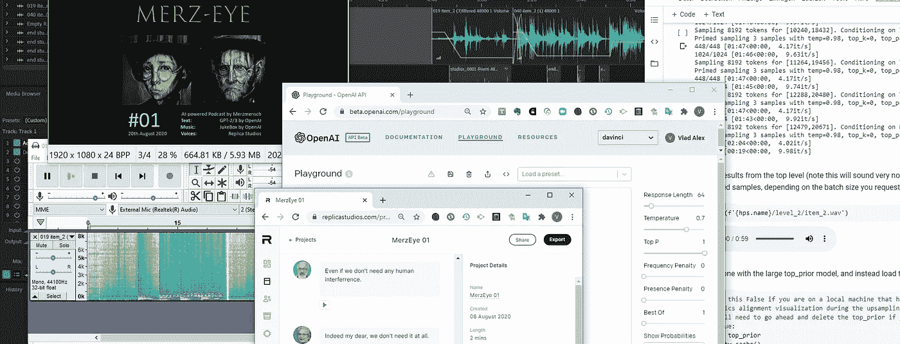
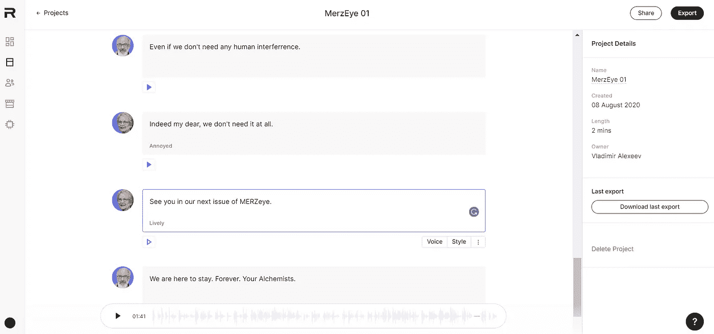

# 用人工智能创建播客

> 原文：<https://towardsdatascience.com/creating-a-podcast-with-a-i-6fe6a0ec6c37?source=collection_archive---------31----------------------->

## 点唱机、GPT 3 和人工智能语音(包括 5 个稀有样本和 1 个播客)

人工智能播客所需的一切(截图:Merzmensch)

O**penAI**不停地给我惊喜。去年他们上了头条[提供了 GPT-2](https://openai.com/blog/better-language-models/) ，一个具有强大写作技巧的 NLP 框架。2020 年，他们甚至用两件大事来反击。一个是 GPT-3，一个大规模的语言模型，有着巨大的创造潜力。

另一个引起了一些轰动，但很快就消失在背景中——在我看来很不公平: **JukeBox，一个音频生成模型**。过去有——现在也有——各种利用算法和人工智能创作音乐的方法。[走向数据科学已经有了一个不错的关于人工智能音乐的文集](/search?q=Music%20AI)。

*   早在 1960 年一位俄罗斯研究人员 **R. Zaripov** 发表了一篇关于算法音乐生成的论文(*обалгоритмическомописаниипроцессасочинениямузыки(关于音乐创作过程的算法描述)——*[*此处为俄文 pdf*](http://www.mathnet.ru/links/428bfe25018a1257e6a1370af7d2f8d4/dan23732.pdf))。
*   雷·库兹韦尔在 1965 年的电视节目《我有一个秘密》中展示了一首由模式识别计算机创作的钢琴曲
*   经过两个人工智能的冬天，随着技术的出现，**各种有前途的模式和音乐服务**打开了它们的大门:[查克](https://en.wikipedia.org/wiki/ChucK)、墨菲斯( [arXiv](https://arxiv.org/abs/1812.04832) )、 [AIVA](https://www.aiva.ai/) ( [以下是 2020 年十大服务的名单](https://filmora.wondershare.com/audio-editing/best-ai-music-composer.html))
*   tensor flow powered[Magenta](https://magenta.tensorflow.org/)在许多情况下都令人惊叹——对于旋律写作也是如此。使用[钢琴变形金刚笔记本](https://colab.research.google.com/notebooks/magenta/piano_transformer/piano_transformer.ipynb#scrollTo=tciXVi5eWG_1)你可以生成一些有趣的实验旋律，就像这个:

尽管如此，它有很好的，但有限的 MIDI 质量。

# 投币式自动点唱机

**OpenAI** 有另一种方法。 **JukeBox** 是一个神经网络，[在 120 万首歌曲的数据集上训练(其中 60 万首是英文的)](https://openai.com/blog/jukebox/)。利用变压器的自我关注的好处，它产生新的音乐作品。你得到的既不是 MIDI 乐谱，也不是简单的旋律，而是完整的音频“录音”。Top-even transformers 根据流派和艺术家条件预测音频标记。这一点，结合相应的歌词，在 [LyricWiki](https://lyrics.fandom.com/wiki/LyricWiki) 上训练，使得**点唱机**变得完全新奇。

有一些限制——在长度、与内容相关的歌曲创作(你听到的要么是现有的文本到新的声音，要么是 GPT-2 生成的歌词或不可理解的语言模仿)和硬件强度方面。你需要一个好的系统来产生新的声音。幸运的是，有两个选择:

**1。点唱机播放列表。**

 [## OpenAI Jukebox 示例资源管理器

### 浏览所有样品

jukebox.openai.com](https://jukebox.openai.com/) 

拥有超过 7k 首音乐，可按流派、艺术家和其他功能进行搜索，让您对自动点唱机的容量有足够的了解。

**2。点唱机 Colab 笔记本。**

不是官方的，但是效果很好:“[interactive _ with _ jukebox . ipynb](https://colab.research.google.com/github/openai/jukebox/blob/master/jukebox/Interacting_with_Jukebox.ipynb#scrollTo=2nET_YBEopyp)”。

这款笔记本很不稳定([这里有一些有趣的变通方法让它运行得更好](https://github.com/openai/jukebox/issues/40))——这需要时间。很多时间。它在一个会话中产生 3 首音乐曲目——从 2 级到 0 级的顶级运行大约需要 8 个小时。您的笔记本有崩溃和丢失所有数据和检查点的危险。但是当它运行时，它是强大的。你可以定义流派和解释者——并随意混合它们。

结果令人着迷。

# 听起来怎么样？(为了获得最佳质量，请使用您的耳机)

这里有一个例子。这是第一次运行——它在结束时让我不知所措。

初始级别 2 仍然有很多噪声:

级别 1(在大约 4 小时的迭代上采样之后)更加清晰:

但是如果你运气好，你的笔记本没有死机——8 个小时后，你会得到一些美好的东西，比如对另一个世界的一瞥，一部关于未知文化的纪录片的叙述，用一种你永远也不会理解的语言:

看看音乐是如何演变的，神秘的声音是如何歌唱的。一分钟——就结束了。你也明白你将永远听不到这首曲子的延续，或者这个解释。因为结果是独特的。其他地方没有分数。这是唯一的原件。

# 自动点唱机播放音乐的例子。

这里有一些有趣的片段供你欣赏:

民谣和英国摇滚的美妙融合:

一个电台播放着宋宛如的评论:

 [## 点唱机:006 -“开”

### 流自动点唱机:006 -“开”由 Merzmensch 从桌面或您的移动设备

soundcloud.com](https://soundcloud.com/merzmensch/006-jukeboxed-on) 

一些在赛谬尔·巴伯、恩雅和菅野洋子之间进行了改编的古典管风琴音乐:

有趣的人声和催眠鼓:

然后这个完美的爵士自由式即兴创作:

用人工智能生成的音乐来检查播放列表，我确实使用了各种方法。有潜在的耳虫。

# 用例？播客！

现在我们有一个音乐库。但是，在什么情况下可以使用一段超出通常视唱标准的音乐，使用未知的语言，有时会有错误和故障？

*   **用于取样和重新取样。**
    如果你是一名实验音乐的 DJ 或作曲家——这是你的一个百宝箱。没有人使用的独特声音。一些新鲜和不寻常的音频宝石。
*   **用于视频背景。**
    我用它们来制作我的人工智能短片，比如《空房间》(也可以查看的[制作):](/ai-as-a-movie-maker-e5865b99a06c?source=friends_link&sk=f83d2cea5ffd88807890781e84ac22c0)

最大的好处是——它没有版权。因为如果作为框架的 JukeBox 是 OpenAI 的财产，那么你用它生成的音乐就是你的。

*   **播客？** AI 生成音频的另一种使用方式是用于 AI 生成的媒体。比如播客。我从我的播客系列“ [MERZeye](https://medium.com/merzazine/merzeye-an-ai-powered-podcast-a6095718095c?source=friends_link&sk=4087f39fcb593169e2ffc3ea68247d15) ”开始，下面是我是怎么做的。

# 如何使用人工智能制作播客？

基本和我的文章《 [AI 做电影人](/ai-as-a-movie-maker-e5865b99a06c?source=friends_link&sk=f83d2cea5ffd88807890781e84ac22c0)》差不多。

通常，您需要以下 Podcast 组件:

1.  内容、文本、故事板
2.  音乐背景和叮当声
3.  声音

人工智能赋予你所有的可能性。

**内容。**

在我的第一集《梅泽耶》中，我使用了:

*   短片《空房间》已有剧本。它是用 GPT-2 实验室笔记本中的 GPT-2 生成的。
*   一首诗(“[我真正的诗](https://thecreative.cafe/a-rock-and-a-poem-8e14a791a092?source=friends_link&sk=3a2797bfcd5781746f0a74f42d28c8b4)”)，GPT-3 为我写的。
*   叙述文本(由我写的人类文本，因为你仍然不能让人工智能在各种内容之间自动调节)

**音乐和声音。**

*   对于前奏和尾声，我使用了点唱机连贯的音乐片段
*   对于电台播放的“空房间”，我使用了我的短片现有的配乐。这里是你需要的一切:叙述者，主角，和背景音乐。
*   对于类别“无线电广播”,是由自动点唱机播放的合适的各种类似无线电的记录。主持人聊天和交叉淡入淡出音乐的独特组合。这次是爵士乐，以吉米·卡伦为背景。

**人声。**

在这里，就像我以前的电影一样，我使用了[雷普利卡工作室](https://replicastudios.com/)。目前有各种现有的解决方案，但是 Replika 工作室的声音库和质量通过一些独特的戏剧质量说服了我。其他解决方案对于信息视频或审核来说相当不错。

炼金术士。AI-MERZeye 的版主，由我和[art breader](/artbreeder-draw-me-an-electric-sheep-841babe80b67?source=friends_link&sk=2fff2b9e102ce632d725e58bfa4c67dd)共同打造。

对于这两位炼金术士，我使用了所罗门的声音(有着英国戏剧嗓音的老绅士，适合莎士比亚的舞台剧)和格里塔的声音(有情感语调的美国女士):

来自雷普利卡工作室的 Screencap(截图:Merzmensch)

在这里，您可以张贴整个脚本，并将声音分配给特定的短语。同时，甚至情绪调整也是可能的(就像上面的 Greta:“烦躁”或“活泼”)。

现在，您只需在自己选择的多轨道音频编辑器中进行混音，瞧！

**第一集。**

**第二集。**

对于我们如何利用所有这些创造性的生成媒体模型，你有其他想法吗？在评论中分享吧！