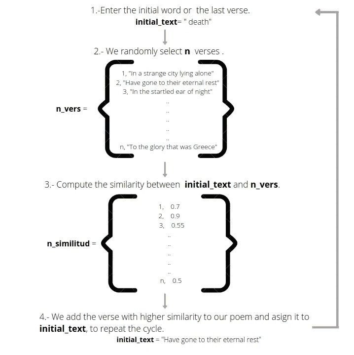

# 使用单词嵌入创建诗歌生成器

> 原文：<https://towardsdatascience.com/creating-a-poems-generator-using-word-embeddings-bcc43248de4f?source=collection_archive---------36----------------------->

## AI 创意助手

## 关于如何基于你最喜欢的作者书目创建一个人工智能诗歌生成器的指南。

-照片由[莱昂纳多·巴尔迪萨拉](https://unsplash.com/@ilbaldii?utm_source=medium&utm_medium=referral)在 [Unsplash](https://unsplash.com?utm_source=medium&utm_medium=referral) 上拍摄

随着最近新的和更复杂的语言模型的出现，有时向自然语言处理世界迈出第一步感觉是一项艰巨的任务。

本指南的目的是提供一个相当简单的项目，一个诗歌生成器，让你只使用一种技术就能掌握 NLP 世界:单词嵌入。

# 那么什么是单词嵌入呢？

单词嵌入是单词的 n 维向量表示，它基于语料库中存在的上下文以某种方式捕捉它们的含义。换句话说:在特定语料库(文本集合)中以相似方式使用的单词将具有相似的向量。

用数字表示单词的有趣之处在于，现在我们可以在数学运算中使用它们，比如计算相似度，这是我们将在诗歌生成器中使用的一种度量方法。

相似性用于量化两个向量之间的相同性。它计算它们之间角度的余弦值，当角度为 90°时，对于方向相同的向量，余弦值为 1，余弦值为 0。

单词间的余弦相似度

我们将使用这个属性来搜索单词和句子之间的相似性。

# 该算法

我们的目标是用输入的首词创作一首新诗。首先，我们将随机选择诗句，然后我们将计算这些诗句与我们最初的单词之间的相似度。稍后，我们将选择得分最高的诗句，并将其添加到这首诗中。我们将重复这个过程，但使用最后一节作为首词，直到这首诗完成。

对于这个特定的指南，我选择使用埃德加·爱伦·坡的诗。

该算法

# 数据回忆

首先，我们需要收集将成为我们项目来源的诗歌。为此，我们将使用 Python 创建一个 web-scraper，从 mypoeticside.com[网站收集特定作家(在我的例子中是埃德加·爱伦·坡)的诗歌，并将它们保存到*。csv* 文件。](https://mypoeticside.com/)

# 数据清理和准备

我们将创建一个函数，它采用我们之前创建的*。csv* 根据我们选择的正则表达式，将诗歌归档并拆分成诗句。然后，我们还将删除和替换诗句中一些不需要的字符(例如冒号)，以使最终的诗歌看起来更好地连接和凝聚。

我们将在新的*中保存经文。csv* 文件。

# 诗歌生成器

诗生成器取*。来自上一步的 csv* 文件，一个新诗的初始单词和诗句数作为输入。

这个过程从我们最初的单词开始，理想情况下，它应该是一个广泛使用的单词，以便增加找到具有高相似性的诗句的机会。然后，我们从语料库中随机选择 *n* 个诗句，并计算它们与我们的初始词之间的相似度。

我们将使用 Spacy 库中的预训练向量，特别是在通用爬行数据集上训练的*“en _ core _ web _ MD”*模型。我们还将使用相同的库函数来计算相似性。

最后，我们选择得分最高的诗句，重复这个过程，直到这首诗完成。

# 格式化诗歌

为了正确格式化我们新创建的诗歌，我们将创建一个函数，将第一个诗节的字母大写，并在诗歌的结尾添加一个点。

# 结果

我个人选择生成 4 节的短诗，以尽量减少结果缺乏连贯性的机会。

这些是我最喜欢的一些结果:

一般来说，大多数生成的诗歌读起来都很有趣，即使有时结果可能缺乏连贯性，但大多数情况下，人们并没有注意到它们是如何创作的。

希望你喜欢这个指南，并随时通过 [Linkedin](https://www.linkedin.com/in/benjamin-duranperez-/) 或 [Twitter](https://twitter.com/benjaDn) 联系我。