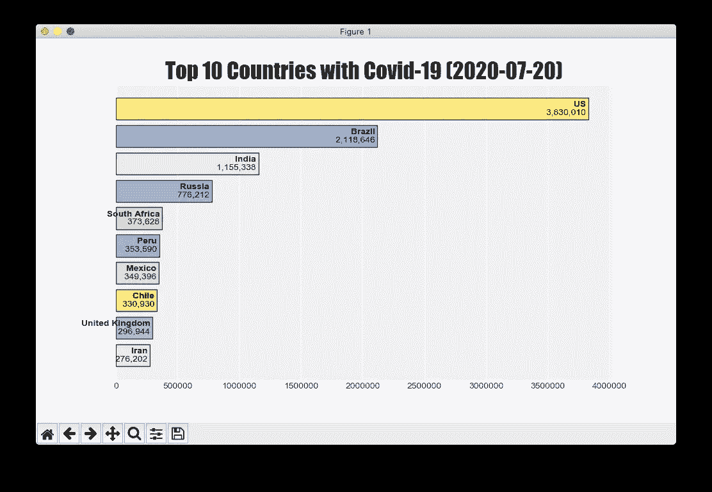
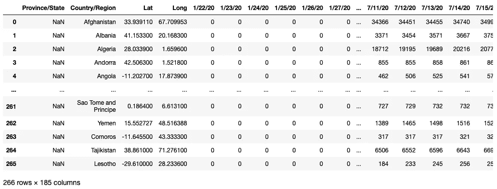
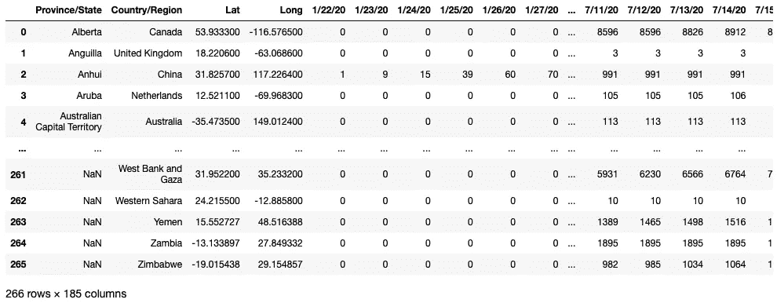
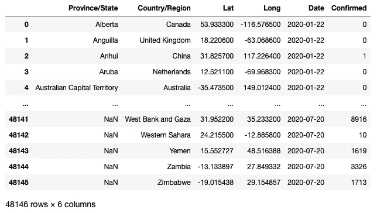
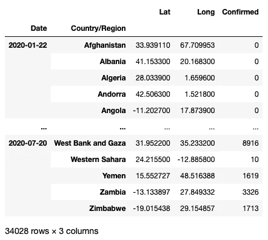
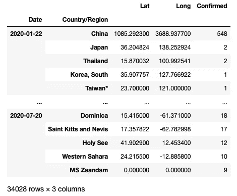
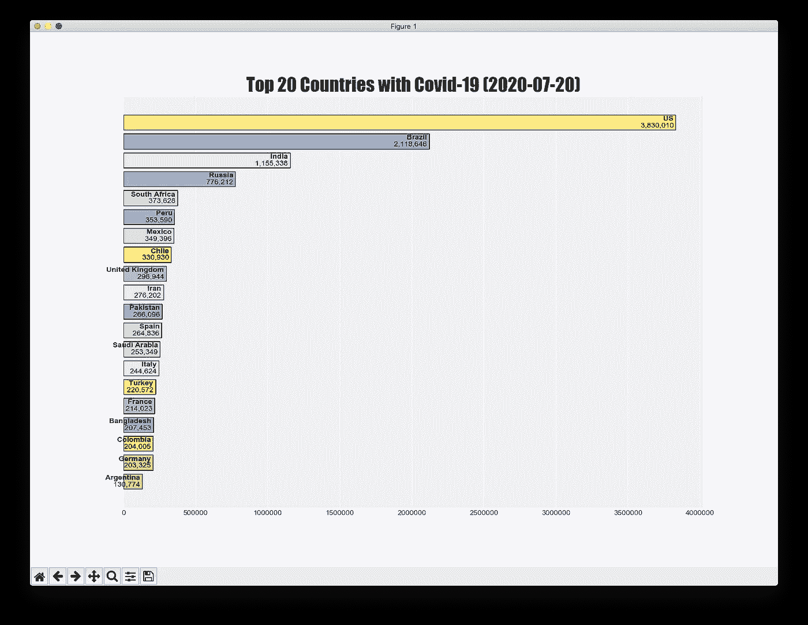
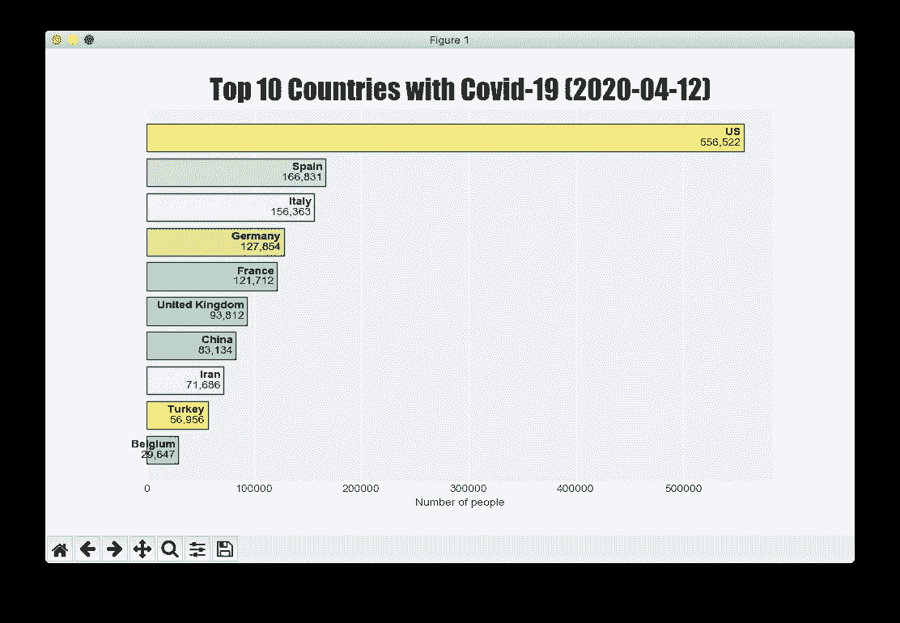

# 使用新冠肺炎数据集创建赛车条形图

> 原文：<https://towardsdatascience.com/creating-a-racing-bar-chart-using-the-covid-19-dataset-c7595d0b51ee?source=collection_archive---------59----------------------->

## 让您的条形图栩栩如生

在我之前的两篇关于使用新冠肺炎数据集进行数据分析的文章中，我首先

*   讨论了如何使用 NumPy 和 Pandas 进行数据分析([https://level up . git connected . com/performing-data-analytics-on-the-新冠肺炎-dataset-using-python-NumPy-and-Pandas-bdfc 352 c61e 9](https://levelup.gitconnected.com/performing-data-analytics-on-the-covid-19-dataset-using-python-numpy-and-pandas-bdfc352c61e9))，随后，
*   如何使用 matplotlib 进行数据可视化([https://level up . git connected . com/performing-data-visualization-using-the-新冠肺炎-dataset-47c441747c43](https://levelup.gitconnected.com/performing-data-visualization-using-the-covid-19-dataset-47c441747c43) )。

新冠肺炎数据集是探索和理解数据分析和可视化的一个很好的候选。在本文中，我将向您展示如何在 matplotlib 中创建一个*动态*图表。特别是我会创建一个*赛车条形图*来动态显示每一天每个国家的确诊病例数。在这篇文章的结尾，你将会看到这样一个图表:



# 争论数据

首先，让我们使用 Jupyter Notebook 来清理和过滤所有数据，这样您就有了一个干净的数据集。准备好数据后，您就可以专注于创建条形图了。

## 导入包

第一步是导入您将用于此项目的所有包:

```
import pandas as pd
import numpy as np
import matplotlib.pyplot as plt
import datetime
```

## 加载数据集

对于本文，我将使用来自[https://www . ka ggle . com/sudalairajkumar/novel-corona-virus-2019-dataset](https://www.kaggle.com/sudalairajkumar/novel-corona-virus-2019-dataset)的最新数据集。所以一定要下载并保存在你的本地机器上。对于我的情况，我将它保存在名为“**Dataset—2020 年 7 月 20 日**”的文件夹中，该文件夹与我的 Jupyter 笔记本的位置相对应:

```
# load the dataset
dataset_path = "./Dataset - 20 July 2020/"
df_conf = pd.read_csv(dataset_path + \
              "time_series_covid_19_confirmed.csv")
df_conf
```

数据帧看起来像这样:



## 对数据帧排序

加载数据框架后，让我们按'**省/州**和'**国家/地区**列对值进行排序:

```
# sort the df
df_conf = df_conf.sort_values(by='Province/State','Country/Region'])
df_conf = df_conf.reset_index(drop=True)
df_conf
```

排序后，`**df_conf**`将如下所示:



## **取消数据帧的透视**

下一步是取消数据框的透视，这样现在就有了两个新列`**Date**`和`**Confirmed**`:

```
# extract the dates columns
dates_conf = df_conf.columns[4:]# perform unpivoting
df_conf_melted = \
    df_conf.melt(
        id_vars=['Province/State', 'Country/Region', 'Lat', 'Long'], 
        value_vars=dates_conf, 
        var_name='Date',
        value_name='Confirmed')df_conf_melted
```

取消透视的数据帧(`**df_conf_melted**`)现在应该如下所示:


## 将日期列转换为日期格式

下一步是将存储在**日期**列中的日期格式化为**日期**对象:

```
# convert the date column to date format
df_conf_melted[“Date”] = df_conf_melted[“Date”].apply(
    lambda x: datetime.datetime.strptime(x, ‘%m/%d/%y’).date())df_conf_melted
```

更新后的`**df_conf_melted**`数据帧现在看起来像这样:



## 按日期和国家/地区分组，并总结每个国家的确诊病例

现在是总结每个国家(不分省/州)所有确诊病例的时候了。您可以使用以下语句来实现:

```
# group by date and country and then sum up based on country
df_daily = df_conf_melted.groupby(["Date", "Country/Region"]).sum()
df_daily
```

`**df_daily**`数据框现在显示了每个国家的每日确诊病例:



## 按日期排序数据帧并确认

我们希望根据两个关键字对`**df_daily**`数据帧进行排序:

*   `**Date**`(升序)
*   `**Confirmed**`(降序)

因此，以下语句实现了这一点:

```
df_daily_sorted = df_daily.sort_values(['Date','Confirmed'], 
                      ascending=[True, False])
df_daily_sorted
```

`**df_daily_sorted**`数据帧现在看起来像这样:



最后要做的一件事是，让我们将国家列表提取为一个列表:

```
# get the list of all countries
all_countries = list(df_conf['Country/Region'])
```

这将在下一节中使用。

## 每天都在重复

既然我们的`**df_daily_sorted**`数据框架已经按照我们想要的方式进行了排序和格式化，我们现在可以开始深入研究它了。

首先，定义我们想要查看的前 *n* 个国家:

```
top_n = 20    # view the top 20 countries
```

让我们按照第一级索引(**级 0** ，即`**Date**`)对`**df_daily_sorted**`数据帧进行分组，然后遍历它:

```
for date, daily_df in df_daily_sorted.groupby(level=0):
    print(date)
    print(daily_df)    # a dataframe
```

您应该会看到以下输出:

```
2020-01-22
                                       Lat         Long  Confirmed
Date       Country/Region                                         
2020-01-22 China               1085.292300  3688.937700        548
           Japan                 36.204824   138.252924          2
           Thailand              15.870032   100.992541          2
           Korea, South          35.907757   127.766922          1
           Taiwan*               23.700000   121.000000          1
...                                    ...          ...        ...
           West Bank and Gaza    31.952200    35.233200          0
           Western Sahara        24.215500   -12.885800          0
           Yemen                 15.552727    48.516388          0
           Zambia               -13.133897    27.849332          0
           Zimbabwe             -19.015438    29.154857          0

[188 rows x 3 columns]
2020-01-23
                                       Lat         Long  Confirmed
Date       Country/Region                                         
2020-01-23 China               1085.292300  3688.937700        643
           Thailand              15.870032   100.992541          3
           Japan                 36.204824   138.252924          2
           Vietnam               14.058324   108.277199          2
           Korea, South          35.907757   127.766922          1
...                                    ...          ...        ...
```

以上数据框显示了每个国家的确诊病例总数(按降序排列)，按`**Date**`排序。

对于每一天，提取排名前 *n* 的国家及其确诊病例数:

```
for date, daily_df in df_daily_sorted.groupby(level=0):       
    print(date)
    **#** print(daily_df)    # a dataframe
    **topn_df = daily_df.head(top_n)**# get all the countries from the multi-index of the dataframe **countries = list(map(lambda x:(x[1]),topn_df.index))[::-1]    
    confirmed = list(topn_df.Confirmed)[::-1]**  **print(countries)
    print(confirmed)**
```

> 注意，我用`**[::1]**`颠倒了`**countries**`和`**confirmed**`列表的顺序。这是为了确保病例最多的国家列在最后。这样做将确保稍后当您使用`**plt.barh()**`方法绘制水平条形图时，案例最多的国家将被列在顶部。这是因为`***plt.barh()***`方法在向上的方向绘制水平条。

您将看到类似这样的内容:

```
2020-01-22
['Bangladesh', 'Bahrain', 'Bahamas', 'Azerbaijan', 'Austria', 'Australia', 'Armenia', 'Argentina', 'Antigua and Barbuda', 'Angola', 'Andorra', 'Algeria', 'Albania', 'Afghanistan', 'US', 'Taiwan*', 'Korea, South', 'Thailand', 'Japan', 'China']
[0, 0, 0, 0, 0, 0, 0, 0, 0, 0, 0, 0, 0, 0, 1, 1, 1, 2, 2, 548]
2020-01-23
['Bahamas', 'Azerbaijan', 'Austria', 'Australia', 'Armenia', 'Argentina', 'Antigua and Barbuda', 'Angola', 'Andorra', 'Algeria', 'Albania', 'Afghanistan', 'US', 'Taiwan*', 'Singapore', 'Korea, South', 'Vietnam', 'Japan', 'Thailand', 'China']
[0, 0, 0, 0, 0, 0, 0, 0, 0, 0, 0, 0, 1, 1, 1, 1, 2, 2, 3, 643]
2020-01-24
['Azerbaijan', 'Austria', 'Australia', 'Armenia', 'Argentina', 'Antigua and Barbuda', 'Angola', 'Andorra', 'Algeria', 'Albania', 'Afghanistan', 'Vietnam', 'US', 'Korea, South', 'Japan', 'France', 'Taiwan*', 'Singapore', 'Thailand', 'China']
...
```

此时，您基本上已经获得了绘制条形图所需的所有数据，该条形图显示了每个国家每天的确诊病例数。

# 绘制条形图

您现在可以显示一个竞赛条形图，显示每个国家的确诊病例数。您不能在 Jupyter Notebook 中显示动态图表，因此让我们编写以下代码，并将其保存为名为 **RacingBarChart.py** 的文件(保存在您启动 Jupyter Notebook 的同一目录中)。下面以粗体显示的代码是绘制赛车条形图的代码:

```
import pandas as pd
import numpy as np
import matplotlib.pyplot as plt
import datetime# load the dataset
dataset_path = "./Dataset - 20 July 2020/"
df_conf = pd.read_csv(dataset_path + 
              "time_series_covid_19_confirmed.csv")# sort the dfs
df_conf = df_conf.sort_values(by=
    ['Province/State','Country/Region'])df_conf = df_conf.reset_index(drop=True)# extract the dates columns
dates_conf = df_conf.columns[4:]# perform unpivoting
df_conf_melted = \
    df_conf.melt(
        id_vars=['Province/State', 'Country/Region', 'Lat', 'Long'],
        value_vars=dates_conf,
        var_name='Date',
        value_name='Confirmed')# convert the date column to date format
df_conf_melted["Date"] = df_conf_melted["Date"].apply(
    lambda x: datetime.datetime.strptime(x, '%m/%d/%y').date())# group by date and country and then sum up based on country
df_daily = df_conf_melted.groupby(["Date", "Country/Region"]).sum()df_daily_sorted = df_daily.sort_values(['Date','Confirmed'],
                      ascending=[True, False])# get the list of all countries
all_countries = list(df_conf['Country/Region'])**# plotting using the seaborn-darkgrid style
plt.style.use('seaborn-darkgrid')****# set the size of the chart
fig, ax = plt.subplots(1, 1, figsize=(14,10))****# hide the y-axis labels
ax.yaxis.set_visible(False)****# assign a color to each country
NUM_COLORS = len(all_countries)
cm = plt.get_cmap('Set3')
colors = np.array([cm(1.*i/NUM_COLORS) for i in range(NUM_COLORS)])**top_n = 20for date, daily_df in df_daily_sorted.groupby(level=0):
    **#** print(date)
    **#** print(daily_df)    # a dataframe
    topn_df = daily_df.head(top_n)

    # get all the countries from the multi-index of the dataframe
    countries = list(map (lambda x:(x[1]),topn_df.index))[::-1]
    confirmed = list(topn_df.Confirmed)[::-1] **# clear the axes so that countries no longer in top 10 will not 
    # be displayed
    ax.clear()** **# plot the horizontal bars
    plt.barh(
        countries,
        confirmed,
        color = colors[[all_countries.index(n) for n in countries]],
        edgecolor = "black",
        label = "Total Number of Confirmed Cases")** **# display the labels on the bars
    for index, rect in enumerate(ax.patches):
        x_value = rect.get_width()
        y_value = rect.get_y() + rect.get_height() / 2** **# display the country
        ax.text(x_value, y_value, f'{countries[index]} ',
            ha="right", va="bottom",
            color="black", fontweight='bold')** **# display the number
        ax.text(x_value, y_value, f'{confirmed[index]:,} ',
            ha="right", va="top",
            color="black")** **# display the title
    plt.title(f"Top {top_n} Countries with Covid-19 ({date})",
        fontweight="bold",
        fontname="Impact",
        fontsize=25)** **# display the x-axis and y-axis labels**
    **plt.xlabel("Number of people")** **# draw the data and runs the GUI event loop
    plt.pause(0.5)****# keep the matplotlib window
plt.show(block=True)**
```

要运行该应用程序，请在您的**终端/Anaconda** 提示符中键入以下内容:

`**$ python RacingBarChart.py**`

您现在应该会看到赛车条形图:



如果不想显示这么多国家，调整`**top_n**`变量的值:

```
top_n = **10**
```

并更改图形的大小:

```
fig, ax = plt.subplots(1, 1, figsize=(**10,6**))
```



如果你想加速比赛，改变`**pause()**`功能的持续时间:

```
# draw the data and runs the GUI event loopplt.pause(**0.2**)
```

# 摘要

我希望你有机会尝试一下赛车条形图。赛车条形图允许信息动态呈现，是一个非常强大的媒介来推动你的观点。如果您有任何改进，请告诉我，我很乐意收到您的来信！下次见！