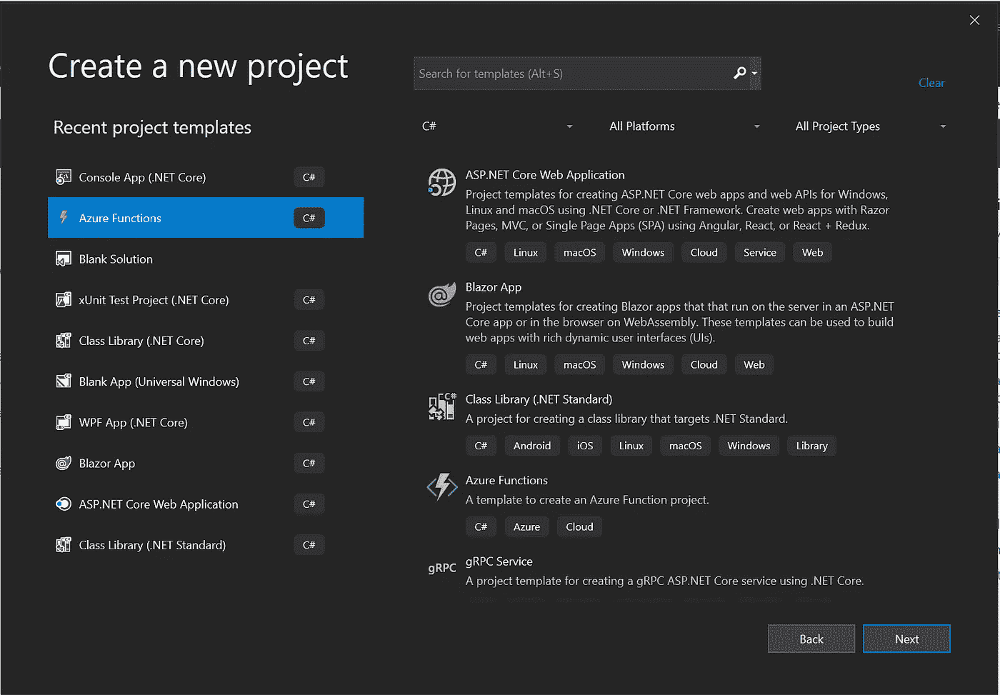
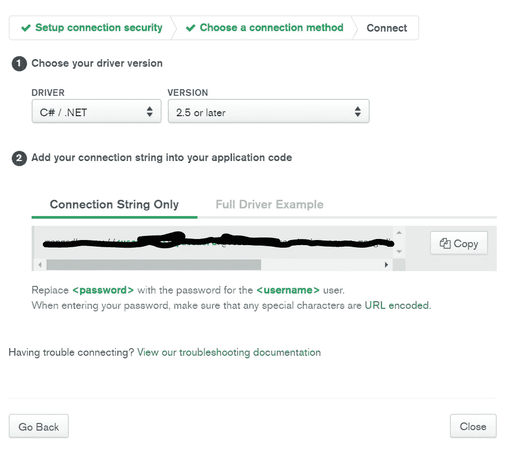
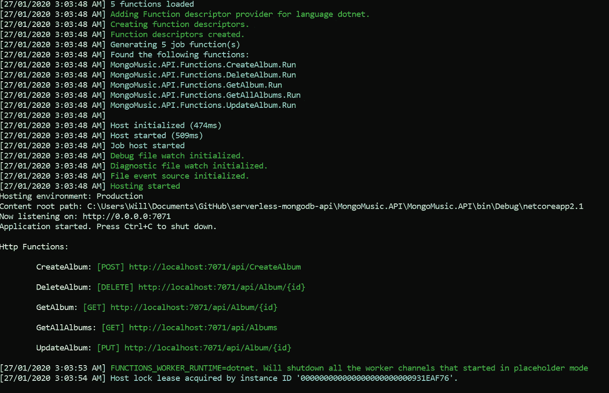
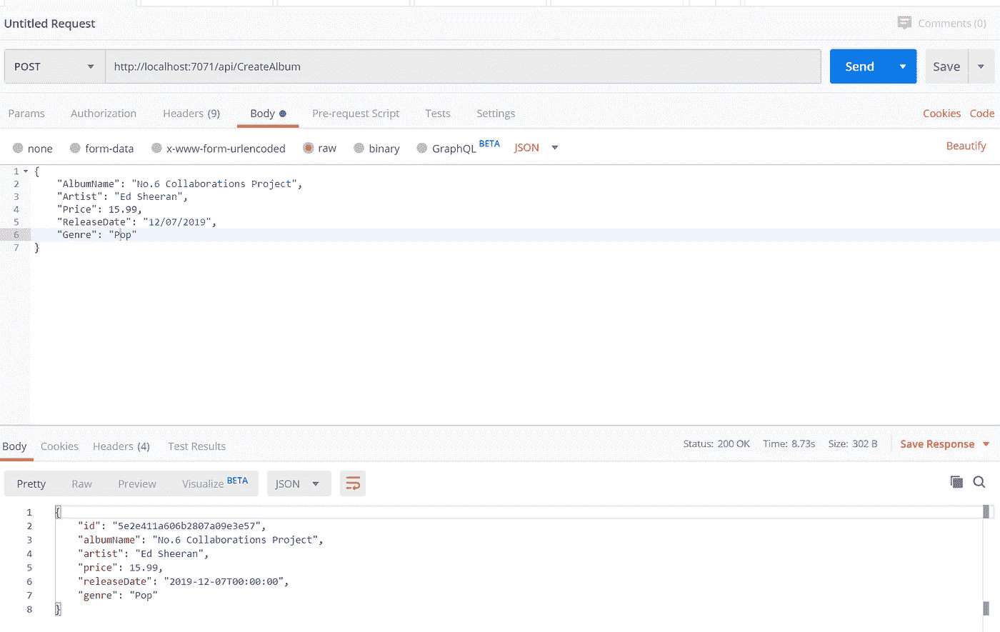
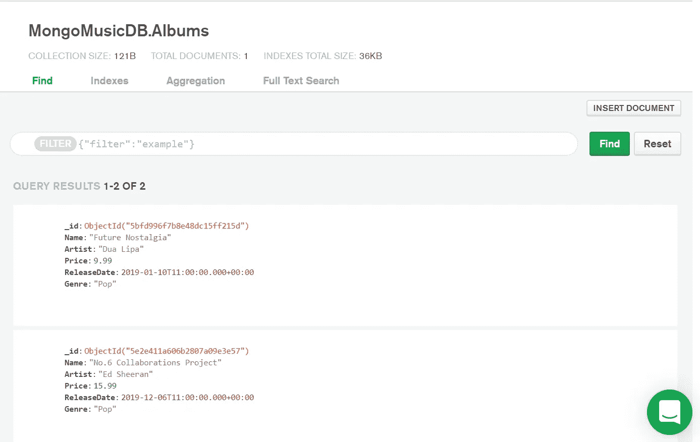
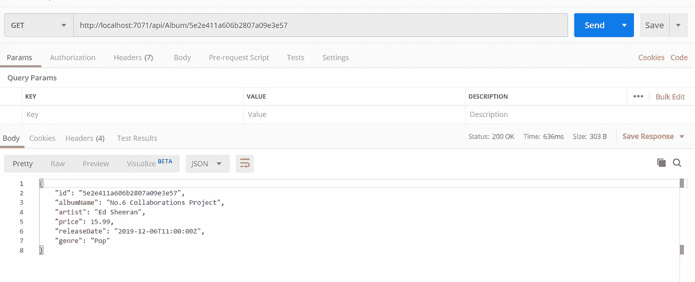
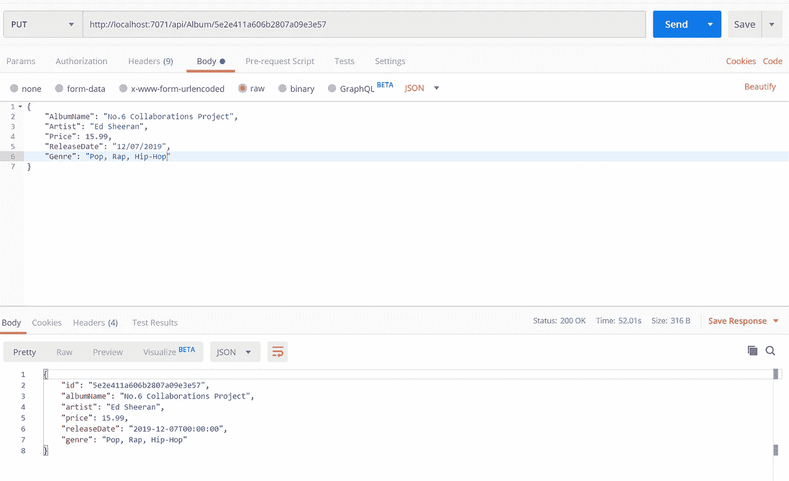

# 用 Azure 函数和 MongoDB 创建 RESTful 无服务器 API

> 原文：<https://towardsdatascience.com/creating-a-restful-serverless-api-with-azure-functions-and-mongodb-6221cfd51a43?source=collection_archive---------13----------------------->

## 了解如何使用 Azure 函数创建一个使用 MongoDB Atlas 作为后端的无服务器 API。


在本教程中，我们将在使用 [MongoDB Atlas](https://www.mongodb.com/cloud/atlas) 后端的 [Azure Functions](https://azure.microsoft.com/en-us/services/functions/) 中使用 HTTP 触发器构建一个无服务器 API。我们将为一个存储专辑信息的假想音乐库构建一个 API。

我们将使用 C#来构建这个 API，因此您至少需要理解 C#的语法。我不打算深入探究 Azure 函数和 MongoDB 背后的复杂性的大量细节，我只想简单地展示它们如何一起工作来创建一个简单的 API。

如果你想了解更多关于 MongoDB 的知识，我强烈推荐你去看看 [MongoDB 大学](https://university.mongodb.com/)。他们为希望了解 MongoDB 所有知识的开发人员和 DBA 提供了极好的免费课程。如果你喜欢这篇文章，并且想了解更多关于 Azure 函数的知识，我建议你查看一下[文档](https://docs.microsoft.com/en-us/azure/azure-functions/)。

**什么是 MongoDB？**

MongoDB 是一个 NoSQL 文档数据库，在索引和查询方面为开发人员提供了灵活性。数据存储在 JSON 文档中，这允许我们随时改变数据结构。

MongoDB Atlas 本质上是 MongoDB 的托管服务，我们可以将其用于我们的 MongoDB 集群。我们可以在 Azure、AWS 或 GCP 上托管我们的 MongoDB Atlas 集群。

对于 C#开发，我们可以使用[MongoDB 驱动程序](https://docs.mongodb.com/ecosystem/drivers/csharp/)连接到我们的 MongoDB 集群。在开发期间使用它时，重要的是使用与您的 Atlas 集群正在使用的 Mongo 版本兼容的驱动程序。

**什么是 Azure 功能？**

Azure 函数是我们可以在 Azure 中运行的小块代码，而不用太担心应用程序基础设施(这种“担心”因场景而异。真的要看情况和你的要求)。

我们可以使用特定的事件来触发函数中的动作。对于本教程，我们将基于 HTTP 请求触发事件。

**设置 MongoDB Atlas 集群**

在开始编码之前，我们需要设置我们的 MongoDB Atlas 集群。MongoDB 文档中有一个关于如何设置 Atlas 集群的很棒的指南，所以如果你还没有的话，[看看这个指南。](https://docs.atlas.mongodb.com/getting-started/)

**创建 Azure 函数**

一旦你创建了你的集群，让我们创建我们的 Azure 函数。我准备用 Visual Studio 2019 开发我的函数。为了使用 Visual Studio 开发 Azure 功能，请确保您已经启用了 Azure 开发工作负载[。](https://visualstudio.microsoft.com/vs/features/azure/)

创建一个“**新项目**，点击“ **Azure Functions** ”。就像我之前说的，我们要用 C#做这个项目，所以要确保这是模板中选择的语言。



现在您已经选择了正确的模板，为您的 API 命名并设置一个容易找到的位置来保存项目。


现在，我们可以选择想要创建的函数类型。由于这是一个 API，我将创建一个带有 HTTP 触发器的**函数。创建 HTTP 触发器函数时，可以设置该函数将使用的存储帐户以及授权级别。**

我们在这里不会做任何授权的事情，所以只需将它设置为“**Anonymous”**。关于授权的一个快速注释，如果您创建了一个具有某个级别的函数，但决定以后需要更改它，您可以在代码中这样做，所以不要太担心这个设置。只是帮 Visual Studio 给你生成一个模板。


点击**创建**并祝贺您！你现在有一个 Azure 函数。虽然这不是很好，但是让我们做点什么吧。

**连接到 MongoDB 集群**

好了，现在我们已经设置好了函数，让我们获取到 MongoDB Atlas 集群的连接字符串。

前往您的 Atlas 门户网站(如果您尚未登录)并登录。点击**连接**按钮，如下图所示:


因为我们要将应用程序连接到我们的集群，所以为我们的连接方法选择**连接您的应用程序**选项:


现在我们必须选择一个驱动程序版本。选择" **C#/。NET"** 为驱动" **2.5 或更高版本"**为版本。复制连接字符串，因为我们以后会用到它。



现在，让我们创建一个名为 Startup.cs 的新类。这个类将允许我们在函数中使用依赖注入。

在我的启动类中，我正在实例化我的 **MongoClient** 的单例实例，这样所有的函数都可以使用它。这里我们所需要的是获取我们的 MongoDB Atlas 集群的连接设置，并将其作为字符串参数传递。

我已经将这个实际的连接字符串放在我的 local.settings.json 文件中，该文件是在 config 的**icon configuration**实例中获得的。将连接字符串或设置硬编码到您的代码中并不是一个好主意，因此这是您的代码中可以用来保护应用程序所需的秘密的一种方法。

**设置我们的相册类**

现在让我们建立我们的相册类。这门课我们不会做什么太惊人的事情。为了让这个模型与 MongoDB 驱动程序一起工作，我简单地强调了我们需要/可以做的几件事情。我们的类的定义如下:

在这个类中，我已经给了我的专辑一个 Id、名称、艺术家、价格、发行日期和流派。很简单。这里我想强调的两件事是 Id 属性和 AlbumName 属性。

对于 Id 属性，我已经将该属性指定为我们的 ObjectId。这充当了我们的 MongoDB 文档的主键。MongoDB 驱动程序会为我们生成这个。

对于 AlbumName 属性，我将该属性装饰为一个名为 Name 的 BsonElement。当这个属性被持久化到 MongoDB 时，它将在我们的文档中被调用。

**创建 RESTful 方法**

我们已经获得了制作 RESTful API 所需的几乎所有东西，所以让我们开始构建它吧。对于我们所有的函数，我已经创建了一个构造函数，它接受以下参数，这些参数将有助于注入我们的依赖项:

*   MongoClient :连接到我们的数据库。
*   **ILogger** :这样我们可以在函数中记录活动。如果你在 Azure 上部署了一个功能并启用了应用洞察，那么你就是日志被发送到的地方。
*   **IConfiguration** :这是我用来管理我们函数中需要的所有秘密的。正如我之前提到的，这些值保存在 local.settings.json 中，用于本地调试。

我还创建了一个 **IMongoCollection <相册>** ，这样我们就可以在 MongoDB 数据库中使用我们的相册集合了。

对于我们所有的函数，所以我们得到一个异常，我刚刚记录了异常消息，并设置我们的 IActionResult returnValue 抛出一个 500 错误响应。没什么复杂的，但是对于这个例子来说足够简单了。

现在让我们深入了解每个函数😊

*创建相册. cs*

在这个函数中，我们传递一个 HttpRequest 类型的请求，并读取该请求的正文。我用过 Newtonsoft。Json 将我的请求反序列化到我的 album 对象中，我正在用我们输入的值创建一个新的 Album 对象。

然后我使用[。InsertOne()](https://docs.mongodb.com/manual/reference/method/db.collection.insertOne/) 方法将我们的新相册对象插入到我们的 MongoDB 中，并使用我们的相册对象将我的返回值设置为一个新的 OkObjectResult。

*GetAlbum.cs*

在这个函数中，我将传递一个 id 来表示我们文档的 id。在我们的 try/catch 语句中，我将尝试使用[来查找具有该 id 的相册文档。在我们的 MongoCollection 上找到()](https://docs.mongodb.com/manual/reference/method/db.collection.find/)方法，并将其返回给用户。如果我们找不到它，我们将发送一个日志消息说我们找不到它，并抛出一个 404。

*GetAllAlbum.cs*

在这些函数中，我们在这里所做的就是使用 [Find()](https://docs.mongodb.com/manual/reference/method/db.collection.find/) 函数来查找我们的相册集合中的所有相册，并将它们作为列表返回给用户。如果收藏中有专辑，我们会返回一个 404。

*UpdateAlbum.cs*

UpdateAlbum 略有不同。这里我们传递我们的请求体和一个 id。我将我们的主体反序列化为一个相册对象，然后设置我们传递给 updatedResult 项的 id。

我使用 [ReplaceOne()](https://docs.mongodb.com/manual/reference/method/db.collection.replaceOne/) 方法做两件事。首先，使用 id 在集合中查找具有该 id 的相册，然后，我传递 updatedResult 相册对象来替换现有的条目。如果我们找不到这个项目，我会抛出一个 404。

*删除相册. cs*

在我们的 DeleteAlbum 函数中，我们再次传递我们希望删除的文档的 id，并使用 [DeleteOne()](https://docs.mongodb.com/manual/reference/method/db.collection.deleteOne/) 函数找到具有该 id 的相册，然后删除它。

**使用 POSTMAN 测试我们的 API**

我们所有的方法都已经就绪，所以我们现在可以开始使用 Postman 测试我们的 API 了。让我们依次测试我们的每一个功能。在 Visual Studio 中按 F5 启动我们的函数。

它不应该需要太长时间，但一旦它完成，你应该给每个功能的一些网址如下:



保持这个控制台窗口打开，因为这些 URL 被映射到每个函数，我们将需要使用它们来触发我们的函数。

对于我们的 **CreateAlbum** 函数，我们需要发送下面的 JSON 有效载荷来将一个相册插入到我们的集合中。这是我发送的有效载荷:

```
{
  "albumName": "No.6 Collaborations Project",
  "artist": "Ed Sheeran",
  "price": 15.99,
  "releaseDate": "2019-12-06T11:00:00Z",
  "genre": "Pop"
}
```

将 URL 粘贴到文本框中，并确保类型设置为 **POST** 。点击**发送**，应该会得到如下响应:



看来成功了！回到你的相册集群，导航到你的相册收藏，点击**找到**。我们应该能够看到作为 JSON 有效负载的一部分发送的带有值的插入文档。



让我们尝试读取我们刚刚创建的项目！复制并粘贴该项目的 _id 字段，然后在我们的 GetAlbum URL 中将它用作 id 参数。将请求类型更改为 **GET** 并点击“ **Send** ”。



如您所见，我们应该在主体中看到返回给我们的已创建相册的文档。

快速浏览维基百科后，这张专辑涵盖了更多的流派，所以我们需要更新我们的文档。使用相同的 id，将请求类型更改为 **PUT** 并更新主体，如下所示:

```
{
  "albumName": "No.6 Collaborations Project",
  "artist": "Ed Sheeran",
  "price": 15.99,
  "releaseDate": "2019-12-06T11:00:00Z",
  "genre": "Pop, Rap, Hip-Hop"
}
```

点击**发送**更新我们的文档:



在 Atlas 中找到您的收藏，然后点击“**查找**”。我们应该看到更新后的文档在 MongoDB 中保持不变。


现在让我们测试一下我们的函数，看看我们是否可以删除文档。使用 id 作为 Id 参数，并将请求类型设置为**删除**。点击**发送**删除文件。


回到地图，再次点击**找到**。如果成功了，这个文档应该从我们的相册收藏中删除。


**结论**

在本教程中，我们学习了如何使用 Azure 函数构建一个真正简单的 API，该 API 使用 MongoDB 作为数据存储。虽然这是一个非常简单的项目，但希望本教程能给你一些如何在 Azure 函数中使用 MongoDB 的想法。

如果你想看完整的样本，请查看 GitHub 上的代码！

如果你有任何问题，请在下面的评论区告诉我！