# 用 9 个简单的步骤在 Microsoft Azure 中从头开始创建一个无服务器的 Python 聊天机器人 API

> 原文：<https://towardsdatascience.com/creating-a-serverless-python-chatbot-api-in-microsoft-azure-from-scratch-in-9-easy-steps-2f1913fc9581?source=collection_archive---------3----------------------->

## 学习使用 Azure Function 应用程序创建和部署自己的无服务器聊天机器人应用程序，这些应用程序可用于 Slack、Skype、MS Teams 和其他应用程序

# 介绍

聊天机器人和无服务器是 2020 年完全主导企业界的两大技术趋势:
为什么不一石二鸟，学习如何构建自己的无服务器聊天机器人？

完成本文后，您将知道如何:

1.  在 Azure 中部署无服务器应用程序，
2.  建立一个聊天机器人，可以嵌入到一个网站，连接到微软团队，Slack，Skype，Facebook Messenger 和许多其他渠道！


图片作者:皮沙贝的穆罕默德·哈桑

## 为什么是聊天机器人？

我们现在都知道，在未来几年，聊天机器人将在世界各地的组织中变得越来越突出。从优化公司和客户之间的信息交流到完全取代销售团队。

根据 Juniper Research 发布的一篇论文，我们可以预计，到 2022 年，客户服务领域多达 75 **%** 的查询将由机器人处理，每年将带来 80 亿美元的业务成本。

## 为什么没有服务器？


图片来源:Pixabay 的 Nikin

无服务器应用程序是另一个巨大的技术趋势，它们允许在线部署简单的应用程序，而不需要建立或管理任何类型的服务器基础设施。此外，现在有了微软和亚马逊等公司提供的优秀云服务，就有可能(也非常容易)完全根据使用情况来扩展您的应用程序，因此您只需为使用量付费，永远不必担心没有足够的带宽！

# 教程:

现在，我们将通过几个步骤来建立和设置你的机器人。
你需要的只是一个 Azure 订阅，Visual Studio 代码(VSCode)安装在你的机器上，旁边还有一些 Python 版本！

## 步骤 1:在 Azure Portal 上注册一个新的 Web 应用程序 Bot 服务

首先登录 Azure 门户网站，在搜索栏上查找 Web 应用程序 Bot，这将允许您导航到 Bot 服务页面，在这里您可以**在 Azure 门户网站上创建一个新的 Web 应用程序 Bot** 。

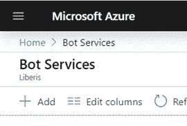

您可以通过在 Azure 门户主页上搜索来找到 Bot 服务

单击 **add** 创建新服务，这将带您进入下一页，在这里您必须选择一系列配置，您可能需要创建一个新的资源组，并确保选择 S1 定价层(这是我们目前需要的)。

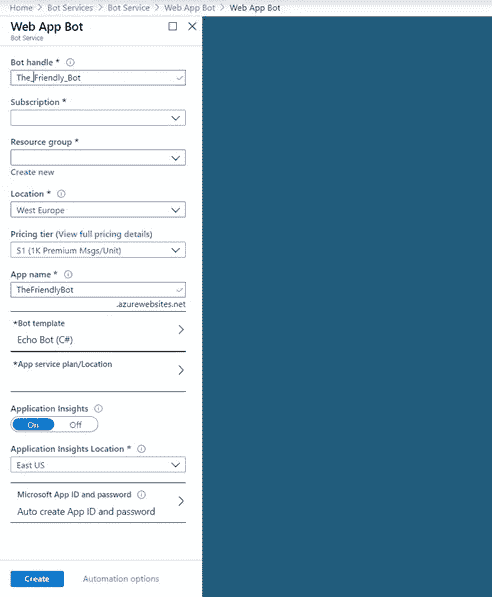

选择 **Echo Bot C#** 模板，我们稍后将稍微修改该模板以将 Bot 连接到我们的 API。

## 步骤 2:通过 VSCode 设置 Azure 访问

此时，我们将创建我们的 bot 将与之交互的后端。有多种方法可以做到这一点，你可以在 Flask、Django 或任何其他框架中创建一个 API。

我们将使用 Azure Function 应用程序，因为它可以非常简单地建立一个无服务器的 API，可以根据需求进行很好的扩展。

首先，**创建一个新文件夹**并在 VSCode 上打开它:

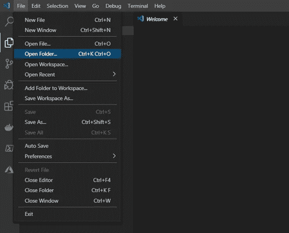

现在，我们需要安装一些扩展来帮助我们创建一个功能应用程序，并将其推送到 Azure，即我们需要 Azure CLI 工具和 Azure 功能。

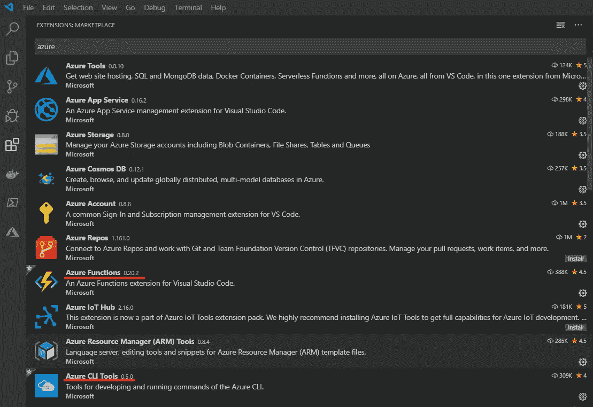

一旦你安装了 VSCode 的扩展，你就可以通过 VSCode 登录你的 Azure 订阅来管理那里的资源！

**按 CTRL+SHIFT+P** 打开 VSCode 命令托盘，然后输入 Azure Sign in。

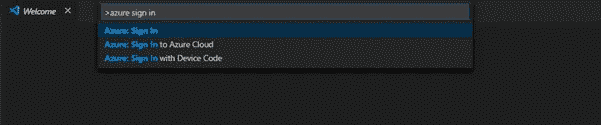

登录后，您应该会在 VSCode 的底部栏看到以下内容:


## 步骤 3:创建一个新的 Azure Function App 项目

导航到 VSCode 中的 Azure function 选项卡并创建一个新项目:

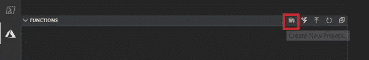

遵循将出现在 VSCode 命令托盘上的提示:

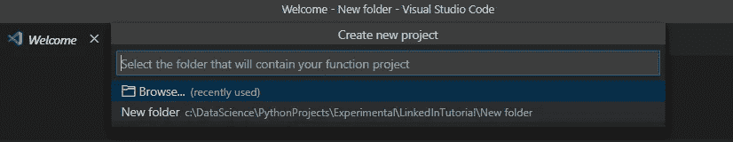

选择要使用的语言(在本例中为 Python)并创建新的虚拟环境:

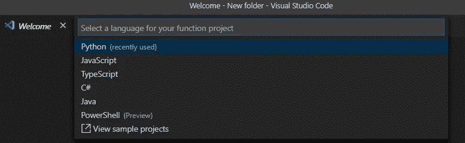

作为我们的模板，我们将使用 HTTP 触发器:

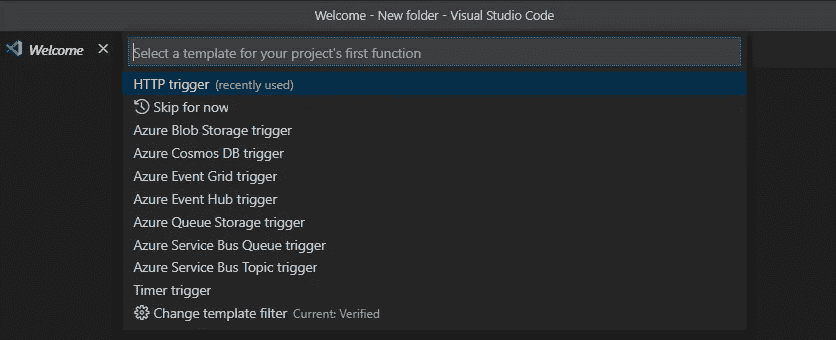

我们将使我们的安全**选项匿名**，这意味着任何人都可以访问你的 API 而不需要 API 密钥，你可以在这里阅读更多关于认证设置的信息:

[](https://docs.microsoft.com/en-us/azure/azure-functions/) [## Azure 函数文档

### Azure Functions 是一种无服务器的计算服务，让您无需显式地…

docs.microsoft.com](https://docs.microsoft.com/en-us/azure/azure-functions/) 

最后，**为保存无服务器功能应用程序的文件夹选择一个名称**，然后**按回车键**。

## 第四步:修改函数应用程序的代码

现在您已经创建了您的函数应用程序，应该已经为您的项目自动生成了一个文件夹结构。您应该会看到一个文件夹，其名称与您在步骤 3 中创建项目时传递的名称相同。

在这个文件夹中，应该有一个名为 __init__ 的 python 文件。py，看起来像这样:

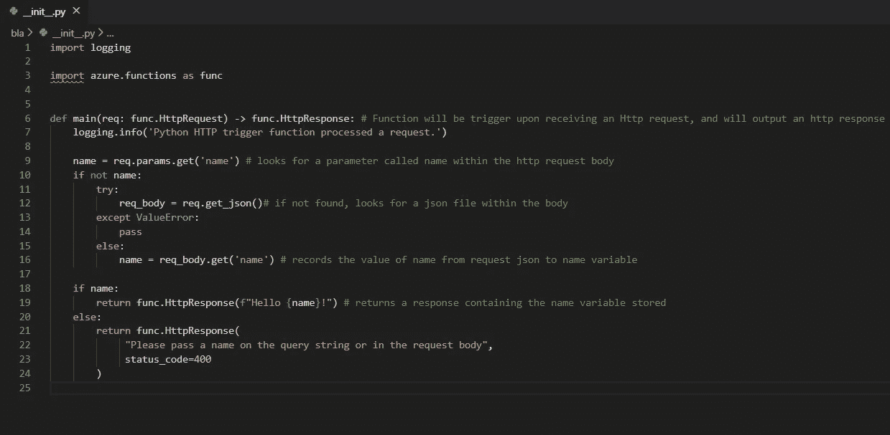

__init__。py 注释

即使对于有经验的 Python 程序员来说，主函数定义的语法初看起来也有点令人畏惧:

```
def main(req: func.HttpRequest) -> func.HttpResponse:
```

这段代码只是指定函数将在接收到请求对象时执行，并将返回 HTTP 响应。

从这里，我们可以很容易地修改这个模板，以添加我们希望通过我们的机器人接口提供的功能，这可能包括例如从 SQL 数据库查询数据，触发其他功能或您可能需要您的机器人做的任何其他工作。

对于这个用例，我们将使用开放的英国政府数据:我们的无服务器函数将获得一个包含英国城市名称的 HTTP 请求，它将返回该城市所有图书馆的列表。

让我们在应用程序中创建一个名为 **modules** 的文件夹，并在其中创建一个名为 **library_finder.py 的新文件。**

此时，您的项目应该是这样的:

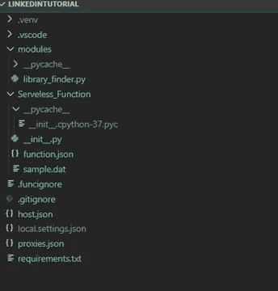

在 library_finder.py 中粘贴以下代码片段:

您需要在 azure function 为我们创建的虚拟环境中安装 pandas。

如果您不熟悉虚拟环境，请查看以下链接:

 [## 12.虚拟环境和包- Python 3.8.2 文档

### Python 应用程序通常会使用不属于标准库的包和模块。应用程序…

docs.python.org](https://docs.python.org/3/tutorial/venv.html) 

我们的虚拟环境已经设置好了，我们现在只需要激活它。这可以在 vscode 中通过键入

```
.venv\Scripts\activate 
```

在 VSCode 的终端窗口中。

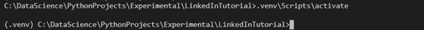

如果您的环境已经成功激活，您将看到(。venv)在路径的开始。

现在我们可以安装熊猫了，只需在你的控制台中输入“pip install pandas”

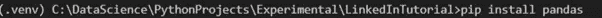

(对于您希望通过 pip 安装的任何其他外部库，可以重复相同的过程)。

**现在将熊猫添加到您的 requirements.txt 文件中非常重要，它看起来应该是这样的:**

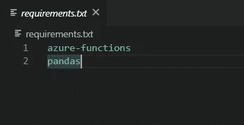

现在我们可以回到 **__init__。py** (我们的无服务器应用程序的主文件)并修改代码，以便在接收到 HTTP 请求时(a)我们将在 json 上查找附加到请求正文的文本字段，(b)我们将读取文本并解析它，(c)我们将调用我们刚刚定义的函数并返回请求的数据。

以下代码将满足我们的目的:

## 步骤 5:在本地测试您的 API

我们现在已经使用 Azure 函数创建了一个基本的无服务器 API，是时候测试我们是否一切都按预期工作了！

我们可以在本地启动我们的 Azure 功能应用程序。为此，请在终端中用 VS 代码键入以下命令:

```
func start
```

您的功能将被初始化，您应该会看到标志性的 Azure Function 应用程序徽标！


如果一切正常，您应该不会看到任何错误，并且在提示符的末尾会显示如下消息:


该消息包含与我们在本地启动的无服务器应用程序通信的 URL。这可以很容易地用一个叫做 Postman 的免费软件来完成。在 Postman 中，您可以通过发送请求并查看响应来调试 API。

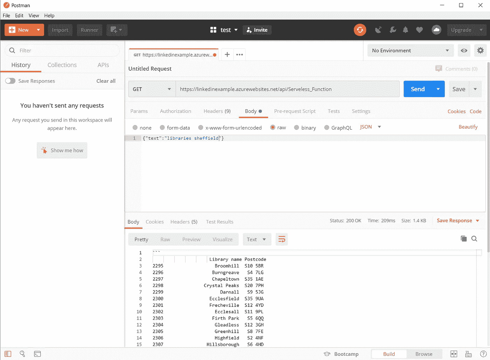

或者，您可以通过在命令提示符窗口中打开 Python 并向指定的 URL 发送请求，然后检查我们是否获得了预期的响应，来测试 API 是否正在工作。

## 第六步:将你的功能应用部署到 Azure

现在，您的无服务器应用程序正在工作，并且您已经成功创建了一个 HTTP 触发器，是时候将它部署到 Azure 了，这样您就可以从本地网络外部访问它。

要部署它，只需导航到 VScode 中的 Azure 选项卡，然后**滚动到函数窗口**。

**右键点击你的 Azure 订阅**，按**在 Azure 中创建功能 App**。

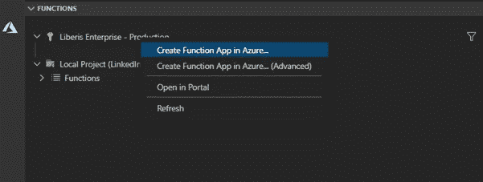

提示将要求您命名函数，提供位置和 Python 版本。按照要求执行步骤，等待直到 Azure 函数创建完成。你应该可以在 Azure Functions 选项卡中找到它，再次右键单击该函数并选择 Deploy to Function App。

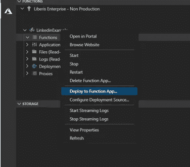

将出现一个提示，要求确认部署，几分钟后，将出现一条消息，表明部署已经成功。

发生这种情况时，您可以通过打开浏览器窗口并导航到以下位置来检查您的部署是否有效:

```
[https://[name_of_your_functionapp].azurewebsites.net/](/[name_of_your_functionapp].azurewebsites.net/)
```

如果您在 Azure 门户页面中导航到您的功能应用程序，也可以找到此链接。

访问该链接后，您应该会看到以下页面:

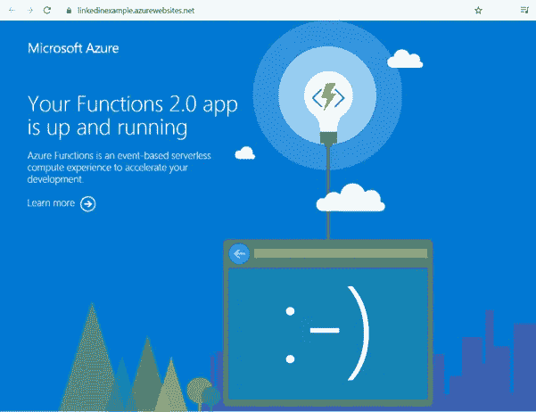

这意味着您已经成功地将您的功能应用程序部署到互联网上，现在任何人都可以访问您的无服务器 API！(取决于您在创建 HTTP 触发器时选择的身份验证设置)

## 步骤 7:将机器人连接到无服务器功能

对于这一步，我们将回到我们在本教程的步骤 1 中在 Azure portal 中创建的 Bot 应用服务！

导航到 web bot 服务主页，转到 build 选项卡，然后**点击“打开在线代码编辑器”**。

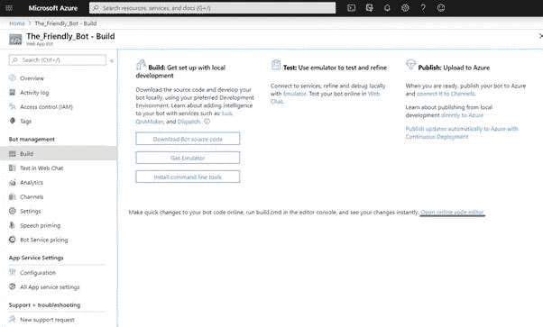

从在线代码编辑器导航到 Bots > EchoBot.cs

这将允许您对机器人的 C#代码进行一些轻微的修改，这是您最初应该看到的内容:

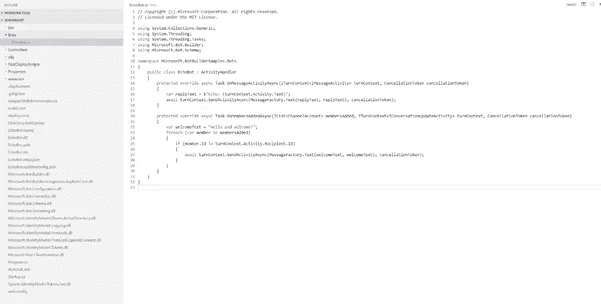

用下面提供的代码替换此页面上的代码:

记得把我们上一步创建的 Azure Function App 的 URL 访问点的 URL 替换掉！

现在我们只需要构建我们对 C#代码所做的修改，这可以通过右键单击页面上的 build.cmd 文件轻松完成

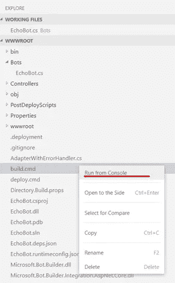

我们可以测试我们的机器人，检查它是否如预期的那样工作。打开 Azure Portal 并导航到您的 Web 应用程序 Bot 主页。

在网络聊天中选择测试选项:

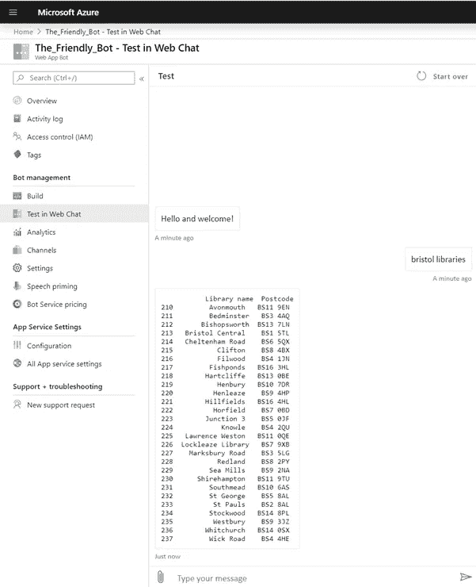

## 步骤 8:将你的机器人发布到频道

如果一切正常，你就可以将这个机器人添加到任何支持的频道了。

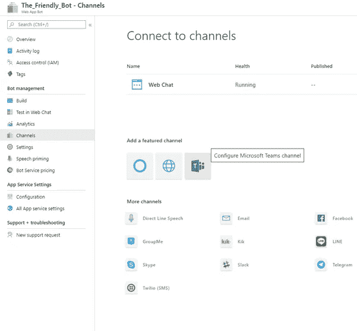

通过按保存并接受使用条款来配置 Microsoft Teams 频道。

接下来，我们可以通过点击“get bot embed codes”链接并复制 HTML 标记内的 URL，为某人提供与我们的 bot 对话的链接。


访问该 URL 的任何人都将被邀请在 MS 团队中添加机器人，如下所示:

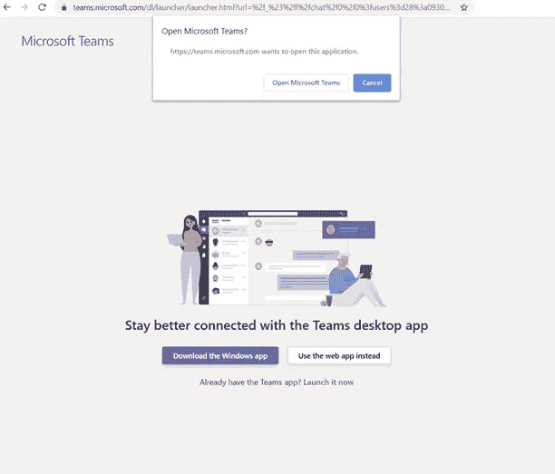

MS 团队将打开，我们的机器人将被列为您的聊天之一。

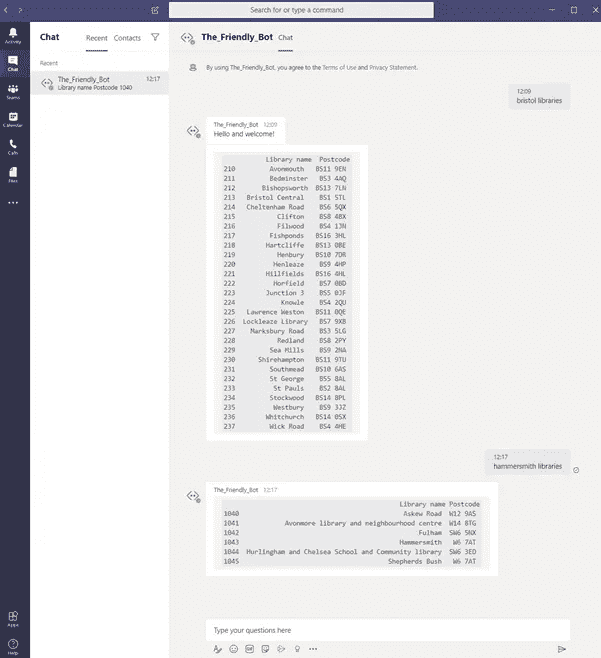

## 步骤 9:(可选)将您的机器人应用程序发布到 MSTeams

这可能足以满足你的机器人需求，如果你想发布机器人，那么它可以被添加到 ms 团队的群聊中，你可以通过打开 MS 团队并点击“…”图标，然后打开**应用工作室**:

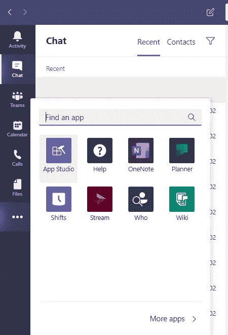

点击**创建新应用**:

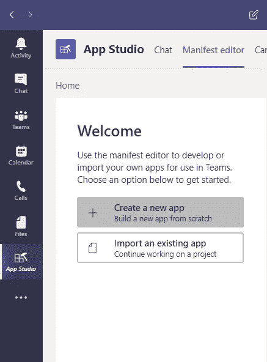

你必须填写登记表。重要的是，一旦您填写了所有必需的信息，导航到机器人选项卡并按下**设置**按钮:

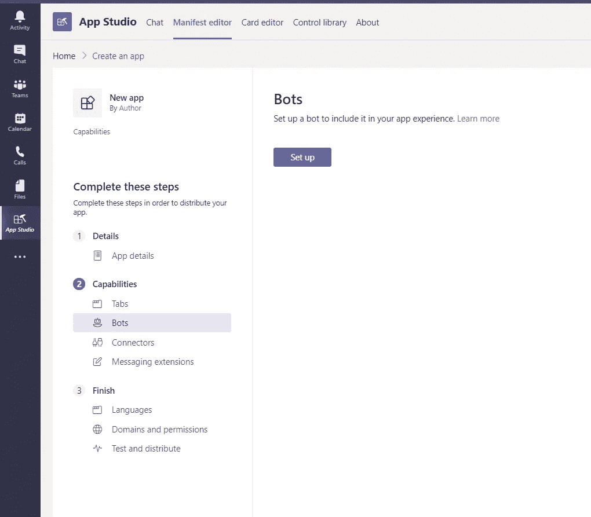

在**现有机器人**选项卡中，我们刚刚创建的机器人应该列在下拉菜单中

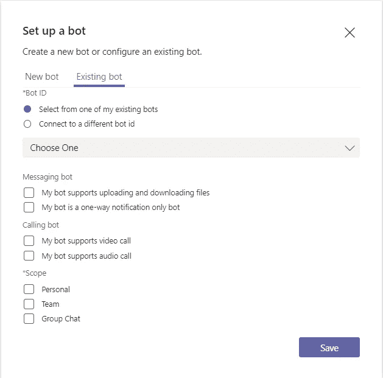

最后一步是导航到清单编辑器上的**测试和分发**选项卡，然后**分组安装**你的应用。

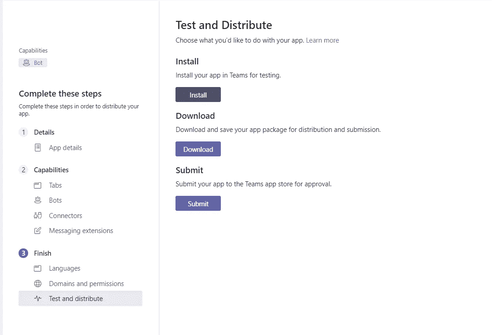

您已经配置了您的 MS Teams 应用程序，您需要做的只是邀请机器人加入特定的团队，并享受您的新无服务器机器人应用程序。