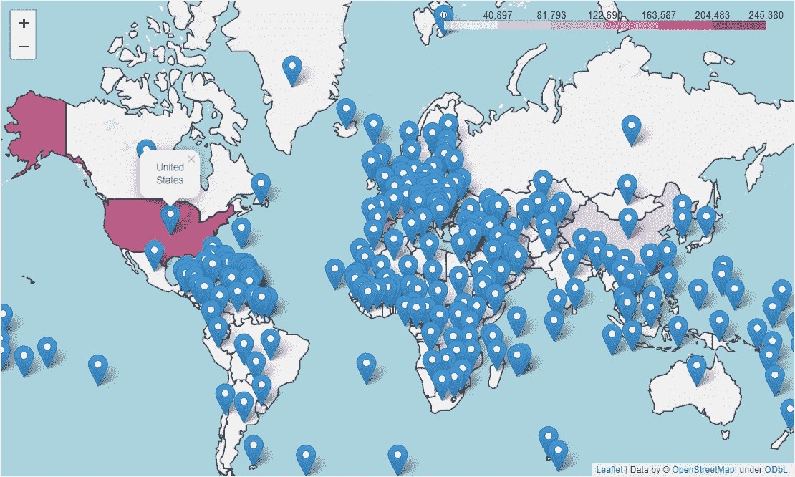

# 创建一个简单的叶子地图-新冠肺炎全球总案例

> 原文：<https://towardsdatascience.com/creating-a-simple-folium-map-covid-19-worldwide-total-case-a0a1429c6e7c?source=collection_archive---------11----------------------->

## 从数字到互动地图


在 [Unsplash](https://unsplash.com?utm_source=medium&utm_medium=referral) 上由 [Brett Zeck](https://unsplash.com/@iambrettzeck?utm_source=medium&utm_medium=referral) 拍照

本文中显示的所有代码都可以在我的 GitHub repo [这里](https://github.com/cornelliusyudhawijaya/Folium_covid)获得。

创建交互式地图有很多方法，但我最喜欢的方法是通过[叶子](https://python-visualization.github.io/folium/index.html)；基于 Python 语言的地图可视化库。

在这篇文章中，我想展示如何创建一个很好的交互式地图，以及当前的情况(2020 年 4 月 4 日)；代表病情的最佳数据应该是世界上新冠肺炎确诊病例的数量。让我们开始吧。

# 创建地图

对于不知道叶子是什么的你；它基本上是一个地图可视化库，有许多内置的专门用于创建交互式地图。我们可以使用下面的命令来安装叶库。

```
#Installation via pip
pip install folium#or, installation via conda
conda install folium -c conda-forge
```

就像我们已经安装了我们的库。现在，让我们尝试展示一个简单的交互式地图(或底图)。

```
import folium#Creating a base map
m = folium.Map()
m
```


使用 leav 的交互式底图示例

现在我们已经有了我们的基本地图。在这种情况下，我想创建一个世界地图，显示截至今天(2020 年 4 月 3 日)新冠肺炎确诊病例的彩色国家部分(这基本上是我们所说的 choropleth 地图)。

要做到这一点，我们首先需要有实际的数据。幸运是，现在有许多现有的 API 提供这种数据。在我的例子中，我会使用来自 thevirustracker.com 的 API。让我们试着从 API 中提取一些数据。下面是从 API 提取数据的步骤。

```
#We would use the requests module to pull the data from API
import requests#Pulling the Worldwide COVID-19 data, we use the get function from requests module with API endpoint(Basically a URL address to request your data) as the function parameter. To know available endpoint, check the API documentationres = requests.get('[https://api.thevirustracker.com/free-api?countryTotals=ALL'](https://api.thevirustracker.com/free-api?countryTotals=ALL'))#We turn the data into json. It would become dictionary in the Python.
covid_current = res.json()
```


从 API 中以 JSON 格式提取的数据(字典)

在上面的数据中，我们可以看到有很多可用的数据，但在这种情况下，我只取国家(' title ')和总案例(' total_cases ')的数据。

```
#Creating the COVID-19 DataFramedf = []
for j in range(1,len(covid_current['countryitems'][0])):
    df.append([covid_current['countryitems'][0]['{}'.format(j)]  ['title'],
         covid_current['countryitems'][0]['{}'.format(j)]['total_cases']])df_covid = pd.DataFrame(df, columns = ['Country', 'Total Case'])
```


我们的新冠肺炎数据

对于最后一个数据，我们还需要一个世界各国的 GeoJSON 数据。GeoJSON 数据是一种表示地理要素(如国家边界)的数据格式。对于我们的情况，leav 已经拥有了我们可以使用的 GeoJSON 数据。

```
#Setting up the world countries data URL
url = '[https://raw.githubusercontent.com/python-visualization/folium/master/examples/data'](https://raw.githubusercontent.com/python-visualization/folium/master/examples/data')country_shapes = f'{url}/world-countries.json'
```

我还将清理新冠肺炎数据，因为在下一步中，我将在地图上使用由 clean 提供的世界国家数据。在这种情况下，我需要在新冠肺炎数据集中使用我的国家名称，以跟随由 leav 提供的国家名称。

```
#Replacing the country namedf_covid.replace('USA', "United States of America", inplace = True)
df_covid.replace('Tanzania', "United Republic of Tanzania", inplace = True)
df_covid.replace('Democratic Republic of Congo', "Democratic Republic of the Congo", inplace = True)
df_covid.replace('Congo', "Republic of the Congo", inplace = True)
df_covid.replace('Lao', "Laos", inplace = True)
df_covid.replace('Syrian Arab Republic', "Syria", inplace = True)
df_covid.replace('Serbia', "Republic of Serbia", inplace = True)
df_covid.replace('Czechia', "Czech Republic", inplace = True)
df_covid.replace('UAE', "United Arab Emirates", inplace = True)
```

现在，我们有了数据，可以使用 flour 创建新冠肺炎确诊病例 choropleth 地图。下一步，我们只需要将 choropleth 图层添加到我们的底图中。

```
#Adding the Choropleth layer onto our base mapfolium.Choropleth(
    #The GeoJSON data to represent the world country
    geo_data=country_shapes,
    name='choropleth COVID-19',
    data=df_covid,
    #The column aceppting list with 2 value; The country name and  the numerical value
    columns=['Country', 'Total Case'],
    key_on='feature.properties.name',
    fill_color='PuRd',
    nan_fill_color='white'
).add_to(m)m
```


新冠肺炎 Choropleth 地图

就这样，我们已经有了一张简单的地图，代表了世界上确诊的新冠肺炎病例。我们可以看到，2020 年 4 月 3 日的美国是最深的颜色。这是因为现在的病例数是最高的。一些国家如意大利、中国、西班牙、意大利的颜色也比其他国家略深，因为他们的确诊病例数仅次于美国。

另外，我会添加一个可点击的标记来显示国家名称。在这种情况下，我们需要这个 [csv](https://developers.google.com/public-data/docs/canonical/countries_csv) 文件中提供的每个国家的纬度和经度。

```
for lat, lon, name in   zip(country['latitude'],country['longitude'],country['name']):
    #Creating the marker
    folium.Marker(
    #Coordinate of the country
    location=[lat, lon],
    #The popup that show up if click the marker
    popup=name
    ).add_to(m)
m
```



有标记的 choropleth 地图

我们到了。我们只是根据新冠肺炎确诊病例制作了一个简单的互动地图。我们仍然可以看到很多东西，比如恢复的病例、死亡病例、百分比等等。

# **结论**

创建一个简单的交互式地图是很容易的叶库，我们需要的只是数据，现在可以通过 API 拉。Choropleth 是世界上最适合可视化新冠肺炎确诊病例的地图之一。

希望有帮助！

***编者按:*** [*走向数据科学*](http://towardsdatascience.com/) *是一份以数据科学和机器学习研究为主的中型刊物。我们不是健康专家或流行病学家，本文的观点不应被解释为专业建议。想了解更多关于疫情冠状病毒的信息，可以点击* [*这里*](https://www.who.int/emergencies/diseases/novel-coronavirus-2019/situation-reports) *。*

# 如果您喜欢我的内容，并希望获得更多关于数据或数据科学家日常生活的深入知识，请考虑在此订阅我的[简讯。](https://cornellius.substack.com/welcome)

> 如果您没有订阅为中等会员，请考虑通过[我的推荐](https://cornelliusyudhawijaya.medium.com/membership)订阅。