# 在 PowerBI 中创建风暴跟踪器

> 原文：<https://towardsdatascience.com/creating-a-storm-tracker-in-powerbi-eb905eb84538?source=collection_archive---------41----------------------->

## 并在此过程中帮助菲律宾气象局

菲律宾正处于新冠肺炎疫情的风暴“安博”(黄蜂的国际名称)之中。

我习惯根据我从新闻和时事中听到的内容来思考相关的项目(这很容易)。这有让我保持乐观的副作用。

所以我决定在 PowerBI 中为这场风暴创建一个追踪器。在此过程中，我发现菲律宾大气、地球物理和天文服务管理局(PAGASA)网站上的风暴**数据有小错误！**

*这让它变得更有价值。*

# *概观*

*跟踪器是这样工作的。*

*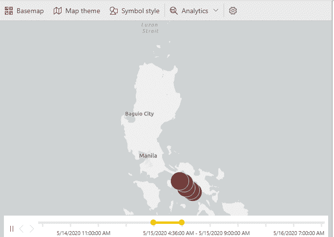*

*如果你还记得我以前的一篇关于在 PowerBI 中重建 Gapminder 的文章，你会意识到这个风暴追踪器只是那个泡泡地图的另一个版本。但是我们不使用 x 轴和 y 轴，而是使用纬度和经度数据。*

*此外，数据还应该有一个日期时间列，以动画我们的跟踪。*

***所以我们的数据要求是***

1.  ***追踪风暴的日期和时间栏。***
2.  ***地图中的经纬度栏用来绘制风暴***

# *获取数据*

*在网上搜索时，我找到了两个可以为我们服务的数据源， [Wunderground](https://www.wunderground.com/hurricane/western-pacific/2020/tropical-depression-vongfong) 和 [PAGASA](http://bagong.pagasa.dost.gov.ph/tropical-cyclone/tropical-hourly-track) (菲律宾气象局)。*

*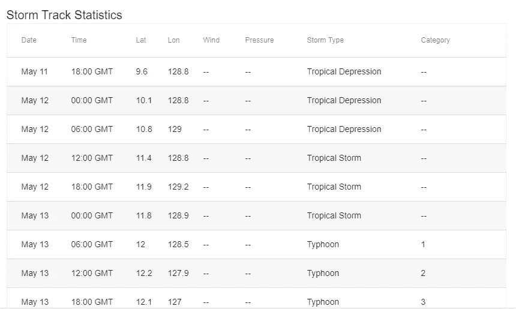*

*风暴安博(黄蜂)的地下数据*

*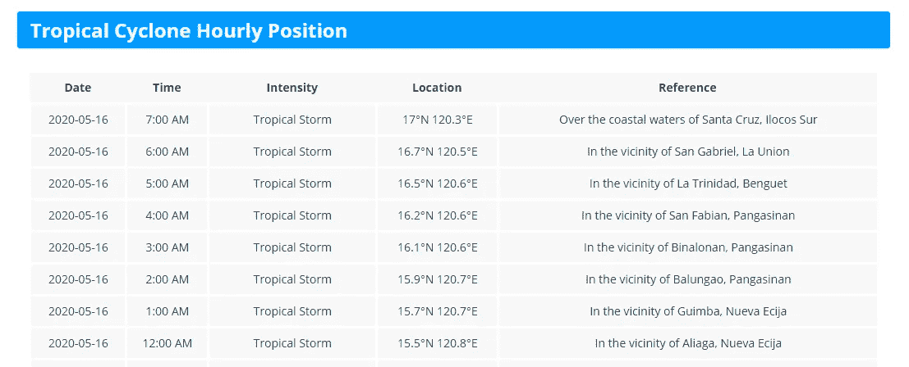*

*PAGASA 关于风暴安博(黄蜂)的数据*

*查看数据来源，我选择使用 PAGASA 的数据，因为它显示了风暴每小时的移动。这将在以后产生更详细的地图。*

# *导入数据*

*现在，要在新的 PowerBI 文件中导入它*

1.  *去*首页>获取数据>网页*。*

*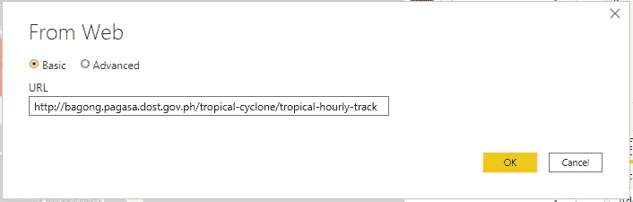*

*并选择适当的表。*

*2.现在，我们需要将日期和时间列合并到一个日期时间列中。为此，我选择了使用合并列*

*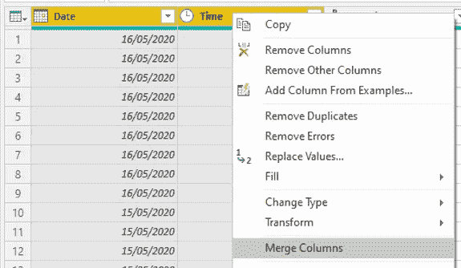*

*并将结果列转换为日期时间类型。*

*3.接下来，将 location 列分成纬度和经度部分。您可以使用空格分隔符拆分列。*

*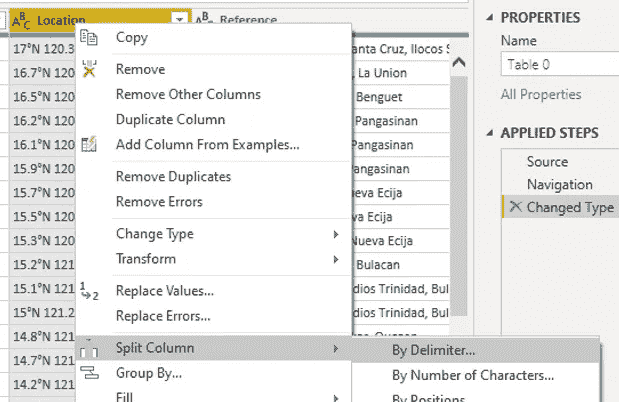*

*然后去掉度北和度东字符。*

***确保将结果列转换为十进制格式。稍后当我们将它们转换成纬度和经度类型时，这是需要的。***

*得到的数据应该是这样的。*

*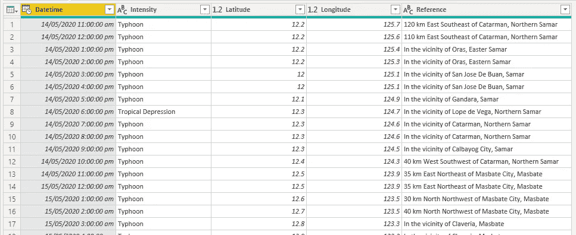*

*清理的 PAGASA 数据*

# *将列转换为适当的数据类型*

*为了在地图上实际绘制纬度和经度，我们必须确保 PowerBI 能够识别纬度和纬度数据类型。*

*应用查询更改后，在数据视图中，单击纬度列并转到*列工具>属性*。将栏目转换为*纬度*和*不汇总*。*

*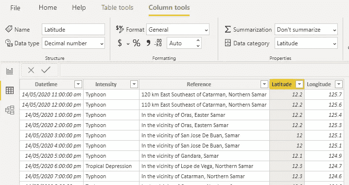*

*对经度做同样的操作。*

*这些列后面应该有一个球形图标。否则，转换不成功。*

*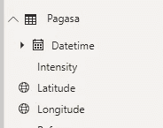*

***如果您之前没有在 PowerQuery 编辑器中将列转换为小数，转换将不会成功。***

# *绘制数据*

*好了，要在地图中绘制数据，请选择 PowerBI 中的 ArcGIS 地图。*

*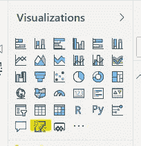*

***请注意，默认的地图可视化没有使其具有交互性的时间轴，因此我们使用 ArcGIS 版本。***

*将列拖动到适当的轴上，如下所示*

*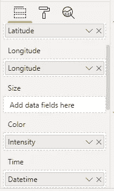*

*初步的情节应该是这样的*

*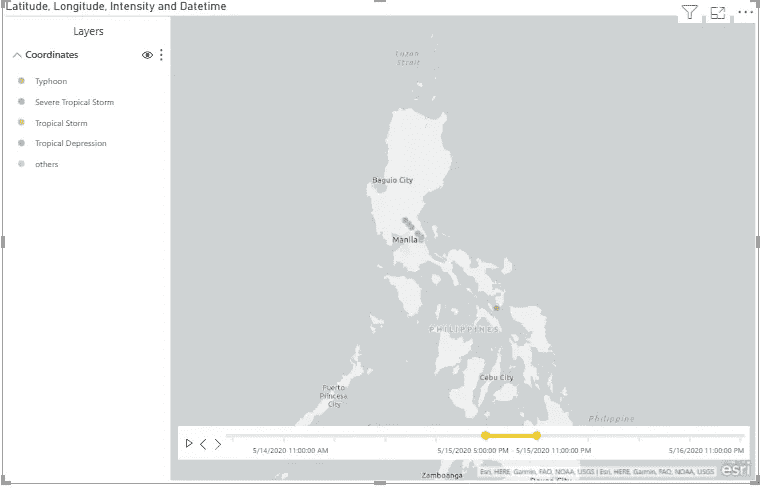*

*让我们编辑图来改变图例的颜色并放大点。转到图表中的*省略号>编辑>符号样式*。设置以下设置，我发现这些设置在我们的绘图中效果很好*

*   *透明度 0%*
*   *符号大小 50px*
*   *符号颜色*

*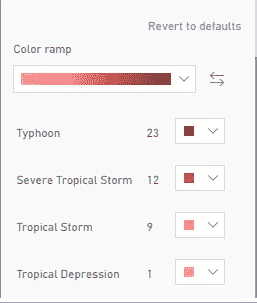*

*符号颜色*

*图表现在应该看起来像这样*

*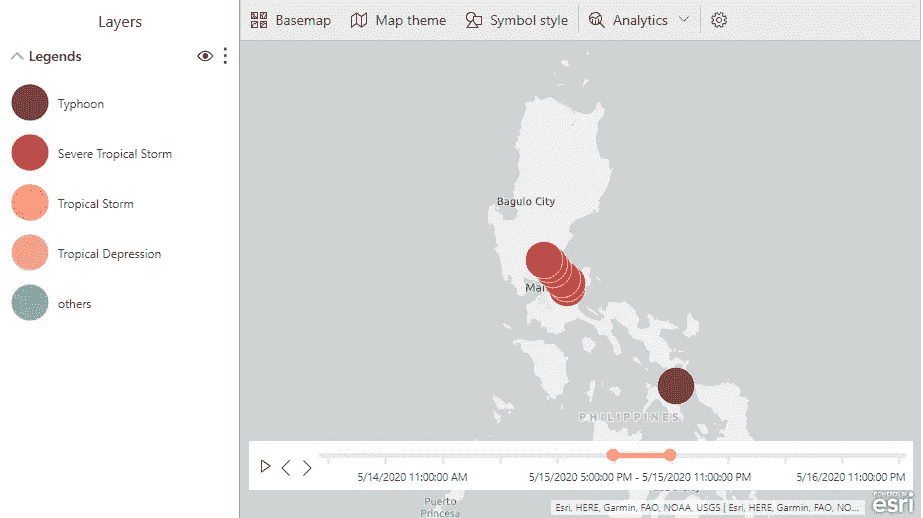*

*现在，上面的图表有一些问题。*

***这些点应该彼此靠近，并且不应该向后移动，因为这不是暴风雨的通常移动方式！***

*当你播放图表时，这是显而易见的*

*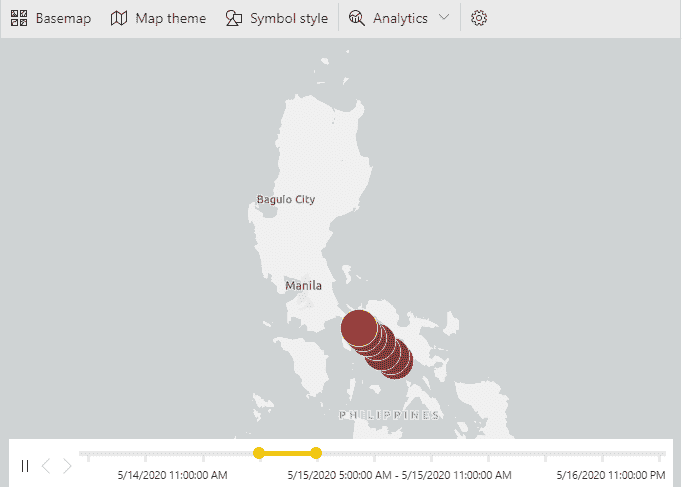*

*回头看看数据，罪魁祸首是晚上 11 点被自动标记为第二天的一部分。*

***例如，2020 年 5 月 15 日晚上 10 点之后的晚上 11 点时间立即被标记为 5 月 16 日，而不是 5 月 15 日。***

*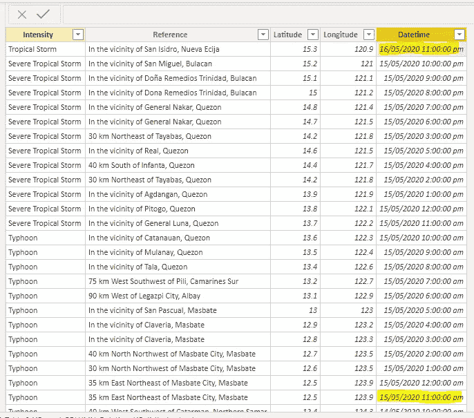*

*要纠正这些，我们必须通过右键单击数据*编辑查询>来打开查询编辑器。*在电量查询编辑器中，右击*单元格>替换数值*。*

*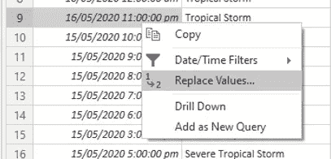*

*替换数据中的错误值*

***当然，我也通知了 PAGASA 这件事。***

*编辑完数据后，图表应该看起来像这样。*

**

# *结论*

*好了，我们的教程到此结束。让这个项目对我来说特别的是，我能够指出 PAGASA 网站上的一个错误。*

*完成的文件在下面的 [Github 链接中。](https://github.com/kennethjhim/medium_hurricane_tracker_in_powerbi)*

****感谢您阅读我的文章。关注我上*** [***推特***](https://twitter.com/iamkennethcpa) ***和*** [***领英***](https://www.linkedin.com/in/kennethinfante/) ***。****

****还看我的书***[***PowerQuery 熊猫指南***](https://leanpub.com/powerqueryguidetopandas)*[***Leanpub***](https://leanpub.com/powerqueryguidetopandas)***。*****

**也看看我以前在 Medium 上的文章。**

*   **[在 PowerBI 中重新创建 Gapminder 图](/recreating-the-gapminder-plot-in-powerbi-2b2eb6061dc6?source=friends_link&sk=c61fc5cbe7a9e4025e45a25c34ef4221)**
*   **[如果你来自 Excel，如何看待熊猫数据可视化](/how-to-think-of-pandas-data-visualization-if-youre-coming-from-excel-7af9f933e212?source=friends_link&sk=d672507887b7e41074ebb33ee742d132)**
*   **[如何使用 SQLite 构建会计系统](/how-to-build-an-accounting-system-using-sqlite-2ce31f8b8652?source=friends_link&sk=85caa76af517b9ebc772c8cb9ba4d3a5)**
*   **[为什么会计非常适合编程](/why-accountants-are-great-fit-for-programming-6033927047e6?source=friends_link&sk=97175fda7b86fdfb74ee89c6c575af59)**