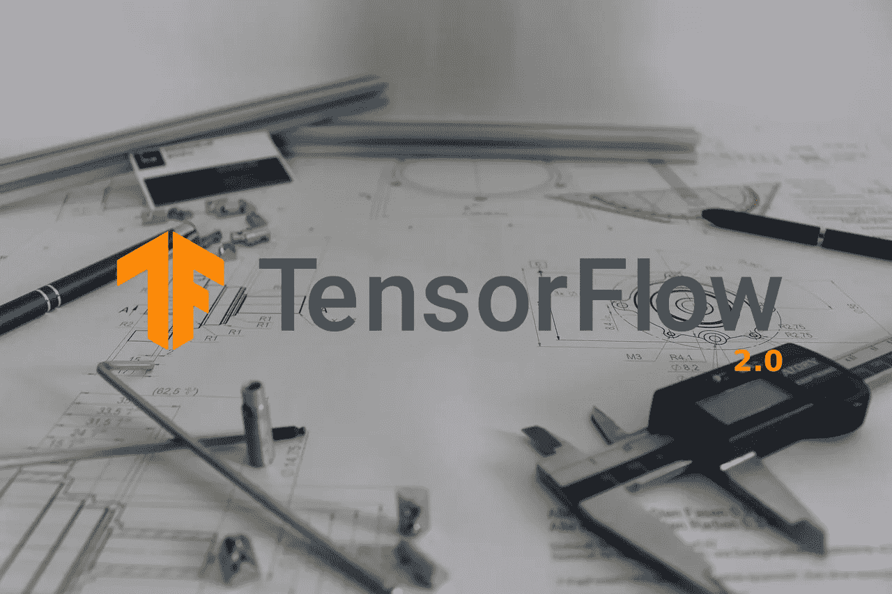
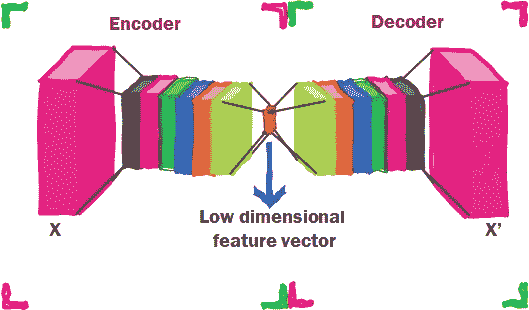
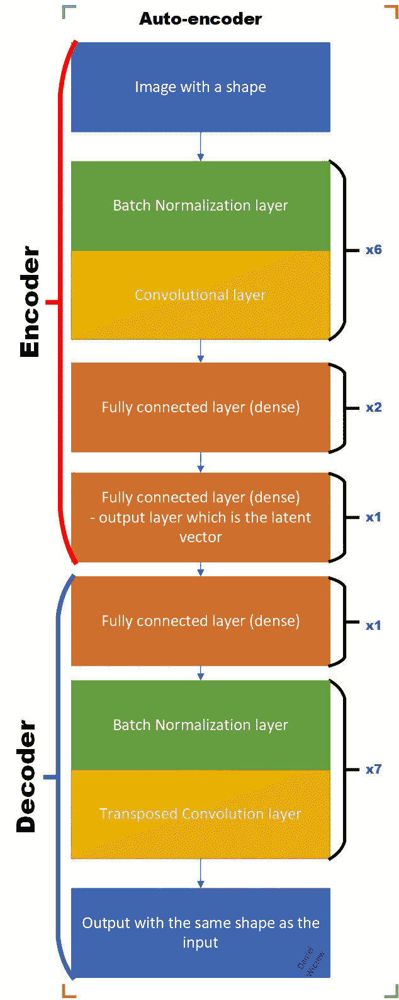
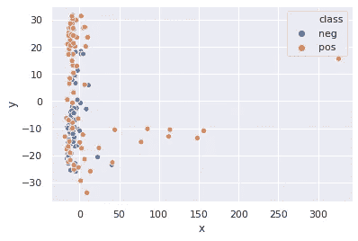

# 如何从头开始创建 TensorFlow 2 模型——一个“无用”的例子。

> 原文：<https://towardsdatascience.com/creating-a-trashy-model-from-scratch-with-tensorflow-2-an-example-with-an-anomaly-detection-27f0d1d7bd00?source=collection_archive---------12----------------------->

## 假设您想要构建一个可以在项目中使用的模型。您选择用 TensorFlow 2 框架来实现它，但是您想知道如何实现它。

TensorFlow 2 (TF2)框架允许创建可以在您的项目中轻松使用的复杂模型。所以让我们带着必需的东西(TF2 和 Python 3)进入主题的深处。

在 TF2，模型是使用框架的 Keras 包装器中的`Model`类构建的。但是在写代码之前，试着把你的模型分成可用的部分。让我们以文章中的自动编码器为例，如果你不知道这是什么，请阅读维基百科文章[这里](https://en.wikipedia.org/wiki/Autoencoder)。
回到模型，您可以将您的模型构建为一个完整的自动编码器，但是您很可能不会这样使用它。你很可能会单独使用编码器部分或解码器部分。所以让我们把模型分成两部分，`Encoder`和`Decoder`，相同的名字将会在代码中进一步使用。

自动编码器的概念性表示。编码器和解码器部分用方括号区分，长方体表示模型的不同层，像卷积或全连接。

## 如何从概念上建立模型

最好的方法是将模型划分为服务于某些特定功能的功能部分，例如，一个对某些东西进行编码，而另一个进行预测或解码。在使用自定义训练循环(您将在本文中进一步了解)的由几个部分(定义为 objects 中的模型类)组成的模型训练期间，这不会产生问题。

## **建立模型—模板**

构建一个模型非常简单，你只需要从`tf.keras`库中继承`Model`类。第二类必需的方法— `__init__`和`call`(为什么不`__call__`在故事的最后解释)。

您可以在后续工作中使用的模型模板

`__init__`方法包含了将在`call`方法中执行的所有层和操作。例如，自动编码器的所有神经网络层，或者在执行任何操作之前将要初始化的一些常数。这里需要注意的是，所有的层都必须继承自`Layer`类，因此如果你想做一些 TensorFlow 操作(像`tf.math.reduce_sum()`)，你必须使用`Lambda`层(更多[在这里](https://www.tensorflow.org/api_docs/python/tf/keras/layers/Lambda))。另一个解决方案是在`call`方法内部执行操作。还要记住，如果你在`__init__`方法中定义了一些东西，那么你应该指向模型的类的实例——也就是`self`关键字。否则，它们在`call`方法中不可用，例如`self.layer_1 = tf.keras.layers.Dense(5)`。

关于`call`方法，您可以使用在`__init__`方法中定义的对象来定义对输入数据执行的所有操作。在`call`的参数列表中，您可以根据需要定义任意数量的参数。最基本的一个是输入，用于将数据输入模型。另一个论点是`training`，它并不总是强制性的，但如果你不知道他，生活就会变得复杂。由于在训练阶段和测试/验证阶段，它们的行为有很大的不同，所以在它们创建之后，应该将争论进一步传递给像`BatchNormalization`和`Dropout`这样的层。

创建模型后，你只需将其创建为 Python 对象，如`model = ExampleModel()`。如果有一些参数，如神经元或层数，你可以在创建模型对象时传递它们，如`__init__`方法中所指定的。您将在下面的案例研究中了解到这一点。然后，如果你想做一个预测，你只需调用模型，即`model(input)`，它输出在`call`方法中定义的处理过的输入。

## **构建自动编码器模型的案例研究**

所以我们一起做个例子来扩展你的知识面。想象一下，你在一家塑料回收公司，大部分时间你都在做一项无聊的工作，检测生产线上的非塑料瓶垃圾。但是你发现了一篇关于用机器学习检测图像的文章，你开始学习它来解决问题。由于非塑料瓶物品种类繁多，很难对它们进行分类——你可以有一个瓶子，也可以有一个锡箔或罐头，也许还有一些蔬菜或其他未指定的东西。所以你要集中精力检测所有不是塑料瓶的东西。因此你决定使用异常检测(更多[在这里](https://en.wikipedia.org/wiki/Anomaly_detection))，你想检测非塑料瓶垃圾作为一个异常。几周之后，你了解了 TF2，并开始思考这个模型。首先，你从互联网上收集了一些塑料瓶垃圾的图片。您获取了 908 个塑料瓶图像，并将它们分成一个训练(827)和一个测试(81)数据集。还有。你发现了一些非塑料垃圾图像，并将其标记为阴性测试(也是 81)。

总结问题，我们必须检测垃圾图像是否是塑料瓶。为此，我们收集了 908 张塑料瓶图片和 81 张非塑料图片进行测试。你可以在我的 Github 知识库中找到专门为这篇文章创建的图片，你可以打开例如 Google Collab。

 [## 丹尼尔维奇/垃圾异常

### 垃圾异常检测使用一个自动编码器的目的的储存库是教程在走向数据科学…

github.com](https://github.com/DanielWicz/trashanomaly) 

或者直接访问 Google colab:

 [## 丹尼尔维奇/垃圾异常谷歌联合实验室

### 使用自动编码器的垃圾异常检测

colab.research.google.com](https://colab.research.google.com/github/DanielWicz/trashanomaly/blob/master/tutorial_notebook.ipynb) 

此外，需要注意的是，你只有 827 张训练图像，这是一个相当小的数字，所以你要对这些图像应用图像增强——这种技术会稍微干扰图像，使它们对于神经网络来说有点不同，但我不会在这里详细介绍，你可以在这里阅读更多的和。

## 建立自动编码器模型

在此之前，如果你从我的 Github 库([，这里是](https://github.com/DanielWicz/trashanomaly))打开 Jupyter 笔记本是最好的，但是如果你从手机上阅读它，仍然有代码片段可以理解这个问题。然而，首先让我们在纸上定义模型:

用于异常检测的自动编码器模型。层的参数被省略了，但是你可以在下面的代码或者笔记本中检查它们。在卷积层之后使用完全连接的层的目的是确保来自卷积层的信息的有效聚集，从而更好地编码。然而，我找不到任何支持这一观察的论文，因此对此持怀疑态度。

如您所见，有两个部分——编码器和解码器(见左侧),但让我们转到代码，看看模型是如何构建的。由于堆叠了几层，它有点长，所以你将被迫转移到 Github 的网站上寻找要点或更好的方法——打开 Jupyter 笔记本。

编码器模型要点

代码遵循与`ExampleModel`、`tf.keras.Model`、`__init__`方法和`__call__`方法相同的方案。正如你所见，所有层的参数都在`__init__`方法中定义。关于`call`方法，看一下`training=False`，参数的值被进一步传递到`BatchNormalization`层。它确保该层在训练期间处于训练模式，而在测试/验证期间处于评估模式。此外，我总是将其默认值设置为`False`，以确保 after training 不会错误地将`True`传递给 BatchNorm 或 Dropout 层(它们不在模型中)。

让我们也来分析解码器的模型代码:

它看起来几乎一样，但颠倒了。看看`__init__`方法中的默认参数，除了重建图像的最后一层，它们与自动编码器相反。

## 创建模型的对象

现在是创建模型的时候了，这真的很简单——就像示例一样，您只需创建模型类的一个实例:

对`last_layer_kernel_shape method`的解释在文章的最后。

此时你可以尝试使用一个图像的编码器和解码器(就像:`encode(image_variable)`)。结果应该是随机噪声，因为权重被初始化为随机的。然而，该图像应该具有与将在训练期间使用的图像相同的大小，因为权重的形状是基于第一遍的维度来初始化的。我会在文末深入探讨。

## 训练模型

为了训练模型，我们将使用一个定制的训练循环。让我们先把代码扔到桌面上:

代码实际上遍历了所有的历元(第一个循环)，然后遍历了所有的批次，其中每个批次都被传递给了`train_step`函数，如下所示。

简而言之，装饰器`@tf.function`以较小的灵活性为代价显著提高了训练步骤的性能。更多关于 TF2 的网页[这里](https://www.tensorflow.org/tutorials/customization/performance)。

`train_step`函数将一批图像传递给编码器，然后将编码器的潜在变量传递给解码器，计算损失。然后用`gradient`评估梯度并用`apply_gradient`应用。整个过程是在`GradientTape` 的环境中进行的，T5 记录了正向传递过程中的所有操作，并在应用`gradient`方法后执行反向传播。这里我就不多赘述了，更多关于在 TF2 建立定制训练循环的内容，你可以去谷歌的 Tensorflow 2 网站[这里](https://www.tensorflow.org/tutorials/customization/custom_training_walkthrough)。但是要注意`training=True`，如果你不定义它，批量标准化层就不会训练。此外，如果它没有设置为 True，就很难检测到，没有错误也没有任何特定的行为。所以你必须小心这个论点。如果您想玩代码，请查看我前面提到的 Jupyter 笔记本。

好的，但是异常检测在哪里…？看着生产线上所有的塑料瓶，我们还是很无聊。从这里开始！

## 使用经过训练的自动编码器进行异常检测

由于自动编码器在潜在空间中聚集相似的数据，所以您可以使用潜在向量(从编码器生成的向量)进行异常检测。让我们对测试示例(塑料瓶— 81 张图像)和负面测试示例(排除了塑料瓶的一些垃圾—也是 81 张图像)执行 PCA(主成分分析)。

使用主成分分析将潜在空间向量降低到 2 维的图

大约一半的正例聚集在 PCA 图中的一个点周围，因此它给出了数据实际上以某种方式聚集的线索，但是不打算作为异常检测器工作(它在这里表现不好)。

我决定使用非线性聚类模型——高斯混合模型(简称 GMM——你可以在这里找到更多的)。我在这里不会详细介绍，但是它允许用高斯(正态)分布描述多维数据集群，并用于评估测试示例离集群有多远。在我们的例子中，它允许描述塑料瓶的潜在向量簇(编码器的输出)。然后使用训练集(827 个塑料瓶图像),使用 GMM 模型计算得分，得分描述了一个例子离聚类有多远。此外，如果示例是塑料瓶(低于阈值)或另一个垃圾(高于阈值)，则分数被设置为阈值。

在提供的 Jupyter 笔记本中使用了 GMM 模型，所以如果你对它的性能感到好奇。

## 保存编码器和解码器模型

与 Keras 或 PyTorch 的框架相比，保存模型有点棘手。用来自 Keras 的`model.save()`保存模型并不完全有效，因此你必须解决它。此外，`to_json()`也不适用于非顺序(比如在 Keras 中)模型，这就有点麻烦了。

首先，为了保存模型，你必须保存权重，这很简单——你只需要在模型的对象上调用`save_weights(filepath='path_to_file')`方法。

然而它不包含模型架构，所以您必须以另一种方式保存它。最简单的方法是用 models config 创建一个字典，并将其保存为 JSON 文件，如下所示。

然后加载模型变得很简单，因为对于字典，您可以使用解包操作符(`**`用于字典)。解包操作符将字典转换成方法的参数。例如，使用来自 config 的字典将被转换`a_method(**encoder_dict)`将被转换成一系列参数`a_method(fillters = [32, 64, 128, 196, 256, 1024], kernel sizes = …)`。

**加载模型**

保存模型的加载分三步进行。第一步是创建模型类的一个实例。在谈论拆包的时候，我们已经迈出了装载模型的第一步。由于你必须使用 json 标准库加载 JSON 格式的序列化字典，并在调用`Encoder`和`Decoder`的同时用`**`解包。

对解码器执行与上面相同的代码。但是在这里停下来一会儿——为什么在文章的开始我们要把自动编码器分成两部分？如果我们想要执行异常检测和检测非塑料瓶垃圾，我们实际上不需要加载解码器！这就是为什么把模型分成更小的部分真的很有用。然而，要使这个模型可行，还有三个步骤。

第二步是初始化权重形状。最简单的方法是传递与原始模型形状相同的输入。由于图像的形状为(batch_size，x_dimension，y_dimension，channel dimension ),因此我只需使用形状为(1，127，127，1)的`np.zeros`或`tf.zeros`(假设 np 为 NumPy，tf 为 TensorFlow)创建一个零向量，并将其传递给编码器。在这样一个简单的技巧之后，形状被初始化，您可以加载保存的权重，如下所示。

现在你有了检测非塑料瓶垃圾的模型，你可以愉快地做一些比观察生产线上的垃圾更有趣的事情，例如学习机器学习！如果你有任何问题，请写在评论区，我会在 1-2 天内回复你。

# 总结

*   要创建一个模型，你需要创建一个继承自`tf.keras.Model`的类，并且定义了两个方法`__init__`和 call。
*   重要的是在调用方法中定义`training`参数，并进一步传递给批量规格化和 dropout 层，否则会出问题。
*   要使用该模型，您需要创建该模型的类的一个实例。记得过`training=True`，一边训练。
*   您可以使用自定义训练循环来训练这样的模型。
*   在传递第一数据之后，定义权重矩阵的形状。
*   保存模型需要将参数保存为可读格式(例如 JSON)并保存权重矩阵。
*   加载需要使用先前的参数创建模型，传递与先前形状相同的输入(例如`np.zeros`或`tf.zeros`),然后加载保存的权重。

## 其他解释:

*   定义了`call`方法而不是`__call__`，因为`__call__` 在调用`call`之前调用了一些额外的东西。这些东西包括初始化权重的方法，以及确保调用中的东西正常工作的所有其他东西。因此，如果你有一个编码器实例，并用一个输入(如`encoder(input, training=False)`)调用它，那么首先执行`__call__`并完成一些工作。然后在所有那些东西之后，调用你定义的`call` 方法。
*   如果您想知道为什么在编码器模型和模型实例的创建中有`last_layer_kernel_shape`方法，那么这里是正确的地方。解码器需要关于最后一个卷积层的输出维度的信息，因此`last_layer_kernel_shape`方法返回最后一层的维度。

## 有用的链接:

*   专门为这篇文章创建的包含整个 Jupyter 工作笔记本的存储库，您可以在这里找到[和](https://github.com/DanielWicz/trashanomaly)
*   来自 Google 的 Tensorflow 2 自定义层/模型指南，它充满了代码示例，您可以在这里找到它。
*   在 Tensorflow 2 中编写自定义循环你可以在这里找到。