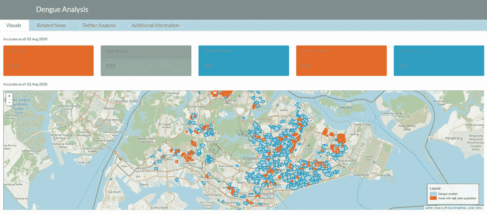
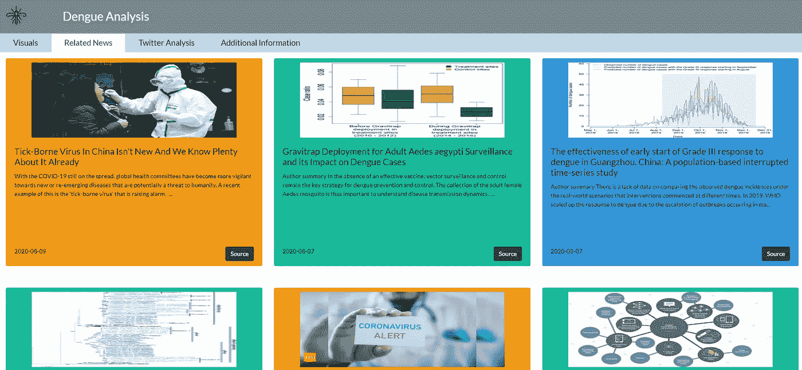
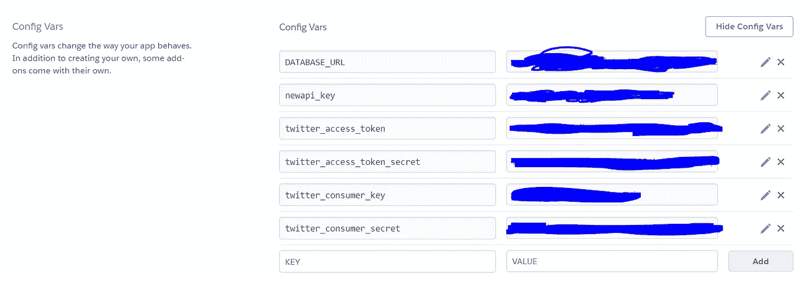
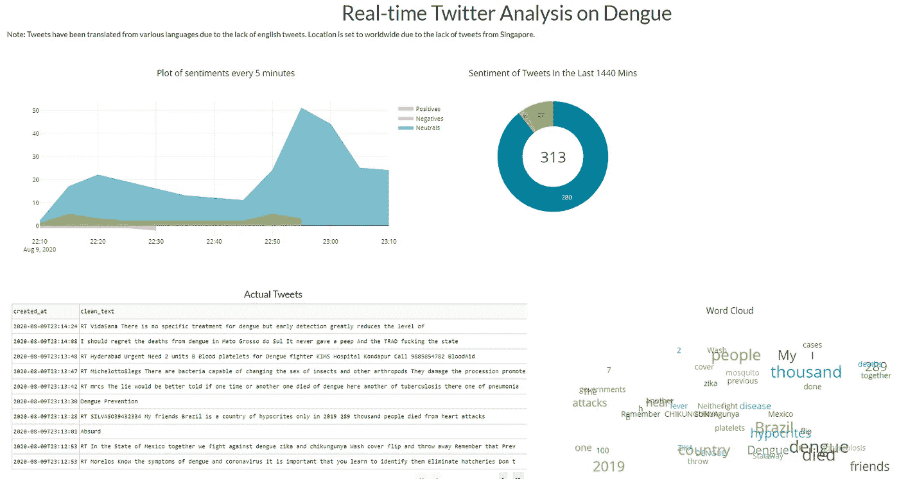
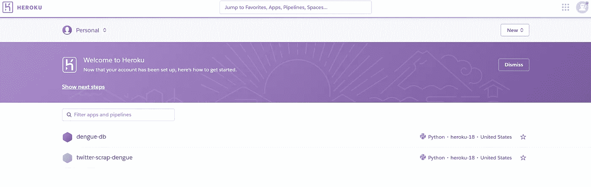

# 创建一个分析登革热病例的网络应用程序

> 原文：<https://towardsdatascience.com/creating-a-web-application-to-analyse-dengue-cases-1be4a708a533?source=collection_archive---------33----------------------->

## 使用 Tweepy、TextBlob、NewsAPI 和 Geopandas 分析登革热


卢克·切瑟在 [Unsplash](https://unsplash.com?utm_source=medium&utm_medium=referral) 上的照片

# 介绍

*信息就是力量。指尖上的信息是超能力。*

在此期间，我偶然在 Reddit、Twitter 和脸书上看到了许多关于新冠肺炎的图像。它们中的许多都非常鼓舞人心，能够在如此短的时间内吸收大量信息是如此令人愉快。

我也想在新冠肺炎上建一个仪表板，但我觉得已经够多了。因此，我决定研究另一个问题，登革热，这也是一个紧迫的问题。data.gov.sg 的数据很容易获得，但是有三个主要问题:

1.  一些数据没有任何可视化
2.  数据到处都是，需要额外的工作来过滤结果
3.  没有足够的数据来讲述一个故事


学分: [ggscore](https://ggscore.com/en/dota-2/team/hmmm)

这促使我自己制作了一个仪表板。这个项目有 3 个主要部分:

1.  **分析:**我可视化了登革热病例的数量，并创建了一个登革热热区和繁殖点的叠加地图。
2.  **新闻检索:**该选项卡能够从多个来源检索主题为“登革热”的新闻。
3.  **Twitter 分析:**该功能构成了该项目的主体。简而言之，我实时检索 twitter 数据，分析他们的情绪，并以图表形式呈现出来。

这个项目的目的是展示构建这样一个强大的应用程序是多么简单。不一定是登革热。可以是任何话题。对于这个项目来说，重要的不是内容，而是**技能**。这更多的是概念验证，而不是最终产品。我将带你走过项目的所有 3 个不同部分，同时提供代码片段。希望您能够在自己有意义的项目中复制它。请务必滚动到本文的底部，找到完整代码的链接。

# 概念

在我开始之前，我想谈谈这个项目是如何建立的。

这个项目是用 [**Dash**](https://plotly.com/dash/) 构建的，这是一个构建数据科学/ML 项目的 Python 框架。随着 [**dash 引导组件**](https://dash-bootstrap-components.opensource.faculty.ai/docs/)**【DBC】**[**dash 核心组件**](https://dash.plotly.com/dash-core-components)**【DCC】**，你将需要**最少的** HTML/CSS 技能来构建你的 web 应用。

这三个特性中的每一个都采用了不同的技术(将进一步解释)。然后使用 [**Heroku**](https://www.heroku.com/) 部署所有这些功能，这是一个云平台即服务(PaaS)，允许您轻松地将应用程序部署到云。

# 第 0 部分:仪表板

Dash 应用程序主要由两部分组成。

## 第 1 部分:应用程序布局

应用程序布局是应用程序的**前端**部分。然而，多亏了 DBC 和 DCC，你不需要复杂的 HTML 代码来创建你的应用程序。例如，我的整个应用程序是用以下代码创建的:

```
# Code partially hidden for readability
# Layout of entire app
app.layout = html.Div(
    [
        navbar,
        dbc.Tabs(
            [
                dbc.Tab(analysisTab, id="label_tab1", label="Visuals"),
                dbc.Tab(newsTab, ...),
                dbc.Tab(socialMediaTab, ...),
                dbc.Tab(infoTab, ...),
            ],
            style={"font-size": 20, "background-color": "#b9d9eb"},
        ),
    ]
)
```

当然，你必须指定什么是 analysisTab，newsTab 等。你可以看到**如何用 DBC 和 DCC 抽象**你的应用程序。DBC 和 DCC 都提供了按钮、选项卡、表单、导航栏以及许多其他基本组件。

## 第 2 部分:应用程序回调(可选)

应用程序回调可以被认为是应用程序的后端部分。如果你观察上面的代码，你会注意到我给我的`analysisTab`分配了一个`id="label_tab1"`，这有助于我们识别哪个回调用于那个特定的组件。

回调的示例如下所示:

```
[@app](http://twitter.com/app).callback(
    Output("sa-graph", "children"), [Input("interval-component-slow", "n_intervals")]
)
def sa_line(n):
    children = [...]
    return children
```

这样做的是，它将接受一个带有指定参数`n_intervals`的输入组件`interval-component-slow`，并将由方法`sa_line()`创建的结果`children`输出到输出组件`sa-graph`。如果您想让您的应用程序具有交互性，这一点尤其有用。例如，你可以允许你的可视化根据用户点击的单选按钮而改变。

但是，如果您希望应用程序是静态的，并不总是需要回调。你会意识到我的前两个标签页没有使用回调，因为我不需要用户的任何输入。我只需要向他们发送信息。第三个标签(twitter 分析)是一个特例。我不得不使用回调，因为我希望我的分析每 30 秒刷新一次。稍后详细介绍！



# 第一部分:视觉化

[**完整代码在此。**](https://github.com/bensjx/Dengue-dashboard/blob/master/analysis.py)

本节的主要学习点是[地垫](https://geopandas.org/)和[叶子](https://python-visualization.github.io/folium/)的用法。

## 地质公园

从[data.gov.sg](https://data.gov.sg/dataset/dengue-clusters)下载的数据以 [GeoJSON](https://geojson.org/) 格式出现。GeoJSON 文件允许您将地理数据编码到对象中。它具有非常结构化的格式，包括位置的类型、几何图形和属性。由于登革热集群涉及一块土地，我们的位置被编码在一个多边形对象中，这是一个经度和纬度的数组。

读取 GeoJSON 文件很容易。我们简单地使用 Geopandas:

```
central_data = gpd.read_file("data/dengue-cases-central-geojson.geojson")
```

一旦数据被加载，操作应该很容易，前提是你精通数据框架。

## 薄层

follow 允许我们将 GeoJSON 数据可视化在一个活页地图(一个用于交互式地图的 JavaScript 库)中。

首先，我们创建一张地图并放大到我们想要的地点(在我的例子中，我选择了新加坡的经度和纬度):

```
kw = {"location": [1.3521, 103.8198], "zoom_start": 12}
m = folium.Map(**kw)
```

接下来，我在地图上添加两个图层(一个用于集群，另一个用于繁殖区):

```
folium.GeoJson(<FIRST LAYER DATA>, ...).add_to(m)
folium.GeoJson(<SECOND LAYER DATA>, ...).add_to(m)
```

最后，由于 Dash 不允许我直接显示叶子对象，所以我将生成的地图导出到一个 **HTML 文件**中，并使用一个 **IFrame** 来显示它:

```
m.save("dengue-cluster.html")html.Iframe(id="dengue-map", srcDoc=open("dengue-cluster.html", "r").read(), ...)
```



# 第二部分:新闻剪报

[**完整代码在此。**](https://github.com/bensjx/Dengue-dashboard/blob/master/news.py)

本节的主要学习点是 [NewsAPI](https://newsapi.org/) 的用法。NewsAPI 允许我们使用他们的 API 从多个来源搜索新闻文章。在您可以开始使用它之前，您需要注册一个帐户，以便获得您自己唯一的 API 密钥。

请注意，作为一个免费会员，你将受到每天新闻检索数量的限制。

## 存储密钥(本地系统)

钥匙很重要！就像你不会和你的朋友分享你的房子钥匙一样，**你也不会想要分享你的 API 钥匙**。当您在本地系统上开发时，我强烈建议您将所有的键保存在一个`keys.py`文件中，并将该文件添加到`.gitignore`中，这样它就不会被在线推送。

## 存储密钥(Heroku)

由于你没有将`keys.py`推送到 GitHub，Heroku 无法访问它。相反，Heroku 有自己的**配置变量**。您可以通过 CLI 或它们的 GUI 将您的密钥添加到 Heroku。



Heroku 配置变量

## 代码！

出于部署的目的，我们让代码根据我们是在本地系统上还是在 Heroku 上来检索密钥:

```
try:
    from keys import newsapikey  # retrieve from local system
    newsapi = NewsApiClient(api_key=newsapikey)
except:
    newsapikey = os.environ["newapi_key"]  # retrieve from Heroku
    newsapi = NewsApiClient(api_key=newsapikey)
```

接下来，我们终于可以检索我们的新闻文章了:

```
all_articles = newsapi.get_everything(
        q="dengue singapore",
        from_param=date_n_days_ago,
        to=date_now,
        language="en",
        sort_by="publishedAt",
        page_size=100,
    )
```

有三个主要功能`newsapi.get_everything()`、`newsapi.get_top_headlines()`和`newsapi.get_sources()`。使用任何你认为合适的！然后我们可以检索我们的内容。检索所有文章标题的示例如下所示:

```
all_articles_title = [
        str(all_articles["articles"][i]["title"])
        for i in range(len(all_articles["articles"]))
    ]
```

现在您已经有了数据，您可以使用 DBC 添加它们。在这个项目中，我使用了[卡片](https://dash-bootstrap-components.opensource.faculty.ai/docs/components/card/)、[卡片主体](https://dash-bootstrap-components.opensource.faculty.ai/docs/components/card/)和[卡片页脚](https://dash-bootstrap-components.opensource.faculty.ai/docs/components/card/)。



# 第 3 部分:实时 Twitter 情感分析

这构成了项目的主体。我使用了 [Tweepy](https://www.tweepy.org/) ，这是一个 Python 库，允许我们访问 Twitter API 来传输推文。我的目标是检索所有与“登革热”相关的推文，预处理文本，分析情感，并可视化结果。从 Twitter 上不断挖掘推文，我的应用程序将每 30 秒刷新一次以显示新数据。

## 工作流程

在这个阶段，我可能应该向您介绍一下工作流程。

1.  推文被从推特中抽出
2.  **推文正在被**清理**(翻译成英文，表情符号被移除，链接被移除)，推文的情感被 [TextBlob](https://textblob.readthedocs.io/en/dev/) 分析**
3.  **建立了与数据库的连接，每次**有新的推文进入**时，处理过的推文和情感就会被推送到数据库。对于本地系统，我使用 MySQL，对于 Heroku，我使用他们的 PostgreSQL 数据库。**该脚本保持运行**。**
4.  **同时，我检索超过一天的推文，并从数据库中删除它们。这将确保我们的数据库不会耗尽空间。**
5.  **随着我的应用程序在**并行**中运行，它将每隔 **30 秒**从数据库中检索**一小时的数据**并显示它们。**

## **钥匙钥匙钥匙**

**就像 NewsAPI 一样，Tweepy 也要求我们生成 API 密钥。前往 [Twitter 开发者](https://developer.twitter.com/)获取您的！**

## **Twitter 抓取**

**[**完整代码在此。**](https://github.com/bensjx/twitter-scrap-dengue/blob/master/mylistener.py) 注意注释代码是针对 MySQL 的，未注释代码是针对 PostgreSQL 的。**

**步骤 1:如果数据库和表不存在，通过为我们创建一个数据库来初始化数据库。**

```
DATABASE_URL = os.environ["DATABASE_URL"]
conn = psycopg2.connect(DATABASE_URL, sslmode="require")
cur = conn.cursor()cur.execute(
    """
        SELECT COUNT(*)
        FROM information_schema.tables
        WHERE table_name = '{0}'
        """.format(
        parameters.TABLE_NAME
    )
)
if cur.fetchone()[0] == 0:
    cur.execute(
        "CREATE TABLE {} ({});".format(
            parameters.TABLE_NAME, parameters.TABLE_ATTRIBUTES
        )
    )
    conn.commit()
cur.close()
```

**步骤 2:初始化 Twitter API 并开始流媒体播放**

```
myStreamListener = MyStreamListener()
myStream = tweepy.Stream(auth=api.auth, listener=myStreamListener)
myStream.filter(track=parameters.TRACK_WORDS)
```

**第三步:处理收到的每条推文。为了实现这一点，你必须**超越** tweepy。StreamListener，它是负责从 Twitter 向您推送新推文的类。**

```
# Override tweepy.StreamListener to add logic to on_status
class MyStreamListener(tweepy.StreamListener):
    def on_status(self, status):
        # Start modifying
        id_str = status.id_str
        created_at = status.created_at
        clean_text, text = preprocess(status.text)
        sentiment = TextBlob(text).sentiment
        polarity = sentiment.polarity
        ...
        # SQL statement for pushing tweets to DB
        ...
        # SQL statement for deleting and cleaning DB
        ...
```

## **让它活起来**

**让你的应用程序每 x 秒刷新一次的诀窍是使用`dcc.Interval`。通过在应用程序中添加一个时间间隔作为回调的输入，可以告诉应用程序每隔 x 秒重新生成一次组件。**

```
dcc.Interval(
            id="interval-component-slow",
            interval=30000,  # in milliseconds
            n_intervals=0,
        ),
```

## **情绪的折线图+饼图**

**[**此处为观想完整代码。**](https://github.com/bensjx/Dengue-dashboard/blob/master/app.py)**

**首先，我们必须检索刮出的数据:**

```
# Loading data from Heroku PostgreSQL
    DATABASE_URL = os.environ["DATABASE_URL"]
    db_connection = psycopg2.connect(DATABASE_URL, sslmode="require")# Load last 1 hour data from MySQL
    ...query = "SELECT ... FROM {} WHERE created_at >= '{}' ".format(
        "dengue", timenow
    )df = pd.read_sql(query, con=db_connection)# Convert UTC into SGT
    ...
```

**接下来，对数据进行清理和转换，以绘制时间序列:**

```
# Clean and transform data to enable time series
    # Bin into 5 minutes
    result = (
        df.groupby([pd.Grouper(key="created_at", freq="5min"), "polarity"])
        .count()
        .reset_index()
    )
    ...
```

**最后，我们使用 [Plotly Graph 对象](https://plotly.com/python/graph-objects/)将结果可视化。左上角的折线图是用`go.Scatter`创建的，而右上角的饼图是用`go.Pie`创建的。这就是创建视觉效果的简单之处！**

## **检索实际的推文**

**推文用[仪表板数据表](https://dash.plotly.com/datatable)显示。**

```
dash_table.DataTable(id='table', columns=[{"name": i, "id": i} for i in df.columns], data=df.to_dict('records'))
```

## **真实推文的文字云**

**目前还不太支持单词云。传统的方法是创建一个图像，并把它附加到我们的可视化中。我使用的非常规方法是在 X 和 Y 轴上绘制单词，而不是显示坐标，而是显示文本。因此，这个词云是使用`go.Scatter`创建的。**

```
go.Scatter(x=wc_data.x,
           y=wc_data.y,
           mode="text",
           text=wc_data.words,
           ...)
```

****

# **第 4 部分:部署到 Heroku**

**既然您的应用程序在本地系统中运行良好，那么是时候将它部署到 Heroku 了。我**强烈推荐**你看看这个 [15 分钟教程](https://www.youtube.com/watch?reload=9&v=j3VvVaNnDH4)如何做到这一点。否则，请参考下面的摘要:**

1.  **创建一个 Heroku 帐户并下载 Heroku CLI**
2.  **确保项目的所有依赖项都已下载。此外，运行`pip install gunicorn`**
3.  **创建一个 [Procfile](https://github.com/bensjx/Dengue-dashboard/blob/master/Procfile) ，它将告诉 Heroku 运行什么**
4.  **用`pip freeze > requirements.txt`创建 requirements.txt。这对于 Heroku 了解你正在使用的包是很重要的，这样他们也可以下载它。**
5.  **使用部署您的应用程序**

```
heroku login
heroku create "<YOUR APP NAME>"
git add .
git commit -m "<ANY MESSAGE>"
git push heroku master
heroku ps:scale web=1
```

**注意:为了让你的 tweet scrapper 和应用程序同时运行，你需要 **2 个不同的应用程序**。否则，您可以支付额外的 dynos，这是 Heroku 容器。您的 Procfile 将会不同。要使用**相同的数据库**，将您的 scrapper 的 DATABASE_URL(配置变量)设置为与您的应用程序的 DATABASE_URL 相同。**

**此外，请注意，加载应用程序需要相当长的时间。这是因为我正在使用免费的 dynos。如果应用程序在设定的时间内没有被访问，免费的 dynos 将被置于睡眠状态。**

# **结论**

**这个应用程序简单、轻量、功能强大。由于有限的预算、时间和网页设计技巧，这绝不是一个完美的应用程序。我还需要花时间优化算法，这将大大提高应用程序的加载速度。**

**通过这篇文章，希望你对 Dash，Tweepy，NewsAPI，Geopandas，和 leav 有了更深入的了解。我强烈要求你为不同的上下文创建类似的应用程序。**

## **链接:**

1.  **[https://dengue-db.herokuapp.com/](https://dengue-db.herokuapp.com/)**
2.  **[https://github.com/bensjx/Dengue-dashboard](https://github.com/bensjx/Dengue-dashboard)**
3.  **[https://github.com/bensjx/twitter-scrap-dengue](https://github.com/bensjx/twitter-scrap-dengue)**