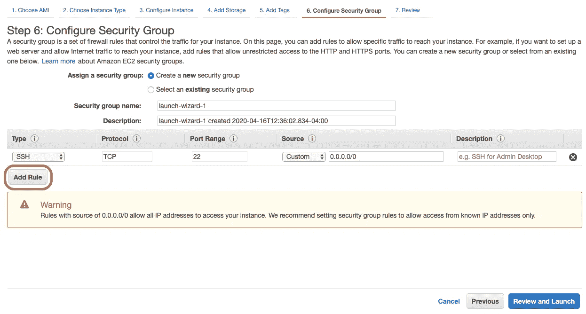
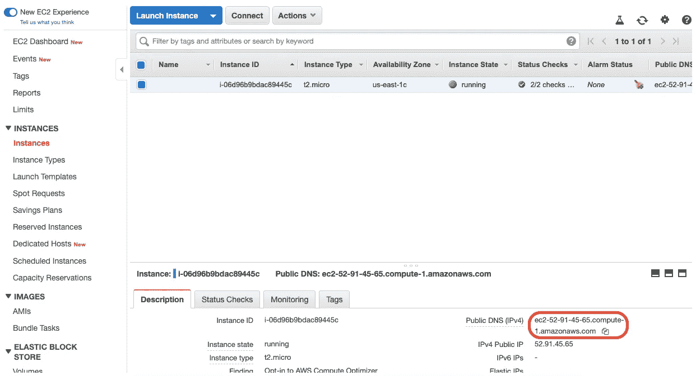

# 我如何用 Python 和 AWS 制作一个网站

> 原文：<https://towardsdatascience.com/creating-a-website-to-host-your-python-web-application-f06f694a87e8?source=collection_archive---------12----------------------->

## 关于使用 EC2 实例部署 Streamlit 应用程序的分步教程


[UX 店](https://unsplash.com/@uxstore?utm_source=medium&utm_medium=referral)在 [Unsplash](https://unsplash.com?utm_source=medium&utm_medium=referral) 上拍照

作为编码员和程序员，我们必须能够在不随身携带笔记本电脑的情况下，向不同的人展示我们创建的项目和应用程序。为了做到这一点，我们可以把我们的应用程序放在我们自己的网站上，让任何能上网的人都能看到。创建我们自己的网站的第一步是找到一个网站托管服务，如**亚马逊网络服务(AWS)** 。这些主机服务将确保我们的网站在任何时候都可以从任何一台可以上网的电脑上访问。

我们网站的外观将完全取决于我们使用的代码。在我们的例子中，我们实现了 **Streamlit** Python 库来为基于数据科学的应用程序构建用户界面。要了解我们如何使用 *Streamlit* 创建我们的 web 应用程序，请查看下面的文章:

[](/how-to-use-streamlit-to-create-web-applications-218af44064f5) [## 我如何使用 Streamlit 构建 Web 应用程序

### 用于构建 Web 应用的 Streamlit 和 Python

towardsdatascience.com](/how-to-use-streamlit-to-create-web-applications-218af44064f5) 

本文深入研究了我们使用 *Streamlit* 及其各自功能创建的 web 应用程序的开发和设计。

> [在这里注册一个中级会员，可以无限制地访问和支持像我这样的内容！在你的支持下，我赚了一小部分会费。谢谢！](https://marco-santos.medium.com/membership)

# 为网站利用亚马逊网络服务(AWS)

让我们开始创建网站的过程。首先，我们需要找到一个适合我们的网站托管服务。有许多虚拟主机服务，但我们现在将利用 AWS。

## 第一步。创建 AWS 帐户

首先，您必须先 [**创建一个 AWS 账户**](https://portal.aws.amazon.com/billing/signup#/start) 。这是一个独立的帐户，不同于用于购物或销售的普通亚马逊帐户。我们将使用免费层帐户。我们将需要这个帐户，以便创建一个服务器来托管我们的网站。

## 第二步。创建 AWS EC2 实例

一旦创建了帐户，我们就可以继续创建一个 *AWS EC2 实例*。AWS EC2 实例或*亚马逊弹性计算云*用于启动**实例**，它是云中的虚拟服务器**。**

要创建一个实例，从主页导航到 **My Account** 选项卡并点击 **AWS 管理控制台**。


**AWS 管理控制台**

一旦您在*管理控制台*中找到自己，导航到**所有服务**部分，并点击 **EC2** 。


**EC2 仪表板**

在这里你会发现许多不同的资源和选择。然而，我们将关注于*启动实例*部分。点击**启动实例**按钮继续。


## 第三步。准备 EC2 实例

接下来，我们将看到一个页面来定制该实例。这里的第一步是选择一个**亚马逊机器映像(AMI)** 。

这里我们选择**亚马逊 Linux AMI 2018.03.0 (HVM)** 。我们选择这一个是因为它已经包含了许多编程语言(例如 Python ),并且它是符合自由层条件的。


**选择实例类型**

一旦我们选择了合适的 AMI，我们继续下一步，选择正确的实例类型。选择自由层合格选项: **t2.micro** 。


**配置安全组**

继续下一步，直到第 6 步。在那里，我们需要配置安全组。点击**添加规则**。



点击**添加规则**后，您会看到添加了一个新行。我们需要为我们的 Streamlit 应用程序配置这个新行。

*   在**类型**下，选择**自定义 TCP** 。
*   在**端口范围**下，输入 **8501** 。
*   在**源**下，选择**任意位置**。

点击右下角的**查看并启动**完成。


**启动实例**

点击**查看并启动**后，会看到一个查看页面。确保一切正确，然后点击右下角的**发射**。


## 第四步。创建并下载新的密钥对

点击**发射**后，出现以下弹出窗口。


在这里，您需要创建一个新的密钥对，方法是导航到 ***选择一个现有的密钥对*** 并选择 ***创建一个新的密钥对*** 。

为*密钥对名称*输入您想要的任何名称。然后，点击**下载密钥对**。为了从命令终端访问我们的实例，您将需要这个`.pem`文件。(*动了一下。pem 文件放入。ssh 文件夹在一个安全的位置，如果你没有一个*，你可以创建它。


下载私钥文件(。pem)，可以点击**启动实例**。这将带您进入显示*启动状态*的下一页。


## 第五步。从我们的 EC2 实例中查找公共 DNS (IPv4)

现在我们的 EC2 实例已经启动并运行，我们需要找到*公共 DNS* 地址来在命令终端中访问该实例。为此，导航到**管理控制台**，点击 **EC2** ，点击**实例**，然后选择我们刚刚创建的**实例**。您会在右下角找到*公共 DNS (IPv4)* 地址。 ***复制地址*** 因为以后会用到。



## 已完成启动 EC2 实例

如果遵循了这些步骤，您就已经成功地使用 AWS 启动并创建了 EC2 实例。接下来，您需要 SSH 到实例中，以便建立网站。

# SSH 到 EC2 实例

SSH 或安全 Shell 是一个网络协议，它允许我们通过终端使用命令行界面来操作 EC2 实例。如果你有 Mac 或 Linux，那么你已经有 SSH 了。Windows 用户可能需要使用 [**油灰**](https://www.ssh.com/ssh/putty/) 。

对于下面的步骤，我们将使用 MacOS 命令终端来访问我们的 EC2 实例。要 SSH 到我们的实例，我们必须首先打开命令终端，然后导航(CD)到包含我们之前下载的`.pem`文件的同一个文件夹。(*确保。pem 文件位于. ssh 文件夹中，该文件夹存储在您计算机上的安全位置*。

进入该文件夹后，运行以下命令:

```
$ ssh -i key_pair.pem ec2-user@your_public_dns_address
```

*   使用您创建并下载的`.pem`文件。
*   将“ **ec2-user@** ”添加到您的公共 DNS (IPv4)地址的*开头的*中。

输入此命令后，您应该会在命令终端中看到以下内容:


这意味着我们在 EC2 实例中成功了！

# EC2 实例中的安装

现在，我们需要安装我们的 Streamlit 应用程序所需的所有包和文件。即使我们的 AMI 包含一些必需的包，我们仍然需要更多的包。当我们仍然在 EC2 实例的命令终端中时，运行以下命令:

## 1.安装 Python 3.6

AMI 中包含的 Python 是 Python 2 而不是 Python 3，这是我们的 Streamlit 应用程序运行的基础。所以我们需要安装 Python 3。

```
$ sudo yum install python36
```

## 2.安装 Git

我们还需要安装 Git，以便下载包含我们的 Streamlit 应用程序的存储库。

```
$ sudo yum install git
```

## 3.克隆 Github 存储库

我们将克隆包含我们的 Streamlit web 应用程序的 Github 存储库:

```
$ git clone your_github_repo
```

在我们成功地将 Github repo 克隆到 EC2 实例中之后，导航( **CD** )到 repo 文件夹。

## 4.安装要求

导航到包含`requirements.txt`文件的文件夹。一旦我们进入包含我们的`requirements.txt`文件的文件夹，我们就可以安装运行我们的 Streamlit 应用程序所需的所有库。

```
$ python36 -m pip install -r requirements.txt --user
```

这将安装在`requirements.txt`文件中指定的所有库。`--user`命令将确保我们的库以正确的权限安装。

# 查看/运行应用程序

安装好一切后，我们终于可以运行我们的应用程序了。在包含`.py`文件的文件夹中，输入 Streamlit 命令:

```
$ streamlit run your_app.py
```

现在，我们的 web 应用程序可以通过使用**外部 URL** 在我们首选的浏览器中在线查看。但是，当我们注销 EC2 实例时，该链接将不再可用，这将关闭当前会话。

为了让这个 URL 在我们注销时仍然有效，我们需要再安装一个东西: **TMUX** 。

## **TMUX**

TMUX 让我们能够保持会话运行，即使我们注销。但是首先，使用 **ctrl+C** 关闭当前的 Streamlit 会话。然后，导航回实例的开头。

要安装，请在 EC2 实例中输入以下命令:

```
$ sudo yum install tmux
```

然后，使用以下内容创建一个新会话:

```
$ tmux new -s name_of_session
```

这将启动一个新的会话，您可以选择任何名称来运行我们的应用程序。从那里，就像以前一样，移动到你的`app.py`文件所在的文件夹。

在那里，您可以再次运行 Streamlit:

```
$ streamlit run your_app.py
```

现在，您已经有了在 TMUX 会议中运行的 Streamlit 应用程序。要退出 tmux 会话但仍保持运行，您必须 ***分离 tmux 会话*** 。你可以通过按下 **ctrl+B，然后 D** 来完成。

分离后，您可以通过运行以下命令来检查 tmux 会话的状态:

```
$ tmux ls
```

您应该会看到有一个 tmux 会话仍然处于活动状态。现在，您可以从 EC2 实例注销，而不必担心 URL 会关闭。只需按: **ctrl+D** 。

# Web 应用程序启动并运行


我们的 web 应用程序是什么样子的

成功！我们能够通过使用 AWS EC2 实例来激活我们的 Streamlit 应用程序。我们拥有的具体网络应用是我们的约会应用，它利用了 ***数据科学*** 和 ***机器学习*** :

[](/dating-algorithms-using-machine-learning-and-ai-814b68ecd75e) [## 我用机器学习和人工智能做了一个约会算法

### 为约会应用程序利用无监督机器学习

towardsdatascience.com](/dating-algorithms-using-machine-learning-and-ai-814b68ecd75e) 

*网站的 URL 可能不漂亮，但可以通过为我们的实例创建自己的自定义域名来解决。然而，这一过程需要更多的步骤，比预期的更加复杂。注册一个域名也可能要花一些钱。*

最后，我们希望您能够利用 *Streamlit* 和 *AWS EC2 实例*成功创建一个托管您自己的 web 应用程序的网站。请随意查看展示我们的 Streamlit web 应用程序开发或约会应用程序开发的其他文章。

[*在 Twitter 上关注我:@_Marco_Santos_*](https://twitter.com/_Marco_Santos_)

# 资源

[](https://github.com/marcosan93/AI-Matchmaker) [## Marcos an 93/人工智能媒婆

### 使用无监督机器学习和 NLP - marcosan93/AI-Matchmaker 的匹配简档

github.com](https://github.com/marcosan93/AI-Matchmaker) [](/how-to-use-streamlit-to-create-web-applications-218af44064f5) [## 我如何使用 Streamlit 构建 Web 应用程序

### 用于构建 Web 应用的 Streamlit 和 Python

towardsdatascience.com](/how-to-use-streamlit-to-create-web-applications-218af44064f5) [](/dating-algorithms-using-machine-learning-and-ai-814b68ecd75e) [## 我用机器学习和人工智能做了一个约会算法

### 为约会应用程序利用无监督机器学习

towardsdatascience.com](/dating-algorithms-using-machine-learning-and-ai-814b68ecd75e)