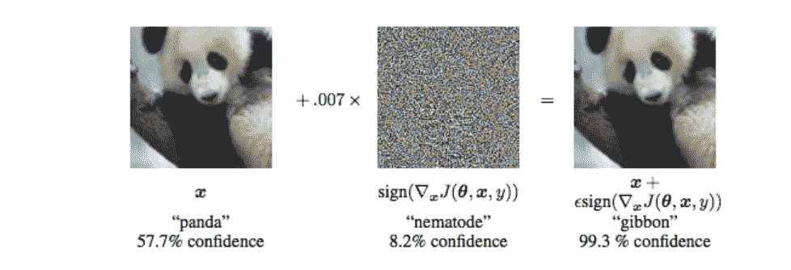
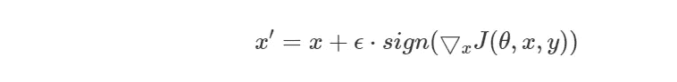
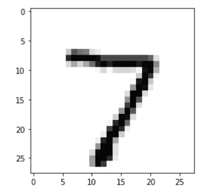
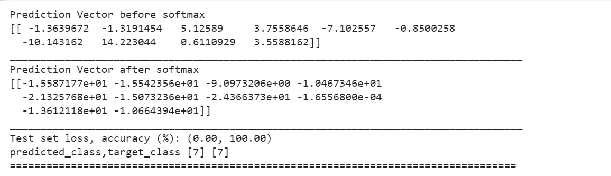
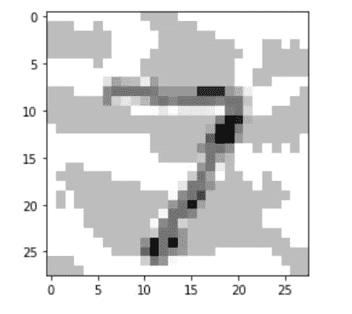
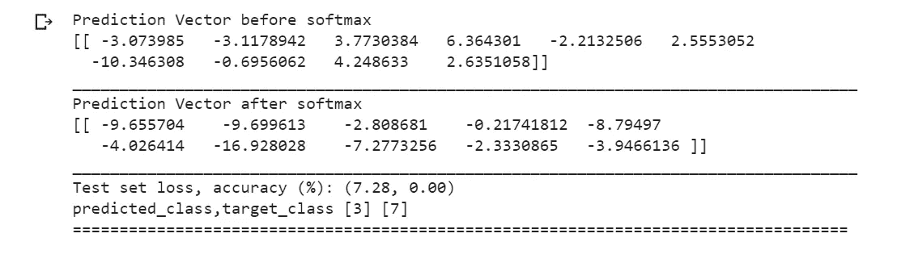

# 用 JAX 创建神经网络的对立例子

> 原文：<https://towardsdatascience.com/creating-adversarial-examples-with-jax-from-the-scratch-bf267757f672?source=collection_archive---------29----------------------->

## 在本教程中，我们将看到如何创建使用 JAX 欺骗神经网络的对立例子。

黛比·莫勒在 [Unsplash](https://unsplash.com/s/photos/panda?utm_source=unsplash&utm_medium=referral&utm_content=creditCopyText) 上的照片

首先，让我们看看一些定义。有哪些对立的例子？简单地说，对立的例子是神经网络的输入，其被优化以欺骗算法，即导致目标变量的错误分类。我们可以通过给目标变量添加“适当的”噪声来对其进行错误分类。下图展示了这一概念。

摘自古德费勒等人的[解释和利用对立的例子](https://arxiv.org/abs/1412.6572)。

今天，本教程的重点是演示如何创建对立的例子。我们将使用 ***快速梯度符号方法进行生成。***

在这个方法中，如果 x 是一个输入图像，我们将 x 修改为

其中对抗输入是通过将交叉熵损失的梯度的 ***符号***w . r . t 输入图像 ***x*** 和加到原始图像上获得的。ε是这里的超参数。

对于本教程，我们将使用流行的 MNIST 数据集。如果你不知道什么是 MNIST 数据集，我建议去下面的链接。

 [## MNIST 数据库

### MNIST 数据库(改进的国家标准和技术研究所数据库)是一个大型数据库…

en.wikipedia.org](https://en.wikipedia.org/wiki/MNIST_database) 

为了训练我们的模型并生成对立的例子，我们将使用 JAX 模块。JAX 是自动微分(AD)工具箱，在训练 MNIST 这样的大规模数据集时非常方便。有人恰如其分地将 JAX 描述为服用类固醇的笨蛋！由于这不是“JAX 介绍”教程，我不会深入探讨。

你可以参考下面的文档来进一步了解 JAX。

 [## 谷歌/JAX

### 声明:JAX 已经放弃 Python 2 支持，需要 Python 3.6 或更新版本。见 docs/CHANGELOG.rst. JAX 是…

github.com](https://github.com/google/jax) 

对于初学者，我建议参考以下关于 JAX 及其用法的教程。

 [## 你不了解 JAX

### 你不知道 JAX 这个简短的教程涵盖了 JAX 的基础知识。JAX 是一个 Python 库，它扩充了 numpy 和…

colinraffel.com](https://colinraffel.com/blog/you-don-t-know-jax.html) 

现在让我们深入编码。我提供的代码是建立在下面的 GitHub 库之上的。我已经做了必要的修改，并添加了一些新的功能，使其适合手头的应用程序。可以访问以下链接，以供参考。

 [## 张量流/cleverhans

### 一个用于构建攻击、构建防御和基准测试的对抗性示例库…

github.com](https://github.com/tensorflow/cleverhans/blob/master/tutorials/future/jax/mnist_tutorial.py) 

首先，我们将导入所有重要的库。

接下来，我们将下载并加载 MNIST 数据。

现在，我们将定义一个函数，该函数将通过迭代所有层来计算全连接神经网络的输出，获取输入/前一层的激活并应用双曲正切激活。

记住，对于我们使用的输出， **z=w⋅x+b**

在本教程中，我们将使用交叉熵损失。下面的函数将返回我们模型的损失。

下面的单元格定义了我们的模型的准确性以及如何初始化它的参数。

现在我们必须生成批量的训练数据。为此，我们将为数据集创建一个 Python 生成器。它一次输出一批 n 个训练样本。

接下来，我们的工作是使用***【StAX】***创建一个全连接的神经网络架构。Stax 是一个神经网络规范库。这里，我们将详细说明卷积神经网络中各层的规格。

现在我们必须定义小批量 SGD 优化器。优化器给了我们 3 样东西。

1]方法 opt_init 接受 init_fun 返回的一组初始参数值，并返回初始优化器状态 opt_state，

2]方法 opt_update，它接受梯度和参数，并通过应用一个优化步骤来更新优化器状态，以及

3]获取优化器状态并返回当前参数值的方法 get_params。

接下来，我们将根据训练示例训练我们的模型。在训练结束时，我们将获得“参数”,我们将使用这些参数来计算损失函数相对于测试图像的梯度。

最后，我们定义一个函数，它将返回损失函数相对于测试输入的梯度。此外，这个函数将计算测试损失以及预测我们的目标变量的类别。

现在是时候测试我们的模型了。

首先，我们来看一个测试输入。这里我们选择一个属于类***‘7’的图像。***

让我们想象一下原始图像。

上面的代码给出了下面的输出。

让我们看看我们训练过的模型是否预测了该图像的准确类别。

运行上面的代码后，我们得到以下输出。

我们看到我们的模型已经正确地预测了我们的输入图像的类别。

现在让我们跳到有趣的东西。让我们用 ***快速梯度符号法扰动同一个图像。***

为此，我们定义了函数。这里我们使用 0.3 作为超参数ε的值。

运行上面的代码后，我们得到以下输出。

我们看到扰动的图像有很多噪声。这个噪声量可以由超参数ε的值来控制。

最后，让我们看看噪声是否对模型分类有任何影响，即我们的模型是否对扰动的图像进行了错误分类。

上面的代码给出了以下结果。

瞧啊。我们的模型将输入图像错误分类为类别**‘3’**。

因此，我们看到了如何产生对立的例子。您可以对整个测试集重复相同的过程。

如果你对 JAX 感兴趣，我建议你访问下面的页面，看看你还能为 JAX 做些什么。

 [## JAX 入门(MLPs、CNN 和 RNNs)

### JAX，杰克斯，杰克斯。如今，Twitter 似乎不知道其他任何东西(除了新冠肺炎)。如果你和我一样，想知道什么…

roberttlange.github.io](https://roberttlange.github.io/posts/2020/03/blog-post-10/) 

图像来源包括:

[https://www . researchgate . net/figure/An-illustration-of-machine-learning-adversarial-examples-Studies-has-show-that-by _ fig 1 _ 325370539](https://www.researchgate.net/figure/An-illustration-of-machine-learning-adversarial-examples-Studies-have-shown-that-by_fig1_325370539)

**如果你觉得这篇文章有用，请给它鼓掌，它会有很大的帮助！！**

此外，欢迎任何建议/更正。

编码快乐！！