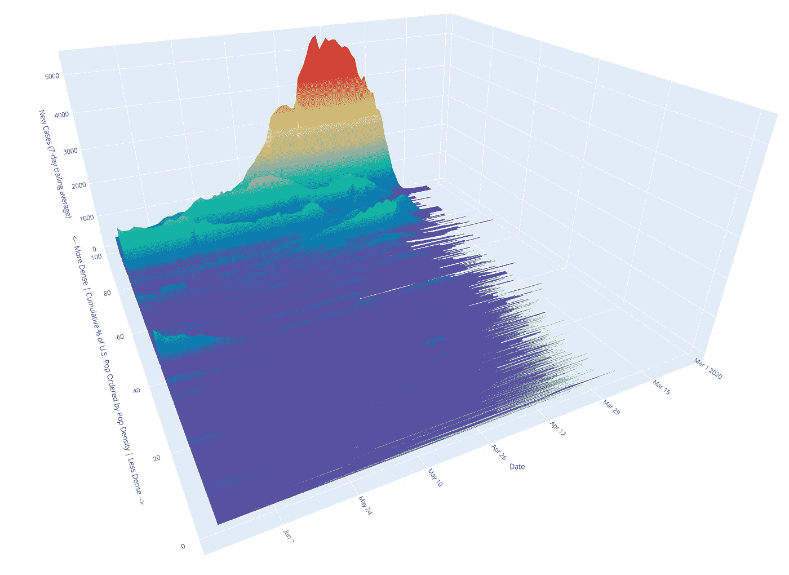
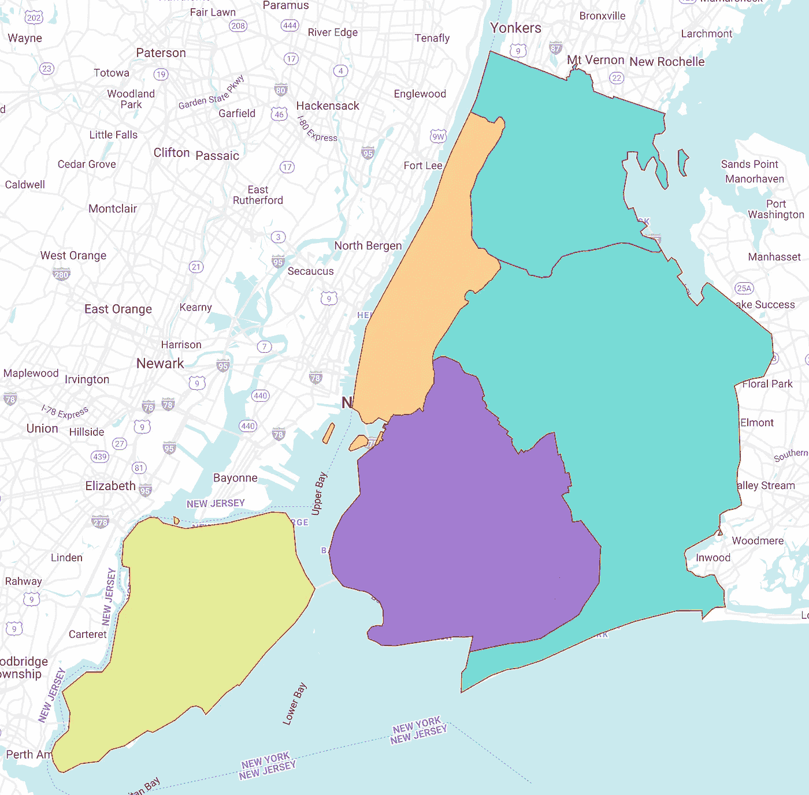
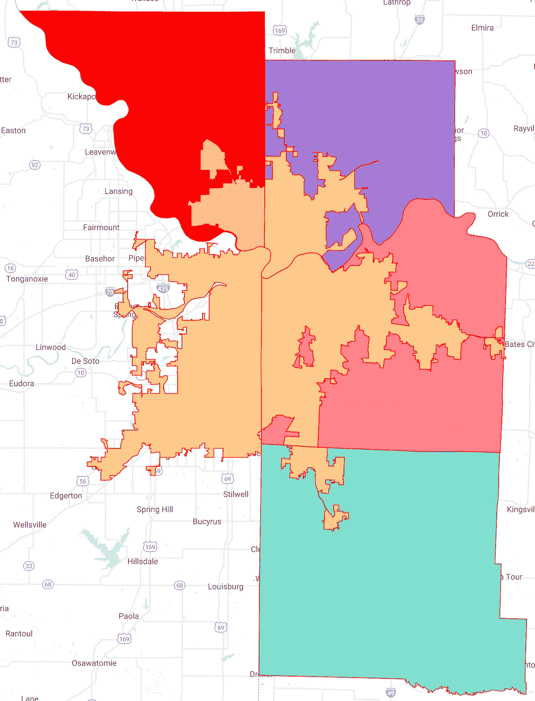
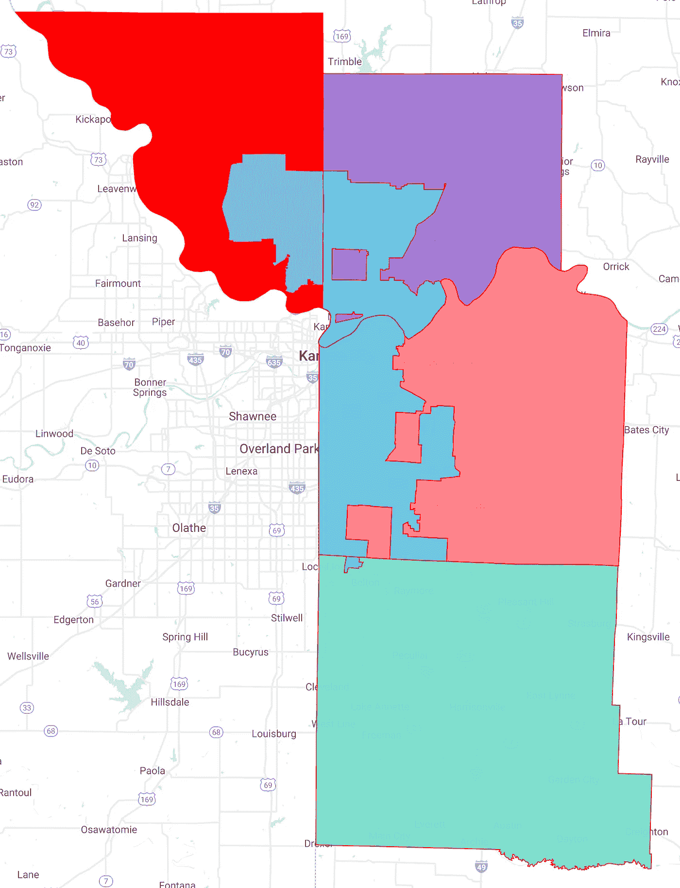
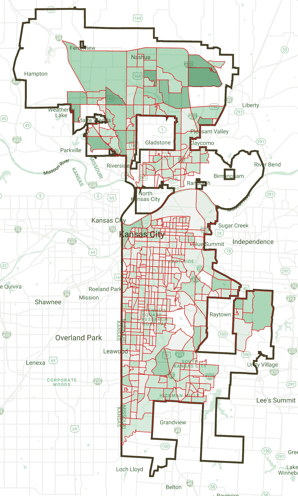
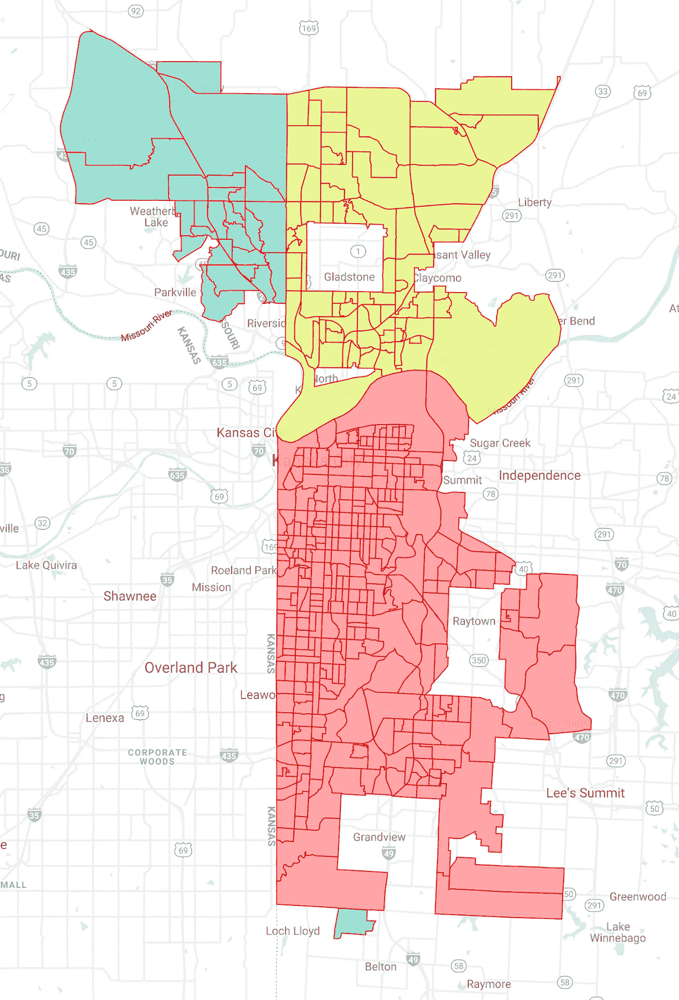
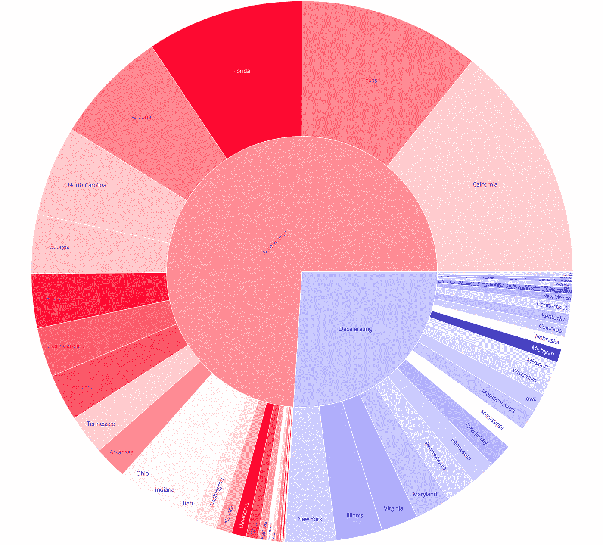
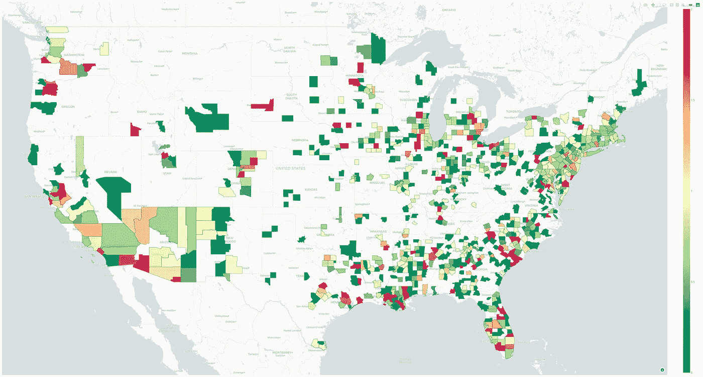
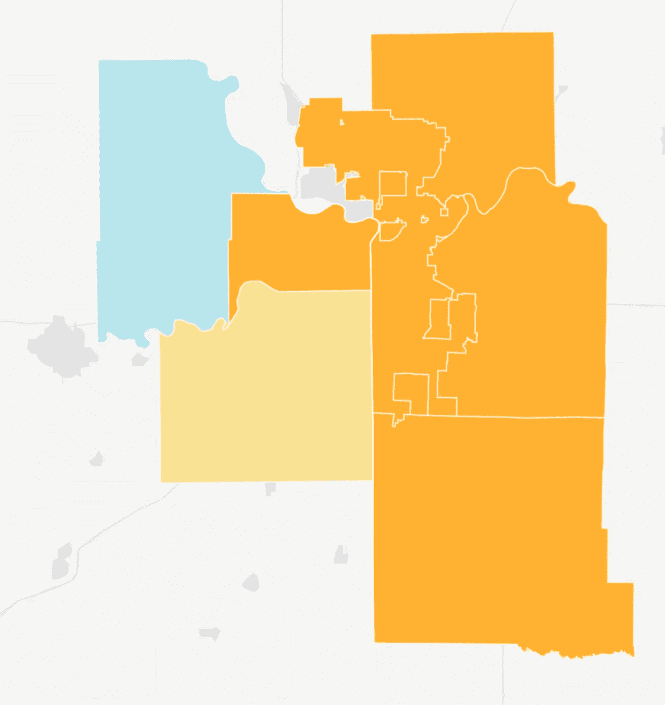
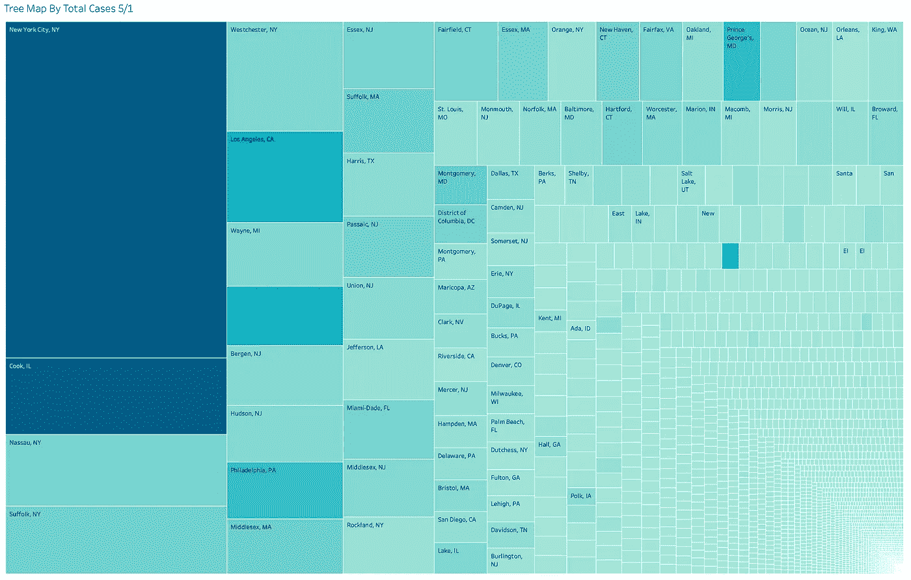

# 创建增强的 NYT 新冠肺炎数据集

> 原文：<https://towardsdatascience.com/creating-an-enhanced-nyt-covid-19-data-set-3c61e7d68422?source=collection_archive---------72----------------------->

## 在 BigQuery 中添加人口统计、选举和移动信息



美国人口密度(累计人口桶的 1%)随时间变化的 Covid 感染。[互动版](https://storage.googleapis.com/covid.lusion.org/new_cases_x_cum_pop_by_density_surface.html)。

***编者注:*** [*走向数据科学*](http://towardsdatascience.com) *是一份以研究数据科学和机器学习为主的中型刊物。我们不是健康专家或流行病学家，本文的观点不应被解释为专业建议。想了解更多关于疫情冠状病毒的信息，可以点击* [*这里*](https://www.who.int/emergencies/diseases/novel-coronavirus-2019/situation-reports) *。*

我已经在谷歌云工作了十个月，但对我们的产品没有任何经验，所以当我读到谷歌将 COVID 数据，包括纽约时报的县级数据，添加到他们的公共 BigQuery 数据集时，这似乎是一个学习工具如何工作的好机会。(声明:这是我用自己的时间做的一个项目，与谷歌无关。)

在疫情期间，我一直非常焦虑，我处理焦虑的主要应对机制是试图理解让我焦虑的事情。当我在 3 月中旬开始这个项目时，关于该病毒的深度分析来源要少得多，我希望能够提出原始数据的问题，提出并测试假设，以更好地了解它的传播以及对公共卫生政策和我自己行动的影响。

我也想学习一些新东西。

# 不要使用这个数据集

如果你正在寻找一个可靠的，经过测试的，高质量的美国新冠肺炎人口统计数据集，这不是那个数据集。我认为这很棒，但这是我自己在业余时间做的，作为学习练习和自己使用。使用由一组人构建的数据集[，经过实际训练、自动化正确性测试、更好的度量测试和更多的采用，你会好得多。](https://arxiv.org/pdf/2004.00756.pdf?fbclid=IwAR39ljXM6aSaAftwFZII2-UAJArQKLVYw8uYRW_hY5Th6ak0K6fOeruhuKI)

# 我为什么写这篇文章

我认为分享我构建这样的报告模式的新手经验可能对其他人有用或有趣，就像我在这样做的过程中阅读的许多文章对我有帮助一样。

该项目需要学习使用 GIS 和 SQL 几何图元，如何将人口普查局的数据放在一起，以及处理该数据的复杂子集的一些策略，例如城市边界和部分县。我希望这些策略和工具对其他正在学习操作类似数据集的人有用。

# 如何找到这个你不应该使用的数据集

我已经[在 GitHub 上签入了一些文件](https://github.com/delusionary/covid_bigquery_dataset),可以用来重新创建报告模式，如果你对此感兴趣的话。我故意不进行任何完整性测试或安装自动化。不是我懒，是别的什么原因。

如果你对数据集本身感兴趣，它是通过 BigQuery 公开获得的。我大约每六个小时物化一对表，但是如果您想要最新的数据，您最好查询我的视图并物化您自己的表。

# NYT 县数据

有几个由县和州报告的原始数据的数据集。起初，我很快为 [COVID 跟踪项目](https://covidtracking.com)的数据构建了一个 BigQuery 导入器，该项目最初是大西洋的一个项目。这是一个在州一级广泛使用的数据集，跟踪住院和测试以及感染和死亡。

然而，在我看来，状态内的变化*比*状态间的变化*更重要。这是一种疾病，至少在开始时，对人口稠密的城市地区的影响比人口不稠密的农村地区要大得多，而且由于增加其传播的因素，这种疾病似乎有可能继续存在。*

除了密度问题，50 个左右的样本数量很少。它代表了更大数量的县报告的集合，并且信息在该集合中丢失。

我想要我能找到的最细粒度的数据，在美国，这意味着分别查看每个县的报告数据。

我希望能够查看关于地理位置的县级数据，以及人口和地理数据，如总人口和土地面积，我希望将这些数据加入到麻省理工学院的选举数据和谷歌的新冠肺炎移动性报告中，以便我可以寻找移动性和疾病传播之间的关系，以及移动性数据的党派关系。

我选择纽约时报的数据有几个原因:

*   它已经在 BigQuery 中可用了。
*   它是基于某种程度的现场报道，我发现这些年来《纽约时报》是一个普遍值得信赖的信息来源。
*   当时大多数仪表盘都使用约翰霍普金斯大学的数据，该大学有更多的指标系列，但当时 BigQuery 中没有县级数据，我也有点逆向思维。

我希望能够做的事情之一是比较来自不同数据集的数据，看看它们有多少一致，所以我的计划是最终与所有这些数据一起工作。我决定先从容易获得的东西开始。

***NYT 数据特征***

如果你打算使用 NYT 的数据，你应该去 GitHub 上的[源](https://github.com/nytimes/covid-19-data)，仔细阅读，并完全理解作者对数据集的描述。但简而言之:

NYT 的数据集非常简单。

有三个维度字段，`date`、`state_name`和`county`，用于标识数据适用的美国县。还有另一个字段`county_fips_code`，它给出了一个唯一的 FIPS 代码，这是一个广泛使用的用于识别县的标准值。

该数据包含所有 50 个州以及美国领土的数据。

还有县名为“未知”的行。这用于记录在州或地区级别报告的死亡人数，但 Times 无法将其分配到县。这些行没有 FIPS 代码，在我的数据集中，它们没有填充任何来自其他来源的增强数据。

每行只有两个数据值:`deaths`和`confirmed_cases`。这些给出了该县报告的累计数字。该数据集不提供新的病例或死亡，必须通过与前一天的比较来计算。

这种情况很少发生，尤其是在早期，一个县会一天比一天向下修正对死亡或确诊病例的估计。这导致一天的“新病例”为负。在我的分析中，我通常会过滤掉这些异常情况，或将新案例的下限设置为 0。如果你分析的是日常案例，这不是一个大问题。为了与报告不同情况的其他数据集进行比较，它可能需要一些补救措施。

***NYT 地理异常***

NYT 数据有几个地理报告例外，这些例外构成了该项目中最具挑战性和最有趣的部分，并为我提供了使用大量基本 GIS 操作和工具的绝佳学习机会:

*   纽约市五个区(纽约、国王、皇后、布朗克斯和里士满县)的所有案件都分配到一个名为纽约市的区域，并且
*   四个县(卡斯、克莱、杰克逊和普拉特)与密苏里州堪萨斯市重叠。我们显示的这四个县的病例和死亡人数只是堪萨斯城以外的部分。堪萨斯市的病例和死亡人数是作为他们自己的一行报道的。

# FIPS 电码

从技术上来说，FIPS 代码是一种已被废弃的用于识别县的联邦标准，但仍广泛用于政府之外或旧的数据源中。今天，人口普查局使用一个更新的系统，T2 大地水准面来识别县和其他类型的地方。从大地水准面到 FIPS 码的映射很容易找到。

有两种类型的 FIPS 代码:州和县。

一个州的 FIPS 代码是一个[的两位数](https://www.nrcs.usda.gov/wps/portal/nrcs/detail/?cid=nrcs143_013696)。加州是 06 年。德州是 48。

一个县的 FIPS 代码是一个[三位数字](https://www.dshs.texas.gov/chs/info/info_txco.shtm)，在州内唯一。许多数据源将这两个代码连接起来，形成一个在全国独一无二的五位数代码。例如，德克萨斯州的特拉维斯县的综合 fips 代码为 48453，因为它位于德克萨斯州(48)，而 FIPS 县的代码为 453。

在许多网页和数据源中，这个组合数字被称为“FIPS 县代码”，因此您必须检查该值是带有单独州字段的三位数代码，还是五位数代码。此外，一些源将这些值存储为整数，其他的存储为字符串。编写帮助函数或准备好表达式来在相同数据的这些表示之间进行转换是一个好主意。

# 人口普查局美国社区调查

每年，人口普查局每年都会调查大约 350 万个家庭。它收集关于祖先、公民身份、教育程度、收入、语言能力、移民、残疾、就业和住房特征的信息，因此它提供了非常丰富的数据源。

***ACS 数据特征***

*结构和内容*

像所有人口普查局的数据一样，ACS 调查数据被分成几个依次更小的级别。每个*州*又分为若干*县*(或类似县的划分，如教区)。县被分成*普查区域*，普查区域又被分成*区块组*，区块组由最小的分区*区块*组成。街区是一种任意的划分，但在城市中，它通常对应于一个实际的城市街区。

对于每个街区，该局记录他们正在调查的任何事物的实际数量(人、儿童、有色人种、一个年龄组内的人、收入范围内的人、男性、女性等)。)它们还记录了一些无法直接计算的总值，如收入中值、租金中值等。

数据的结构很重要，因为为了解决 NYT 数据中的地理异常，我需要将一些县加在一起以构建一个新的县，并从其他县中减去*部分*以消除重叠。

*缺失数据*

另一件需要注意的重要事情是，由于 ACS 数据是一项调查，而不是人口普查，抽样误差在较低的地理层次上成为一个更大的因素。当误差线变得太大时，一些字段将不被包括在内。柱子根本不在那里。举例来说，你无法按种族和年龄对男性进行分类。在堪萨斯城的一些县，我不得不将这些值设置为 NULL，因为它们不存在。

# *ACS 地理算术*

人口普查局的划分有两个非常重要的属性:它们是不相交的，这意味着它们不重叠；它们是综合的，这意味着一个州的所有土地都在一个县中，一个县中的所有土地都在一个人口普查区域中，等等。

总的来说，这些属性意味着，当你把这个县所有街区的总人口加起来，你就得到这个县的总人口。

对我们的目的很重要的是，这也意味着如果你只取一个县(城市的一部分)中的一些区块组，并从该县的总人口中减去它们的人口，那么剩下的就是该县不在所选区块组中的所有部分的人口。

*合计计算值(平均值、中位数和四分位数)*

*有了中值，就有点复杂了。你不能用一个县的收入中值减去一个城市的收入中值来计算这个县其他地方的收入中值:你很可能得到一个负数！*

*同样，一个县(或一个州的县，等等)中的区块组的中值总和。)不会给出该县的中值。*

*在这些情况下，为了*估计*中位数的合计值等。我取了中间值的人口加权平均值。例如，我在纽约州的纽约、国王、皇后、布朗克斯和里士满县使用`SUM(median_income*total_pop)/SUM(total_pop)`来估算 NYT 数据中报告的“纽约市”的收入中值。*

*由于美国的收入分布如此不均匀，这种人口加权平均值不如使用基于“帕累托分布”的估计精确，但根据 randos 在互联网上的说法，它们在大多数情况下似乎相当接近，而且我有比学习如何编写这样的估计函数更有趣的事情要做。如果有人想这样做，欢迎你！*

# *美国县地理度量和形状数据*

*BigQuery 拥有[公共数据集](https://console.cloud.google.com/marketplace/details/united-states-census-bureau/us-geographic-boundaries?filter=solution-type:dataset&q=counties&id=20d75072-82af-4fd3-a235-7080e71bcc1b)，其中包含我想要的数据的两个县和区块组属性:以平方米为单位的土地面积和该区域的地理边界。每行包含一个`geo_id`字段、一个`county_fips_code`字段和一个`state_fips_code`字段，用于识别县或区块组，对于从 ACS 数据中的`geo_id`字段映射到其他数据集使用的 FIPS 代码至关重要。*

*地理数据是多边形的形式，其中每个点被映射到地球的椭球体模型上的精确纬度和经度。这种数据有几种表现形式。默认情况下，如果您选择一个地理字段，它将显示 WKT 表示:*

```
*POLYGON((-85.852932  32.475392, -85.853041 32.475265, -85.853711 32.475087, -85.853876  32.475043, -85.854102 32.474983, -85.854492 32.474879, -85.854615  32.474846, -85.854879 32.474887, -85.855306 32.474953, -85.855697  32.475028, -85.855797 32.475053, -85.856138 32.475139, -85.856702  32.475297, -85.856804 32.475326, -85.856873 32.47535, -85.857654  32.475617, -85.860029 32.476349, -85.861159 32.476446, -85.862489  32.476404, -85.862771 32.476263, -85.863495 32.475749, -85.86442  32.475496, -85.865332 32.475246, -85.866949 32.47506, -85.86719  32.475012, -85.870686 32.474311, -85.872695 32.473869, -85.874495  32.472924, -85.874783 32.472225, -85.874744 32.471279, -85.874726  32.470837, -85.874521 32.469859, -85.874504 32.469366, -85.874518  32.469039, -85.874609 32.468884, -85.874787 32.468792, -85.874887  32.468809, -85.874957 32.46828, -85.875196 32.468105, -85.875958  32.467548, -85.87736 32.466318, -85.878192 32.465182, -85.878512  32.464157, -85.878597 32.462615, -85.878571 32.460794, -85.87857  32.460749, -85.878545…*
```

*Google 有一个演示工具， [BigQueryGeoViz](https://cloud.google.com/bigquery/docs/gis-visualize) ，它将在地图上呈现查询结果形状，并允许您使用您可以指定的其他属性对它们进行着色和着色。这个工具非常方便，即使有点基础，也是我在构建数据集时唯一使用的 GIS 可视化工具。*

****BigQuery GIS 功能****

*我不会在 BigQuery 的 GIS 功能上花太多时间。我建议查阅[文档](https://cloud.google.com/bigquery/docs/reference/standard-sql/geography_functions)和[入门](https://cloud.google.com/bigquery/docs/gis-getting-started)指南。它们足以…让我开始。*

*但是，我将简要地提到 BigQuery 提供的在构建这个数据集时必不可少的函数:*

*   ***ST_UNION** 及其聚合函数 **ST_UNION_AGG** ，获取一个形状列表并返回一个包含所有形状中每个点的新形状。我使用此函数将块组加在一起，以获得密苏里州堪萨斯城的近似版本，并通过将组成纽约市的所有县合并来获得纽约市的形状。*
*   ***ST_DIFFERENCE** 和 **ST_DIFFERENCE_AGG** 与 UNION 相反:它接受两个形状，并返回从第一个形状中减去的第二个形状，以便移除任何重叠区域。我用它来“修剪”堪萨斯城的部分区域。*
*   ***ST_INTERSECTS** 接受一个形状和第二个形状或点，如果第二个参数部分或全部位于第一个参数内，则返回 TRUE。例如，这允许您获取纬度和经度，并运行一个查询来告诉您它在美国的哪个县！理论上很简单，实际上却很神奇。*
*   ***ST_COVERS** 如果给出的第二个形状*完全在给出的第一个形状*内，则返回 true。我用这个来确定哪些街区群完全在密苏里州坎萨市的边界内。*

# *纽约市*

*纽约是一个相当简单的例子。NYT 报道了一个名为“纽约市”的县，它涵盖了五个真正的纽约县——纽约、金斯、昆斯、布朗克斯和里士满。*

*为了解决这个问题，我只需要[汇总](https://github.com/delusionary/covid_bigquery_dataset/blob/master/200_nyt_counties.sql)这五个县的人口普查数据和几何数据。*

**

*纽约、国王、皇后、布朗克斯和里士满县*

# *密苏里州堪萨斯城*

*修复堪萨斯城更难。《纽约时报》对密苏里州堪萨斯市的报道就好像它是一个县一样，而没有报道发生在那里的死亡和感染病例。)组成自治市。*

*堪萨斯城都会区横跨两个州:*

**

*堪萨斯城市区和它重叠的四个密苏里县。*

*堪萨斯城的堪萨斯部分报告了它所在县的死亡人数，所以我只需要纠正密苏里部分。*

*我需要[建立](https://github.com/delusionary/covid_bigquery_dataset/blob/master/130_nyt_kc_county_temp_1.sql)一个“虚构的”县，覆盖堪萨斯城的密苏里州部分，而不是聚合多个真实世界的县:*

**

*然后我需要"[减去](https://github.com/delusionary/covid_bigquery_dataset/blob/master/150_nyt_kc_mo_trimmed_counties.sql)"每个县也是堪萨斯城的一部分:*

**

*当我完成时，我将有一组五个县:四个“真正的”县，堪萨斯城[被剔除](https://github.com/delusionary/covid_bigquery_dataset/blob/master/150_nyt_kc_mo_trimmed_counties.sql)，第五个县，“[堪萨斯城](https://github.com/delusionary/covid_bigquery_dataset/blob/master/140_nyt_kc_county.sql)”。*

**

# *建造一座堪萨斯城*

*人口普查局的数据与城市边界不一致，因为这些边界一直在变化。但是它有人口普查区域和街区组，我们可以用它们来做一个大概的比对。*

*我通过从**big query-public-data:utility _ us . us _ cities _ area**获取堪萨斯城和密苏里州的**big query-public-data:utility _ us . us _ cities _ area**行的 ST_INTERSECTION，获得了堪萨斯城 Missiour 部分的轮廓*

*很难完全自动地找到一组接近堪萨斯城面积的区块组。如果我在块组之间使用 ST_INTERSECT，我会得到大量在城市之外的块组:*

**

*ST_INTERSECTS 结果，堪萨斯城的边界用黑色显示。*

*另一方面，如果我使用 ST_COVERS，我会得到一个欠计数:*

**

*堪萨斯城边界为黑色的 ST_COVERS 的结果。*

*为了得到更好的近似，我从 BigQueryGeoViz 中的 ST_INTERSECT 集合开始；然后，我单击我想要删除的每个块组，并将其粘贴到查询中的排除列表中。这花了一点时间，但最终结果非常接近我想要的:*

**

*这种方法的好处是可以很容易地重新加载查询，并随时检查我的工作。*

*一旦我找到了一组包含我的密苏里州堪萨斯城的虚拟“县”的块组，我就用上面的算法估计 ACS 数据。我通过调用 ST_UNION_AGG 为它创建了一个 GIS 边界，将所有的 blockgroup 形状放在一起。*

# *修剪密苏里郡*

*一旦我有了一组接近堪萨斯城的区块组，我就用它来调整组成它的四个县，减去也是堪萨斯城一部分的部分。*

*为此，我先[将 ACS blockgroup 数据加入到人口普查局 blockgroup 数据中，其中包含该县的 FIPS 县代码。我通过 FIPS 码对块组进行分组，然后](https://github.com/delusionary/covid_bigquery_dataset/blob/master/010_county_area_acs.sql)[将它们聚合](https://github.com/delusionary/covid_bigquery_dataset/blob/master/100_nyt_kcmo_agg_bg_by_county.sql)，如上所述。这为我提供了每个县的一行，其中有该县所有区块组的总人口。我使用 ST_UNION_AGG 来计算这些块组聚合的形状。*

**

*组成堪萨斯城的街区，按郡分组。*

*然后，我使用上面详述的技术，从整个县的值中减去该县的堪萨斯城部分，基本上就完成了！*

# ***加入数据***

*现在我已经合成了我需要的县数据，我需要将它们加入到 NYT 数据中。因为其他县是根据 FIPS 代码连接的，而该字段对于合成县是空白的，所以这是自然的选择。*

*我想避免真实县和我的合成县之间的 FIPS 代码冲突。这很简单:“真正的”fips 代码长度从不超过五位数。只要我的合成 FIPS 码的低五位数字是“0”，它们就不可能与真正的 FIPS 码混淆，因为“00”不是有效的州 FIPS 码，“000”也不是有效的县 FIPS 码。*

*因此，我将“1000000”分配给“纽约市”，将“2000000”分配给堪萨斯市，并将“000000”添加到我所修剪的每个县的 FIPS 代码中——例如，将“29095000000”添加到密苏里州的安德鲁县。*

*然后，我可以通过在 NYT 数据上创建一个视图来修复这些县的空白 FIPS 代码。NYT 数据中的县*有*一个县 FIPS 代码使用该代码，但如果为空，则州是“纽约”，县是“纽约市”，则 FIPS 代码是“1000000”，依此类推。*

*构建和修复数据集的每一步都会创建一个新视图，该视图构建在旧视图之上。最初，我为中间步骤实现了表，但是这不必要地消耗了空间，并且在查询数量和数据更新数量都很少的环境中会对性能产生负面影响。NYT 数据每天更新，ACS 数据不变，县地理数据每年更新一次。*

*相反，我每天物化一个大的报告表，在这个过程的最后，使用像 Google 的 Data Studio 和 BigQuery GeoViz 这样的工具。大多数情况下，我实际上并不使用这个表，但稍后会更多地使用它。*

# *添加派生指标*

*NYT 的原始数据只包括每个县每天报告的累计死亡和病例。我想做的第一件事是计算一些基本的增量和加速度:*

1.  *计算每日增量死亡和确诊病例。*
2.  *计算 7 天内新增死亡和病例数。*
3.  *计算 7 至 14 天的新增死亡和病例数。*
4.  *用 2 除以 3 得到周环比加速度。*

*我[首先](https://github.com/delusionary/covid_bigquery_dataset/blob/master/920_nyt_7_day_counts.sql)计算(1)和(2)使用[滞后](https://cloud.google.com/bigquery/docs/reference/standard-sql/navigation_functions#lag)超过分区，然后在一个单独的视图中划分这些值得到[加速度](https://github.com/delusionary/covid_bigquery_dataset/blob/master/930_nyt_acceleration.sql)。*

*我多次执行相同的步骤(2-4 ),时间间隔为一周，这样我就有了 4 周前的新案例，以及 3 个两周一次的案例加速值。*

**

*截至 2020/06/18，过去 7 天各州新增病例的旭日图。一个州的楔形大小是它在美国过去 7 天的病例总数中所占的比例。一个州的颜色反映了该州一周内案件的增长速度。[互动版](https://storage.googleapis.com/covid.lusion.org/new_cases_sunburst_20200618.html)。*

# *使用数据*

*起初，我在谷歌的数据工作室和 Tableau 中使用这个数据集，进行基本的数据探索，并验证我可以在数据中看到我期望寻找的东西。就其本身而言，这是有用的，并且建立了我对数据集的信心，但最终这些工具允许你在不学习编码的情况下快速构建可视化。*

*不过，问题是，我已经知道如何编码，知道如何编码可以让你节省一些功能和数字处理，以后再回来用有趣的方式组合它们。它还允许您构建更加复杂的可视化。*

*这些天，我使用 BigQuery 的 iPython Magics 定期将这个数据集刷新到 Jupyter 笔记本中。在那里，我使用 Pandas 来获得新的度量标准并转换数据。*

*我一直在使用 Pandas 内置的 Matplotlib 集成来进行快速和肮脏的可视化，并使用 Plotly 来创建交互式 Javascript 情节。*

*使用各县的 GIS 边界，我可以在 Plotly 中创建 chloropleth 地图，以显示各县的各种地理指标。*

*我不太相信地理地图能达到这个目的。它们是陆地地图，病毒攻击人类。在美国，人口分布非常不均匀——20%的县拥有 80%的人口——地图通常不能很好地反映问题。*

**

*显示前一周 0-7 天追踪病例比率的美国氯普图。许多县没有这方面的足够数据，并且是空白的。*

**

*预计堪萨斯市和地区的 0-14 天案例加速。*

**

*纽约市 synthetic county 的 0-14 天案例加速。*

*我还很高兴地看到，我的堪萨斯城及其周边地区的几何图形与《泰晤士报》上的克罗珀特地图非常吻合:*

**

*[纽约时报](https://www.nytimes.com/interactive/2020/us/coronavirus-us-cases.html)堪萨斯城地区的地理位置。*

*我还可以使用 ACS 数据来确定有色人种百分比较高的县，这些人死于该疾病的风险较高，如 5/1 的总病例树图所示:*

**

*然而，到目前为止，加入这些数据的最大优势来自两个领域:`total_pop`来自 ACS，`area_land_meters`来自 GIS 数据。用第一种方法你可以得到人均感染率和死亡率，用这两种方法你可以得到人口密度。*

# *其他数据集*

*我还创建了映射表，可用于将这些数据连接到谷歌的新冠肺炎移动性报告数据，以及麻省理工学院的县级选举数据。到目前为止，将 NYT 的数据与移动性数据联系起来还不是很有成效，但是将每个数据分别与县地理、选举和 ACS 数据联系起来给了我很多有用的见解！*

# *结论*

*我希望这对其他人有所帮助。如果是这样，或者如果你有一个项目，我可能会有用的贡献，让我知道！*