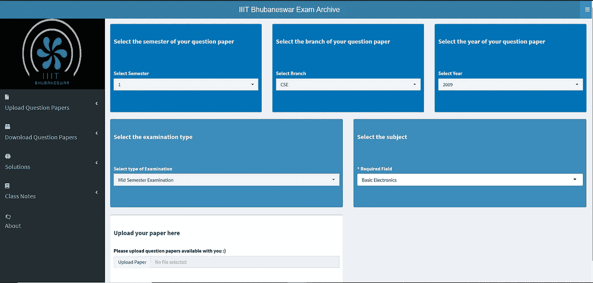
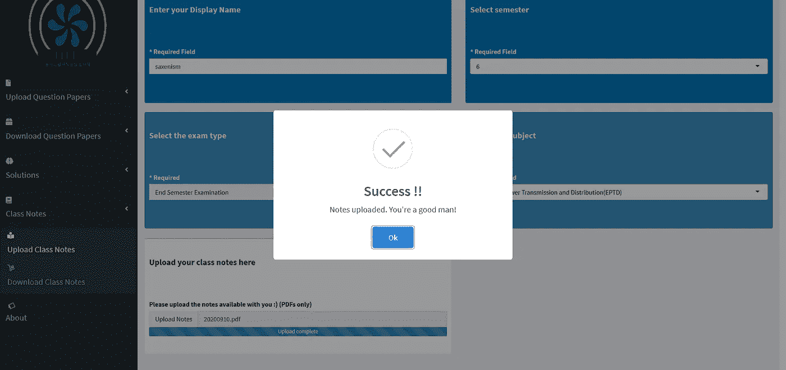
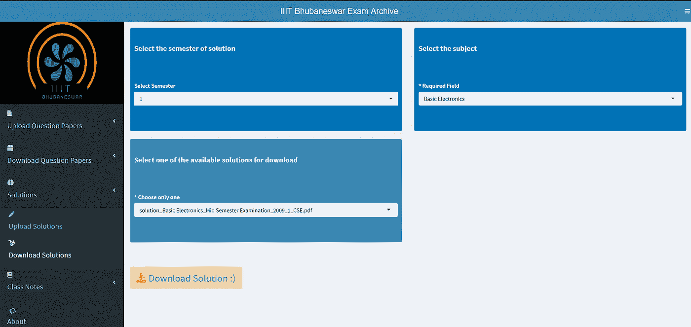

# 使用数据科学家工具包创建考试档案系统

> 原文：<https://towardsdatascience.com/creating-an-exam-archive-system-with-a-data-scientists-toolkit-a080d497a9a0?source=collection_archive---------53----------------------->

## 利用 R Shiny 更好地准备考试

图片由 [tjevans](https://pixabay.com/users/tjevans-5937713/?utm_source=link-attribution&utm_medium=referral&utm_campaign=image&utm_content=2521144) 来自 [Pixabay](https://pixabay.com/?utm_source=link-attribution&utm_medium=referral&utm_campaign=image&utm_content=2521144)

> 随着新冠肺炎疫情中关于大学生晋升标准的不确定性的增加，我决定创建一个集中的平台来聚合来自学生自己的考试资源。

# 动机:

对任何人来说，每天更新的与新冠肺炎相关的新病例和死亡都是令人痛苦的。然而，大学生不得不处理过多的额外问题，从被取消的工作机会到下学期晋升的不确定性。这也是我的队友们越来越焦虑的一个原因。所以，这个项目是我决定尽自己的一份力量来帮助我的同学和大学同学的原因。

# 向未知领域展示 R Shiny:

我最近被谷歌选中参加一个著名的[暑期项目，该项目隶属于统计计算](https://www.linkedin.com/feed/update/urn:li:activity:6663502779358814209/)的 [R 项目。我的项目基本上包括开发一个 R 包，让你的 R 代码更加高效。因此，我认为用 R Shiny 进行这个项目可以让我对我的夏季项目有更多的优化想法，因此我选择了](https://www.r-project.org/) [R Shinydashboard](https://rstudio.github.io/shinydashboard/) 。

正如你可能已经意识到的，R Shiny 主要用于创建仪表板，并在数据分析、争论、操作等之后，交互式地交流你的发现。然而，我的项目是一个典型的 web 开发项目，几乎没有任何与数据相关的元素。尽管如此，我还是继续进行下去，以便为我的夏季奖学金项目发现新的优化想法。

使用这种方法，我必然会面临许多挑战，我将在接下来的章节中讨论这些挑战。

# 编码策略:

通常一个 R Shiny 项目被分成两个文件，一个 ui。r 文件和一个服务器。r 文件。但是，名为 app 的单个文件。也可以使用 r。

## ui。稀有

1.  在侧栏面板中，我首先列举了该应用程序的所有预期功能，包括上传和下载试卷的 ***功能，这些试卷的解决方案和课堂笔记*** 。
2.  我还包含了" ***shinyWidgets*** "库，这样我就可以在成功上传文件时使用" ***SweetAlert*** "以及"***downloadbtn***"与默认的 R Shiny "***download button***"相比，它提供了更多的定制选项
3.  我使用 fluidRow 框创建了几个输入字段来收集关于正在上传的论文的信息。我还使用了`fileInput()`函数的“ ***接受*** ”参数，只接受 PDF 文件。
4.  我从“字体真棒”网站上选择了图标，并在“关于”部分使用了`class = “fa-spin”`来吸引人们的注意。

代表性代码，完整的代码向下滚动到结论

## 服务器。稀有

1.  为了持久存储上传的 PDF 文件，我不得不使用一个包含“ ***pdftools*** ”库的解决方案。
2.  选择学期后，我希望科目选项仅限于该学期的科目。这是我用助手函数和`req()`函数实现的。
3.  在论文/笔记等成功上传后，我想发送一个成功通知，这是我通过包含“ ***shinyWidgets*** ”库和使用`observeEvent()`代码块实现的。
4.  为了从我的本地存储器(我的“www”文件夹)开始下载，在“***download handler***”中，我将`filename`参数转换成一个函数，并用`file.copy()`函数调用了`content` 参数中的那个函数。

代表性的代码，完整的代码向下滚动到结论

# 完整应用程序的片段:

web 应用程序的登录页面

上传成功后的温馨提示

下载选项以及所选解决方案的可用选项

# 结论:

所以，如果你对这个特别的 R Shiny web app 的代码感兴趣，点击[这里](https://github.com/hinduBale/iiit-bh_exam_archive)。

如果你有兴趣看到这个网络应用的现场和部署版本，点击[这里](https://studentsofiiitbh.team/examarchive)。

鉴于 Shiny 的内在能力，这款网络应用对移动用户的响应也足够快。如果你喜欢我的这个项目，看看我之前创建的仪表板[这里](/battling-covid-19-with-data-science-as-a-university-student-ffcb9304b4c)。

在从事这个项目的过程中，我发现了一些棘手的问题，我将在以后的文章中列举这些常见的陷阱以及如何避免它们。所以，请继续关注，稍后见。

你也可以给我买杯咖啡来支持我的工作。

谢谢你，祝你成功。