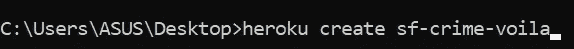

# 用 Jupyter 笔记本创建一个交互式仪表板

> 原文：<https://towardsdatascience.com/creating-an-interactive-dashboard-from-jupyter-notebook-with-voila-b64918b4d15a?source=collection_archive---------4----------------------->

## …以及如何将仪表板部署到 Heroku


照片由[艾萨克·史密斯](https://unsplash.com/@isaacmsmith?utm_source=unsplash&utm_medium=referral&utm_content=creditCopyText)在 [Unsplash](https://unsplash.com/s/photos/graph?utm_source=unsplash&utm_medium=referral&utm_content=creditCopyText) 拍摄

随着 PowerBI 和 Tableau 等 BI 工具的出现，当你想创建一个交互式仪表板时，Jupyter Notebook 可能不会是你脑海中出现的第一个工具。然而，由于 Voila，现在可以直接从 Jupyter Notebook 构建交互式仪表板。

在本文中，我想向您展示如何使用 Jupyter Notebook 创建交互式绘图，将它们转换为独立的仪表板，然后使用 Heroku 将其部署在云上，以便其他人可以看到您的仪表板。所以，让我们开始吧！

# 加载数据

在本文中，我将使用[旧金山数据集](https://www.kaggle.com/roshansharma/sanfranciso-crime-dataset)。该数据集包含 2016 年发生在旧金山的超过 150，000 行犯罪历史。

像往常一样，我们可以用熊猫加载数据集。为了了解数据集的样子，让我们打印出数据集的前五行。

因为这篇文章的目的是展示如何使用 Voila 将 Jupyter 笔记本中的交互式可视化变成独立的仪表板，所以我不打算对这个数据集进行 EDA。让我们开始创建小部件，为这个数据集的可视化添加交互性。

# 创建交互式小部件

现在我们已经加载了数据，我们可以立即开始创建小部件。这些小部件是为我们的可视化添加交互性的基本要素。在本文中，我们将使用三个部件:一个滑块部件和两个多选部件。要创建这些小部件，我们可以使用 Jupyter Notebook 的`ipywidgets`库。

我们要创建的第一个小部件是 slider 小部件。为此，我们可以使用来自`ipywidgets`的`IntSlider()`属性。这个 slider 小部件将控制熊猫应该加载多少行数据集。例如，如果滑块值是 1000，那么 Pandas 应该加载数据集的前 1000 行。下面是它的代码实现。

```
import ipywidgets as widgets
import pandas as pdstyle = {'description_width': 'initial'}limit_case = widgets.IntSlider(
    value=1000,
    min=100,
    max=5000,
    step=1,
    description='Max Number of Case:',
    disabled=False,
    style=style)
```

在上面的代码中，我们从`ipywidgets`向`IntSlider()`属性传递了几个参数。第一个是`value`，这是我们运行代码时会显示的默认值。接下来，`min`和`max`是滑块中可以考虑的最小和最大范围值。同时，`step`是我们上下移动滑块时的增量或减量。最后，我们添加了`style`参数，这样`description`中的单词就不会被截断。

接下来，使用来自`ipywidgets`的`interactive()`属性，我们可以将小部件与我们想要交互更改其值的变量链接起来。现在，如果我们更改滑块值，我们可以看到数据集的长度也会相应地更改。

如果您运行上面的代码单元，您将得到一个类似这样的交互式滑块小部件。


接下来，让我们创建第二个小部件，它是多选小部件。我们可以通过使用`ipywidgets`中的`SelectMultiple()`属性来实现这一点。有了这个小工具，我们可以选择只在特定的选区而不是所有的选区可视化犯罪。为了创建这个多选小部件，下面是代码实现。

```
import pandas as pd
import ipywidgets as widgets
from ipywidgets import Layoutdf = pd.read_csv('SF_crimes.csv')unique_district = df.PdDistrict.unique()district = widgets.SelectMultiple(
    options = unique_district.tolist(),
    value = ['BAYVIEW', 'NORTHERN'],
    description='District',
    disabled=False,
    layout = Layout(width='50%', height='80px', display='flex')
)
```

在上面的代码中，我们使用`SelectMultiple()`属性来选择区域变量的多个值。我们应该指定的第一个参数是`options`，它应该包含变量的可用选项列表(在我们的例子中是不同种类的旧金山地区)。下一个是`value`，它应该包含我们希望默认显示的变量值，然后`description`是用于描述小部件名称的文本字段。

如果您运行上面的代码单元格，您将得到下面的交互式多选小部件。


最后，我们可以创建第三个小部件，它与前面的多选小部件完全相同。这个小部件的目的是让我们能够选择想要可视化的犯罪类别。下面是这个小部件的代码实现。

```
import pandas as pd
import ipywidgets as widgets
from ipywidgets import Layoutdf = pd.read_csv('SF_crimes.csv')unique_cat = df.Category.unique()style = {'description_width': 'initial'}category = widgets.SelectMultiple(
    options = unique_cat.tolist(),
    value = ['VANDALISM', 'ASSAULT', 'ROBBERY'],
    description='Criminal Case',
    disabled=False,
    style=style,
    layout = Layout(width='50%', height='80px')
)
```

我们传递给这个`SelectMultiple()`属性的参数与之前相同，只是`value`和`options`参数是犯罪类别而不是地区。

如果您运行上面的代码单元格，您将得到下面的小部件。


接下来，我们希望将之前创建的所有三个小部件结合起来，创建一个交互式可视化。为了可视化犯罪地点，我们可以用地图来可视化它们，因为我们在数据集中有关于纬度和经度的信息。

为了将数据集可视化成地图，我们可以使用`folium`库。如果还没有安装`folium`，可以使用 pip 命令安装。

```
pip install folium
```

我们可以将地图与小部件集成在一起，这样当我们用小部件做出不同的选择时，可视化就会相应地调整。

首先，slider 小部件的值将决定我们应该在可视化中考虑的数据集中的犯罪数量。接下来，地图应该会根据我们使用多选小部件的选择显示犯罪类别和地区。

为了创建额外的可视化，我们还可以创建两个条形图。一个条形图显示有多少犯罪基于我们使用小部件选择的类别。另一个图表显示了我们使用小部件选择的地区有多少起犯罪。

最后，我们需要定义一个函数，将所有三个小部件与我们的地图可视化和两个条形图集成在一起。

下面是从头到尾完成所有这些工作的完整代码实现。

现在，如果我们调用上面 Jupyter 笔记本的最后一个代码单元中的函数`update_map`,我们将根据我们在所有三个小部件中选择的值获得地图和条形图可视化的交互性。


现在我们已经完成了 Jupyter Notebook 的工作，在`ipywidgets`库的帮助下创建交互式可视化效果！

# 用 Jupyter 创建一个仪表板

到目前为止，我们已经在`ipywidgets`、`matplotlib`和`folium`库的帮助下创建了交互式可视化。现在，你可以开始向其他人展示你的 Jupyter 笔记本中的可视化。

然而，在大多数情况下，您将向非技术人员展示可视化，这些人对查看您笔记本中的大量 Python 代码不感兴趣，只想看到清晰的可视化。因此，使用 Jupyter 笔记本来显示交互式可视化并不是最佳选择。

要将 Jupyter 笔记本上的可视化转换为独立的仪表板，我们可以使用 Voila。现在，如果您还没有安装 Voila，您可以使用 pip 命令安装它，如下所示:

```
pip install voila
```

一旦你安装了 Voila，创建一个独立的仪表板将变得非常容易。您所需要做的就是进入您的终端或 Anaconda 提示符，然后键入以下格式:

```
voila path/to/your/notebook.ipynb
```

或者，您也可以通过单击 Jupyter 笔记本工具栏中的 Voila 图标，直接在笔记本中执行此操作。


现在，如果您执行了上述两个步骤中的任何一个，您将获得以下独立的仪表板。


就是这样！我们已经将 Jupyter 笔记本中的可视化内容转化为一个独立的仪表盘。现在，使用同样的技巧，您可以将 Jupyter Notebook 中任何数据集的可视化转换为独立的仪表板。

# 使用 Heroku 部署仪表板

到目前为止，您用 Voila 构建的仪表板只能在本地计算机上运行。这意味着你实际上不能和其他人分享，除非你把你的电脑借给他们。

为了让其他人访问您的仪表板，您需要将您的仪表板部署在云上，例如 AWS、GCP、Azure 或 Heroku。在本文中，我们将使用 Heroku 来部署我们的仪表板，以便其他人可以用他们自己的计算机看到您的仪表板。

使用 Heroku 部署您的仪表板的第一步是登录您的 Heroku 帐户。如果你还没有账号，你可以[免费注册 Heroku](https://id.heroku.com/login)。

下一步是[下载 Heroku 命令行界面(CLI)](https://devcenter.heroku.com/articles/heroku-cli) 并安装到您的本地机器上。

Heroku CLI 安装后，现在您需要在 Jupyter 笔记本文件旁边创建两个附加文件。这些文件是:

*   **requirements.txt:** 这个文本文件应该包含您在 Jupyter 笔记本中使用的所有依赖项或库。例如，在本文中，我们使用了`folium`、`numpy`、`pandas`、`ipywidgets`、`matplotlib`和`voila`库。因此，我们需要在这个文件中列出它们。另外，由于我们使用 Jupyter Notebook，我们需要在这个文件中添加`ipykernel`,这样 Heroku 就可以运行我们的 Jupyter Notebook 中的命令。下面是 **requirements.txt** 内容的样子。

```
numpy
pandas
folium
ipywidgets
matplotlib
voila
ipykernel
```

*   Procfile: 这个文件告诉 Heroku 如何运行您的 Jupyter 笔记本，以及需要哪些文件。您可以键入以下内容作为该文件的内容。

```
web: voila --port=$PORT --no-browser --enable_nbextensions=True your_jupyter_notebook_name.ipynb
```

您可以使用电脑中的任何文本编辑器创建这两个文件，例如 Notepad 或 Notepad++。接下来，将这些文件保存在保存 Jupyter 笔记本文件的同一文件夹中。

现在打开您的终端或命令提示符，然后在其中键入`heroku login`。这将引导你进入一个浏览器页面，提示你使用 Heroku 帐户登录。


接下来，使用命令提示符进入保存 Jupyter 文件、requirements.txt 和 Procfile 的工作目录。

在工作目录中，通过键入`git init`初始化一个空的存储库。接下来，您可以通过键入以下格式在 Heroku 帐户上创建一个新的应用程序:`heroku create your-app-name`。



创建应用程序后，按顺序输入以下命令:

```
git add .
git commit -m "Your customized message"
git push heroku master
```

现在，在你输入`git push heroku master`之后，Heroku 将开始创建应用程序来托管你的仪表板。大约一分钟后，您会在命令提示符下看到一个指向您的仪表板的链接。该链接将与您的应用程序名称相似。

就是这样！现在，您可以与其他人共享该链接，以便他们可以看到您的交互式仪表板。

您可以在这里看到本文[中部署的可视化仪表板。](https://sf-crime-voila.herokuapp.com/)

如果您有兴趣查看本文中使用的 Jupyter 笔记本和 requirements.txt 以及 Procfile，您可以在这里[看到它。](https://github.com/marcellusruben/sf-crime-voila)